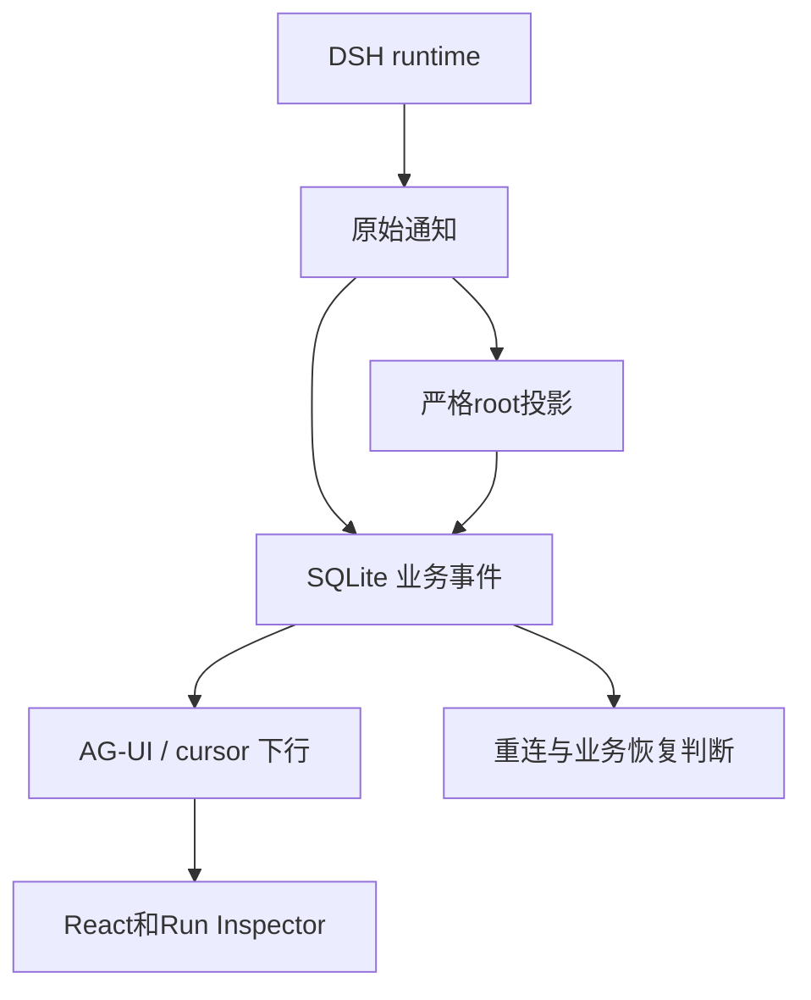

# DSH Session events 与 AG-UI events

一个工具执行完，界面上出现结果卡片，SQLite 里也新增了业务事件。它们来自同一次工作，却没有相同的字段和编号。诊断执行时需要回到 DSH Session，重连界面时则要使用应用保存的事件游标。本章比较本仓库的固定实现：DSH npm `0.1.7-rc.2`、AG-UI `0.0.57`、CopilotKit `1.69.3`，不是所有AG-UI服务端的通用能力表。

前置：[Session与projection](../../how-dsh-works/04-session-event-log-and-projection.md)、[AG-UI项目](../../projects/ag-ui-dsh-runtime/README.md)。

## 三套标识各自属于谁

| 数据 | 谁产生并保存 | 定位 | 用途 |
| --- | --- | --- | --- |
| DSH SessionEvent | runtime / Session backend | 存储source + sessionId + seq | 原始执行事实、surface与机制诊断 |
| 业务RunEvent | 本项目SQLite | runId + 单调seq | 业务终态、持久游标、断线后重放 |
| AG-UI event | 本项目projector/coordinator | runId、messageId、toolCallId等 | 前端消息/工具/生命周期显示 |

不能把Session seq当成RunEvent游标，也不能只用sessionId定位不同store的同名会话。一次业务Run和一个DSH turn可能在简单例子中相近，但生产应用仍需自己处理队列、重启后的执行不确定性和授权。

## 本项目的映射

[`AguiProjector`](../../projects/ag-ui-dsh-runtime/src/server/projector.ts)只投影root Session；直接child的开始/结束通知成为 `CUSTOM`，child正文不会混入root回答。

| DSH输入 | 本项目AG-UI输出 | 必须保留的语义 |
| --- | --- | --- |
| `step/start` | `STEP_STARTED` | 创建该step的投影状态 |
| 已提交 `assistant/message` 的文本 | `TEXT_MESSAGE_START/CONTENT/END` | CONTENT一次装入已提交文本，不是live token |
| `tool/call` | `TOOL_CALL_START/ARGS/END` | 必须先有同step已提交的对应tool-call；ARGS为完整参数 |
| V4 `tool/result` | `TOOL_CALL_RESULT` | 用 `data.message.toolCallId` 配对，保留工具结果含义 |
| `step/end` | `STEP_FINISHED` | 要求所有已提交调用都已有结果 |
| root `turn/end` | coordinator判断业务终态 | 只有completed才能记为succeeded，不能只看有无文本/文件 |

工具自身返回error不等于整轮必然失败；Agent可能继续处理。反过来，即使存在工具产物，max-tokens或error终态也不能包装成业务成功。实际判定由[coordinator](../../projects/ag-ui-dsh-runtime/src/server/coordinator.ts)和[测试](../../projects/ag-ui-dsh-runtime/tests/projector.test.ts)共同约束。



可以从工具结果做一次字段追踪：先在 root `tool/result` 找到 `data.message.toolCallId`，再在 `AguiProjector` 中看它怎样匹配已提交的调用，最后观察 `TOOL_CALL_RESULT` 怎样进入业务存储和界面。若缺少匹配的调用，严格投影会拒绝这段轨迹，而不是凭结果文本补造一次工具调用。

这个阅读练习不要求再发一次模型任务。对照项目的 projector 测试，找到缺失调用或重复结果的负例，便能理解为什么只转发一段 JSON 不足以构成可靠 UI。

## 为什么CONTENT事件不等于实时token

本项目读取的stock SDK通知是durable提交语义。即使历史消息含embedded stream，把它展开或拆成小段也不会改变到达时间。AG-UI事件类型只说明如何组织前端输出，不能反推上游是不是逐token产生。

官方Web使用另一条已验证路径：独立 `assistant-stream/text-delta` 帧先到，随后才有持久 `assistant/message`。这两类数据都出现 `text-delta` 字样，观察器必须按事件来源区分，不能递归搜索JSON后重复计数。证据见[官方Web Lab](../../labs/web-host-lifecycle/README.md)。

## 断线和重启

AG-UI流断开只解除订阅，不自动取消底层Run。应用保存的RunEvent游标用于重放，SQLite终态与不可变Artifact用于核对结果。runtime崩溃后，原本running的业务任务需要进入 `execution_unknown` 并由业务恢复流程处理，不能因为重新连接界面就重新执行工具。

应用的AG-UI投影没有保存全部DSH机制字段；不能用它还原compaction选择、所有child日志或原始模型请求。需要机制诊断时回到Session；需要业务交付判断时回到Run/Artifact。两者各有用途，不互相替代。

## 运行和验收

按[项目安装步骤](../../projects/ag-ui-dsh-runtime/README.md#安装与运行)构建file依赖后，在项目目录执行：

```sh
pnpm test
pnpm typecheck
pnpm build
pnpm smoke:server
```

已有真实证据为[第五批验收](../reviews/2026-09-29-plugin-agui-internals.md)：两个Conversation、四个Run/产物、跨generation恢复、AG-UI detach后的业务终态及游标回读。本章复用这些明确日期的证据并核对当前projector/coordinator，没有把一次文档整理计为新的模型E2E。
