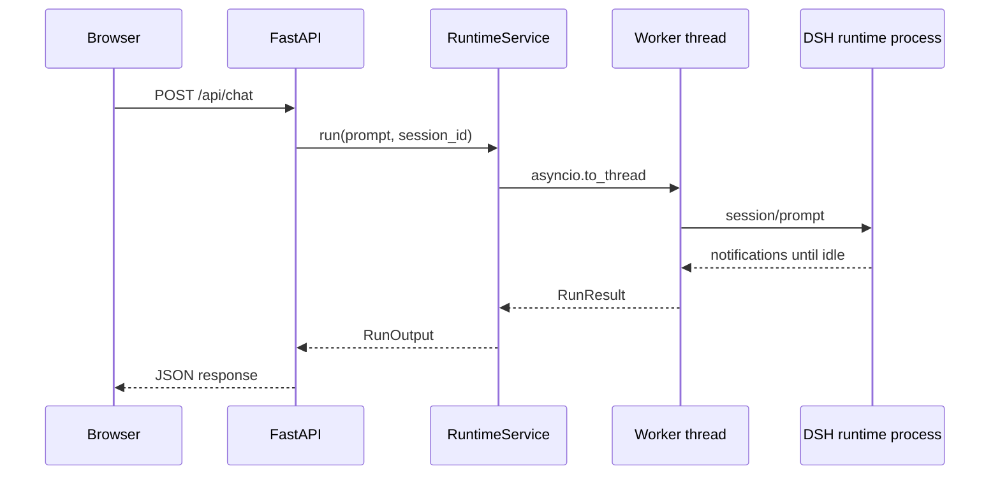

# 第一章：FastAPI 阻塞式 API

## 学习目标

先用最容易理解的方式嵌入 DSH：一个 HTTP 请求对应一次 `RuntimeService.run()`，FastAPI 等待 agent 的整个活动区间结束，再返回 JSON。完成本节后，你能区分 HTTP 请求、DSH session 和 agent turn 三个不同概念。

## 前置条件

在项目根目录完成 `uv sync --group dev`，并在环境中设置 `DEEPSEEK_API_KEY`。服务只监听 `127.0.0.1`，workspace 与会话日志默认分别写入 `workspace/` 和 `.sessions/`。

## 运行

```sh
uv run python -m dsh_fastapi_101
```

打开 `http://127.0.0.1:8000/chapter/1`，或者直接调用 API：

```sh
curl -s http://127.0.0.1:8000/api/chat \
  -H 'content-type: application/json' \
  -d '{"session_id":"chapter-1","prompt":"只回复：CHAPTER_1_OK"}'
```

响应字段为 `session_id`、`response` 和 `finish_reason`。这里的 session ID 是业务传入的稳定标识，不是一次 HTTP request ID。

## 源码分析

`src/dsh_fastapi_101/app.py` 的 `/api/chat` 路由接收 `ChatRequest`，调用 `RuntimeService.run()`。`src/dsh_fastapi_101/runtime.py` 使用 `asyncio.to_thread()` 把同步的 `Session.run()` 放入线程，避免阻塞 ASGI 事件循环。`Session.run()` 内部仍按 DSH 的语义等待提示词进入持久 inbox，再等待整个 agent 回到 `idle`。



为什么不直接在 `async def` 路由里调用 `session.run()`？因为它会持续等待模型、工具和 `idle`，直接调用会冻结当前事件循环线程，使同一 worker 无法及时处理健康检查与其他请求。

## 验证

1. `/api/health` 返回 `runtime_started: true`。
2. `/api/chat` 返回 HTTP 200，`finish_reason` 通常为 `completed`。
3. `.sessions/` 下出现对应 DSH session 日志。
4. 服务停止后不再残留 `dsh-jsonrpc-agent` 子进程。

## 限制

阻塞式接口只有完成后的最终结果，没有增量文本和工具轨迹。HTTP 连接断开不会等价于取消 agent，因为当前 SDK JSON-RPC 没有 `session/cancel`。下一节用 SSE 暴露运行中的事件，但仍保持 agent 在服务端结算。
