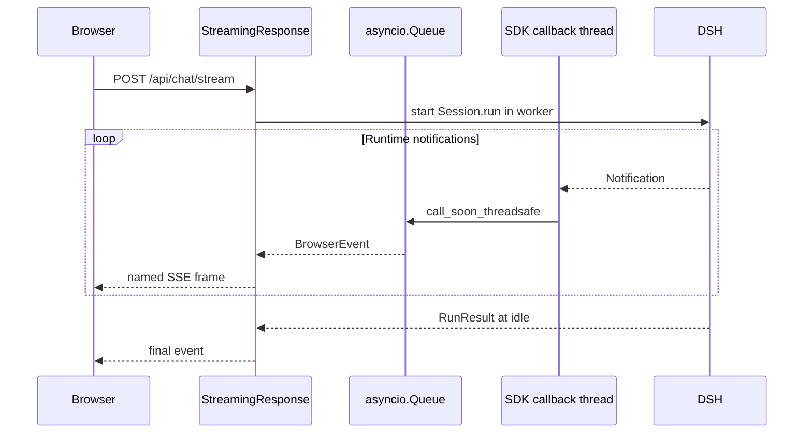

# 第二章：POST + SSE 流式输出

## 学习目标

把 Python SDK 的同步 `on_notification` 回调桥接成浏览器可以消费的 SSE 流。你将看到模型文本在 `RunResult` 返回前逐段出现，同时理解为什么本示例使用 `fetch()` 读取 SSE，而不是浏览器原生 `EventSource`。

## 前置条件

先完成第一章。SSE 响应依旧由一个 POST 请求创建，因为提示词和 session ID 需要放在 JSON body 中；原生 `EventSource` 只方便发起 GET，因此前端使用 `fetch()` 与 `ReadableStream` 解析标准 SSE 帧。

## 运行

```sh
uv run python -m dsh_fastapi_101
```

打开 `http://127.0.0.1:8000/chapter/2`。也可以用 curl 关闭客户端缓冲：

```sh
curl -N http://127.0.0.1:8000/api/chat/stream \
  -H 'content-type: application/json' \
  -d '{"session_id":"chapter-2","prompt":"分三行解释 agent runtime。"}'
```

每个帧都有 `event:` 名称和一行 JSON `data:`。最后一帧是 `final` 或 `error`。

## 源码分析

`RuntimeService.stream()` 在事件循环中创建 `asyncio.Queue`，同时在线程中执行 `Session.run()`。SDK 回调不能直接操作 asyncio 对象，因此通过 `loop.call_soon_threadsafe()` 把投影后的 `BrowserEvent` 放回事件循环。`events.py` 只把根 session 的 `text-delta` 映射为 `text_delta`，不会把模型推理内容发送给浏览器。



Starlette 在迭代生成器之前已经发送 HTTP 200 响应头，所以运行中发生的错误不能改成 HTTP 500。本项目用 `event: error` 作为终止帧，让浏览器在同一协议内处理失败。

## 验证

1. curl 输出中先出现 `status`、`lifecycle` 或 `text_delta`，最后出现 `final`。
2. 浏览器响应区在请求结束前持续增长。
3. 时间线不出现 `reasoning-delta`。
4. `Cache-Control: no-cache` 和 `X-Accel-Buffering: no` 响应头存在。

## 限制

这是单订阅、单 HTTP 连接的教学实现，没有断线重放、事件序号、心跳或多消费者 fan-out。生产服务应为业务 Run 保存单调序号与有限事件缓存，并让重连客户端从确认位置恢复。
