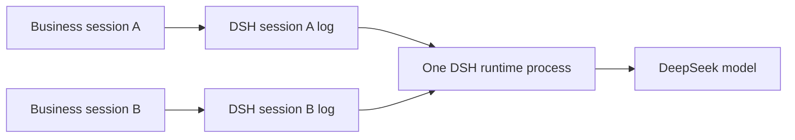

# 第三章：浏览器多轮会话

## 学习目标

复用同一个业务 session ID 完成多轮对话，并明确区分“复用 DSH runtime 进程”和“复用 DSH session 历史”。前者节省启动成本，后者决定模型能否看到前文。

## 前置条件

先完成第二章。在浏览器中点击“记住代号”，运行完成后保持 session ID 不变，再点击“召回代号”。点击“新建 session”会生成另一条独立对话。

## 运行

```sh
uv run python -m dsh_fastapi_101
```

打开 `http://127.0.0.1:8000/chapter/3`，按以下顺序运行：

1. `记住项目代号 ORBIT，只回复：已记录`
2. `项目代号是什么？只回复代号。`

第二轮应回复 `ORBIT`。随后新建 session 并直接询问代号，新会话不应继承旧会话内容。

## 源码分析

`RuntimeService` 在整个 FastAPI lifespan 中只持有一个 `DeepSeekHarness`，因此所有业务 session 共用一个 runtime 子进程。每次请求调用 `harness.start_session(session_id)` 获取轻量句柄；DSH 从该 ID 对应的持久事件日志派生模型历史。



`RuntimeService._sessions` 只是本进程已经接纳过哪些 ID 的应用内目录，用于演示 `/api/sessions`。它不是 DSH 持久会话的权威目录；服务重启后集合会清空，但 `.sessions/` 中的事件日志仍可存在。

## 验证

1. 同一 ID 的第二轮能回复 `ORBIT`。
2. `/api/sessions` 包含使用过的 ID。
3. 新 ID 不共享前一个会话的语境。
4. 多个 ID 仍只对应一个 runtime 子进程。

## 限制

当前 SDK JSON-RPC 不提供 session list/read/delete/fork API，因此本教程没有实现完整会话管理后台。生产业务应在自己的数据库中保存用户、Conversation、Run 与 DSH session ID 的映射，把 DSH 日志视为 runtime 状态，不把它当作业务唯一真源。
