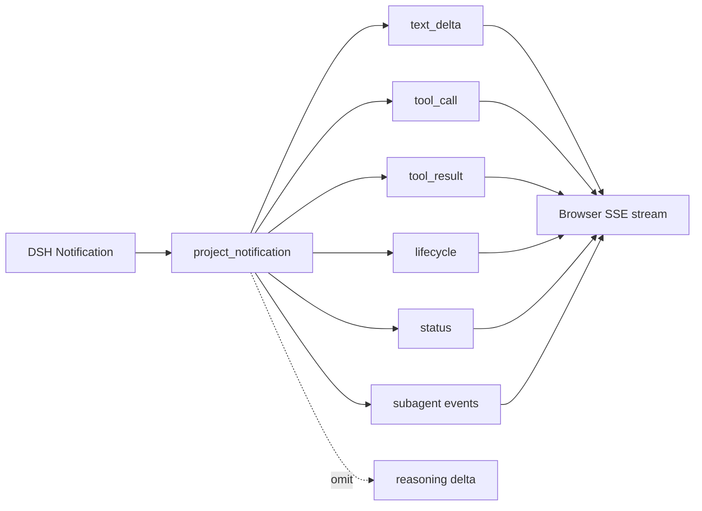

# 第四章：工具与 Agent 轨迹

## 学习目标

把 DSH 的详细事件投影为稳定、适合产品展示的浏览器事件。完成本章后，你能分别展示 assistant 文本、工具调用、工具结果、turn/step 生命周期与 subagent 状态，同时避免把模型推理原文直接暴露给前端。

## 前置条件

先完成前三章，理解 `session.event` 与 `session.status` 的区别。内置 runtime 可以执行文件和进程工具，请继续只在本地隔离 workspace 中体验。

## 运行

```sh
uv run python -m dsh_fastapi_101
```

打开 `http://127.0.0.1:8000/chapter/4`，使用预设“调用工具”，或者发送：

```text
使用 bash 执行 printf 'TOOL_EVENT_OK\n'，然后只回复它的输出。
```

页面右侧时间线应依次出现 `status`、`lifecycle`、`tool_call`、`tool_result`、新的 step、`text_delta` 与 `final`。

## 源码分析

`src/dsh_fastapi_101/events.py` 是应用与 runtime 之间的展示适配层。它接收 SDK `Notification`，输出较小的 `BrowserEvent` 词汇。工具参数在 `tool/call.data.arguments` 中是 JSON 字符串，投影层尝试解析；工具结果则从 `tool/result.data.message.content` 的 `tool-result` 块中提取文本与 `isError`。



为什么不直接把完整 `session.event` 原样发给浏览器？因为 runtime 事件集合会随插件扩展，而且包含模型推理、请求头和大量内部细节。业务前端应消费自己版本化的展示事件，后端保留原始 DSH 日志用于诊断与审计。

subagent 的根文本和子文本必须分开。SDK 回调可能收到整个已知后代树的通知，本项目只把根 session 的 `text-delta` 拼进主回复，子 session 通过 `subagent_started`、`subagent_finished` 和各自的工具/生命周期事件显示。

## 验证

1. 时间线包含一对具有相同 `call_id` 的 `tool_call` 与 `tool_result`。
2. 工具结果显示 `TOOL_EVENT_OK`，且 `is_error` 为 `false`。
3. 主响应只包含最终 assistant 文本，不混入工具 stdout 或 subagent 文本。
4. 浏览器事件中不出现 `reasoning-delta`、API 凭据或完整模型请求头。

## 限制

本项目的 BrowserEvent 还没有 schema 版本、持久序号、断线重放与结果截断策略。生产系统需要限制工具结果大小、清理敏感字段，并把原始事件和面向用户的投影分开存储。当前 SDK 也不提供批准响应与 ask-user 响应流程，因此时间线只能观察这些相关持久事实，不能完成完整交互闭环。
