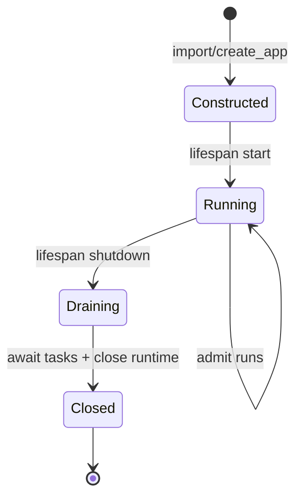
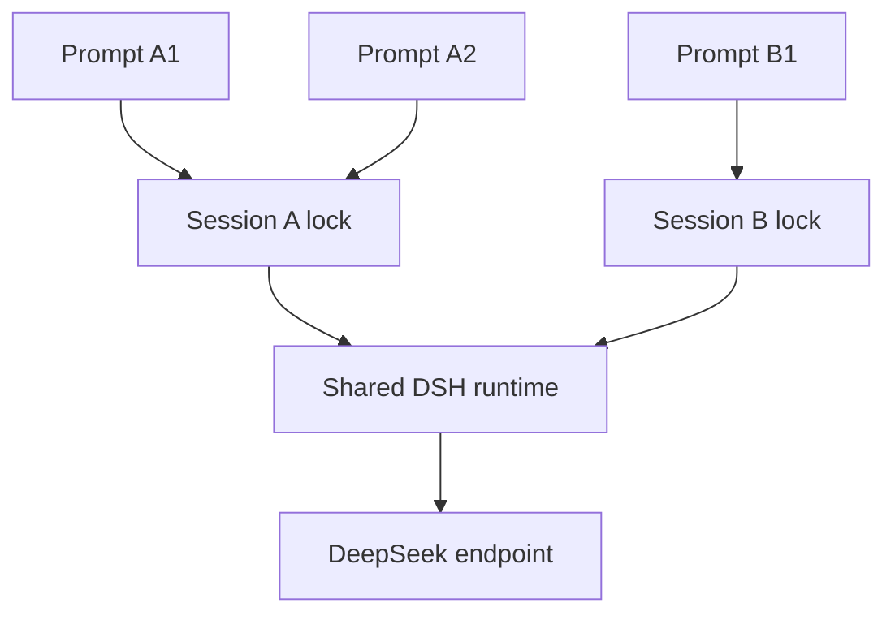

# 第五章：Runtime 生命周期与并发

## 学习目标

理解 Web 服务如何长期拥有一个 DSH runtime 子进程：何时启动、如何复用、怎样控制同一 session 的并发、客户端断开后如何结算，以及服务关闭时如何等待任务完全停稳。

## 前置条件

先完成前四章。第五章关注服务端资源语义，不增加新的 UI 控件。建议同时打开两个浏览器标签或使用两个 curl 进程观察不同 session。

## 运行

```sh
uv run python -m dsh_fastapi_101
```

打开 `http://127.0.0.1:8000/chapter/5`。用两个不同 session ID 同时发送较长任务，随后再用同一个 ID 快速连续发送两次请求。

## 源码分析

FastAPI 的 lifespan 在第一次接收流量前调用 `RuntimeService.start()`，创建 workspace/session 目录、构造 `DeepSeekHarness` 并初始化 runtime。关闭时调用 `RuntimeService.close()`，先等待所有已接纳任务，再发送 shutdown 并回收子进程。仅仅 import `app` 不会创建目录或启动进程。



`RuntimeService` 为每个 session ID 创建一个 `asyncio.Lock`。相同 session 的两个 prompt 必须串行，否则两个 `Session.run()` 会争用同一个 agent 活动区间，最终结果无法建立清晰边界；不同 session 使用不同锁，可以在线程池中并发，但仍共享一个 runtime 子进程。



SSE 客户端断开时，响应生成器会停止消费队列，但已经交给 agent 的工作不会自动取消。后台 task 继续运行到 DSH `idle`，并仍被 `_tasks` 集合追踪；服务关闭会等待这些 task。该语义避免因为浏览器刷新而把 runtime 留在未知的半执行状态。

## 验证

1. `RuntimeService()` 构造后目录不存在，`start()` 后才出现。
2. 两个不同 session 的测试运行可以重叠；相同 session 的最大并发为 1。
3. FastAPI lifespan 结束后 `DeepSeekHarness.close()` 已执行。
4. 中断 SSE 客户端后，服务仍能在该 session 进入 idle 后接受下一轮。
5. 进程退出时没有残留 runtime 子进程。

## 限制

这是单 FastAPI 进程的 runtime 管理器。多 worker 部署会让每个 worker 各自拉起一个 runtime，并且内存锁无法跨进程协调。生产架构应明确采用单 worker、本机 runtime supervisor，或将 runtime 封装为独立服务。当前 JSON-RPC 没有 cancel、steer、inject 和 session 管理方法；在服务器协议扩展前，不应靠杀整个 runtime 来模拟单 session 取消。
