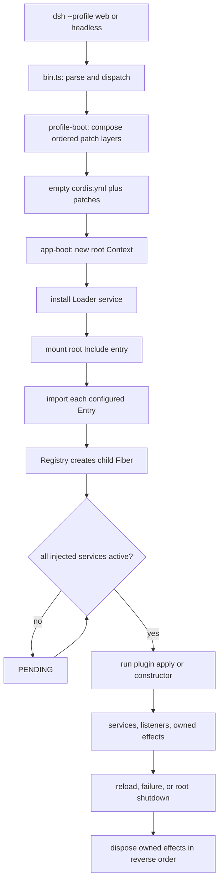

# Plugin tree 与 runtime 组装：从 profile 到可逆 lifecycle

> 固定版本：`dsh-v0.1.1-rc.2`
> 固定 revision：`b150a551b8d465e31e418e1b2eaf5e79bbb7d28e`
> 验证日期：2026-08-31

本篇回答两个容易混在一起的问题：profile 与 bundle 怎样决定“加载哪些 plugin”，Cordis 又怎样把这些配置行变成具有依赖、作用域和清理责任的运行时 plugin tree。结论只针对上面的固定 revision；文中的源码链接也全部固定到这个 revision。

## Verified from source

### 入口文件

| 阅读入口 | 在调用链中的职责 |
| --- | --- |
| [`apps/cli/src/bin.ts`](https://github.com/deepseek-ai/deepseek-harness/blob/b150a551b8d465e31e418e1b2eaf5e79bbb7d28e/apps/cli/src/bin.ts) | 解析 `dsh` 参数；只有合法的 profile 模式才动态导入并调用 `runProfile()`。 |
| [`apps/cli/src/profile-boot.ts`](https://github.com/deepseek-ai/deepseek-harness/blob/b150a551b8d465e31e418e1b2eaf5e79bbb7d28e/apps/cli/src/profile-boot.ts) | 解析 profile，按顺序叠加 bundle、用户与命令行 patch，调用 `boot()`，并把信号和进程退出接到 root disposal。 |
| [`packages/boot/app-boot/src/profile.ts`](https://github.com/deepseek-ai/deepseek-harness/blob/b150a551b8d465e31e418e1b2eaf5e79bbb7d28e/packages/boot/app-boot/src/profile.ts) | 定义 shipped profile 模板、解析 `dsh.profile.bundles`、定位每个 bundle 的 patch 文件，并把 patch 应用到空 root。 |
| [`packages/bundle/base/package.json`](https://github.com/deepseek-ai/deepseek-harness/blob/b150a551b8d465e31e418e1b2eaf5e79bbb7d28e/packages/bundle/base/package.json) 与 [`cordis.patch.yml`](https://github.com/deepseek-ai/deepseek-harness/blob/b150a551b8d465e31e418e1b2eaf5e79bbb7d28e/packages/bundle/base/cordis.patch.yml) | bundle manifest 指向 patch；base patch 插入 session、agent、LLM、tools 等共享行，surface bundle 再按行覆盖或追加。 |
| [`packages/boot/app-boot/src/index.ts`](https://github.com/deepseek-ai/deepseek-harness/blob/b150a551b8d465e31e418e1b2eaf5e79bbb7d28e/packages/boot/app-boot/src/index.ts) | 创建 root `Context`，安装 Loader，挂载 root Include，等待整棵树稳定并审计每个启用 entry 是否 active。 |
| [`vendor/include/src/index.ts`](https://github.com/deepseek-ai/deepseek-harness/blob/b150a551b8d465e31e418e1b2eaf5e79bbb7d28e/vendor/include/src/index.ts) | 解析 included entry list，在副本上按顺序应用 id-targeted patch，并把候选 tree 协调进 Loader。 |
| [`vendor/loader/src/config/entry.ts`](https://github.com/deepseek-ai/deepseek-harness/blob/b150a551b8d465e31e418e1b2eaf5e79bbb7d28e/vendor/loader/src/config/entry.ts) 与 [`tree.ts`](https://github.com/deepseek-ai/deepseek-harness/blob/b150a551b8d465e31e418e1b2eaf5e79bbb7d28e/vendor/loader/src/config/tree.ts) | 将配置行解析成 `Entry`，导入模块，通过 registry 创建 fiber，并等待导入与 lifecycle task 全部结束。 |
| [`vendor/cordis/src/context.ts`](https://github.com/deepseek-ai/deepseek-harness/blob/b150a551b8d465e31e418e1b2eaf5e79bbb7d28e/vendor/cordis/src/context.ts)、[`registry.ts`](https://github.com/deepseek-ai/deepseek-harness/blob/b150a551b8d465e31e418e1b2eaf5e79bbb7d28e/vendor/cordis/src/registry.ts)、[`fiber.ts`](https://github.com/deepseek-ai/deepseek-harness/blob/b150a551b8d465e31e418e1b2eaf5e79bbb7d28e/vendor/cordis/src/fiber.ts) | 定义 service-aware `Context`、plugin 规范化与依赖注入，以及 effect 的安装、状态迁移和逆序清理。 |

### profile、bundle 与 plugin 不是同一种东西

- **profile** 是一次启动使用的命名组合。rc.2 的 shipped `web` profile 由 base 与 web-app bundle 组成，`headless` 由 base 与 headless bundle 组成；profile 自己还可以有 `cordis.patch.yml`。
- **bundle** 是配置层，不是一个长期运行的“总 plugin”。它的 manifest 通过 `dsh.bundle.patch` 指向一组 entry patch；base bundle 插入公共行，surface bundle 通过稳定 entry id 覆盖或新增行。
- **plugin entry** 才会被 Loader 导入并转成 Cordis fiber。一个 entry 的 `name` 指向 function、class 或具有 `apply(ctx, config)` 的对象；`inject` 声明它启动前必须可用的 service。
- **plugin tree** 是运行时关系：Context 作用域、父子 fiber、service provider/consumer 和这些 fiber 拥有的 effects。它不是 YAML 行的简单顺序执行结果。

rc.2 的 profile root `cordis.yml` 被重写为空 entry list，最终树完全由 patch 组装。`runProfile()` 的有效优先级从低到高是：manifest 中按顺序列出的 bundle patch、profile 自己的 patch、`$DSH_HOME/cordis.patch.yml`、按 argv 顺序给出的 `--patch`，再加 launcher 自己拥有的 preset/telemetry 尾部修正。这里的顺序决定配置覆盖关系；base patch 明确说明 entry 的排列顺序不携带启动语义，真正的激活条件由 service availability 决定。

### 一次启动的具体调用路径

1. `bin.ts` 将 profile 模式交给 `runProfile()`；help、version 或参数错误不会进入 runtime boot。
2. `prepareProfile()` 修复安装包到 profile 的模块解析后备，`loadProfile()` 读取 manifest 中的 bundle 列表并加载各 patch；`composeEntries()` 使用 Include 的同一套 patch 算法在空 root 上求出最终 entries。
3. `boot()` 创建 root `Context`，设置配置基准 URL，提供 `dshHomePath`，再以 `ctx.plugin(Loader)` 安装 Loader service。launcher 的环境快照和命令行 service 在任何配置 entry 挂载前提供。
4. `mountRootInclude()` 把 `cordis:include` 与 `cordis:group` 注册成 Loader builtin，并创建固定 id 为 `include` 的 root entry。Include 读取空 root、应用有序 patches，再把结果协调进 Loader tree。
5. 每个 `Entry` 导入自己的 module，调用 `ctx.registry.plugin(plugin, config)` 创建 child fiber。Cordis 先解析 `inject`；缺少依赖的 fiber 保持 `PENDING`，依赖 active 后才执行 plugin function、constructor 或 `apply()`。
6. plugin 在自己的 Context 中提供 service、注册 listener 或创建其他资源。`ctx.effect()` 把对应 disposer 记在当前 fiber 上；子 plugin 本身也由父 fiber 的 effect 拥有。
7. `ctx.loader.await()` 等待当前导入和 lifecycle task 清空，随后 `assertEntriesActivated()` 拒绝导入失败、启动失败或仍等待 service 的启用 entry。`boot()` 只在整棵树稳定后返回。
8. 正常信号、surface 主动退出或启动失败最终都汇入 root fiber disposal。fiber 卸载时以逆注册顺序调用并等待已登记的 effect disposer；某个清理失败会被记录，但不会跳过其他同级清理。



这个图只表示装配与 lifecycle。它没有把所有 entry 画成一条串行链，因为 rc.2 的 Loader 会按依赖可用性激活 fibers；配置文件中的相邻行不等于先后启动。

## Observed at runtime

在固定 revision 的 upstream checkout 根目录运行了一个不需要 API key 的 focused probe：

```sh
corepack pnpm exec vitest run \
  packages/boot/app-boot/tests/profile.spec.ts \
  -t "resolves each dsh.profile.bundles entry to its patch layer in order, plus the user layer"
# 1 test file passed; 1 test passed, 13 skipped
```

测试在临时目录中构造两个 fake bundle：第一层插入 entry，第二层覆盖它，profile 用户层再次覆盖。最终 entry 保留第一层给出的 plugin name，配置值来自最后一层。这个结果直接观察了 bundle 顺序与 user-layer precedence；它没有启动完整 base/web/headless composition，也没有覆盖 HMR 或进程信号。

## Inference

- 排查“某 plugin 为什么没运行”时，应先区分三类问题：entry 是否被最终 composition 保留、module 是否成功导入、fiber 是否因缺少 injected service 留在 `PENDING`。只看 YAML 中是否出现某一行不够。
- profile/bundle 适合回答“要什么能力”，service injection 适合回答“何时可以启动”，fiber/effect ownership 适合回答“谁负责撤销”。把三层合称为一个启动顺序会掩盖真实故障点。
- plugin 注册只要通过 effect-aware API，就能随 owning fiber 一起 reload 或 teardown；脱离 Context 自行持有 listener、timer 或子进程，会绕开这条结构化清理链。

## Proposal

自学时可以选 base bundle 中一个稳定 entry id，依次完成三次小实验：用 `dsh --dump-config` 确认它来自哪一层；在临时 profile patch 中覆盖它；再写一个只提供 service 与 disposer 的最小 Cordis plugin，观察 consumer 从 `PENDING` 到 `ACTIVE` 以及 disposal 的逆序日志。实验应放在独立临时目录或 `labs/`，不要修改 upstream checkout。

面向业务部署，可以在启动日志中同时保存 profile 名、最终 entry id 清单与未满足的 injected services；这些是诊断投影，不应成为另一份可写配置真源。

## Unconfirmed / version boundary

- 结论只适用于 `dsh-v0.1.1-rc.2` / `b150a551b8d465e31e418e1b2eaf5e79bbb7d28e`。DSH 仍处于 developer preview，profile 模板、bundle rows、Loader 与 vendored Cordis 都可能改变。
- focused probe 只验证三层 composition 的一个成功路径；没有验证完整 runtime、HMR transaction、Windows module resolution、失败 rollback 或 bounded process shutdown。
- `dsh --dump-config` 使用相同 patch 算法，但不会 boot plugin tree，也不会执行 entry 中延迟到 injection-ready Context 的 `!!js`；静态 dump 不能证明某 fiber 已 active。
- 本篇没有使用模型或真实 API，因此不证明 LLM、tools、session persistence 或 Web surface 的可用性。
