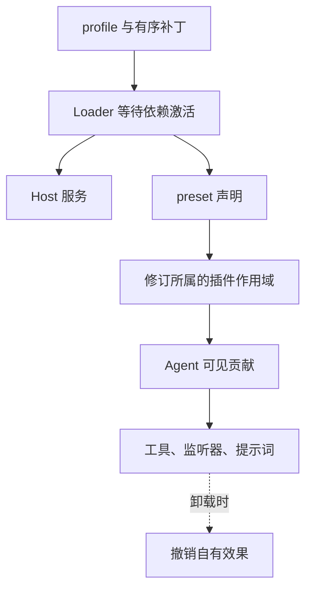

# Plugin tree 与 runtime 组装：profile、preset 与可逆 lifecycle

> 固定版本：`dsh-v0.1.7-rc.2`；revision：`477b4f420553e8a52c2fbccc464d7561b239c443`；源码审查：2026-09-29。

你给 Agent 加了一个工具，配置中能看到它，模型却没有使用它。继续改 prompt 之前，先沿启动过程看一遍：这个 plugin 有没有激活，它注册的工具又对哪个 Agent 可见？

DSH 在三个位置处理这件事。profile 组装进程的 plugin tree；preset 为 Agent 组织可见工具和提示词；Cordis 管理每次激活创建的资源。把这三层分别看清，就能定位“没加载”“没激活”和“作用域不可见”这三类问题。

下面的机制说明依据页首固定源码；文末的实验链接说明哪些路径已经运行。preset 控制贡献的可见性，不提供操作系统隔离。

## profile 与 bundle

公开 Node 应用经 `dsh --profile <name>` 或 `dsh <name>` 启动。`web`、`headless`、`sdk`、`acp` 都以 base bundle 为第一层；`sdk-minimal` 是独立完整 bundle，**不叠加 base**。TypeScript SDK 默认解析同版本 dsh 并选择 sdk；自定义能力通过 profile 和 patches 组合，不通过任意 `launch.command/args`。

profile manifest 的 `dsh.profile.bundles` 按顺序引用 bundle；bundle 的 `dsh.bundle.patch` 指向配置补丁。最终配置从空 entry list 开始，依次应用 bundle patches、profile 自己的 patch、home-level patch、命令行 `--patch`。按 id 覆盖一行时替换完整 config，不能假定对象字段深合并。

例如，某行 plugin 的 config 原来含 `enabled` 和 `limit` 两个字段，后层按 id 用只含 `limit` 的 config 覆盖它。组合结果不会自动保留 `enabled`；是否允许省略以及采用什么默认值，再由该 plugin 的配置规则决定。诊断时先看最终 config，能避免把补丁问题误判为模型问题。

`runProfile()` → profile 准备与加载 → `boot()` → root Context / Loader / Include → entry 导入 → fiber 激活。`inject` 依赖缺失时 fiber 等待，服务可用后才运行 plugin；boot 等待 Loader 并检查启用 entry 的激活结果。配置行相邻不意味着串行启动。

在命令行先查看组合结果，可以帮助排查配置。`--dump-config` 只显示组合结果，不能证明服务激活，也不执行依赖就绪后才求值的 `!!js`。

## preset 与 Agent scope

`@deepseek-ai/dsh-agent-preset` 是普通声明行，其 `config.id` 与 `plugins` 由 preset registry 管理。registry 的 `default` 指定未显式选择时的 preset；它不扫描任意 preset 路径。每个声明修订建立 registry-owned scope 与 Loader tree，Agent scope 通过父链接取得可见贡献。

更新或删除声明会退休旧修订。已有 Agent、child 和历史读取引用仍保留它，最后一个引用释放后才卸载；新绑定使用当前声明。重启只恢复持久化的 preset ID，再解析**当前**定义；不承诺恢复旧进程中的实现修订。缺失定义与激活失败阻止绑定。preset 中的 service row 需要正确 `isolate` realm，不能把服务意外注册到全局。


```mermaid
flowchart TD
    P["profile 与有序补丁"] --> L["Loader 等待依赖激活"]
    L --> H["Host 服务"]
    L --> D["preset 声明"]
    D --> R["修订所属的插件作用域"]
    R --> A["Agent 可见贡献"]
    A --> E["工具、监听器、提示词"]
    E -.->|"卸载时"| X["撤销自有效果"]
```

`ctx.on()`、`ctx.effect()` 与 effect-aware register 管理撤销。依赖丢失、reload 和 owner disposal 都必须沿资源所有权处理；自己挂在全局的 timer/listener 不会因为它曾由 plugin 创建就自动归属 fiber。

## 到实验中观察

[2026-09-28 supervisor 执行记录](../docs/reviews/2026-09-28-execution.md)记录发布 `0.1.7-rc.2` 的 sdk-minimal initialize/close 成功；它只支持“公开 profile 可启动”，不证明所有 profile、preset 修订或 HMR。新版 Cordis 的进一步证据由 [lifecycle lab](../labs/cordis-plugin-lifecycle/README.md)独立拥有。

这里复用明确日期的运行记录。[2026-08-31 composition probe](historical-2026-08-31.md)为历史证据，不能沿用为新版结果。

## 最小核对与限制

在具有该 tag 的 upstream checkout 中执行（只读，不要求 checkout master）：

```sh
git show dsh-v0.1.7-rc.2:packages/boot/app-boot/src/profile.ts
git show dsh-v0.1.7-rc.2:packages/preset/agent-preset-registry/src/mount.ts
```

从这些机制可以推导出一条排查顺序：先看最终 entry，再看导入错误与依赖激活，最后核对 Agent 的 preset scope。修改声明后旧 Agent 保留修订、新 Agent 使用新修订的热更新行为，仍需独立运行验证；当前证据也不覆盖 Windows resolution 或 sandbox。

## 对照源码

按上面的执行过程阅读这些入口。链接全部指向页首固定 revision，源码事实与运行观察的范围分别见正文。

| 入口 | 职责 |
| --- | --- |
| [CLI bin](https://github.com/deepseek-ai/deepseek-harness/blob/477b4f420553e8a52c2fbccc464d7561b239c443/apps/cli/src/bin.ts)、[profile runner](https://github.com/deepseek-ai/deepseek-harness/blob/477b4f420553e8a52c2fbccc464d7561b239c443/apps/cli/src/profile-boot.ts) | 公开 `dsh --profile` 启动和有序 patch 组装 |
| [profile](https://github.com/deepseek-ai/deepseek-harness/blob/477b4f420553e8a52c2fbccc464d7561b239c443/packages/boot/app-boot/src/profile.ts)、[boot](https://github.com/deepseek-ai/deepseek-harness/blob/477b4f420553e8a52c2fbccc464d7561b239c443/packages/boot/app-boot/src/index.ts) | shipped templates、解析 bundle、Loader 与激活检查 |
| [preset registry](https://github.com/deepseek-ai/deepseek-harness/blob/477b4f420553e8a52c2fbccc464d7561b239c443/packages/preset/agent-preset-registry/src/index.ts)、[mount](https://github.com/deepseek-ai/deepseek-harness/blob/477b4f420553e8a52c2fbccc464d7561b239c443/packages/preset/agent-preset-registry/src/mount.ts) | 声明修订、作用域树、Agent 绑定与激活审计 |
| [Cordis fiber](https://github.com/deepseek-ai/deepseek-harness/blob/477b4f420553e8a52c2fbccc464d7561b239c443/vendor/cordis/src/fiber.ts) | 可逆 effect 的生命周期与清理 |
