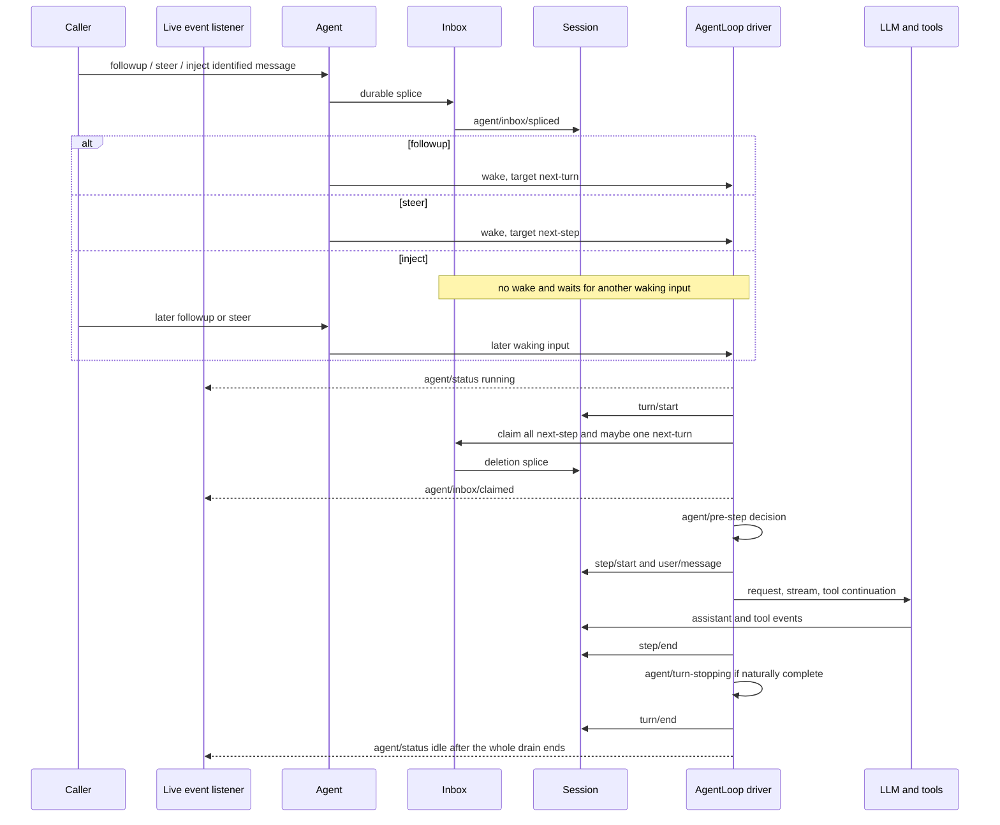

# Agent Inbox 与 AgentLoop：输入如何变成 turn、step 与 whole-agent idle

> 固定版本：`dsh-v0.1.1-rc.2`
> 固定 revision：`b150a551b8d465e31e418e1b2eaf5e79bbb7d28e`
> 验证日期：2026-08-31

本篇沿一条 identified user message 追踪 rc.2 的 live `Agent`、durable Inbox、`AgentLoop` driver 与 SessionEvent。重点不是复述完整 loop，而是弄清 `followup()`、`steer()`、`inject()` 到底把消息放在哪里、是否唤醒 driver，以及为什么“收到入队 receipt 后等待 whole-agent idle”仍不等于得到一个 prompt 专属 Run。

## Verified from source

### 入口文件

| 阅读入口 | 在调用链中的职责 |
| --- | --- |
| [`packages/core/agent/src/runtime-types.ts`](https://github.com/deepseek-ai/deepseek-harness/blob/b150a551b8d465e31e418e1b2eaf5e79bbb7d28e/packages/core/agent/src/runtime-types.ts) | 定义 public `Agent`、`AgentStatus`、`followup`/`steer`/`inject`、cancel 与 `whenIdle()` 语义。 |
| [`packages/core/agent/src/inbox.ts`](https://github.com/deepseek-ai/deepseek-harness/blob/b150a551b8d465e31e418e1b2eaf5e79bbb7d28e/packages/core/agent/src/inbox.ts) | 从 durable splice 重建两个队列，校验 identity，提交 mutation，并在 step boundary claim 消息。 |
| [`packages/core/agent/src/index.ts`](https://github.com/deepseek-ai/deepseek-harness/blob/b150a551b8d465e31e418e1b2eaf5e79bbb7d28e/packages/core/agent/src/index.ts) | 实现 `AgentRegistry`、factory 注册、live lookup、创建/恢复委派，以及 `AgentHandle` 暴露范围。 |
| [`packages/core/agent-loop/src/index.ts`](https://github.com/deepseek-ai/deepseek-harness/blob/b150a551b8d465e31e418e1b2eaf5e79bbb7d28e/packages/core/agent-loop/src/index.ts) | 将 `AgentLoop` 注册为 factory，组装 scoped Agent/Session，发布生命周期，并实现 memoized ordered teardown。 |
| [`packages/core/agent-loop/src/agent.ts`](https://github.com/deepseek-ai/deepseek-harness/blob/b150a551b8d465e31e418e1b2eaf5e79bbb7d28e/packages/core/agent-loop/src/agent.ts) | `Agent` 的默认具体 driver：wake、claim、pre-step、turn/step、LLM stream、tool continuation 与 idle convergence。 |
| [`packages/sdk/client/src/api.ts`](https://github.com/deepseek-ai/deepseek-harness/blob/b150a551b8d465e31e418e1b2eaf5e79bbb7d28e/packages/sdk/client/src/api.ts) | 展示高层 SDK 怎样把 matching inbox receipt 到下一次 root-session idle 解释成自己拥有的 activity interval。 |

### 五个对象各自负责什么

- **`Agent`** 是 live handle：共享 Session identity，暴露 `session`、`inbox`、`status`、agent-scoped `ctx` 与运行控制。它不规定 loop 的实现。
- **`AgentLoop`** 是 rc.2 默认 driver 与 `AgentFactory` provider。consumer 依赖 `ctx.agents`，不需要直接依赖具体 loop package。
- **`AgentRegistry`** 是 live Agent 目录和 factory 门面。`create()`/`resume()` 通过当前 factory 构造 Agent；`get()` 只返回 bare `Agent`，不会泄露 disposal capability。
- **`AgentHandle`** 只交给 programmatic create/resume 的调用方，包含 `{ agent, dispose }`。调用 `dispose()` 会以 `disposed` cause 停止 driver、等待 `whenIdle()`、撤销 agent scope，再从 Agent/Session registries 解绑；factory 自身也是 structural owner。
- **`Inbox`** 是 SessionEvent 的增量投影，不是临时数组。它从 seed 之后的 `agent/inbox/spliced` 重放 pending work；新 mutation 先 append durable splice，再修改内存队列并发 live inserted/discarded notification。

### 两个队列与三个发送方法

| 方法 | Inbox target | idle 时是否唤醒 | running 时的最近消费点 |
| --- | --- | --- | --- |
| `followup(message)` | `next-turn` | 是 | 当前 driver 结束本 turn 后，下一 turn 领取一个 ordinary prompt。 |
| `steer(message)` | `next-step` | 是 | 最近尚未 claim 的 step boundary；idle 时会立即打开一个 turn。 |
| `inject(message)` | `next-step` | 否 | 运行中的最近尚未 claim 的 step；idle 时一直停放，直到其他 waking input 到来。 |

`Inbox.claim(target, turn)` 总是先取走全部 `next-step`；当 target 是 `next-turn` 时，再取一个 `next-turn`。claim 写入的是纯删除 splice，不把消息标成 canceled；随后 loop 为每条消息发 live `agent/inbox/claimed`。这解释了两个常见现象：注入内容排在 ordinary prompt 前进入 proposed batch，以及多个普通 followup 各自保留 turn 边界。

### 一条输入的具体调用路径

1. 调用方先创建具有唯一 `MessageId` 和 `source` 的 `UserMessage`，再调用 `followup`、`steer` 或 `inject`。
2. `ReactLoopAgent.send()` 将消息 durable splice 到目标队列。`followup` 与 `steer` 继续调用 `wakeDriver()`；`inject` 到此返回。
3. idle Agent 被唤醒时同步把内部 phase 改为 running，并发 live `agent/status: running`。driver 在 initiator scope 中执行 `kick()`；如果已经 running，waking message 由当前 drain interval 的后续 boundary 消费。
4. driver 打开 durable `turn/start`，`preStep()` 调用 `Inbox.claim()`，组装 system/runtime context，再经过 `agent/pre-step` waterfall。只有 `enter` decision 的 identified messages 会进入 step；`reject` 可以结束一个没有 step 的 blocked turn。
5. 对 entered batch，loop 依次记录 `step/start` 和 `user/message`，构造模型请求，记录 `assistant/chunk` 与 committed `assistant/message`。tool call/result 结束后，未结束的工具链或新的 `next-step` 输入会形成同一 turn 的下一 step。
6. 模型/工具处理结束后先记录 `step/end`。自然停止且没有 `next-step` 时，`agent/turn-stopping` 是关闭 turn 前最后一次 steering checkpoint；仍无新 steering 才记录 `turn/end`。如果还有 ordinary `next-turn`，同一 running driver 继续下一个 turn。
7. driver 不再欠下工作时才切回 live `agent/status: idle`。因此 `running` 可以跨多个 turn；它不是“某一个 prompt 正在执行”的状态。



### receipt-to-whole-agent-idle 的准确边界

`followup()` 返回 `void`，输入的 `MessageId` 只标识 durable inbox insertion、claim 或 discard，不标识 assistant output，也不是 core 中的 Run id。`whenIdle()` 等待当前 whole-agent activity 完全静止，并会跟随旧 driver 退休前替换进去的工作；它不判断是哪条 message 导致了哪些输出。内部 maintenance phase 对外仍显示 `idle`，但 `whenIdle()` 会继续等待 maintenance 以及其后释放的 waking work。

TypeScript SDK 的高层 `HarnessSession.run()` 因而做了两段过滤：先等待返回的 `MessageId` 出现在 root Session 的 `agent/inbox/spliced` receipt，再收集通知直到该 root Session 报 idle。这个区间可能包含 steering、injected context 或在 idle 前加入的其他 work；`finalResponse` 只是区间内最后一个 committed root assistant text。只有明确拥有“发送前订阅、matching receipt、持续观察到 idle”这个完整区间的调用方，才能把它称为自己的 run；bare `Agent` 或单个 receipt 本身没有这项所有权。

## Observed at runtime

在固定 revision 的 upstream checkout 根目录运行了不需要 API key 的 focused probe；测试使用 `MockAdapter`：

```sh
corepack pnpm exec vitest run \
  packages/core/agent-loop/tests/loop.spec.ts \
  -t "runs a simple turn|starts idle steering synchronously|inject\\(\\) while idle"
# 1 test file passed; 3 tests passed, 51 skipped
```

三个通过的 case 分别观察到：ordinary input 先留下 inbox splice，再产生嵌套的 turn/step 事件并回到 idle；idle `steer()` 同步进入 running，后来的 steering 在下一 step 被消费；idle `inject()` 只留下 durable `next-step` splice，不打开 turn，直到后续 waking input 才进入模型请求。它们没有调用真实模型，也没有覆盖 cancellation、tool failure、resume 或多 caller 竞争。

## Inference

- UI 或 orchestrator 若把 `MessageId` 展示成“运行编号”，会把 delivery receipt 误写成 execution identity。要追踪业务任务，需要在 DSH 之上另建稳定的 Task/Run 标识和关联记录。
- `agent/status: idle` 是 whole-agent quiescence 的 live 观察，不是某 prompt 的 terminal event。多个 producer 可以向同一 Agent 发送 work 时，任何一个 caller 都不能仅靠下一次 idle 把全部输出归因给自己。
- `inject()` 适合不应单独触发模型调用、但需要在下一 pre-step 进入 model-visible history 的 context。需要立即推进 driver 的用户意图应使用 waking route；选择错误会表现为“消息已持久化但 Agent 没启动”。
- disposal capability 只在 `AgentHandle` 与 structural owner 手中，使“谁可以终止 Agent lifecycle”与“谁可以查到并发送给 Agent”保持分离。

## Proposal

需要可恢复业务执行的应用可以在 DSH 之上定义自己的 `RunReceipt`，至少记录业务 `runId`、目标 SessionId、提交的 MessageId、receipt cursor、提交者与接管状态；输出仍通过 SessionEvent cursor 投影，终态由业务控制面在 whole-agent idle、错误、cancel 或连接丢失后归档。这个对象属于应用，不应假装成 rc.2 core 已有类型。

多 producer 共享一个 live Agent 时，可以由一个 admission coordinator 串行拥有 receipt-to-idle 区间；无法保证独占时，就把区间结果标成 whole-agent observation，而不是 prompt response。

## Unconfirmed / version boundary

- 结论只适用于 `dsh-v0.1.1-rc.2` / `b150a551b8d465e31e418e1b2eaf5e79bbb7d28e`。Agent API、event vocabulary、SDK completion policy 与 loop implementation 都可能在后续 developer preview 改变。
- focused probe 没有验证并发 producer 下的因果归属；源码只证明 core 没有提供 prompt-specific completion handle。
- 本篇没有验证 cancel convergence、resume 后的 pending inbox replay、subagent ownership、tool scheduler 并发或 persistence backend failure。
- `AgentLoop` 是 rc.2 默认实现，不是 `Agent` 接口唯一可能的 driver；自定义 factory 必须重新验证 wake、idle 与 disposal 语义，不能只复用这里的推断。
