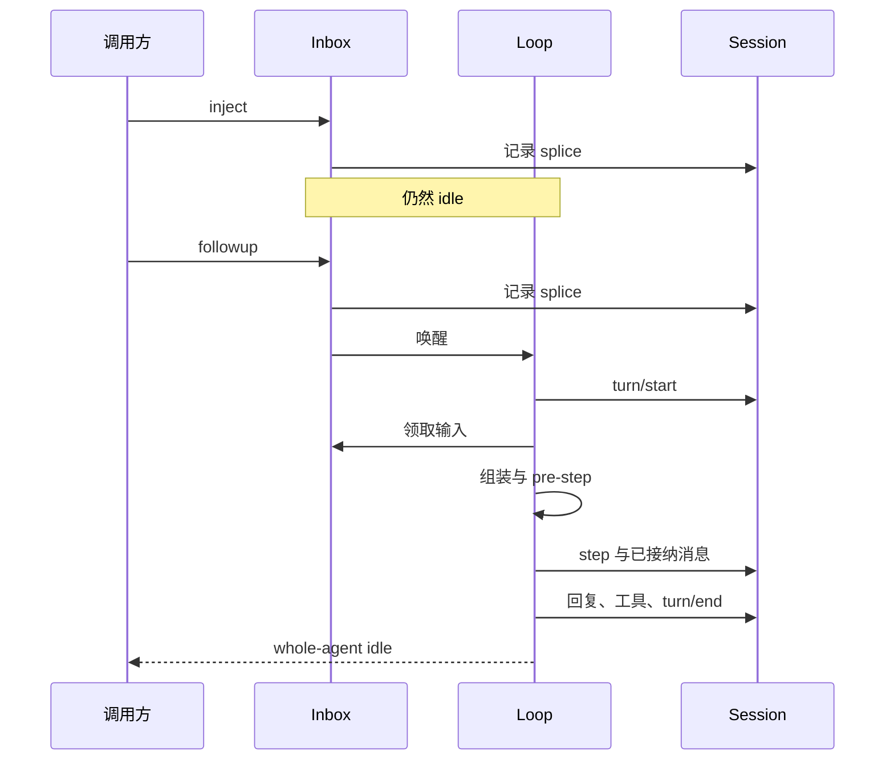

# Agent Inbox 与 AgentLoop：输入、作用域与 whole-agent idle

> 固定版本：`dsh-v0.1.7-rc.2`；revision：`477b4f420553e8a52c2fbccc464d7561b239c443`；源码审查：2026-09-29。

向一个空闲 Agent 调用 `inject()`，日志里出现了输入，它却没有开始回答。再调用一次 `followup()`，两条输入才一起进入模型请求。这个现象能帮助我们把“收到输入”和“开始工作”分开。

调用方拿到的 `Agent` 是一个活跃句柄，`AgentLoop` 是推进工作的驱动，`Session` 则保存执行事实。先看输入在哪里等待，再看谁负责唤醒、执行与收尾。下面是固定源码的行为，后面的无 Key 探针可以观察其中的基本路径。

## 先认清句柄由谁关闭

`ctx.agents.create()` / `resume()` 返回 `{ agent, dispose }`；目录查询只给 live Agent，不转交 dispose 权限。AgentLoop 创建 unpublished Session/Agent，运行 setup，发布 registry identity，并等待 serial `agent/created` 初始化；初始化结束前不执行排队工作，失败会 rollback。先确保初始化完成，输入才会被驱动执行。

作用域决定这次 Agent 能看见哪些工具、监听器和提示词。`agent.ctx` 是 Agent 的贡献作用域；AgentLoop 保存自身依赖 context（私有 `runtime.ctx` / driver 的 `loopCtx`），不能因调用方 shadow 就换成另一组驱动依赖。`agentEvents(ctx, agent)` 将 event subject 与 scope carrier 绑定，`assembleContextFor(agent, signal)` 传递一致的 Agent/assembly scope。

另一类容易混淆的信息是“谁发起这项工作”。`ctx.agents.withInitiator()` 用进程内 async scope 表示当前工作的发起者；`withoutInitiator()` 可清除共享后台工作上的误归属。initiator 不替代明确的输入字段，也不自动拥有 detached task。

把 handle 保存下来时，也要保存与它一起返回的 dispose。dispose 共享一次回收：停止 driver、等待 quiescence、撤销 Agent scope，完成持久化写路径收尾和 registry 解绑。正常业务代码应调用 holder 的 dispose，而不是直接删 registry 项目。`resume()` 通过 persistence 的 `open(id, 'write')` 先取得写 ownership，再读取和修复中断历史，完成 setup 后发布 Agent。

## 队列与唤醒

| 方法 | target | idle 时 | 消费点 |
| --- | --- | --- | --- |
| `followup(message)` | next-turn | 唤醒 | 每个 ordinary input 独占一轮 |
| `steer(message)` | next-step | 唤醒 | 最近未 claim 的 step |
| `inject(message)` | next-step | 不唤醒 | 等待后来的 waking input / 活跃 step |

Inbox 由 `agent/inbox/spliced` 重建；mutation 先提交 splice，再更新队列和 live 通知。claim 取全部 next-step，再视 target 取一个 next-turn；被 claim 不意味着一定进入模型，`agent/pre-step` 可以拒绝或改写输入。被拒绝的首批输入可能留下没有 step 的 turn。

小屏阅读时可[打开此图的 SVG](assets/02-inbox-sequence.svg)放大查看。下图为可编辑的 Mermaid 源，SVG 由同一版本图生成。


```mermaid
sequenceDiagram
    participant C as 调用方
    participant A as Inbox
    participant L as Loop
    participant S as Session
    C->>A: inject
    A->>S: 记录 splice
    Note over A,L: 仍然 idle
    C->>A: followup
    A->>S: 记录 splice
    A->>L: 唤醒
    L->>S: turn/start
    L->>A: 领取输入
    L->>L: 组装与 pre-step
    L->>S: step 与已接纳消息
    L->>S: 回复、工具、turn/end
    L-->>C: whole-agent idle
```

一个 running interval 可以覆盖多轮。`whenIdle()` 等待整个 driver 与 maintenance，包括原 driver 退出前接续的工作；不返回某条 message 的结果。maintenance 对外状态可为 idle，但 `whenIdle()` 仍会等它和其后释放的输入。

SDK 的 `run()` 先匹配 root `agent/inbox/spliced` 中的 messageId，再观察到 root idle。它会包含期间的 steering 或注入；`finalResponse` 是区间内最后一条已提交 root assistant 文本，不能把 messageId 当作业务 Run ID。

## 到实验中观察

2026-09-29 从仓库根目录执行：

```sh
node --test --test-name-pattern='inbox waits' how-dsh-works/probes/published-core.test.mjs
```

2026-09-29 的完整 [published-core probe](probes/published-core.test.mjs)为 3/3 passed；上述 case 使用真实发布库与确定性 adapter，观察 idle inject 不开 turn、followup 同步 running、注入内容先于 waking input 进入请求、whenIdle 后提交 V4 assistant。它未启动 DSH 子进程、未联网或调用模型。安装前置条件见[目录说明](README.md#新版证据与重跑)。

## 继续验证什么

应用可以据此把输入接纳和业务 Run 的创建放到自己拥有的协调层。仅看 status，无法判断某条并发输入对应的工作是否结算。

[维护并发实验](../labs/compaction-lifecycle/TRANSACTIONS.md)进一步观察了第二个 maintenance 被拒绝、followup 等待维护与 flush 的路径。初始化失败 rollback、全部取消交错和真实 SDK 多调用方竞争仍未完整验证；[旧 loop probes](historical-2026-08-31.md)保持原版本记录。

## 对照源码

按上面的执行过程阅读这些入口。链接全部指向页首固定 revision，源码事实与运行观察的范围分别见正文。

| 入口 | 职责 |
| --- | --- |
| [Agent types](https://github.com/deepseek-ai/deepseek-harness/blob/477b4f420553e8a52c2fbccc464d7561b239c443/packages/core/agent/src/runtime-types.ts)、[registry](https://github.com/deepseek-ai/deepseek-harness/blob/477b4f420553e8a52c2fbccc464d7561b239c443/packages/core/agent/src/index.ts) | live handle、factory、initiator 与 create/resume 所有权 |
| [dispatch](https://github.com/deepseek-ai/deepseek-harness/blob/477b4f420553e8a52c2fbccc464d7561b239c443/packages/core/agent/src/dispatch.ts) | `agentEvents` 与 `assembleContextFor` 的 Agent/作用域对应 |
| [loop factory](https://github.com/deepseek-ai/deepseek-harness/blob/477b4f420553e8a52c2fbccc464d7561b239c443/packages/core/agent-loop/src/index.ts)、[driver](https://github.com/deepseek-ai/deepseek-harness/blob/477b4f420553e8a52c2fbccc464d7561b239c443/packages/core/agent-loop/src/agent.ts) | 创建、初始化、恢复、turn 驱动与销毁 |
| [driver Inbox](https://github.com/deepseek-ai/deepseek-harness/blob/477b4f420553e8a52c2fbccc464d7561b239c443/packages/core/agent-loop/src/inbox.ts) | durable splice 的 projection 与 claim |
| [SDK API](https://github.com/deepseek-ai/deepseek-harness/blob/477b4f420553e8a52c2fbccc464d7561b239c443/packages/sdk/client/src/api.ts) | matching receipt 到 root idle 的 activity interval |
