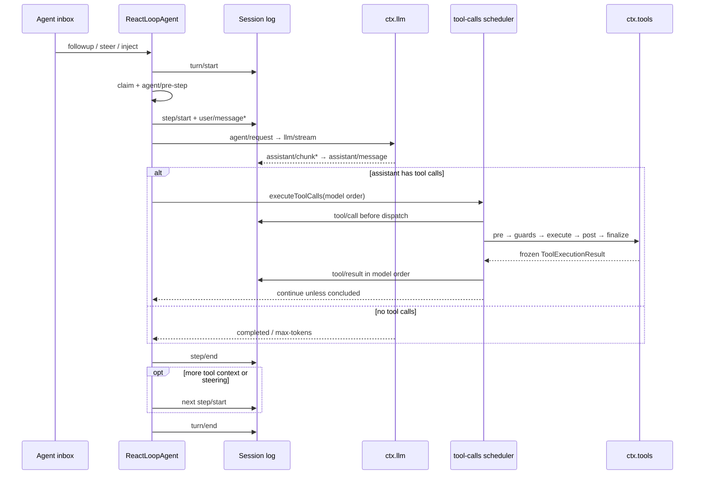

# Turn、Step 与工具执行流水线

本文回答一个具体问题：一条输入如何在 DeepSeek Harness 中变成一个或多个模型请求、工具调用和最终的 durable 事件。结论只适用于 upstream tag `dsh-v0.1.1-rc.2`，完整 commit 为 `b150a551b8d465e31e418e1b2eaf5e79bbb7d28e`。

## 入口文件

| 入口 | 在本链路中的职责 |
| --- | --- |
| [`packages/sdk/server/src/server.ts`](https://github.com/deepseek-ai/deepseek-harness/blob/b150a551b8d465e31e418e1b2eaf5e79bbb7d28e/packages/sdk/server/src/server.ts#L127-L143) | SDK JSON-RPC 的 `session/prompt` 把用户消息交给 `Agent.followup()`。 |
| [`packages/core/agent-loop/src/agent.ts`](https://github.com/deepseek-ai/deepseek-harness/blob/b150a551b8d465e31e418e1b2eaf5e79bbb7d28e/packages/core/agent-loop/src/agent.ts#L63-L505) | 默认 Agent driver；拥有 inbox、Turn/Step 边界、请求组装、流消费和继续条件。 |
| [`packages/core/agent-loop/src/tool-calls.ts`](https://github.com/deepseek-ai/deepseek-harness/blob/b150a551b8d465e31e418e1b2eaf5e79bbb7d28e/packages/core/agent-loop/src/tool-calls.ts#L1-L288) | 按 execution mode 调度工具，限制并行度，并按模型顺序提交结果。 |
| [`packages/core/tools/src/index.ts`](https://github.com/deepseek-ai/deepseek-harness/blob/b150a551b8d465e31e418e1b2eaf5e79bbb7d28e/packages/core/tools/src/index.ts#L1328-L1885) | 执行 `pre → guards → execute → post → finalize → result notification`。 |
| [`packages/llm/llm/src/index.ts`](https://github.com/deepseek-ai/deepseek-harness/blob/b150a551b8d465e31e418e1b2eaf5e79bbb7d28e/packages/llm/llm/src/index.ts#L930-L1010) | 选择 adapter，运行 `llm/stream` waterfall，并把 adapter 失败正规化为 terminal finish chunk。 |
| [`packages/core/session/src/index.ts`](https://github.com/deepseek-ai/deepseek-harness/blob/b150a551b8d465e31e418e1b2eaf5e79bbb7d28e/packages/core/session/src/index.ts#L569-L654) | 接受、冻结并发布每个 `SessionEvent`；事件日志是后续模型历史和 replay 的真源。 |

对应的 upstream 说明是 [architecture 的 Turn flow](https://github.com/deepseek-ai/deepseek-harness/blob/b150a551b8d465e31e418e1b2eaf5e79bbb7d28e/docs/architecture.md#turn-flow)、[Agent lifecycle](https://github.com/deepseek-ai/deepseek-harness/blob/b150a551b8d465e31e418e1b2eaf5e79bbb7d28e/docs/agent-lifecycle.md) 和 [Tool execution pipeline](https://github.com/deepseek-ai/deepseek-harness/blob/b150a551b8d465e31e418e1b2eaf5e79bbb7d28e/docs/tool-execution-pipeline.md)。

## Verified from source

### Turn 与 Step 的边界

`followup()` 把 identified `UserMessage` 放入 `next-turn` inbox 并唤醒 driver。driver 先写 `turn/start`，再 claim 一条 ordinary follow-up 加所有 `next-step` 输入，运行 `agent/pre-step` waterfall。只有最终 decision 是 `enter` 且首批消息非空时才写 `step/start`；因此被拒绝或被清空的首批输入会留下一个没有 Step 的 Turn。

一个 Step 包围一次 logical model request 以及该响应要求的全部工具执行；`agent/request-error` 明确要求 retry 时，新的 provider attempt 仍沿用同一 Turn/Step 坐标。进入 Step 后，loop 依次写 `user/message`，从 `systemPrompt` 和 `session.deriveMessages()` 组装请求，经 `agent/request` 与 `llm/stream` 获取 chunks，逐条写 `assistant/chunk`，最后写携带 `sourceEventSeqs` 的 `assistant/message`。`step/end` 位于外层 `finally`，所以 terminal 模型、工具或 scheduler 异常也会关闭已经打开的 Step。



### 具体调用路径

1. `HarnessSdkJsonRpcServer.prompt()` → `getOrCreateSession()` → `Agent.followup()`，或其他 client 直接调用 `followup()` / `steer()` / `inject()`。
2. `ReactLoopAgent.followup()` → `send()` → `Inbox.splice()` → `wakeDriver()` → `kick()` → `turn()`，打开 durable `turn/start`。
3. `turn()` → `preStep()` → `systemPrompt.assemble()` → `agent/pre-step` → `step()` → `buildRequest()` → `agent/request` → `LlmRuntime.stream()`。
4. `step()` → `executeToolCalls()` → scheduler `prepare/dispatch/finalize` → `ToolRuntime` waterfalls → `Session.append("tool/result")`。
5. `step/end` 后，tool continuation 或 pending steering 回到 `preStep("next-step")`；否则经过 `agent/turn-stopping` 写 `turn/end`，driver 再决定是否领取下一 Turn。

### 模型请求与继续条件

`buildRequest()` 先从 Agent options 和最新 durable request header 得到候选 route，再让 `agent/request` listeners 替换配置。`ctx.llm.prepareCall()` 把 exact model defaults 与 adapter generation 绑定；loop 在 dispatch 前写 `request/header`，route 或 context-window 改变时另写 `request/context`。真正的请求 history 每一步重新来自 `session.deriveMessages()`，不是 Agent 内另一份可变 message list。

模型返回普通 stop 且没有工具时，Step 返回 `completed`。`max-tokens` 是 sticky Turn outcome；后续 Step 正常完成也不会把它降为 `completed`。含工具调用且没有任何 result 标记 `concludesTurn` 时，Step 返回“尚未结束”，loop 在已记录的 `tool/result` 之后开启下一 Step，让模型读取工具结果；`concludesTurn` 仅在没有待处理 `next-step` 输入时结束 Turn，已经到达的 steering 仍可继续。

### 工具 scheduler 与结果顺序

工具参数先尝试 JSON parse；无效 JSON 作为原字符串交给 tool pipeline。scheduler 每次启动前读取 `ctx.tools.executionMode()`：`exclusive` 形成 barrier，`parallel` 进入受 `maxParallelToolCalls` 限制的 rolling pool。`tools/pre-execute` 和最终 commit 保持模型顺序，只有 tool body/around-dispatch 可以重叠；即使后一个调用先完成，`tool/result` 仍按 assistant message 中的调用顺序写入。

每个调用在 dispatch 前先写 `tool/call`。`ToolRuntime` 依次运行 `tools/pre-execute`、approval、monotonic guards、`tools/execute`、`tools/post-execute` 和 tool-owned `finalizeContent`，然后冻结结果并发出 non-vetoing `tools/result` notification。loop 随后把同一结果写成 model-visible `tool/result` SessionEvent；`additionalContexts` 按模型顺序进入 `next-step` inbox。

### 错误与 outcome unknown 的边界

adapter selection、dispatch 或 iteration failure 由 `LlmRuntime` 转成 `finish {kind: "error" | "aborted"}`。loop 在仍打开的 Step 内运行 `agent/request-error`；listener 可明确返回 `retry`，同一 Step 随即重建并重发 request。没有 retry 时才抛出保留 provider failure code 的 `LlmError`，随后外层 `finally` 写 `step/end`。waterfall、scheduler 或其他非 `LlmError` 异常在 `turn/end.reason` 中正规化为 `code: "UNKNOWN"`，但原异常仍通过 live `agent/error` 报告。

tool body、policy listener、result projection 等已进入 ToolRuntime 的失败通常被物化为 `isError: true` 的 `tool/result`，模型可以在下一 Step 看到错误。scheduler 自身在已经写下 `tool/call` 后失败时不会伪造 result；它停止补充新调用、等待已启动调用 settle，然后让 Turn 失败。若进程在 call 已 durable、result 未 durable 时终止，cold persistence repair 才会生成 `TOOL_OUTCOME_UNKNOWN` 结果，提醒调用方先检查外部状态；这个“工具副作用未知”与业务系统自己的 Run `execution_unknown` 不是同一个状态类型。

## Observed at runtime

在固定 rc.2 checkout 根目录实际运行了以下无 key probe：

```sh
env -u DEEPSEEK_API_KEY -u DEEPSEEK_BASE_URL \
  corepack pnpm exec vitest run \
  packages/core/agent-loop/tests/loop.spec.ts \
  packages/core/agent-loop/tests/tool-calls.spec.ts \
  -t 'round-trips tool calls|commits tool/result in model order'
```

结果为 2 个 test files 通过，选中的 2 个 tests 通过，73 个未匹配 tests skipped，exit 0。第一个场景观察到模型请求工具、工具结果进入下一次模型请求；第二个场景让后一个 parallel 调用先 settle，durable `tool/result` 仍保持模型顺序。本 probe 使用本地 mock adapter 和 test tools，不调用真实模型。

## Inference

Turn 是 driver 的排空和错误归属区间，不是某次 SDK request 的同步返回值；一个 Turn 可以没有 Step，也可以因工具结果或 steering 包含多个 Step。相应地，`Agent.whenIdle()` 只说明整个 Agent 已静止，不能单独证明某条 follow-up 的因果结果。

工具的并行性只影响 dispatch overlap，不改变模型可见结果顺序。业务层若按完成时间重排工具结果，会得到与 DSH 下一次模型请求不同的 transcript。

SessionEvent 是事实流而不是数据库事务：`tool/call` 和 `tool/result` 分开提交。看到 call 没看到 result 时，不能从日志推出“工具没有执行”。

## Proposal

业务应用应在 DSH Session/Turn 之外拥有自己的 Run 标识和 terminal policy，并以 SessionEvent seq 作为观察证据。对缺失 result 的 side-effecting tool，默认动作应是查询外部状态或询问用户，而不是自动重试。

需要扩展行为时，优先挂在 `agent/pre-step`、`agent/request`、`agent/request-error`、`agent/turn-stopping` 或 `tools/*` documented events 上；只有无法由这些扩展点表达的通用 driver 语义才需要修改 agent loop。

## Unconfirmed / version boundary

- 本文没有验证真实 provider 的 streaming 时序、retry middleware、approval UI、取消时的外部副作用或不同平台的 scheduler timing。
- probe 只锁定 `dsh-v0.1.1-rc.2` / `b150a551b8d465e31e418e1b2eaf5e79bbb7d28e`；developer preview 后续 revision 可能改变事件、错误或调度语义。
- `TOOL_OUTCOME_UNKNOWN` 只表示缺失 result 的工具 outcome 无法从 durable log 判定，不代表整个业务 Run 一定未知，也不授权重试。
