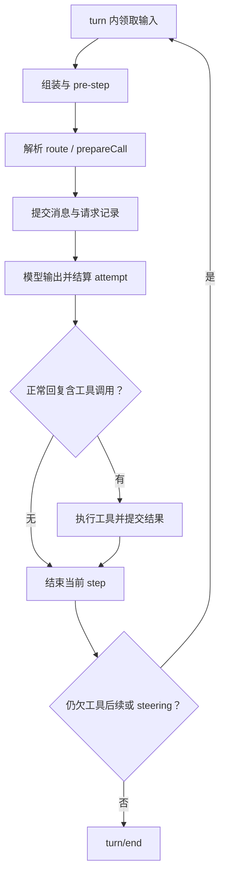

# Turn、Step 与 V4 工具流水线

> 固定版本：`dsh-v0.1.7-rc.2`；revision：`477b4f420553e8a52c2fbccc464d7561b239c443`；源码审查：2026-09-29。

让 Agent 读取一个文件再回答，通常要经历两次模型请求：第一次提出工具调用，第二次读取工具结果并生成回答。它们属于同一个 turn，却是两个 step。若其中一次请求需要显式 retry，同一个 step 内还可能有多个 provider attempt。

这三个层级决定了日志怎么读。先沿一个带工具的正常任务走完，再看重试、取消与崩溃分别停在哪里。下面的生产行为来自固定源码，文末实验用确定性模型验证关键事件关系。

## 从输入到模型请求

`followup()` 先把输入记入 Inbox。Loop 打开 turn 后领取输入，组装提示词和上下文，再交给 `agent/pre-step` 决定是否接纳。只有进入的非空首批输入才建立 step。

接下来准备实际的模型调用。`agent/request` 和 `prepareCall()` 先解析实际 route；在这些 async 阶段赢得取消时，不提交 system/users。随后按 prepared capability 协调 `system/message`，第一次 attempt 才追加 accepted user messages，记录 header/context 并派生冻结的模型历史。retry 复用本步 assembly，不重复 claim/pre-step。

模型开始生成后，实时输出走进程内的 `agent/assistant-stream` 的 start/chunk/end；每个完成结算的 attempt 提交一条 `assistant/message` 或 log-only `assistant/attempt`，其中 `stream` 保存紧凑的带时序记录。这些 stream 随结算后的消息一起保留，不是独立的旧版 `assistant/chunk` 事件。

取消时已输出的 text/reasoning 前缀可以作为 `interrupted: true` 的 assistant message 提交；未 dispatch 的工具调用不混入该前缀。进程在 settlement 前硬退出时不能假定已有 durable stream。


```mermaid
flowchart TD
    A["turn 内领取输入"] --> B["组装与 pre-step"]
    B --> C["解析 route / prepareCall"]
    C --> D["提交消息与请求记录"]
    D --> E["模型输出并结算 attempt"]
    E --> F{"正常回复含工具调用？"}
    F -->|"有"| G["执行工具并提交结果"]
    F -->|"无"| H["结束当前 step"]
    G --> H
    H --> I{"仍欠工具后续或 steering？"}
    I -->|"是"| A
    I -->|"否"| J["turn/end"]
```

这张图展开正常执行的主线。首批输入被拒绝、max-tokens、取消和 provider error 可以提前结束或进入专门的重试路径，不会都经过工具节点。`concludesTurn` 也可能使工具执行后直接收尾。

## 用 callId 把工具记录接起来

`tool/call.data` 为 `{ turn, step, callId, name, arguments }`，arguments 保留模型给出的 JSON 字符串。V4 `tool/result.data` 为 `{ turn, step, message, error?, meta? }`；`message` 是直接的 tool-role message，包含 `toolCallId`、`content`、`isError` 和 identity/source。关联读取应使用 **`data.message.toolCallId`**，不能照搬旧 `data.result` 或假设 result 顶层仍有 callId。内部 failure identity 放在可选 `data.error`，只有 isError 为 true 才允许；UI 数据放在 tool-owned JSON meta。

scheduler 先提交 tool/call，再进入 `pre-execute → guards → execute → post-execute → finalizeContent → tools/result`。最后一个是 live 观察事件，不是 durable event。scheduler 将最终内容写入 `tool/result`，其 `sourceEventSeqs` 引用对应 call 的 seq，模型下次请求直接读 first-class tool message。

假设模型先请求 A、后请求 B，两者都允许并行。即使 B 先返回，读 durable result 时仍会先看到 A，再看到 B；执行完成顺序与日志提交顺序是两个观察量。

`exclusive` 是 barrier，`parallel` 使用配置的 rolling pool。准备和提交保持模型调用顺序，body 可以重叠；后来者先完成不改变 durable result 顺序。工具结果通常使同一 turn 进入下一步；`concludesTurn` 仍需尊重已经到达的 next-step 输入。

## 错误与不确定结果

工具 pipeline 可把失败表达为 isError 结果，让模型在下一步处理。scheduler 自身终止失败不伪造已经开始的 call 的结果；中断恢复根据历史生成 `TOOL_NOT_STARTED` 或 `TOOL_OUTCOME_UNKNOWN` 等结果。看到 durable call 但没有 durable result，无法推出外部工具没有执行。

provider error 只有在 `agent/request-error` 明确返回 retry 时才重试该 step；这不授权业务层重放整条 prompt。run resolve、非空文本、Agent idle 都不单独代表 `turn/end.reason.kind === completed`。

## 到实验中观察

2026-09-29 从仓库根目录执行：

```sh
node --test --test-name-pattern='missing tool' how-dsh-works/probes/published-core.test.mjs
```

2026-09-29 的完整 probe 3/3 passed；该 case 由确定性 adapter 请求一个未注册工具，真实 ToolRuntime 生成 V4 error message，再由下一步模型请求读取；验证 toolCallId、call seq 引用和两个 step。另一个 inbox case 验证 live frames 与 embedded stream。没有真实工具副作用或 provider 网络请求。

## 继续验证什么

读到只有 call、没有 result 的历史时，先把外部结果视为未知，再查询工具产生的文件或业务状态。这个判断来自日志与副作用分开提交的事实，不能用自动重发 prompt 替代。

[进阶 workflow 实验](../labs/workflow-child-lifecycle/RECOVERY.md)提供受控并行、显式 retry 与崩溃场景；它们覆盖各自列明的条件。完整 parallel scheduler 交错与任意真实工具 repair 仍不属于本篇最小探针的保证；[旧两项测试](historical-2026-08-31.md)只作历史参考。

## 对照源码

按上面的执行过程阅读这些入口。链接全部指向页首固定 revision，源码事实与运行观察的范围分别见正文。

| 入口 | 职责 |
| --- | --- |
| [driver](https://github.com/deepseek-ai/deepseek-harness/blob/477b4f420553e8a52c2fbccc464d7561b239c443/packages/core/agent-loop/src/agent.ts) | pre-step、prepared call、attempt settlement 与继续条件 |
| [tool scheduler](https://github.com/deepseek-ai/deepseek-harness/blob/477b4f420553e8a52c2fbccc464d7561b239c443/packages/core/agent-loop/src/tool-calls.ts) | dispatch overlap、模型顺序提交、call/result 配对 |
| [ToolRuntime](https://github.com/deepseek-ai/deepseek-harness/blob/477b4f420553e8a52c2fbccc464d7561b239c443/packages/core/tools/src/index.ts) | policy、guard、执行、后处理与冻结结果 |
| [Session event types](https://github.com/deepseek-ai/deepseek-harness/blob/477b4f420553e8a52c2fbccc464d7561b239c443/packages/core/session/src/types.ts)、[message](https://github.com/deepseek-ai/deepseek-harness/blob/477b4f420553e8a52c2fbccc464d7561b239c443/packages/llm/llm/src/message.ts) | V4 event data 与 first-class tool message |
| [repair](https://github.com/deepseek-ai/deepseek-harness/blob/477b4f420553e8a52c2fbccc464d7561b239c443/packages/core/session/src/repair.ts) | 中断历史中的缺失工具结果 |
