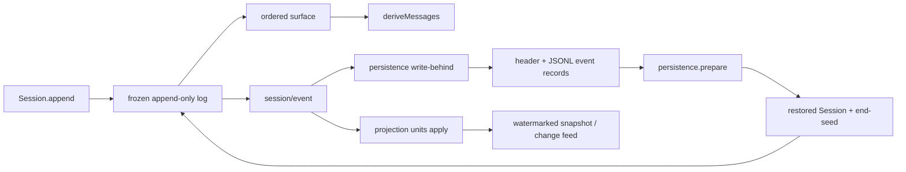

# Session Event Log、持久化与 Projection

本文解释 DSH 如何把一个 live Session 变成可恢复的 JSONL、模型消息和客户端 projection。结论只适用于 upstream tag `dsh-v0.1.1-rc.2`，完整 commit 为 `b150a551b8d465e31e418e1b2eaf5e79bbb7d28e`。

## 入口文件

| 入口 | 在本链路中的职责 |
| --- | --- |
| [`packages/core/session/src/types.ts`](https://github.com/deepseek-ai/deepseek-harness/blob/b150a551b8d465e31e418e1b2eaf5e79bbb7d28e/packages/core/session/src/types.ts#L35-L440) | 定义 `SESSION_FORMAT_VERSION`、`SessionHeader`、`SessionEventMap`、event envelope 与 surface metadata。 |
| [`packages/core/session/src/index.ts`](https://github.com/deepseek-ai/deepseek-harness/blob/b150a551b8d465e31e418e1b2eaf5e79bbb7d28e/packages/core/session/src/index.ts#L480-L758) | 校验/冻结 seed 与 append，发布 `session/event`，并从 surface 派生 messages。 |
| [`packages/core/session/src/surface.ts`](https://github.com/deepseek-ai/deepseek-harness/blob/b150a551b8d465e31e418e1b2eaf5e79bbb7d28e/packages/core/session/src/surface.ts#L72-L114) | 把 `user/message`、非空 `assistant/message`、`tool/result` 投影成模型 history。 |
| [`packages/session/session-persistence/src/coordinator.ts`](https://github.com/deepseek-ai/deepseek-harness/blob/b150a551b8d465e31e418e1b2eaf5e79bbb7d28e/packages/session/session-persistence/src/coordinator.ts#L627-L710) | 串行化 create/append/load/prepare，检查连续 seq、版本和 unknown event，并驱动 write-behind。 |
| [`packages/session/session-persistence-jsonl/src/index.ts`](https://github.com/deepseek-ai/deepseek-harness/blob/b150a551b8d465e31e418e1b2eaf5e79bbb7d28e/packages/session/session-persistence-jsonl/src/index.ts#L421-L700) | JSONL backend；lazy materialize、append/fsync、scan、repair、list 与 prepare。 |
| [`packages/session/session-projection/src/index.ts`](https://github.com/deepseek-ai/deepseek-harness/blob/b150a551b8d465e31e418e1b2eaf5e79bbb7d28e/packages/session/session-projection/src/index.ts#L163-L313) | 可选 projection registry；对 committed events 做纯同步 fold，提供 watermark snapshot/change feed。 |
| [`packages/sdk/server/src/server.ts`](https://github.com/deepseek-ai/deepseek-harness/blob/b150a551b8d465e31e418e1b2eaf5e79bbb7d28e/packages/sdk/server/src/server.ts#L203-L235) | stock SDK server 的进程内 session map 与首次 `ctx.agents.create()` 路径。 |

项目级恢复适配器位于 [`projects/ag-ui-dsh-runtime/src/server/sdk-resume-adapter.ts`](../projects/ag-ui-dsh-runtime/src/server/sdk-resume-adapter.ts)，其部署边界见 [AG-UI DSH Runtime README](../projects/ag-ui-dsh-runtime/README.md#runtime-与-coordinator)。它属于本学习仓库，不是 upstream rc.2 的实现。

## Verified from source

### Header、event envelope 与 append commit

`SessionHeader` 与 event log 分开保存，包含 `version`、`id`、`createdAt`，以及可选的 `cwd`、fork lineage、seed boundary、subagent origin/depth 和 agent preset。rc.2 的 `SESSION_FORMAT_VERSION` 是 `0`；header version 不等于当前值时 persistence read 拒绝，源码没有跨版本 migration chain。

每个 `SessionEvent` 都有 `type`、session-local contiguous `seq`、epoch-millisecond `time` 和 type-discriminated `data`。只有 model-visible surface event 可以带 `surfaceOp` 与 `sourceEventSeqs`；`user/message`、`assistant/message`、`tool/result` 必须声明它们如何进入 surface，turn/step boundary 与 raw chunk 不得携带这些字段。

`Session.append()` 在 commit 前完成 lossless-JSON snapshot、event-specific validation 和 surface transition validation，再以 `seq = log.length` 写入 frozen log。写入后才同步发布 `session/event`；observer failure 被逐个 containment，不能撤销已提交 event。这个 hot path 不等待磁盘 I/O。



### 具体调用路径

1. `SessionStore.prepare/create()` → `Session` constructor → `session/created`，建立 header、seed boundary 与 live identity。
2. domain producer → `Session.append()` → surface validation → frozen log commit → contained `session/event` observers。
3. PersistenceCoordinator `initFor()` → `SessionWriteBehind.enqueue()` → `appendCore()` → JSONL `appendBatch()` → 首批 `materialize()` 或后续 `appendLines()`。
4. `AgentRegistry.resume()` → AgentLoop factory `resume()` → `sessionPersistence.prepare()` → stored-prefix validation/repair → `Session.fromRestore()` → unpublished setup → live publication。
5. 模型读侧走 `Session.deriveMessages()` → surface nodes → `deriveEventMessage()`；host/UI 读侧走 `SessionProjectionRegistry.drive()` → `snapshot()` / change feed。

### JSONL materialize、append 与 resume

PersistenceCoordinator 在 `session/created` 建立 live write state，在 `session/event` 把 frozen event 加入 bounded write-behind，在 `session/flush` 提供显式 durability barrier。`create()` 只登记 header；尚无 event 的 abandoned session 不产生文件。第一批 append 由 backend 的 `appendBatch(meta, events, false)` 同时 materialize header 与 contiguous event batch；后续 batch append 并 fsync，写入失败会回滚到旧文件长度，避免 retry 造成 seq gap 或 duplicate。

未压缩 JSONL 的第一行是 header record，后续逻辑记录是 events；`packChunks` 可把连续 chunk 物理压缩成一行，reader 会无损展开。默认 backend 也支持独立 Zstandard frames，因此“每个 event 一条物理文本行”不是通用保证，logical `SessionEvent[]` 才是稳定层。

正式 resume 路径是 `ctx.agents.resume()` → AgentLoop factory `resume()` → `sessionPersistence.prepare(id)`。prepare 对完整 stored prefix 做版本、unknown-event、seq、surface 与 crash-repair 校验，构造 unpublished `Session`；publication 前仍可因 signal、owner disposal 或 setup failure 回滚。恢复构造保留原 header/history，把 `firstLiveSeq` 设在 restored seed 末尾，并在 seed 尚未以该 marker 结尾时追加 `session/end-seed`；重复打开一个未增长且已经以 marker 结尾的日志不会仅因 resume 再增长。persistence attach 后只写尚未 durable 的 suffix。

### Message derivation 与 projection

`Session.deriveMessages()` 遍历 canonical surface，而不是原始 log。普通 `user/message` 原样成为 user message；非空 `assistant/message` 和 `tool/result` 进入 history；`assistant/chunk`、turn/step boundaries 和 log-only events 不产生 message。surface replacement 会 shadow 旧节点并使 derived cache rebuild，所以 compaction 后的模型 history 仍从同一日志机制获得。

`SessionProjectionRegistry` 是可选 read-model capability，不是 agent-loop spine。它只订阅一次 `session/event`，对每个 registered unit 同步执行纯 `apply(previous, event)`；同一引用表示无变化，改变引用才产生 client change。`snapshot()` 返回所有 client-visible whole values 与共同的 `asOfSeq`，projection state/version/cache 都是可重建捷径，不能取代 Session log 的权威地位。

### Required-on-read、`ignorable` 与版本

rc.2 生成 `KNOWN_SESSION_EVENT_TYPES` 表。Persistence 读取 normalized events 时，未知 type 且没有 `ignorable: true` 会抛 `SessionFormatUnsupportedError`；未知但明确 ignorable 的 event 会保留在 loaded event list，不是被 persistence 删除，后续不认识它的 merge-extensible fold 才能走安全 default。检查故意位于 read side：live writer 可以持久化 plugin event，缺少该 type 的 reader 在下一次打开时 loud refusal，而不是在运行中途让 write-behind 卡死。

rc.2 没有让 out-of-repo plugin 把 type 注册进 generated known set 的 API，`Session.append()` 也没有写 `ignorable` envelope marker 的参数；这类 plugin event 因而默认 required，并可能被同一 stock build 在下一次读取时拒绝。`ignorable` 在本版本主要是 persisted-envelope compatibility rule，不应被描述为通用 plugin authoring API。

结构性改变——header、event envelope、core event semantics 或 surface mechanism——需要 format version bump。新增普通 event type 不靠 version bump 协商，而由 required-on-read/ignorable 决定旧 reader 是拒绝还是安全跳过。rc.2 虽包含对少量旧 v0 event vocabulary 的 normalization 或明确拒绝，但没有对非零 header version 的升级路径。

### Stock SDK fresh-create gap

固定 rc.2 的 `HarnessSdkJsonRpcServer` 用实例内 `sessions`/`sessionCreations` map 复用当前进程的 handle。一个新 server 实例首次看到 session ID 时，`createSession()` 固定调用 `ctx.agents.create({sessionId, meta:{cwd}, agentOptions})`；该文件没有查询 `sessionPersistence`，也没有调用 `ctx.agents.resume()`。因此“相同 SDK session ID + 相同 JSONL root”本身不等于跨进程恢复，这是 upstream rc.2 的源码事实。

本仓库的 [resume adapter](../projects/ag-ui-dsh-runtime/src/server/sdk-resume-adapter.ts) 在部署时把官方 server 包在 Context proxy 后面：只覆盖 `agents.create`，先查 exact persisted header、校验 canonical cwd，再选择原始 create 或官方 `agents.resume`，失败不 fallback。它没有修改 upstream，也不能被当作 stock SDK wire capability。

## Observed at runtime

在固定 rc.2 checkout 根目录实际运行了以下无 key probe：

```sh
env -u DEEPSEEK_API_KEY -u DEEPSEEK_BASE_URL \
  corepack pnpm exec vitest run \
  packages/session/session-persistence-jsonl/tests/jsonl.spec.ts \
  packages/session/session-projection/tests/registry.spec.ts \
  -t 'lazy materialization|round-trip is byte-identical|rejects an unknown event type|drives a registered unit over committed events'
```

结果为 2 个 test files 通过，选中的 4 个 tests 通过，170 个未匹配 tests skipped，exit 0。实际覆盖了 compression `none` 下的 lazy materialization、包含 `assistant/chunk` 的 logical round-trip、unknown required event 拒绝与 unknown ignorable event 接受，以及 projection 对 committed events 的 eager fold 和 watermark snapshot。本 probe 没有启动 SDK subprocess 或真实模型。

## Inference

“Session 已 append”与“JSONL 已 durable”是两个不同时间点。需要在磁盘读取最新状态的调用方必须等待 `session/flush` 或拥有等价 checkpoint；只等待 Agent idle 不能从这些源码推出 write-behind 已完成。

Raw log、surface、derived messages 和 domain projection 是同一事实流的不同读法：raw log 保留最大 replay fidelity，surface 决定模型 history，projection 服务 UI/host 查询。把 projection 或 SDK 内存 map 当成 Session authority 会失去 rebuild 与跨进程语义。

`ignorable: true` 是 writer 对“安全丢失不影响重建”的承诺，不是为了让未知 required state 悄悄通过。给会改变 history、policy 或恢复含义的 event 标记 ignorable 会破坏兼容性判断。

## Proposal

upstream SDK server 若要提供跨进程相同-ID恢复，应在首次 session resolution 明确执行 create-or-resume，并在 resume 前校验 persisted/requested cwd；损坏、重复或 cwd conflict 必须失败，不能静默 fresh-create。是否把这项策略放入 stock server 仍是 upstream 设计选择，不是 rc.2 现状。

应用侧 projection 应保存自己的 schema/fold version，并始终允许从 SessionEvent replay 重建。业务 Task/Run、artifact 和 retry policy 仍应由应用层持有；DSH Session persistence 只回答 Agent history 与 runtime state 的恢复问题。

## Unconfirmed / version boundary

- 本文没有用真实 SDK subprocess 复现 stock fresh-create gap；该结论来自固定 rc.2 server source，项目 adapter 的两生命周期 keyless/真实验收记录由其项目 README 单独拥有。
- probe 只验证 JSONL `compression: none` 的选中路径，没有覆盖 Zstandard、跨平台 durable publish、torn-frame repair、projection cache 数据库或并发外部 writer。
- `SESSION_FORMAT_VERSION = 0` 是 `dsh-v0.1.1-rc.2` / `b150a551b8d465e31e418e1b2eaf5e79bbb7d28e` 的 pre-release 状态，不承诺后续 revision 可直接读取本版本日志。
