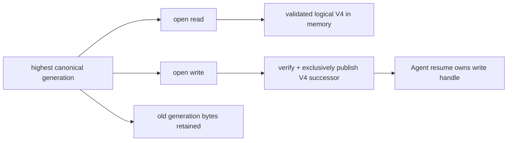

# Session V4：日志、surface、不可变 generation 与 projection

> 固定版本：`dsh-v0.1.7-rc.2`；revision：`477b4f420553e8a52c2fbccc464d7561b239c443`；源码审查：2026-09-29。

Session log 记录事实，surface 决定模型历史，projection 服务读取，JSONL generation 保存物理版本。它们之间不能互相替代。

## Verified from source

| 入口 | 职责 |
| --- | --- |
| [Session types](https://github.com/deepseek-ai/deepseek-harness/blob/477b4f420553e8a52c2fbccc464d7561b239c443/packages/core/session/src/types.ts)、[store](https://github.com/deepseek-ai/deepseek-harness/blob/477b4f420553e8a52c2fbccc464d7561b239c443/packages/core/session/src/index.ts)、[surface](https://github.com/deepseek-ai/deepseek-harness/blob/477b4f420553e8a52c2fbccc464d7561b239c443/packages/core/session/src/surface.ts) | V4 envelope、append、模型历史和 replacement |
| [Persistence interface](https://github.com/deepseek-ai/deepseek-harness/blob/477b4f420553e8a52c2fbccc464d7561b239c443/packages/session/session-persistence/src/index.ts) | create/open/stat/list/export 与 handle 所有权 |
| [JSONL backend](https://github.com/deepseek-ai/deepseek-harness/blob/477b4f420553e8a52c2fbccc464d7561b239c443/packages/session/session-persistence-jsonl/src/index.ts) | 物理 generation、写 ownership、迁移与读取 |
| [V3→V4 migration](https://github.com/deepseek-ai/deepseek-harness/blob/477b4f420553e8a52c2fbccc464d7561b239c443/packages/session/session-format-v3-to-v4/src/index.ts) | 相邻版本转换；不是原地改 header |
| [Projection registry](https://github.com/deepseek-ai/deepseek-harness/blob/477b4f420553e8a52c2fbccc464d7561b239c443/packages/session/session-projection/src/index.ts) | committed-event fold、stateOf 与客户端 snapshot |

### V4 的逻辑记录

该 tag 的 `SESSION_FORMAT_VERSION` 为 4。envelope 的 seq 是 Session 内连续位置，time 是时间戳，data 按 event type 定义。`system/message`、`developer/message`、`user/message`、`assistant/message`、`tool/result` 属于模型 surface。assistant message 嵌入 stream，assistant attempt 仅存日志；工具输出字段见[工具流水线](03-turn-step-tool-pipeline.md)。

`surfaceOp: 'append'` 追加可见节点；替换为 `{ op: 'replace', startSeq, endSeq }`，端点是当前 surface 上的 inclusive event seq，**不是数组下标**。replacement 的新 seq 可以占据旧位置，因此不能按数字排序重建 surface。assistant/message 禁止 `sourceEventSeqs`；compaction checkpoint 与工具结果仍可按各自规则声明来源。

Session append 先检查 JSON、事件与 surface 约束，再冻结提交并发送 `session/event`；不等待磁盘 write-behind。`ctx.sessions.flush(session)` 是显式 durability checkpoint，Agent idle 不自动等价于最新数据已经落盘。

### 物理版本与 open mode


```mermaid
flowchart LR
    Old["highest canonical generation"] --> R["open read"]
    R --> Logical["validated logical V4 in memory"]
    Old --> W["open write"]
    W --> New["verify + exclusively publish V4 successor"]
    Old --> Keep["old generation bytes retained"]
    New --> Resume["Agent resume owns write handle"]
```

backend 选择数值最大的规范 generation；未来版本或损坏的最高 generation 会拒绝，不回退较旧文件。v0 路径为 session.jsonl，v1 起为 session.vN.jsonl，均可能带 zstd 后缀。已提交 generation 不移动、覆盖或删除。

`stat/list` 读取并转换支持的历史 header，不读取完整 event body、不发布 successor。`open(id, 'read')` 执行相邻迁移得到逻辑 V4，保持源字节；`open(id, 'write')` 在返回 handle 前验证并独占发布最终 V4 successor。逻辑经过 v1→v2→v3→v4，不要求磁盘新增每个中间文件。read handle 不提供 Agent resume；AgentLoop resume 要先取得 write handle，再处理开放尾部和 live publication。

未知 required event 会 loud refusal，明确 ignorable 的未知事件才允许 reader 安全忽略其含义。版本号协调结构性格式变化，不能单凭版本相同断言任意 plugin vocabulary 都可读。压缩和 frame packing 使“一条 event 对应一条物理文本行”不成立。

### 三个读侧

`deriveMessages()` 从当前 surface 派生模型历史，不把所有日志行传给模型。插件修改消息内容需要注册纯 message projection；缺少定义时拒绝 append/restore，不能从未知事件随意猜消息。同步 `snapshotEvents/eventAt/ownEvents` 在该版已 deprecated，新生产读取应走相应观察/查询服务；本目录诊断 probe 只在测试中使用 snapshot。

`ctx.sessionProjections` 将 committed event fold 为可重建 state。AgentLoop 依赖该服务注册 inbox、turnBoundary；不能继续描述为 loop 可有可无的配件。Host 读取 required key 应要求服务存在或失败，客户端 snapshot 是裁剪投影，不是日志 authority。

stock SDK 的首次 session resolution 仍调用 agents.create，没有 persistence-aware resume RPC。应用 adapter 与 ACP resume 各自拥有策略；不要从“V4 可读”推断“任意协议可恢复同一 ID”。

## Observed at runtime

[2026-09-29 persistence 执行记录](../docs/reviews/2026-09-29-recovery-storage.md)报告 [V1/V3→V4 lab](../labs/session-format-migration/README.md)的 7 项 keyless 测试和两次 demo：read 无 successor，write 新增 V4，原 SHA-256 不变，reopen 稳定，未来/损坏/未知历史拒绝。输入是 plaintext synthetic V1/V3，不是真实用户历史。

重跑命令从仓库根目录：

```sh
cd labs/session-format-migration
pnpm install --frozen-lockfile
pnpm test
node --import tsx examples/run.ts v1
node --import tsx examples/run.ts v3
```

这些是已有本次版本的独立执行证据，本篇编辑没有重复执行它们。新增 published-core probe 则实际观察到 header.version=4、embedded stream 和 tool result，并不验证磁盘。

## Inference、Proposal 与未确认

Inference：恢复模型历史、恢复业务 Run、确认副作用分别需要证据。Proposal：在副本上增加含附件、child catalog 与中断工具的迁移 fixture。本篇未证明复杂用户日志、压缩历史迁移、并发外部 writer 或业务 exactly-once；[历史四项 probe](historical-2026-08-31.md)只适用旧版。
