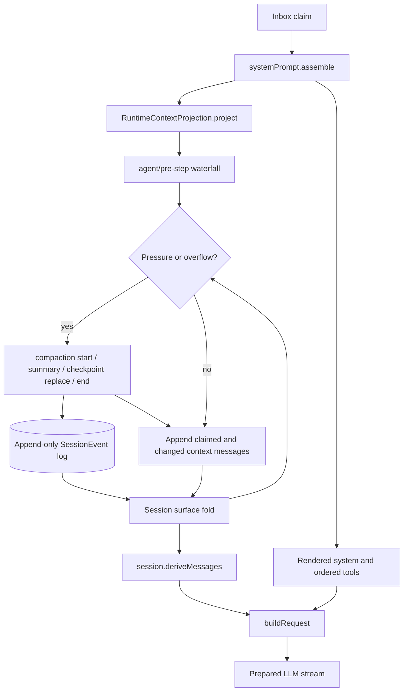

# Compaction 与 Context Assembly 如何共同形成下一次模型请求

> 固定版本：`dsh-v0.1.1-rc.2`
> 固定 revision：`b150a551b8d465e31e418e1b2eaf5e79bbb7d28e`
> 验证日期：2026-08-31

## 要回答的问题

DSH 不会把 Session 的整个 append-only event log 原样发送给模型。AgentLoop 在每个 step 边界重新组装 system prompt、tools、动态 runtime context，并从 Session 的当前 surface 派生消息；compaction 则保留原始日志，用一个有来源记录的 checkpoint 替换 surface 上的一段旧消息。本篇追踪这两条路径在下一次模型请求前如何汇合。



## 入口与源码路由

| 主题 | 固定 revision 入口 |
| --- | --- |
| 每个 step 的组装与请求派生 | [`packages/core/agent-loop/src/agent.ts`](https://github.com/deepseek-ai/deepseek-harness/blob/b150a551b8d465e31e418e1b2eaf5e79bbb7d28e/packages/core/agent-loop/src/agent.ts) |
| system/context/tool registry | [`packages/core/system-prompt/src/index.ts`](https://github.com/deepseek-ai/deepseek-harness/blob/b150a551b8d465e31e418e1b2eaf5e79bbb7d28e/packages/core/system-prompt/src/index.ts) |
| runtime-context durable projection | [`packages/core/agent-loop/src/runtime-context.ts`](https://github.com/deepseek-ai/deepseek-harness/blob/b150a551b8d465e31e418e1b2eaf5e79bbb7d28e/packages/core/agent-loop/src/runtime-context.ts) |
| append-only log 上的 surface fold | [`packages/core/session/src/surface.ts`](https://github.com/deepseek-ai/deepseek-harness/blob/b150a551b8d465e31e418e1b2eaf5e79bbb7d28e/packages/core/session/src/surface.ts)、[`packages/core/session/src/index.ts`](https://github.com/deepseek-ai/deepseek-harness/blob/b150a551b8d465e31e418e1b2eaf5e79bbb7d28e/packages/core/session/src/index.ts) |
| compaction Service Definition 与事件 | [`packages/compaction/compaction/src/index.ts`](https://github.com/deepseek-ai/deepseek-harness/blob/b150a551b8d465e31e418e1b2eaf5e79bbb7d28e/packages/compaction/compaction/src/index.ts)、[`types.ts`](https://github.com/deepseek-ai/deepseek-harness/blob/b150a551b8d465e31e418e1b2eaf5e79bbb7d28e/packages/compaction/compaction/src/types.ts) |
| basic policy 与 AgentLoop hooks | [`packages/compaction/compaction-basic/src/index.ts`](https://github.com/deepseek-ai/deepseek-harness/blob/b150a551b8d465e31e418e1b2eaf5e79bbb7d28e/packages/compaction/compaction-basic/src/index.ts) |
| range selection 与 durable transaction | [`packages/compaction/compaction-basic/src/region.ts`](https://github.com/deepseek-ai/deepseek-harness/blob/b150a551b8d465e31e418e1b2eaf5e79bbb7d28e/packages/compaction/compaction-basic/src/region.ts) |
| direct summarization call | [`packages/compaction/compaction-basic/src/summarizer.ts`](https://github.com/deepseek-ai/deepseek-harness/blob/b150a551b8d465e31e418e1b2eaf5e79bbb7d28e/packages/compaction/compaction-basic/src/summarizer.ts) |

## Verified from source

### 1. Context assembly 每个 step 都重新执行

`ReactLoopAgent.preStep()` 先从 Inbox claim 本 step 的消息，再调用 `systemPrompt.assemble(assembleContextFor(agent, signal))`。`SystemPrompt` 合并 global 与当前 Agent scope 的 sections、contexts、tool providers 和 variables：同名 scoped section/variable 遮蔽 global 值，section/context 按 `order` 排序，tools 按配置顺序或稳定字典序排列。最后还会经过 cooperative `system-prompt/assemble` waterfall。

`renderPrompt()` 把非空 section 插值后连接成 system string。动态 context 不直接塞入 system prompt；`renderContextSections()` 和 `joinContextSections()` 形成一份完整快照，`RuntimeContextProjection.project()` 仅在快照相对当前 retained surface 值发生变化时生成一条尚未提交的 user message。空快照在曾经存在旧快照时会生成明确的 cleared marker。

`agent/pre-step` waterfall 返回后，loop 才追加 claimed messages 与这条可能变化的 runtime-context message。随后 `step()` 调用 `session.deriveMessages()`，从当时最新的 surface 构建模型消息。因此 waterfall listener 在 `next()` 前完成的 surface replacement 会进入本次 request；不能从 `preStep()` 最初生成的 message 数组推断最终历史。

### 2. Request header 与消息 surface 分工不同

`buildRequest()` 将 adapter 解析后的 provider/model、rendered system 和 ordered tools 规范化为 `request/header`。首次写 `initial` 或 `resume`，后续只有 header 变化才写 `change`；context-window 元数据另写 `request/context`。真正的 `GenerateOptions.messages` 来自 `session.deriveMessages()`，不是从所有 event 过滤得到。

Session log 始终 append-only。`SurfaceFold` 只投影带 `surfaceOp` 的 message-producing events：普通消息 append；compaction checkpoint 用 `{ op: 'replace', start, end }` 替换当前 surface 位置范围。旧 event、原始 chunks、compaction 计量与 bracket 都仍在 log 中。replacement 之后，新 checkpoint 的 seq 可以出现在旧位置，所以 surface 顺序不能按 seq 数字排序。

### 3. Automatic compaction 是 AgentLoop extension，不是 loop 内硬编码分支

`BasicCompactionEngine` 在 `auto` 开启时注册两个 waterfall listener：

- `agent/pre-step` 在请求派生前调用 `compactIfNeeded(agent, 'pressure', signal)`，失败时记录 warning 并继续当前 turn。
- `agent/request-error` 只对规范化的 context-window overflow 尝试 `compactIfNeeded(agent, 'context-overflow', signal)`；只有 `surface.replaceGeneration` 前进才授权原 step retry，并受 target-specific retry cap 限制。

普通压力先从最新 durable route 获取 provider/model 和容量，使用 `ctx.tokenMeter` 对请求 envelope 与当前 surface 计量。可选 tool-result pruner 会先对超大文本结果做 model-free replacement；若重测已经安全，就不调用 summarizer。range selection 从最旧头部选择完整 surface units，保留近期 tail，并移动边缘以避免切开 assistant tool-call / tool-result 对。

### 4. Compaction 以 durable bracket 和 checkpoint 提交

`compactSurfaceRegion()` 的调用路径是：

```text
validateSurfaceRegion
→ inspect/assert no active durable compaction
→ append compaction/start
→ measure + buildSummarizationInput
→ summarize
→ revalidate surface stability
→ append compaction/summary
→ append replacement user/message
→ append compaction/end
```

`compaction/start` 是 durable lock。automatic/explicit-region transaction 归属当前开放 turn，并要求 whole-surface stability；manual `compactNow()` 先通过 `Agent.runMaintenance()` 保留 idle admission，使用 `turn: null`，只要求选中 span 稳定，并在 closed attempt 后 flush persistence。失败会尝试写带 `error` 的 `compaction/end`；close 本身失败会留下可检测的 unmatched lock。

默认 summarizer 不重新运行 AgentLoop。它从最新 `request/header` 取 system/tools，把 shadowed region 的派生消息按 surface 顺序回放，在尾部增加 compaction instruction，然后直接调用 `ctx.llm.stream()`，并设置 `purpose: 'compaction'`。只有 text 输出进入 checkpoint；reasoning/tool calls 不进入摘要，image 输出失败。`compaction/summary` 保存安全摘要、raw output provenance、route、usage 与 shadow price；紧邻的 synthetic `user/message` 使用 `<compacted-summary>` framing，并引用 start、summary 与所有被遮蔽 seq。

### 5. Context snapshot 与 compaction checkpoint 不是一回事

两者都可能表现为 user-role surface message，但 source 不同、生命周期也不同：runtime context 的 source plugin 是 `@deepseek-ai/dsh-system-prompt`，表达“本 step 的当前动态事实”；compaction checkpoint 的 source 是 `{ kind: 'plugin', plugin: 'compact', compactionId }`，表达“这段旧对话已被一份 durable summary 替代”。业务投影必须按 provenance 分辨，不能仅按 role 判断。

## Observed at runtime

在固定 rc.2 checkout 运行了以下 keyless focused probes：

```sh
corepack pnpm exec vitest run \
  packages/compaction/compaction-basic/tests/compaction-basic.spec.ts \
  -t 'lands a framed, replayable checkpoint with exact source seqs and token price'
# 1 file / 1 passed / 79 skipped

corepack pnpm exec vitest run \
  packages/core/agent-loop/tests/runtime-context.spec.ts \
  packages/core/system-prompt/tests/system-prompt.spec.ts
# 2 files / 44 tests passed
```

第一条 probe 实际落地了 bracket、summary、带 source seqs 的 replacement checkpoint 与 shadow price。第二组覆盖 assembly 排序/作用域/waterfall、context snapshot 去重/清除/恢复与 surface replacement 后的 projection 状态。它们没有发起真实模型压缩，也不是 compaction 全套测试。

## Inference

- 调试“模型为什么看到这些内容”时，需要同时查看最新 `request/header`、当前 surface 顺序、runtime-context snapshot provenance 与 compaction events；只打印最终 messages 会丢掉决策依据，只打印全量 log 又会混入已 shadowed 历史。
- 应用自己的 Conversation/Run event log 应保存 DSH 原始事件或其可追溯引用；UI 可以显示压缩后的当前 transcript，但不能把它当成唯一审计记录。
- context-overflow recovery 是 provider error 之后的补救。没有可靠 context capacity metadata 时，不能假设 proactive pressure 一定在首次 overflow 前触发。

## Proposal

学习项目可以增加一个只读“Request Inspector”：并排展示 header、surface seq 列表、被 shadowed seq、runtime-context sections 和最近一次 compaction bracket。它应从持久事件重建，不读取 Agent 私有字段。若未来做 eval，还应把 compaction 前后 model-visible envelope 和外部任务结果一起记录，避免只比较摘要文本。

## Unconfirmed / version boundary

- 结论只适用于固定 rc.2；compaction event vocabulary、pressure policy 与 assembly hook 可能变化。
- 本篇没有用真实 API 测量摘要质量、prefix-cache 命中或 token 成本；focused probe 使用确定性测试 adapter。
- 本篇没有证明所有 provider 都提供准确的 context-window metadata，也没有覆盖图片输入在具体 adapter 上的行为。
- `system-prompt/assemble` 是 cooperative waterfall；第三方 listener 若不调用 `next()` 可短路后续 listener。这里只验证了官方实现和测试组合，不代表任意 plugin composition 都保持同样结果。
