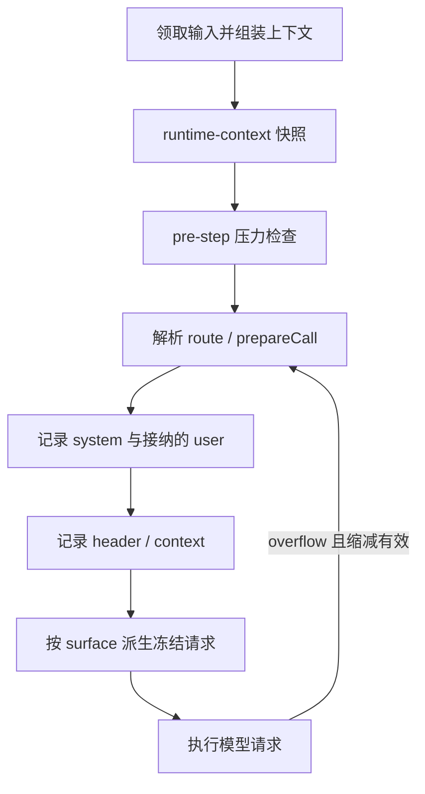

# Compaction 与 Context Assembly：从日志重建模型请求

> 固定版本：`dsh-v0.1.7-rc.2`；revision：`477b4f420553e8a52c2fbccc464d7561b239c443`；源码审查：2026-09-29。

对话逐渐变长时，Agent 仍然需要腾出空间完成下一步。它不能只在内存中删掉几条消息，否则重启后无法解释当时到底把什么发给了模型。

DSH 将上下文缩减记入 Session：原日志保留，新的摘要或裁剪记录改变 surface，也就是当前派生给模型的消息顺序。先跟着一次请求看输入怎样组装，再观察压缩如何改变下一次请求。机制依据固定源码；真实运行和受控故障在后半部分分别说明。

## 本步 assembly 与每次 attempt

claim 后用 `assembleContextFor(agent, signal)` 汇总 sections、contexts、tools 和 variables。scoped contribution 影响当前 Agent；`system-prompt/assemble` 与 `agent/pre-step` 都是 cooperative waterfall，包装 listener 要委托 next。runtime context 渲染为完整快照，只有相对当前 retained surface 改变时才提出新 user message；其 `source.kind` 是 `runtime-context`，不是旧的 plugin-name 判定。

`agent/request` 与 `prepareCall()` 解析实际 route 后才协调 system/users。system prompt 是 surface 中的 `system/message`，**不再是 `request/header.system`**。prepared route 支持 in-history update 时可在同一 series 后面追加非空新 prompt；不支持或开始新 series 时归并到首个 system 节点。清空时必须用日志中的空 replacement 清除全部活跃 system 节点，不能使旧内容重新显现。

`request/header` 保存非历史 envelope：config、tools 和 adapterDefaults 等。reason 包括 initial、resume、change、series；surface content generation 改变或显式 `startsRequestSeries` 可建立新 series，envelope 同时改变则带 startsSeries。`request/context` 记录模型容量等元数据，不能用之前的容量快照代替当前 prepared capability。


```mermaid
flowchart TD
    A["领取输入并组装上下文"] --> B["runtime-context 快照"]
    B --> C["pre-step 压力检查"]
    C --> D["解析 route / prepareCall"]
    D --> E["记录 system 与接纳的 user"]
    E --> H["记录 header / context"]
    H --> F["按 surface 派生冻结请求"]
    F --> G["执行模型请求"]
    G -->|"overflow 且缩减有效"| D
```

## 压缩是 plugin 行为

automatic compaction 监听 agent/pre-step 的压力检查，以及 agent/request-error 的 context overflow。overflow retry 需要 durable surface replacement 前进且未取消，并受 retry cap 限制；如果 model-free prune 已产生有效缩减，后续可选 summary 失败仍可能允许重试。重试同一步不重新 assembly 或领取 inbox。

选区按 surface 顺序保留近期 tail，避免拆开工具调用与结果；summary 前后检查所选范围仍有效。事务为 compaction/start → summarize → compaction/summary → replacement user/message → compaction/end。checkpoint 的 replacement 使用 startSeq/endSeq，sourceEventSeqs 引用 opening marker、summary 与被覆盖节点。旧 events 保留。自动流程检查 whole surface，manual compactNow 通过 runMaintenance 占据 idle admission，并按其选区稳定规则执行。

summarizer 直接调用 LLM service，purpose 为 compaction；输入以派生 system head 和按 surface 顺序选出的消息为基础，工具 schema 用于请求前缀，末尾追加摘要指令。它不是另起一轮 AgentLoop。summary、checkpoint 和 closing event 使结果可重放，但不能把多次 append 当作数据库原子事务；失败的 closing marker 可能留下可识别的未闭合 compaction。

## 到实验中观察

2026-09-29 的 published-core probe 使用真实发布库、确定性 adapter：

```sh
node --test --test-name-pattern='runtime context|inbox waits' how-dsh-works/probes/published-core.test.mjs
```

上述 probe 完整 3/3 passed，覆盖相同 context 在连续两轮只记一次、变化后新增 runtime-context 快照、system prompt 出现在已记录 history。该 probe 本身不调用 compaction engine 或 summarizer。

[基础压缩实验](../labs/compaction-lifecycle/README.md)让第一轮记住随机 code，第二轮在不重发 code 的情况下写出文件。通过降低 pressure 阈值，摘要发生在写文件的 step 之前；当时其余保留消息不含 code。实验同时检查 checkpoint、持久重读和精确文件字节，才能把“信息来自摘要”与“模型碰巧回答正确”分开。2026-09-30 的成功任务写出 40 字节产物，关闭后独立读回 34 个事件；[原始验收](../docs/reviews/2026-09-30-compaction.md)保留具体 seq、hash 与 usage。

摘要预算不足也有真实观察：1024-token 的初次摘要截断，没有提交 checkpoint；换用新 fixture、提高预算至 4096 后得到上述成功结果。这是一个明确样本的信息保留实验，一般摘要质量仍需要更广的评测。manual 路径由库级测试验证，真实任务通过 pre-step pressure 触发，SDK 没有因此多出 `/compact` RPC。

接下来每个实验只增加一个新的判断：

| 接着观察 | 实验与关键区别 |
| --- | --- |
| overflow 后是否可以重试 | [溢出与取消](../labs/compaction-lifecycle/RECOVERY.md)分别控制标准错误、预算、缩减进展和 signal；故障来自 fixture |
| 取消是否意味着历史没变 | manual 拒绝迟到摘要；automatic 若 summarizer 忽略 signal，可能先提交 checkpoint，listener 随后仍拒绝 retry，turn 为 aborted/user |
| 不调用摘要模型怎样缩减 | [prune/offload](../labs/compaction-lifecycle/REDUCTION.md)验证 replacement 与图片 occurrence 选择；已提交的缩减可在后续失败后保留 |
| 图片对象与模型输入怎样对应 | [附件输入](../labs/attachment-input/README.md)、[inline fallback](../labs/attachment-input/FALLBACK.md)、[本地预算](../labs/attachment-input/BUDGET.md)、[失效 Files ID](../labs/attachment-input/STALE.md)分别补生产存储与真实传输证据 |
| 供应商是否真的拒绝过请求 | [真实 overflow](../labs/compaction-lifecycle/PROVIDER-OVERFLOW.md)观察一次 400/CONTEXT_WINDOW_EXCEEDED、零工具与持久终态；不把受控恢复写成真实恢复闭环 |
| 调用报错前写入了什么 | [事务与并发](../labs/compaction-lifecycle/TRANSACTIONS.md)分别检查维护接纳、followup 等待、flush 前后失败和 end append 失败 |

裁剪实验还对照原始事件、模型占位符视图、显式 image projection 和 70 字节 PNG 文件；缺失 projection、重复/交换图片索引及 live pruner 改写位置的负对照均有记录。这部分是确定性重放验证，外部视觉与生产 store 的结论由附件实验单独拥有。完整批次、命令和失败样本见[缩减验收](../docs/reviews/2026-09-30-compaction-reduction.md)。

## 继续验证什么

排查一次模型请求时，可以并排查看 header、system/developer 消息、surface 顺序与压缩记录。只打印全部 log，容易把已经被替换的内容误认为仍在请求中。

课程已经观察到一个随机 code 经摘要后仍被使用，以及多个缩减、取消和部分提交场景。一般摘要质量、真实物理存储故障、provider cache 性能和完整账单仍需各自的实验；[旧 45 项测试](historical-2026-08-31.md)保留原日期。

## 对照源码

按上面的执行过程阅读这些入口。链接全部指向页首固定 revision，源码事实与运行观察的范围分别见正文。

| 入口 | 职责 |
| --- | --- |
| [Agent driver](https://github.com/deepseek-ai/deepseek-harness/blob/477b4f420553e8a52c2fbccc464d7561b239c443/packages/core/agent-loop/src/agent.ts) | assembly、prepared call、system admission 和 request series |
| [SystemPrompt](https://github.com/deepseek-ai/deepseek-harness/blob/477b4f420553e8a52c2fbccc464d7561b239c443/packages/core/system-prompt/src/index.ts) | scoped sections、contexts、tools 与 variables |
| [Runtime context](https://github.com/deepseek-ai/deepseek-harness/blob/477b4f420553e8a52c2fbccc464d7561b239c443/packages/core/agent-loop/src/runtime-context.ts) | 当前完整快照去重、清除与恢复 |
| [Compaction engine](https://github.com/deepseek-ai/deepseek-harness/blob/477b4f420553e8a52c2fbccc464d7561b239c443/packages/compaction/compaction-basic/src/index.ts) | pressure hook、overflow retry、manual maintenance |
| [Region transaction](https://github.com/deepseek-ai/deepseek-harness/blob/477b4f420553e8a52c2fbccc464d7561b239c443/packages/compaction/compaction-basic/src/region.ts)、[summarizer](https://github.com/deepseek-ai/deepseek-harness/blob/477b4f420553e8a52c2fbccc464d7561b239c443/packages/compaction/compaction-basic/src/summarizer.ts) | 稳定范围、bracket、summary 与替换 |
