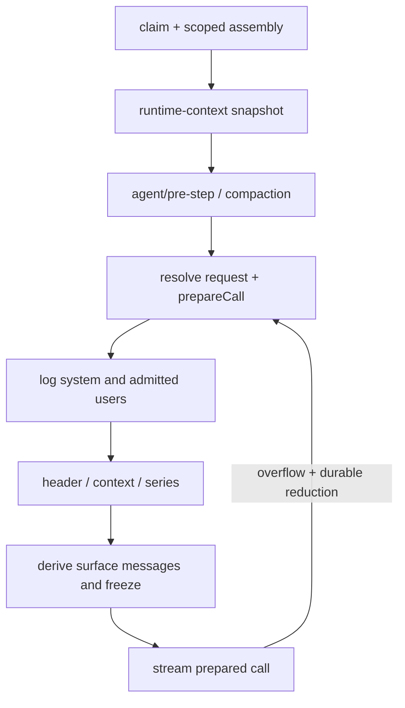

# Compaction 与 Context Assembly：从日志重建模型请求

> 固定版本：`dsh-v0.1.7-rc.2`；revision：`477b4f420553e8a52c2fbccc464d7561b239c443`；源码审查：2026-09-29。

上下文压缩改变模型可见的 surface，不删原始事实。动态 runtime context、system prompt 和摘要 checkpoint 各有来源，不能因为最后都是 Message 就合并解释。

## Verified from source

| 入口 | 职责 |
| --- | --- |
| [Agent driver](https://github.com/deepseek-ai/deepseek-harness/blob/477b4f420553e8a52c2fbccc464d7561b239c443/packages/core/agent-loop/src/agent.ts) | assembly、prepared call、system admission 和 request series |
| [SystemPrompt](https://github.com/deepseek-ai/deepseek-harness/blob/477b4f420553e8a52c2fbccc464d7561b239c443/packages/core/system-prompt/src/index.ts) | scoped sections、contexts、tools 与 variables |
| [Runtime context](https://github.com/deepseek-ai/deepseek-harness/blob/477b4f420553e8a52c2fbccc464d7561b239c443/packages/core/agent-loop/src/runtime-context.ts) | 当前完整快照去重、清除与恢复 |
| [Compaction engine](https://github.com/deepseek-ai/deepseek-harness/blob/477b4f420553e8a52c2fbccc464d7561b239c443/packages/compaction/compaction-basic/src/index.ts) | pressure hook、overflow retry、manual maintenance |
| [Region transaction](https://github.com/deepseek-ai/deepseek-harness/blob/477b4f420553e8a52c2fbccc464d7561b239c443/packages/compaction/compaction-basic/src/region.ts)、[summarizer](https://github.com/deepseek-ai/deepseek-harness/blob/477b4f420553e8a52c2fbccc464d7561b239c443/packages/compaction/compaction-basic/src/summarizer.ts) | 稳定范围、bracket、summary 与替换 |

### 本步 assembly 与每次 attempt

claim 后用 `assembleContextFor(agent, signal)` 汇总 sections、contexts、tools 和 variables。scoped contribution 影响当前 Agent；`system-prompt/assemble` 与 `agent/pre-step` 都是 cooperative waterfall，包装 listener 要委托 next。runtime context 渲染为完整快照，只有相对当前 retained surface 改变时才提出新 user message；其 `source.kind` 是 `runtime-context`，不是旧的 plugin-name 判定。

`agent/request` 与 `prepareCall()` 解析实际 route 后才协调 system/users。system prompt 是 surface 中的 `system/message`，**不再是 `request/header.system`**。prepared route 支持 in-history update 时可在同一 series 后面追加非空新 prompt；不支持或开始新 series 时归并到首个 system 节点。清空时必须用日志中的空 replacement 清除全部活跃 system 节点，不能使旧内容重新显现。

`request/header` 保存非历史 envelope：config、tools 和 adapterDefaults 等。reason 包括 initial、resume、change、series；surface content generation 改变或显式 `startsRequestSeries` 可建立新 series，envelope 同时改变则带 startsSeries。`request/context` 记录模型容量等元数据，不能用之前的容量快照代替当前 prepared capability。


```mermaid
flowchart TD
    A["claim + scoped assembly"] --> B["runtime-context snapshot"]
    B --> C["agent/pre-step / compaction"]
    C --> D["resolve request + prepareCall"]
    D --> E["log system and admitted users"]
    E --> H["header / context / series"]
    H --> F["derive surface messages and freeze"]
    F --> G["stream prepared call"]
    G -->|"overflow + durable reduction"| D
```

### 压缩是 plugin 行为

automatic compaction 监听 agent/pre-step 的压力检查，以及 agent/request-error 的 context overflow。overflow retry 需要 durable surface replacement 前进且未取消，并受 retry cap 限制；如果 model-free prune 已产生有效缩减，后续可选 summary 失败仍可能允许重试。重试同一步不重新 assembly 或领取 inbox。

选区按 surface 顺序保留近期 tail，避免拆开工具调用与结果；summary 前后检查所选范围仍有效。事务为 compaction/start → summarize → compaction/summary → replacement user/message → compaction/end。checkpoint 的 replacement 使用 startSeq/endSeq，sourceEventSeqs 引用 opening marker、summary 与被覆盖节点。旧 events 保留。自动流程检查 whole surface，manual compactNow 通过 runMaintenance 占据 idle admission，并按其选区稳定规则执行。

summarizer 直接调用 LLM service，purpose 为 compaction；输入以派生 system head 和按 surface 顺序选出的消息为基础，工具 schema 用于请求前缀，末尾追加摘要指令。它不是另起一轮 AgentLoop。summary、checkpoint 和 closing event 使结果可重放，但不能把多次 append 当作数据库原子事务；失败的 closing marker 可能留下可识别的未闭合 compaction。

## Observed at runtime

2026-09-29 的 published-core probe 使用真实发布库、确定性 adapter：

```sh
node --test --test-name-pattern='runtime context|inbox waits' how-dsh-works/probes/published-core.test.mjs
```

本次完整 3/3 passed，覆盖相同 context 在连续两轮只记一次、变化后新增 runtime-context 快照、system prompt 出现在已记录 history。**没有调用 compaction engine 或 summarizer**，不能借这两个 case 声称新版压缩已经验收。

未运行的压缩实现可从固定源码继续核对：

```sh
git show dsh-v0.1.7-rc.2:packages/compaction/compaction-basic/src/region.ts
git show dsh-v0.1.7-rc.2:packages/compaction/compaction-basic/src/summarizer.ts
```

## Inference、Proposal 与未确认

Inference：Request Inspector 应并排显示 header、system/developer messages、surface 顺序和 compaction bracket；仅打印全 log 会把 shadowed 内容误作当前请求。Proposal：增加确定性 summary adapter 的 checkpoint/replay 和 overflow retry 实验。本次未重跑压缩事务、provider cache、真实摘要质量或成本；[旧 45 项测试](historical-2026-08-31.md)保留为 2026-08-31 历史结果。
