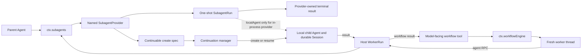

# Subagent 与 Workflow 如何分工

> 固定版本：`dsh-v0.1.1-rc.2`
> 固定 revision：`b150a551b8d465e31e418e1b2eaf5e79bbb7d28e`
> 验证日期：2026-08-31

## 要回答的问题

DSH 的 subagent 是“如何建立并管理一个 child Agent”的 capability seam；workflow 是“如何执行一段编排脚本，并让脚本通过 subagent seam 并发调用多个 child”的更高层 capability。两者共享 child run，却不共享同一个生命周期对象：one-shot subagent 有 `SubagentRun`，continuable child 有 durable Session + Activation，workflow 另有 holder-owned `WorkflowRun`。



## 入口与源码路由

| 主题 | 固定 revision 入口 |
| --- | --- |
| Subagent Service Definition、provider registry 与 public API | [`packages/subagent/subagent/src/index.ts`](https://github.com/deepseek-ai/deepseek-harness/blob/b150a551b8d465e31e418e1b2eaf5e79bbb7d28e/packages/subagent/subagent/src/index.ts)、[`types.ts`](https://github.com/deepseek-ai/deepseek-harness/blob/b150a551b8d465e31e418e1b2eaf5e79bbb7d28e/packages/subagent/subagent/src/types.ts) |
| lifecycle edge projection | [`packages/subagent/subagent/src/lifecycle.ts`](https://github.com/deepseek-ai/deepseek-harness/blob/b150a551b8d465e31e418e1b2eaf5e79bbb7d28e/packages/subagent/subagent/src/lifecycle.ts) |
| durable descriptor 与 child composition | [`packages/subagent/subagent/src/descriptor.ts`](https://github.com/deepseek-ai/deepseek-harness/blob/b150a551b8d465e31e418e1b2eaf5e79bbb7d28e/packages/subagent/subagent/src/descriptor.ts)、[`child-agent.ts`](https://github.com/deepseek-ai/deepseek-harness/blob/b150a551b8d465e31e418e1b2eaf5e79bbb7d28e/packages/subagent/subagent/src/child-agent.ts) |
| continuable Activation 与 cold resume | [`packages/subagent/subagent/src/continuation.ts`](https://github.com/deepseek-ai/deepseek-harness/blob/b150a551b8d465e31e418e1b2eaf5e79bbb7d28e/packages/subagent/subagent/src/continuation.ts) |
| local one-shot driver | [`packages/subagent/subagent-in-process-driver/src/index.ts`](https://github.com/deepseek-ai/deepseek-harness/blob/b150a551b8d465e31e418e1b2eaf5e79bbb7d28e/packages/subagent/subagent-in-process-driver/src/index.ts) |
| fork provider 的 completed-turn seed | [`packages/subagent/subagent-fork-in-process/src/index.ts`](https://github.com/deepseek-ai/deepseek-harness/blob/b150a551b8d465e31e418e1b2eaf5e79bbb7d28e/packages/subagent/subagent-fork-in-process/src/index.ts) |
| Workflow Service Definition | [`packages/workflow/workflow/src/index.ts`](https://github.com/deepseek-ai/deepseek-harness/blob/b150a551b8d465e31e418e1b2eaf5e79bbb7d28e/packages/workflow/workflow/src/index.ts)、[`runtime-types.ts`](https://github.com/deepseek-ai/deepseek-harness/blob/b150a551b8d465e31e418e1b2eaf5e79bbb7d28e/packages/workflow/workflow/src/runtime-types.ts) |
| worker-thread provider 与 host bridge | [`packages/workflow/workflow-worker-thread/src/index.ts`](https://github.com/deepseek-ai/deepseek-harness/blob/b150a551b8d465e31e418e1b2eaf5e79bbb7d28e/packages/workflow/workflow-worker-thread/src/index.ts)、[`host.ts`](https://github.com/deepseek-ai/deepseek-harness/blob/b150a551b8d465e31e418e1b2eaf5e79bbb7d28e/packages/workflow/workflow-worker-thread/src/host.ts)、[`session.ts`](https://github.com/deepseek-ai/deepseek-harness/blob/b150a551b8d465e31e418e1b2eaf5e79bbb7d28e/packages/workflow/workflow-worker-thread/src/session.ts) |
| model-facing workflow Consumer | [`packages/workflow/tool-workflow/src/index.ts`](https://github.com/deepseek-ai/deepseek-harness/blob/b150a551b8d465e31e418e1b2eaf5e79bbb7d28e/packages/workflow/tool-workflow/src/index.ts) |

## Verified from source

### 1. `ctx.subagents` 是 provider registry，不是一种固定子进程实现

`SubagentRuntime.registerProvider()` 按名字注册 effect-scoped `SubagentProvider`；重复名字失败，provider removal 只阻止新的 start，不撤销已经交给 holder 的 run。`start(name, request)` 先解析 descriptor、depth、options 与 provider capabilities，再调用并等待 `provider.start()` 发布真实 child，最后用 `observeRun()` 投影配对的 `subagent/start` / `subagent/end`。

Provider 可以是同进程 spawn/fork，也可以通过 ACP、Codex、Claude Code 或 DSH SDK 驱动外部 Agent。`inheritsParentContext` 只描述 child 是否拿到父 Session 的 completed history，不表示继承了所有工具、服务或权限。`fork` provider 只复制到最后一个 `turn/end` 的连续前缀；当前未闭合的 tool-call turn 不进入 seed。

### 2. One-shot run 的 publication 是 ownership transfer

`SubagentRun` 表示一次 foreground delegation：

```text
SubagentRuntime.start
→ provider.start
→ child publication
→ SubagentRun { id, result, dispose, localAgent? }
→ await result
→ always dispose
```

publication 之前的失败由 provider rollback，调用者拿不到 id；publication 之后，child-level failure 通过 `result.stopReason` 表达，调用者在所有路径调用 idempotent `dispose()`。`result` 只应在 seam 无法表达的基础设施故障时 reject；`dispose()` 等待剩余 work 与资源 quiescence，并把独立 teardown fault 留在 disposal channel。

本地 driver 通过 `parent.ctx.agents.create()` 建立 child Agent/Session，在 unpublished setup 中应用父 preset composition、child persona/tool restriction 和 delegation policy，并安装一个 scoped `agent/pre-step` listener；该 listener 在 child 的 initial turn 内追加版本化 `subagent/descriptor`。随后 driver 投递 prompt。child Session header 保存 `parentSession`、`delegationDepth`、workspace 与 preset；descriptor 保存 provider、`one-shot`/`continuable` mode 及可重建 composition 所需字段。

Delegated policy 不继承“可以继续询问人类”的假设：若 approval capability 存在，child policy 固定为 `never`；显式 sandbox override 以 `source: 'delegation'` 写入 child 自己的日志。子 Agent 的模型上下文也会说明权限范围固定，超出范围时报告限制而不是反复升级。

### 3. Continuable child 没有 `SubagentRun`

`startContinuable()` 先让 provider 只返回 detached create spec，随后 continuation manager 负责 session id reservation、`ctx.agents.create()`、descriptor/composition、初始 prompt admission 和 rollback。API 在 child Inbox 接受初始消息后返回 `{ childId, messageId }`，不等待 turn 开始或完成。

每个 durable continuable Session 在一个进程里最多有一个 Activation。Activation 是 residency epoch，不是 request、result 或 Task：

- `followup()` 对 resident child 调用 `Agent.followup()`，按 FIFO 开启 later turn；Activation 不在时从 persistence 检查 descriptor/parent authority，再走 `ctx.agents.resume()` cold-resume。
- `interrupt()` 只对 live continuable turn 发 `Agent.cancel(..., { keepInbox: true })`，不删除 pending Inbox、Activation 或 descendants；它不是 teardown。
- manager 从 Agent quiescence 与 owned children 推导 running/waiting/settled；settled 时先向 durable direct parent 投递 runtime-authored settlement notice，再 child-first dispose handle。
- `reportFrom()` 只能由 exact live child 向其 durable direct parent 发送选定内容；source 字段不能充当 authority。

因此 continuable child 的业务标识是 durable child Session id，消息边界是 Inbox receipt；不能拿 one-shot 的 `SubagentRun.result` 心智模型套在它上面。

### 4. Workflow 在 subagent seam 上增加脚本执行层

`WorkflowEngine.start()` 接收 plain-JS body、validated `meta`、JSON `args`、parent Agent、可选 provider/cap 和 cancel signal，返回 holder-owned `WorkflowRun`。run 的 `result` 永不 reject，`cancel()` 触发整次编排取消，调用者必须 `dispose()` 等待有界清理。`workflow/start|phase|log|agent-start|agent-end|end` 是 observe-only lifecycle events，不提供 run control。

默认 worker-thread provider 的调用路径是：

```text
WorkerThreadWorkflowEngine.start
→ validate meta + host-side parse + provider/cap
→ create WorkerRun and fresh Worker
→ worker Ready / host Go handshake
→ WorkflowExecution.drive
→ script agent() posts ChildStart RPC
→ host WorkerRun calls ctx.subagents.start
→ published SubagentRun result crosses back as JSON projection
→ script returns JSON value
→ workflow result settles, children are reaped, holder disposes
```

每个 run 使用 fresh worker thread；worker 环境删除 ambient credentials 与 loader flags，host/worker payload 走 structured clone。thread 阻止同步脚本阻塞 host event loop，也允许 grace 后强制 terminate，但源码明确称它是 containment，不是 security boundary：脚本运行在可逃逸的 `node:vm` context，不能把它当成执行不可信代码的 sandbox。

host 拥有 child provider calls，因为 worker 不持有 Agent/Context capability。每个 `agent()` 通过 RPC 到 host，host 再调用同一个 `ctx.subagents` registry。cancel 会同时通知 worker、abort 所有 pending/published child starts，并启动 `disposeGraceMs`；超时会补齐缺失的 `workflow/agent-end`、settle cancelled、terminate worker。worker death 也由 host 关闭 admission、配对 lifecycle 并回收 children。

### 5. Model-facing `workflow` tool 还增加了 durable parent record

`tool-workflow` 只在存在 `exec.agent` 时启动 run，把 parent step signal 同时传给 engine 并桥接到 `run.cancel()`。top-level tool execution 会把 `tool-workflow/run-start`、每个 member start/end 和 `run-end` 写入 calling parent Session；nested transport execution 不重复记录。工具只在 clean completion 返回 `{ runId, agentsStarted, result }`，非 completed outcome 变成 `isError`，并在 `finally` 中等待 `run.dispose()` 后才关闭 durable record。

## Observed at runtime

在固定 rc.2 checkout 运行了两组 keyless focused probes：

```sh
corepack pnpm exec vitest run \
  packages/subagent/subagent-fork-in-process/tests/subagent-fork-in-process.spec.ts \
  packages/subagent/subagent/tests/run-settlement.spec.ts
# 2 files / 20 tests passed

corepack pnpm exec vitest run \
  packages/workflow/workflow-worker-thread/tests/integration.spec.ts \
  packages/workflow/tool-workflow/tests/tool-workflow.spec.ts
# 2 files / 26 tests passed
```

第一组实际覆盖 fork seed/child composition/one-shot settlement-dispose 映射。第二组让真实 worker-thread engine 经结构化与普通 subagent 运行两阶段 workflow，并覆盖 model-facing tool 的 durable record、cancel、error、quiescent disposal 与 HMR cleanup。这里的 child LLM/provider 是确定性测试实现，没有消耗 API key。

## Inference

- 一两个明确 delegation 直接使用 subagent 更容易理解生命周期；大规模 fan-out、phase、parallel/pipeline 和结构化汇总才值得引入 workflow script。
- workflow run id、subagent child Session id 与业务 Run id 是三个不同标识。业务服务应维护显式映射，不能把其中任何一个当成全部状态的权威来源。
- UI 的 `subagent/start/end` 与 `workflow/*` 适合做实时轨迹；可恢复页面仍应从 durable child descriptors、parent Session records 与业务 RunEvent 重建，而不是只缓存 live notifications。
- worker thread 没有替代 tool sandbox。若允许业务用户提交任意 workflow body，需要独立的安全执行方案；环境 scrub 只是减少偶然泄露面。

## Proposal

在后续 full-stack 实验里，把 runtime adapter 能力拆为 `oneShotSubagent`、`continuableSubagent`、`workflow`、`interrupt` 与 `durableChildDiscovery`，并为每个 accepted message/run 保存 stable business correlation。先增加一个两 child 的 keyless workflow fixture，再用真实模型验证外部产物；不要以模型最终总结文本代替每个 child 的外部状态验收。

## Unconfirmed / version boundary

- 结论只适用于固定 rc.2；continuable Activation、descriptor version、worker protocol 与 tool event vocabulary 都可能变化。
- 本篇没有真实调用 ACP/Codex/Claude Code/DSH SDK subagent providers，也没有比较它们各自的 process teardown 与 diagnostic 语义。
- focused probes 没有覆盖完整 continuation cold-resume forest、所有 worker-death race 或平台矩阵；这些分支在上游有更广的 package tests，但不在本篇运行证据内。
- workflow worker 的 scrubbed environment 和 fresh thread 不能证明恶意脚本隔离；生产安全结论仍未建立。
