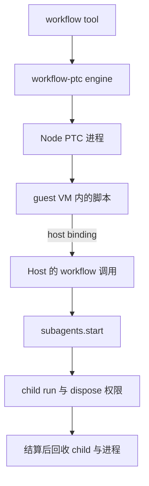

# Subagent、父会话 catalog 与 PTC Workflow

> 固定版本：`dsh-v0.1.7-rc.2`；revision：`477b4f420553e8a52c2fbccc464d7561b239c443`；源码审查：2026-09-29；运行补证：2026-09-30。

一个父 Agent 把写文件的工作交给 child，另一个 child 再读取结果。任务结束后，有的 child 可以释放，有的还要留给下一轮继续对话。若此时重启 runtime，找到这个 child、恢复它和继续执行又是三件不同的事。

这一章先看 child 的使用方式，再看父会话怎样保存目录，最后看 workflow 如何在 PTC 进程中编排这些调用。下面描述的是固定版本的 Node PTC 实现；旧 worker-thread 实验只在历史附录中保留。

## One-shot 与 continuable

provider 通过 effect 注册。one-shot `start()` 成功代表真实 child 已发布，caller 得到 `{ id, result, dispose, localAgent? }`；发布前 provider rollback，发布后 holder 必须在所有路径 dispose。provider removal 阻止新 start，不撤销已经接纳的 run。本地 fork 使用 completed-turn prefix，不包含父当前开放 turn。

continuable child 有 durable Session ID，进程内最多一个 Activation。初始 inbox admission 返回 child/message identity，不等模型完成。已 resident 的消息复用 Activation；缺席的 direct child 可以基于 descriptor 和 parent authority 冷恢复。公共 `sendMessage()` 验证 exact live sender 与直接父子邻接关系，模型消息使用 Steer；浏览器内部 adapter 可选择 Queue/Steer。不能再把旧 followup/reportFrom 组合描述为当前公共 messaging API。

`maxActiveSubagents` 限制相连 continuable 树中的 resident capacity，等待中的父、pending inbox、正在停止的 Activation 仍占用 slot。容量在创建/冷恢复时保留，handle dispose 后归还；one-shot 和外部 provider 不计入这个限制。达到容量拒绝而非排队，避免父占着 slot 等 child 的死锁。它不是总 token 或累计 Session 配额。

## 重启后，先从父 catalog 找到 child

成功本地 child 创建在父 Session 记录 `subagent/catalog`；`subagentCatalog` projection 排除 fork 继承的事实，保持父事件顺序。直接 discovery 观察父 Session，不必扫描每个 child log；递归 discovery 才逐层读取 child catalog，不加载或 resume Agent。不可读分支返回诊断。

可以把这两个记录放到一张对象表里看：

| 记录 | 所在位置 | 回答的问题 |
| --- | --- | --- |
| catalog | 父 Session | 我创建过哪些 child？ |
| descriptor | child 的持久元数据 | 用什么配置恢复这个 child？ |
| live registry | 当前进程 | 哪些 Agent 此刻已激活？ |

找到 catalog 条目时，child 可以尚未激活。递归发现只沿记录读取，真正继续对话时才由有权的直接父请求恢复。

descriptor 记录可重建的 child 配置；catalog 记录“父创建了谁”。两者不能互代。迁移中的 v1 catalog 允许 mode unknown，只说明发现该 child，不能推断可 continuation；正常创建仍可使用已知 mode 的 v0 payload。

## Workflow 转为 PTC 进程


```mermaid
flowchart TD
    T["workflow tool"] --> E["workflow-ptc engine"]
    E --> P["Node PTC 进程"]
    P --> G["guest VM 内的脚本"]
    G -->|"host binding"| H["Host 的 workflow 调用"]
    H --> S["subagents.start"]
    S --> C["child run 与 dispose 权限"]
    C --> R["结算后回收 child 与进程"]
```

Workflow engine 拥有脚本编排；Node PTC provider 拥有进程启动、OS confinement、framed transport 与 managed cleanup。脚本的 agent() 通过 host bindings 调用 subagents，guest 不直接取得 Context。meta/args 是验证过的 JSON data；跨 guest 的结果要求 lossless JSON。当前 engine 拒绝非 TypeScript PTC provider，不能直接用 Python PTC 替代。

engine 为本次 PTC 执行解析调用 Session 的 standing file policy 与 cwd，程序可见环境为空；VM 本身不是 security boundary，文件策略不限制网络。不能从“在进程/VM 中执行”推出任意恶意脚本已安全隔离。

`WorkflowRun.result` 用 completed/cancelled/error 表达结算，不因脚本失败 reject。初始同步 slice 有 syncTimeoutMs，但 engine 给 PTC 的 timeoutMs 是 null，没有总 elapsed deadline；外部 abort/工具 deadline 仍有效。取消立即 abort PTC 及 pending/active children，dispose 等待进程与 child cleanup；**没有独立 workflow cleanup timer**。PTC 停止不等价于 host child ownership 已回收。

top-level workflow tool 将 run-start、member start/end 和 run-end 写入 parent Session；nested transport 不重复写。run-end 要在结果已知且 disposal 完成后记录。缺失尾部结束事件是中断证据，不应伪造成成功。observe-only workflow events 不授予 cancel/dispose 权限。

## 证据与最小核对

[Workflow/child lifecycle Lab](../labs/workflow-child-lifecycle/README.md)已补上当前发行包的执行证据：无 Key 案例运行真实 Node PTC、AgentLoop、JSONL，并验证脚本失败、非父拒绝和取消后的 late-start disposal；真实模型案例通过两个顺序启动的 `sdk-minimal` runtime，完成两个一次性 child 的文件任务及一个 continuable child 的冷恢复。第二次输入不带随机口令，恢复后文件字节准确，child 持久历史 `14 → 31` 且原前缀不变。详见[执行记录](../docs/reviews/2026-09-30-workflow-child.md)。

实验由 profile 中的课程 plugin 调用公开 service，父 pre-step 被拒绝以抑制 settlement 通知触发额外模型调用。它验证正常关闭后的同一 child 恢复，不是原生 SDK resume 或崩溃恢复。冷恢复需要 Session Query；continuable descriptor 不保存 `maxTokens`，恢复时使用模型路由默认预算。

以下命令在带该 tag 的 upstream checkout 只读执行：

```sh
git show dsh-v0.1.7-rc.2:packages/subagent/subagent/src/list-children.ts
git show dsh-v0.1.7-rc.2:packages/workflow/workflow-ptc/src/host.ts
git show dsh-v0.1.7-rc.2:packages/workflow/workflow-ptc/README.md
```

这些源码命令用于核对具体实现；上述 Lab 才提供 runtime probes。[2026-08-31 的 46 项测试](historical-2026-08-31.md)含旧 worker-thread engine，不构成 PTC 的当前证据；SDK 或存储实验的成功也不能代替 PTC 路径的独立验证。

## 继续验证什么

理解了目录与活跃句柄的区别，再做[进阶恢复实验](../labs/workflow-child-lifecycle/RECOVERY.md)：它分别覆盖 PTC 进程崩溃、受控并行/retry、历史 catalog，以及正常关闭和 flush 后 SIGKILL 的森林恢复。每个故障都要看清杀掉的是谁、此前哪些数据已经持久化。

workflow run、child Session 和业务 Run 仍需由应用建立明确映射。任意执行中森林恢复、完整 continuable 容量交错、外部 provider teardown、恶意脚本隔离，以及 tool-workflow 的完整 durable UI 记录，尚未由这些实验全面覆盖。

## 对照源码

按上面的执行过程阅读这些入口。链接全部指向页首固定 revision，源码事实与运行观察的范围分别见正文。

| 入口 | 职责 |
| --- | --- |
| [Subagent service](https://github.com/deepseek-ai/deepseek-harness/blob/477b4f420553e8a52c2fbccc464d7561b239c443/packages/subagent/subagent/src/index.ts)、[types](https://github.com/deepseek-ai/deepseek-harness/blob/477b4f420553e8a52c2fbccc464d7561b239c443/packages/subagent/subagent/src/types.ts) | provider capabilities、one-shot 与 continuable API |
| [Continuation](https://github.com/deepseek-ai/deepseek-harness/blob/477b4f420553e8a52c2fbccc464d7561b239c443/packages/subagent/subagent/src/continuation.ts)、[activation](https://github.com/deepseek-ai/deepseek-harness/blob/477b4f420553e8a52c2fbccc464d7561b239c443/packages/subagent/subagent/src/continuation-activation.ts) | admission、冷恢复、resident child 与回收 |
| [Catalog](https://github.com/deepseek-ai/deepseek-harness/blob/477b4f420553e8a52c2fbccc464d7561b239c443/packages/subagent/subagent/src/catalog.ts)、[list children](https://github.com/deepseek-ai/deepseek-harness/blob/477b4f420553e8a52c2fbccc464d7561b239c443/packages/subagent/subagent/src/list-children.ts) | parent-owned durable child 目录与无 Agent 激活的发现 |
| [Workflow types](https://github.com/deepseek-ai/deepseek-harness/blob/477b4f420553e8a52c2fbccc464d7561b239c443/packages/workflow/workflow/src/runtime-types.ts) | run/result/cancel/dispose |
| [PTC engine](https://github.com/deepseek-ai/deepseek-harness/blob/477b4f420553e8a52c2fbccc464d7561b239c443/packages/workflow/workflow-ptc/src/index.ts)、[host](https://github.com/deepseek-ai/deepseek-harness/blob/477b4f420553e8a52c2fbccc464d7561b239c443/packages/workflow/workflow-ptc/src/host.ts) | 复用 PTC 执行、host child ownership 和结算 |
| [Workflow tool](https://github.com/deepseek-ai/deepseek-harness/blob/477b4f420553e8a52c2fbccc464d7561b239c443/packages/workflow/tool-workflow/src/index.ts) | calling parent 的 durable run 记录 |
