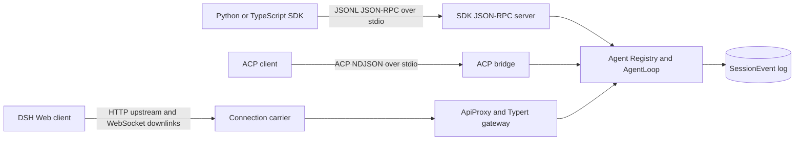

# SDK JSON-RPC、ACP 与 Web Host 不是同一层协议

> 固定版本：`dsh-v0.1.1-rc.2`
> 固定 revision：`b150a551b8d465e31e418e1b2eaf5e79bbb7d28e`
> 验证日期：2026-08-31

## 要回答的问题

DSH 同时出现 SDK JSON-RPC、ACP 和 Web Host，并不表示三者只是同一套方法的不同传输。它们面向不同调用者，拥有不同的 session 创建方式、下行事件、取消/权限语义与物理 carrier。本篇从三个 server 入口追到 Agent/Session，而不是从客户端方法名反推服务端能力。



## 入口与源码路由

| 面 | 协议与 carrier | 固定 revision 入口 |
| --- | --- | --- |
| SDK JSON-RPC 类型 | 3 个 request、4 个 notification | [`packages/sdk/protocol/src/types.ts`](https://github.com/deepseek-ai/deepseek-harness/blob/b150a551b8d465e31e418e1b2eaf5e79bbb7d28e/packages/sdk/protocol/src/types.ts) |
| SDK JSONL transport | newline-delimited JSON-RPC 2.0 | [`packages/sdk/protocol/src/transport.ts`](https://github.com/deepseek-ai/deepseek-harness/blob/b150a551b8d465e31e418e1b2eaf5e79bbb7d28e/packages/sdk/protocol/src/transport.ts) |
| SDK server | lazy SDK session、事件/状态通知 | [`packages/sdk/server/src/server.ts`](https://github.com/deepseek-ai/deepseek-harness/blob/b150a551b8d465e31e418e1b2eaf5e79bbb7d28e/packages/sdk/server/src/server.ts)、[`index.ts`](https://github.com/deepseek-ai/deepseek-harness/blob/b150a551b8d465e31e418e1b2eaf5e79bbb7d28e/packages/sdk/server/src/index.ts) |
| TypeScript client | process ownership、低层 request、高层 receipt-to-idle | [`packages/sdk/client/src/client.ts`](https://github.com/deepseek-ai/deepseek-harness/blob/b150a551b8d465e31e418e1b2eaf5e79bbb7d28e/packages/sdk/client/src/client.ts)、[`api.ts`](https://github.com/deepseek-ai/deepseek-harness/blob/b150a551b8d465e31e418e1b2eaf5e79bbb7d28e/packages/sdk/client/src/api.ts) |
| ACP bridge | ACP session/prompt/cancel/permission | [`packages/acp/acp/src/index.ts`](https://github.com/deepseek-ai/deepseek-harness/blob/b150a551b8d465e31e418e1b2eaf5e79bbb7d28e/packages/acp/acp/src/index.ts) |
| Web raw server | HTTP route registry 与 upgrade handoff | [`packages/host/webserver/src/index.ts`](https://github.com/deepseek-ai/deepseek-harness/blob/b150a551b8d465e31e418e1b2eaf5e79bbb7d28e/packages/host/webserver/src/index.ts) |
| Web product API | browser-safe contract、ApiProxy、fetch carrier | [`packages/host/apiproxy/src/api/index.ts`](https://github.com/deepseek-ai/deepseek-harness/blob/b150a551b8d465e31e418e1b2eaf5e79bbb7d28e/packages/host/apiproxy/src/api/index.ts)、[`fetch/handler.ts`](https://github.com/deepseek-ai/deepseek-harness/blob/b150a551b8d465e31e418e1b2eaf5e79bbb7d28e/packages/host/apiproxy/src/fetch/handler.ts) |
| Browser connection | HTTP upstream、两条 WebSocket downlink | [`packages/client/connection/src/index.ts`](https://github.com/deepseek-ai/deepseek-harness/blob/b150a551b8d465e31e418e1b2eaf5e79bbb7d28e/packages/client/connection/src/index.ts)、[`client/web-api-client.ts`](https://github.com/deepseek-ai/deepseek-harness/blob/b150a551b8d465e31e418e1b2eaf5e79bbb7d28e/packages/client/connection/src/client/web-api-client.ts) |
| Typert Remote | generated descriptor 到同进程 Service | [`packages/api/gateway/src/index.ts`](https://github.com/deepseek-ai/deepseek-harness/blob/b150a551b8d465e31e418e1b2eaf5e79bbb7d28e/packages/api/gateway/src/index.ts) |

## Verified from source

### SDK JSON-RPC：详细观察，控制面很窄

`HarnessSdkRequestMap` 只有 `initialize`、`session/prompt` 和 `shutdown`。`session/prompt` 返回持久入队的 `messageId`，不是该 prompt 的最终回答。服务端下行只有 `session.event`、`session.status`、`subagent.started`、`subagent.finished`。高层 `HarnessSession.run()` 是客户端策略：匹配 inbox receipt，再等待 root Agent 进入 whole-agent idle；它没有增加 wire 方法。

JSONL transport 以换行分帧。带 `id + method` 是 request，仅 `id` 是 response，仅 `method` 是 notification。JSON 语法错误行被忽略；没有 handler 的 request 返回 method-not-found；transport close 会拒绝所有 pending request。

rc.2 wire 没有 prompt/session cancel、approval、session close、load 或 resume。server 的进程内 session map 能复用 live Agent，但进程重启后 stock `createSession()` 固定调用 `ctx.agents.create()`。[`ag-ui-dsh-runtime`](../projects/ag-ui-dsh-runtime/README.md) 的 generation-local adapter 将“存在同 cwd 的持久 header”路由到官方 `agents.resume()`；它没有伪造一个新的 JSON-RPC 方法，也不能写成 stock rc.2 的能力。

### ACP：互操作 prompt，加上 cancel 与 one-shot permission

ACP 通过 `@agentclientprotocol/sdk` 的 NDJSON stream 暴露 `initialize`、`session/new`、`session/prompt` 和 `session/cancel` 等标准语义。每个 `session/new` 创建 bridge-owned fresh Agent；同一 session 一次只允许一个 in-flight prompt。

ACP 只投递 committed assistant text/image。reasoning、raw chunk、tool trace、plan、title 和 retry marker 不进入 automation wire。取消同时覆盖异步附件 admission 与已经进入 durable inbox 的 Agent work。`approval/request` 被映射为 `allow_once` / `reject_once`；未知或 cancelled response 不会升级成 durable grant。

因此 ACP 的“事件更少”不是遗漏实现细节，而是产品语义：它为客户端互操作提供 committed output、cancel 和 permission，不是完整 SessionEvent 调试流。

### Web Host：产品 API 加 carrier 组合

`dsh-host-webserver` 只拥有原始 HTTP route/upgrade 生命周期，不知道 Agent。`client-connection` 把 `/api` 上游 request 交给 Typert gateway 或 ApiProxy，并为浏览器建立 `/api/events.mux` 与 `/api/events.host` 两条下行 WebSocket。Browser `WebApiClient` 的 unary/respond 使用 fetch，下行使用 WebSocket；同一个抽象 client 在 in-process 或其他 carrier 中也可以用 streaming fetch/SSE。

ApiProxy 的逻辑消息是“谁发起 × request/response”四象限。普通客户端 request 走 `POST /api/<method>`；server request 的回答复用原 `rpcId`，走 `POST /api/respond`。`session/event`、tool view、approval、question、history、session export 等产品能力属于这套 Host API，不属于 SDK JSON-RPC 或 ACP。Typert gateway 再把 generated descriptor 映射到当前 Cordis Service；物理 `/api` 不能反推只有一种业务 RPC 实现。

`session.prompt` 的 response 只表示输入已经被接纳（以及可选 slash-command 结果），不是 prompt-specific completion receipt。客户端需要从 whole-session events/projections 判断后续活动。持久恢复也不是一个公开的 `session.resume` method：`session.create` 接受显式 session ID，内部 ensure 路径可按 persistence 状态调用 `agents.resume()`；`session.fork` 是另一项公开 product method。

Web Host 默认面向完整 DSH GUI composition。浏览器使用 WebSocket 下行；Electron 从 `file://` 加载前端并通过 IPC bridge 发 fetch。它不是“更完整的 SDK runtime protocol”。

## 能力对照

| 语义 | SDK JSON-RPC rc.2 | ACP rc.2 | Web Host rc.2 |
| --- | --- | --- | --- |
| 主要调用者 | Python/TS SDK | 通用 ACP client / automation | DSH Web/Electron product client |
| session 建立 | caller 提供 ID，进程内 lazy create | `session/new` 返回 fresh ID | `session.create`；显式 ID 经内部 ensure create-or-resume；另有 `session.fork` |
| 下行 | full SessionEvent + Agent status + local subagent lifecycle | committed assistant text/image | mux/host frames、SessionEvent、product projections |
| prompt 完成 | client receipt-to-idle 投影 | prompt response `stopReason` | `session.prompt` 只确认 admission；完成度由 whole-session product stream 投影 |
| wire cancel | 无 | 有 | 有 product session cancel |
| permission | 无 | one-shot ACP permission | approval/question product flow |
| 跨进程 resume | stock server 无；项目 adapter 内部补齐 | `session/new` 不加载旧 session | 无公开 `session.resume`；`session.create` 的内部 ensure 可走 persistence-aware resume |
| carrier | stdio JSONL | stdio NDJSON | HTTP fetch + browser WebSocket；其他平台可换 carrier |

## Observed at runtime

在固定 rc.2 checkout 运行了三组 keyless focused probe：

```sh
corepack pnpm exec vitest run \
  packages/sdk/protocol/tests/transport.spec.ts \
  packages/sdk/server/tests/server.spec.ts \
  packages/sdk/client/tests/sdk-client.spec.ts
# 3 files / 75 tests passed

corepack pnpm exec vitest run \
  packages/acp/acp/tests/turns.spec.ts \
  packages/acp/acp/tests/approval.spec.ts \
  packages/acp/acp/tests/multi-session.spec.ts
# 3 files / 39 tests passed

corepack pnpm exec vitest run \
  packages/client/connection/tests/client-apply.client.spec.ts \
  packages/client/connection/tests/websocket-downlink.host.spec.ts \
  packages/host/apiproxy/tests/fetch-carrier.spec.ts
# 3 files / 56 tests passed
```

这些 probe 分别覆盖 JSONL correlation/server/high-level client、ACP turn/permission/multi-session，以及浏览器 WebSocket/downlink + ApiProxy fetch carrier；它们不是完整仓库测试。真实 SDK/ACP source prompt 记录见 [`labs/protocol-semantics`](../labs/protocol-semantics/README.md)。真实 Web 产品 Host 本篇没有启动；Stage 5 的 AG-UI 应用是自有 BFF，不是 DSH Web Host 的替代验证。

## Inference

- 需要完整 tool/step/session lifecycle，并愿意自己拥有 runtime process 与业务 recovery 时，SDK JSON-RPC 是较直接的 southbound adapter；cancel/approval 必须由 capability descriptor 明确标成 false。
- 需要第三方 Agent client 互操作、prompt cancel 和 machine permission 时，ACP 更合适；不要期待它复制完整工具轨迹。
- 需要 DSH 自带 GUI 的 session 管理、审批、问题、投影与平台连接时，Web Host 是 product control plane；把它当通用嵌入 SDK 会把 UI 语义和 carrier 一起带入业务。

## Proposal

业务应用可以定义统一的 runtime adapter 接口，但必须先暴露 capability：`fullSessionEvents`、`wireCancel`、`permission`、`persistedResume`、`productRpc`。北向 AG-UI 只消费这些能力的投影；它不能让 SDK JSON-RPC 获得 ACP cancel，也不能让 ACP 自动产生完整 SessionEvent。

上游 SDK server 的合理演进是把 first-session create-or-resume 变成显式 server policy，并增加跨进程 regression；这比在客户端新增一个没有服务端实现的 `resume()` 方法更可靠。

## Unconfirmed / version boundary

- 结论只适用于固定 rc.2。developer preview 的 method、Host package 和 carrier 可能变化。
- 本篇没有证明 Web Host 的认证、远程暴露或生产安全；源码默认 loopback 也不等于认证。
- focused tests 不证明所有 error/escalation/platform 分支。
- 项目 resume adapter 依赖 rc.2 server 首次 session 创建仍经过 `ctx.agents.create()`；升级 DSH 时必须重新审计并删除已被 upstream 取代的 adapter。
