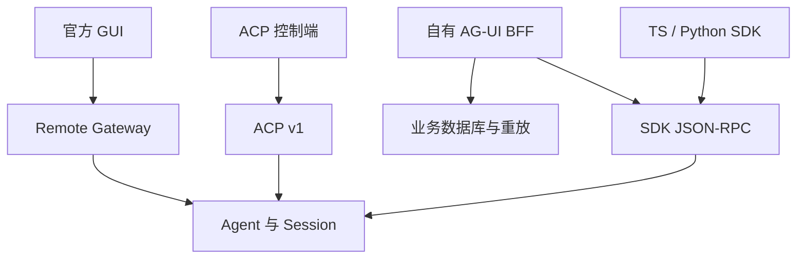

# SDK JSON-RPC、ACP 与 Web Host：分别核对能力

> 固定版本：`dsh-v0.1.7-rc.2`；revision：`477b4f420553e8a52c2fbccc464d7561b239c443`；源码审查：2026-09-29；Web 运行补证：2026-09-30。

同样是“发一句话，等回答”，三个入口的完成信号并不一样。SDK 先给出入队回执，再由客户端等待 idle；ACP 把 prompt 请求保持在途，最终返回 stopReason；官方 Web 则同时观察持久历史与进程内实时帧。

选择入口时，先确定应用需要什么控制和观察，再选协议。用 AG-UI 包装输出可以改变前端事件形式，但原入口提供的取消、恢复与实时能力仍需逐项核对。下面先分别走通三条链路，再放到一张能力表里比较。

## SDK：先收到回执，再等待结算

request 仍只有 initialize、session/prompt、shutdown；通知为 session.event、session.status、subagent.started、subagent.finished。prompt 返回持久 inbox messageId，高层 run 匹配 receipt 后等待 root whole-agent idle。server 转发 durable assistant message/attempt 的 embedded stream，不订阅实时 agent/assistant-stream；事后展开 stream 不是实时 token delivery。

stock server 新实例首次看到 ID 仍调用 agents.create，没有 resume、cancel、approval 或 session close RPC。调用 SDK close 关闭整个 owner/runtime，不是取消某一个共享 session 的 prompt。[AG-UI 项目](../projects/ag-ui-dsh-runtime/README.md)的部署 adapter 必须独立核对 persisted ID、canonical cwd 和 agents.resume，不能称为 SDK 原生能力。

## ACP：请求保持在途，直到返回结束原因

该 DSH 包依赖 `@agentclientprotocol/sdk 1.4.0`；这是库版本，协商的 protocol version 仍是 1。当前 bridge 提供 session/new、list、resume、close、set_config_option、prompt、cancel 以及一次性 permission。list 发现可恢复 inactive root；resume 核对 canonical cwd，恢复模型历史但不向 client 重放旧 transcript；close 只回收目标 Agent scope，持久状态保留。

配置来自服务端 catalog，model/effort option value 是 opaque ID。prompt 在异步 image admission 前保存配置选择，并把 route 固定到该 turn 的各 step；同时修改配置作用于下一轮。同一 session 只允许一个 in-flight ACP prompt，结算还等待有序 update delivery。

session/update 包括 **committed assistant messages/thoughts、generic tool lifecycle、配置与 context usage**。raw provider deltas、retry attempts、DSH 专用 UI cards 不在 wire。`agent_message_chunk` 的名称不意味着 token delta。未知/取消 permission response 不升级为 durable grant。

session/load、delete、fork、transcript replay、terminal 和 elicitation 等仍不支持。authenticate 立即成功，不能把该方法存在当成认证已经实现。close 需要等待输入接纳、Agent 活动与 update 下发收尾，再回收后代、flush 并 dispose。

## Web Host：Remote streams 与产品身份

当前 browser unary Remote 走 HTTP POST；API Gateway 管理 `/api/remote.mux` WebSocket 的 logical streams。旧双下行 `/api/events.mux` 与 `/api/events.host` / ApiProxy 叙述不能解释此版。shell carrier 可通过相同 Remote abstraction 提供流，不必开 WebSocket。

Host 的 `$events` source 先安装增量监听再发送 ready；Client 收到 ready 后才发布该 generation 与 connected 状态。错误/断线使 generation 失效，旧 source 完成取消后才替换。Session-follow 在持久历史之外接收 `agent/assistant-stream` 实时帧，这是官方 Web 路径具备而 stock SDK 不具备的输出能力。

浏览器请求需要 launch token 换取的 authority-bound signed cookie，并先经过 Host/Origin 检查。信任主机不是身份认证，loopback 也不是多租户 ACL。Desktop carrier 拥有自己的认证与连接；不能继续假定所有 Electron 请求都经过旧 ApiProxy。


```mermaid
flowchart TD
    SDK["TS / Python SDK"] --> S["SDK JSON-RPC"]
    ACP["ACP 控制端"] --> A["ACP v1"]
    WEB["官方 GUI"] --> W["Remote Gateway"]
    S --> CORE["Agent 与 Session"]
    A --> CORE
    W --> CORE
    BFF["自有 AG-UI BFF"] --> S
    BFF --> DB["业务数据库与重放"]
```

| 能力 | SDK JSON-RPC | DSH ACP | 官方 Web Host |
| --- | --- | --- | --- |
| 输出 | 原生 durable events/status | committed 语义 updates | 产品历史/投影 + live stream |
| prompt 结算 | 客户端 receipt-to-idle | prompt response + update drain | 产品会话观察与控制 |
| cancel | 无 per-prompt wire cancel | 有 | 产品会话控制 |
| persisted resume | stock server 无 | 有，且不回放 transcript | 产品 Session Controller |
| permission | 无 | one-shot ACP request | 产品 approval/question |
| session close | 只能 shutdown runtime | 指定 session close | 产品 lifecycle |

## 到实验中观察

[2026-09-29 protocol 执行记录](../docs/reviews/2026-09-29-web-protocol-migration.md)记录发布 npm `0.1.7-rc.2`：SDK matching receipt、非空 committed text、completed/idle；ACP close/list、第二个 CLI 进程 resume 同 ID、无旧 transcript update 回放、无工具 nonce 回忆。该 SDK/ACP 记录没有真实 cancel/permission 验证，其精确选择与双向 ID 相关性属于 fake/keyless tests。

从 protocol lab 重跑 keyless 测试：

```sh
cd labs/protocol-semantics
uv sync --group dev
uv run --python 3.10 pytest tests
```

[官方 Web Host Lab](../labs/web-host-lifecycle/README.md)提供独立浏览器证据：匿名首页 401、token 登录后干净 URL、页面 reload 保留历史，以及两个顺序启动的 Host 使用同一个 Session 完成两轮文件任务。持久记录 `26 → 43`、原前缀不变，两个产物均为相同的 36 字节口令；第二轮输入不带口令。两个最终回复各有 4 个独立 `assistant-stream / text-delta` 帧先于对应持久 `assistant/message` 到达浏览器，未将历史内嵌 chunk 算成实时输出。详见[验收记录](../docs/reviews/2026-09-30-web-host.md)。

[Web 控制案例](../labs/web-host-lifecycle/CONTROLS.md)另补了真实审批、foreground 取消和离线：拒绝没有目标写入且根 turn completed；单次允许后持续策略仍 read-only；取消为 user-caused aborted、保留已发生的开始标记；浏览器离线时 Host 继续完成一次 append，重连补齐同会话历史。参见[控制验收](../docs/reviews/2026-09-30-web-controls.md)。

这些 Web 观察使用公开 `web` profile；基础恢复为 SIGINT 后重启，控制案例也不覆盖强杀恢复或完整交互矩阵。无模型源码核对命令：

```sh
git show dsh-v0.1.7-rc.2:packages/acp/acp/src/index.ts
git show dsh-v0.1.7-rc.2:packages/client/connection/README.md
```

## 继续验证什么

落地应用时，适配器应分别声明原始 SessionEvent、实时文本、wire cancel、permission 和持久恢复的支持情况。一个统一的 prompt 方法不足以表达这些差异。

[Web 恢复课](../labs/web-host-lifecycle/RECOVERY.md)已经观察 admission 断线、取消后的迟到回答、重复投递与 Host SIGKILL 修复。并发相同 requestId 曾被接纳两次，迟到回答的 200/OK 也可能只是 no-op；判断结果时需要关联原请求与持久决策。这些是具体实验结果，自有 FastAPI/AG-UI 和[旧版测试](historical-2026-08-31.md)不替代其他官方 Web 功能的验证。

## 对照源码

按上面的执行过程阅读这些入口。链接全部指向页首固定 revision，源码事实与运行观察的范围分别见正文。

| 入口 | 职责 |
| --- | --- |
| [SDK types](https://github.com/deepseek-ai/deepseek-harness/blob/477b4f420553e8a52c2fbccc464d7561b239c443/packages/sdk/protocol/src/types.ts)、[server](https://github.com/deepseek-ai/deepseek-harness/blob/477b4f420553e8a52c2fbccc464d7561b239c443/packages/sdk/server/src/server.ts)、[client API](https://github.com/deepseek-ai/deepseek-harness/blob/477b4f420553e8a52c2fbccc464d7561b239c443/packages/sdk/client/src/api.ts) | wire 方法、通知与 receipt-to-idle |
| [ACP bridge](https://github.com/deepseek-ai/deepseek-harness/blob/477b4f420553e8a52c2fbccc464d7561b239c443/packages/acp/acp/src/index.ts)、[README](https://github.com/deepseek-ai/deepseek-harness/blob/477b4f420553e8a52c2fbccc464d7561b239c443/packages/acp/acp/README.md) | 标准 session control、配置、输出与清理 |
| [Connection](https://github.com/deepseek-ai/deepseek-harness/blob/477b4f420553e8a52c2fbccc464d7561b239c443/packages/client/connection/src/index.ts)、[browser auth](https://github.com/deepseek-ai/deepseek-harness/blob/477b4f420553e8a52c2fbccc464d7561b239c443/packages/client/connection/src/browser-auth.ts) | HTTP 路由、身份与 carrier |
| [API Gateway](https://github.com/deepseek-ai/deepseek-harness/blob/477b4f420553e8a52c2fbccc464d7561b239c443/packages/api/gateway/src/index.ts)、[stream server](https://github.com/deepseek-ai/deepseek-harness/blob/477b4f420553e8a52c2fbccc464d7561b239c443/packages/api/gateway/src/stream-server.ts) | Remote unary/stream 与 multiplex WebSocket |
| [Session Controller](https://github.com/deepseek-ai/deepseek-harness/blob/477b4f420553e8a52c2fbccc464d7561b239c443/packages/api/session-controller/src/index.ts)、[history](https://github.com/deepseek-ai/deepseek-harness/blob/477b4f420553e8a52c2fbccc464d7561b239c443/packages/api/session-controller/src/history.ts) | 产品会话控制与 follow 的 live/durable 内容 |
