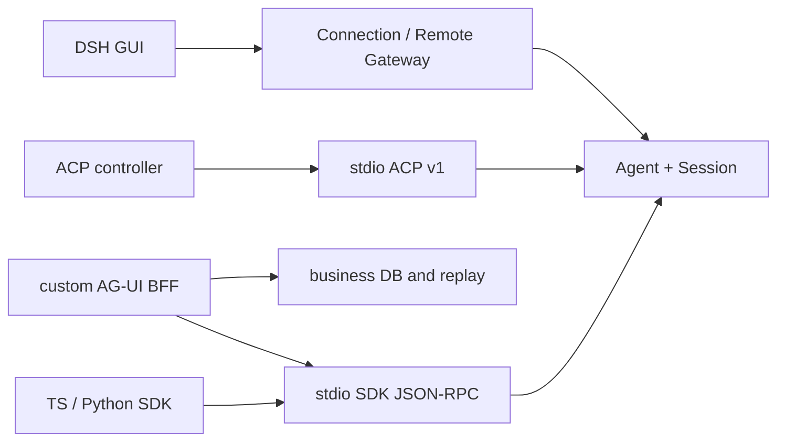

# SDK JSON-RPC、ACP 与 Web Host：分别核对能力

> 固定版本：`dsh-v0.1.7-rc.2`；revision：`477b4f420553e8a52c2fbccc464d7561b239c443`；源码审查：2026-09-29。

三者拥有不同的 session/control/output 语义。北向 AG-UI 可以投影已有能力，不能让 SDK 获得它没有的 cancel/resume，也不能把自有应用的验收当成官方 Web Host 的证据。

## Verified from source

| 入口 | 职责 |
| --- | --- |
| [SDK types](https://github.com/deepseek-ai/deepseek-harness/blob/477b4f420553e8a52c2fbccc464d7561b239c443/packages/sdk/protocol/src/types.ts)、[server](https://github.com/deepseek-ai/deepseek-harness/blob/477b4f420553e8a52c2fbccc464d7561b239c443/packages/sdk/server/src/server.ts)、[client API](https://github.com/deepseek-ai/deepseek-harness/blob/477b4f420553e8a52c2fbccc464d7561b239c443/packages/sdk/client/src/api.ts) | wire 方法、通知与 receipt-to-idle |
| [ACP bridge](https://github.com/deepseek-ai/deepseek-harness/blob/477b4f420553e8a52c2fbccc464d7561b239c443/packages/acp/acp/src/index.ts)、[README](https://github.com/deepseek-ai/deepseek-harness/blob/477b4f420553e8a52c2fbccc464d7561b239c443/packages/acp/acp/README.md) | 标准 session control、配置、输出与清理 |
| [Connection](https://github.com/deepseek-ai/deepseek-harness/blob/477b4f420553e8a52c2fbccc464d7561b239c443/packages/client/connection/src/index.ts)、[browser auth](https://github.com/deepseek-ai/deepseek-harness/blob/477b4f420553e8a52c2fbccc464d7561b239c443/packages/client/connection/src/browser-auth.ts) | HTTP 路由、身份与 carrier |
| [API Gateway](https://github.com/deepseek-ai/deepseek-harness/blob/477b4f420553e8a52c2fbccc464d7561b239c443/packages/api/gateway/src/index.ts)、[stream server](https://github.com/deepseek-ai/deepseek-harness/blob/477b4f420553e8a52c2fbccc464d7561b239c443/packages/api/gateway/src/stream-server.ts) | Remote unary/stream 与 multiplex WebSocket |
| [Session Controller](https://github.com/deepseek-ai/deepseek-harness/blob/477b4f420553e8a52c2fbccc464d7561b239c443/packages/api/session-controller/src/index.ts)、[history](https://github.com/deepseek-ai/deepseek-harness/blob/477b4f420553e8a52c2fbccc464d7561b239c443/packages/api/session-controller/src/history.ts) | 产品会话控制与 follow 的 live/durable 内容 |

### SDK：wire 控制面仍窄

request 仍只有 initialize、session/prompt、shutdown；通知为 session.event、session.status、subagent.started、subagent.finished。prompt 返回持久 inbox messageId，高层 run 匹配 receipt 后等待 root whole-agent idle。server 转发 durable assistant message/attempt 的 embedded stream，不订阅实时 agent/assistant-stream；事后展开 stream 不是实时 token delivery。

stock server 新实例首次看到 ID 仍调用 agents.create，没有 resume、cancel、approval 或 session close RPC。调用 SDK close 关闭整个 owner/runtime，不是取消某一个共享 session 的 prompt。[AG-UI 项目](../projects/ag-ui-dsh-runtime/README.md)的部署 adapter 必须独立核对 persisted ID、canonical cwd 和 agents.resume，不能称为 SDK 原生能力。

### ACP：v1 协议与 SDK 1.4.0

该 DSH 包依赖 `@agentclientprotocol/sdk 1.4.0`；这是库版本，协商的 protocol version 仍是 1。当前 bridge 提供 session/new、list、resume、close、set_config_option、prompt、cancel 以及一次性 permission。list 发现可恢复 inactive root；resume 核对 canonical cwd，恢复模型历史但不向 client 重放旧 transcript；close 只回收目标 Agent scope，持久状态保留。

配置来自服务端 catalog，model/effort option value 是 opaque ID。prompt 在异步 image admission 前快照选择，并把 route 固定到该 turn 的各 step；同时修改配置作用于下一轮。同一 session 只允许一个 in-flight ACP prompt，结算还等待有序 update delivery。

session/update 现在包括 **committed assistant messages/thoughts、generic tool lifecycle、配置与 context usage**。raw provider deltas、retry attempts、DSH 专用 UI cards 不在 wire。`agent_message_chunk` 的名称不意味着 token delta。未知/取消 permission response 不升级为 durable grant。

session/load、delete、fork、transcript replay、terminal 和 elicitation 等仍不支持。authenticate 立即成功，不能把该方法存在当成认证已经实现。完整 close 处理 admission、Agent 活动、updates、descendants、flush 和 dispose。

### Web Host：Remote streams 与产品身份

当前 browser unary Remote 走 HTTP POST；API Gateway 管理 `/api/remote.mux` WebSocket 的 logical streams。旧双下行 `/api/events.mux` 与 `/api/events.host` / ApiProxy 叙述不能解释此版。shell carrier 可通过相同 Remote abstraction 提供流，不必开 WebSocket。

Connection 的 `$events` generation source 先安装增量监听，再交付 ready；只有 ready 才发布 connected。错误/断线使 generation 失效，旧 source 完成取消后才替换。Session-follow 在持久历史之外接收 `agent/assistant-stream` 实时帧，这是官方 Web 路径具备而 stock SDK 不具备的输出能力。

浏览器请求需要 launch token 换取的 authority-bound signed cookie，并先经过 Host/Origin 检查。信任主机不是身份认证，loopback 也不是多租户 ACL。Desktop carrier 拥有自己的认证与连接；不能继续假定所有 Electron 请求都经过旧 ApiProxy。


```mermaid
flowchart LR
    SDK["TS / Python SDK"] --> S["stdio SDK JSON-RPC"]
    ACP["ACP controller"] --> A["stdio ACP v1"]
    WEB["DSH GUI"] --> W["Connection / Remote Gateway"]
    S --> CORE["Agent + Session"]
    A --> CORE
    W --> CORE
    BFF["custom AG-UI BFF"] --> S
    BFF --> DB["business DB and replay"]
```

| 能力 | SDK JSON-RPC | DSH ACP | 官方 Web Host |
| --- | --- | --- | --- |
| 输出 | 原生 durable events/status | committed 语义 updates | 产品历史/投影 + live stream |
| prompt 结算 | 客户端 receipt-to-idle | prompt response + update drain | 产品会话观察与控制 |
| cancel | 无 per-prompt wire cancel | 有 | 产品会话控制 |
| persisted resume | stock server 无 | 有，且不回放 transcript | 产品 Session Controller |
| permission | 无 | one-shot ACP request | 产品 approval/question |
| session close | 只能 shutdown runtime | 指定 session close | 产品 lifecycle |

## Observed at runtime

[2026-09-29 protocol 执行记录](../docs/reviews/2026-09-29-web-protocol-migration.md)记录发布 npm `0.1.7-rc.2`：SDK matching receipt、非空 committed text、completed/idle；ACP close/list、第二个 CLI 进程 resume 同 ID、无旧 transcript update 回放、无工具 nonce 回忆。真实 cancel/permission 未测试，其精确选择与双向 ID 相关性属于 fake/keyless tests。

从 protocol lab 重跑 keyless 测试：

```sh
cd labs/protocol-semantics
uv sync --group dev
uv run --python 3.10 pytest tests
```

本篇编辑没有重复模型调用；上述真实观察为同固定版已有证据。无模型源码核对命令：

```sh
git show dsh-v0.1.7-rc.2:packages/acp/acp/src/index.ts
git show dsh-v0.1.7-rc.2:packages/client/connection/README.md
```

## Inference、Proposal 与未确认

Inference：适配器应逐项声明 fullSessionEvents、liveTokens、wireCancel、permission、persistedResume，不能用统一接口假装对等。Proposal：官方 Web Host 另建认证、重连和 live/durable 汇合的浏览器验收。本次没启动官方 Web Host；自有 FastAPI/AG-UI 的成功不能补足这一点。[旧 170 项测试](historical-2026-08-31.md)也不能验证新版 Remote carrier。
