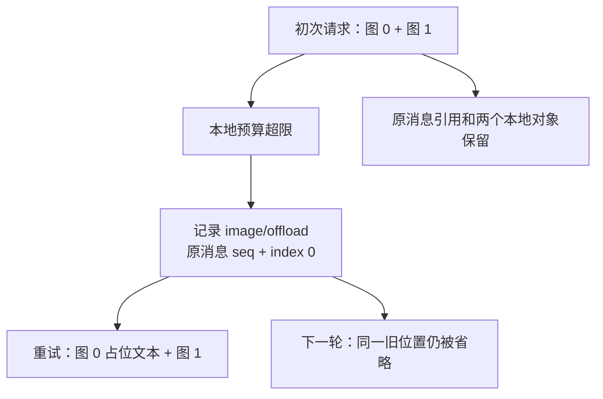

# Inline 图片预算与持久 offload

Files 不可用时，上一课把图片全部放进了 Messages 请求。不过，改为 inline 不意味着图片可以无限增加。本课故意把预算设得很小：一张图能放下，两张一起就超限。先看没有恢复插件时的拒绝，再看插件如何舍弃最旧的图片位置，让请求继续。

实验接续[整请求 fallback](FALLBACK.md)，使用真实发布的 `llm-deepseek` provider 和 `compaction-image-offload` 插件，固定 npm `0.1.7-rc.2` / upstream `477b4f420553e8a52c2fbccc464d7561b239c443`。

## 配置及对照

这里的“预算”先要说清楚：`maxInlineRequestImageBytes` 计的是图片 base64 字节，计算为 `4 × ceil(encodedBytes / 3)`，不是整个 JSON 请求体大小，也不是供应商的账户配额。

两张 512×512 色块图先通过生产 store 归一化为 256×256 JPEG。本课将预算设为 2000，`inlineImageOffloadByteQuantum` 设为 1；程序实际断言每张图的 base64 字节数不超过 2000，而两张之和超过 2000。这样错误一定来自图片组合，不能误解释为单张图不可用。

| 模式      | 插件            | 预期                                                     |
| --------- | --------------- | -------------------------------------------------------- |
| `reject`  | 不加载offload   | turn以 `IMAGE_OFFLOAD_REQUIRED` 错误结束，无Messages请求 |
| `offload` | 加载官方offload | 记录最旧图片index0，重试只发第二张；下一轮仍只发第二张   |

Files使用 `reject-all` 的本地501，不转发任何上传。预算错误由真实provider在Messages发送前计算得出，不是fixture手工抛出，也不是供应商返回的quota错误。

## 运行

在 `labs/attachment-input`：

```sh
pnpm install --frozen-lockfile
pnpm test
pnpm typecheck
pnpm lint
pnpm format:check
```

拒绝对照不需要真实Key。将endpoint设为不可用的本机fixture地址，正确执行时不会访问它：

```sh
DEEPSEEK_API_KEY=fixture-only DEEPSEEK_BASE_URL=http://127.0.0.1:9 pnpm budget:reject
```

恢复对照会调用两轮真实模型，需要已有凭据：

```sh
pnpm budget:offload
# 或根目录已有被忽略的.env：
node --env-file=../../.env --import tsx examples/live.ts --files=reject-all --budget=offload
```

恢复模式要求模型只描述仍可见的图片、忽略 offload 占位符并且不调用工具。父进程只接受第二张的准确颜色顺序。运行后重点看三个位置：一次 `image/offload`、两轮各一张 inline 图片，以及原始消息里仍保留的两张图片引用。



下一轮已经能从历史中读到首轮文本答案，所以只用来检查持久选择与传输复用，不再计为独立视觉样本。

## 执行链与验证

[provider的 `inlineImages()`](https://github.com/deepseek-ai/deepseek-harness/blob/477b4f420553e8a52c2fbccc464d7561b239c443/packages/llm/llm-deepseek/src/images.ts)计算base64预算，发现需要移除一个最旧occurrence时返回带 `offloadImages` 的错误。没有恢复插件时，Agent结束为error；SDK的 `run()` 仍可能正常返回一个RunResult，因此必须检查 `turn/end.reason`，不能把Promise兑现当成成功。

[官方 offload 插件](https://github.com/deepseek-ai/deepseek-harness/blob/477b4f420553e8a52c2fbccc464d7561b239c443/packages/compaction/compaction-image-offload/src/index.ts)在 `agent/request-error` 记录 `image/offload`，随后请求 retry。它选择的是“原消息 seq + imageIndexes:[0]”。因此同一个位置在下一轮仍被省略，但原图片引用没有被删除或改写。

这次重试之所以有意义，是持久记录已经改变了下一次模型输入。它不消耗 `retryPolicy.maxRetries` 的 transient 重试预算；本课该值仍为 0。

硬断言包括：

- 拒绝模式：恰有1个error turn，code为 `IMAGE_OFFLOAD_REQUIRED`；0个offload、0个Messages。
- 恢复模式：恰有1条offload，准确指向初始消息的index0；两个turn completed，0个工具调用。
- 原消息仍保存两张原始引用；显式 `imageOffloadProjection` 重放后，只标记第一张，attachment字段与顺序不变。
- 两轮实际wire都只有第二张inline图片，hash与独立重读的请求版本一致；两份durable对象仍可读。
- runtime关闭后新Context重开V4，全部事件相等；恢复模式的projection也一致。

## 实测结果

2026-10-01：拒绝模式12个持久事件、1次本地Files501、0个模型请求；恢复模式25个事件、1条offload、3次本地Files501、2个HTTP200 Messages，每个只含1张inline图片。第三次501属于下一轮重新尝试Files。两模式无远端上传、无远端删除，临时目录均已清理。

31项本地测试通过，预算验收新增5项，负对照拒绝“预算失败却发送模型请求”“省略新图或下一轮恢复旧图”“没有首次失败尝试却宣称恢复”。详细结果见[元数据](evidence/2026-10-01-budget.json)与[验收](../../docs/reviews/2026-10-01-attachment-budget.md)。

本课没有触发服务端context overflow、账户配额错误、真实网络丢响应、图片质量评测或强杀恢复。它补齐生产store与真实provider预算计算相连的路径，不能替代[前一组受控compaction故障](../compaction-lifecycle/REDUCTION.md)的其他场景，也不把本地配置造成的错误写成供应商故障。
