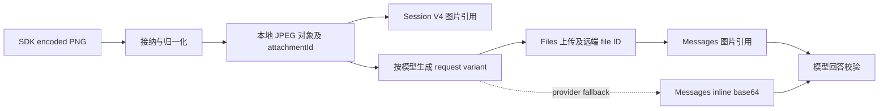

# 从 SDK 图片输入到真实视觉请求

本实验回答：图片经过 SDK 接纳后存在哪里，模型收到哪些字节，如何分别验证持久引用、传输和回答？先读 [TypeScript SDK](../../tutorials/typescript-sdk/README.md) 与 [图片 offload](../compaction-lifecycle/REDUCTION.md)。本课使用发行版 `LocalAttachmentStore`，不改变上一课的 fixture 结论。

## 版本与条件

固定 DSH npm `0.1.7-rc.2`、Cordis `4.0.4`、Sharp `0.35.5`，对应 upstream `dsh-v0.1.7-rc.2` / `477b4f420553e8a52c2fbccc464d7561b239c443`。实测环境为 macOS arm64、Node `26.7.0`、pnpm `12.3.4`；Node 支持范围见 manifest。Vitest `4.1.8`；lockfile 与 workspace override 保留本机验证过的 Rolldown `1.2.11` 原生绑定组合。

真实例子使用 `deepseek-flash`、reasoning `off`、`maxTokens: 512`、provider transient retry `0`。两张图由 Sharp 在父进程生成：每张是512×512的红/绿/蓝/黄色块，象限顺序独立随机且两图不同；答案不写入文件名、metadata、prompt 或子进程环境。模型只收到允许的颜色集合、位置顺序和图片。

## 安装与运行

从仓库根目录进入本课：

```sh
cd labs/attachment-input
pnpm install --frozen-lockfile
pnpm test
pnpm typecheck
pnpm lint
pnpm format:check
```

本地测试不需要 Key，也不调用外部模型。真实例子需要环境中的 `DEEPSEEK_API_KEY`，可选 `DEEPSEEK_BASE_URL`；沿用已有环境配置即可，勿把 Key 写入代码。默认 endpoint 为 `https://api.deepseek.com/anthropic`。环境变量就绪后：

```sh
pnpm live
```

若凭据在仓库根目录、被 Git 忽略的 `.env` 中，可从本课目录运行：

```sh
node --env-file=../../.env --import tsx examples/live.ts
```

这会产生真实 API 调用。脚本通过公开 SDK 的 `sdk-minimal` profile 和 patch 启动 runtime；runtime、home、workspace、Session 和附件均放在本次临时目录。SDK patch 挂载真实附件 provider，并将归一化尺寸限制为256×256，确保512×512输入确实经过转换。每轮等待上限120秒，超时调用 owner.close；关闭自身耗时不计入这个等待上限。失败不自动重放模型任务。

## 先分清三种图片身份



- `attachmentId` 对应归一化后内容。两份相同字节即使展示名不同，也可复用同一本地对象；它不是原输入文件的 hash。
- `variantId` 标识含变换参数的请求版本。它不等于请求字节的 SHA-256；在本次小图中，variant 与归一化对象的字节恰好一致。
- `file_id` 是供应商返回的远端引用，生命周期独立于本地 Session/对象。只删除它不会删除本地图片。

SDK 的 `durablePromptContent()` 调用 `admitEncodedImages()`，把 wire 上的 encoded image 转成 Session 的附件引用。`LocalAttachmentStore` 在 `<DSH_HOME>/attachments/v1/objects/` 保存归一化对象，在 `<DSH_HOME>/cache/attachments/request-images/` 缓存请求版本。收紧接纳限制影响新写入；已接纳对象仍可读。请求 cache 可以重建，本地 durable 对象不会自动删除。

provider 的 `prepareImages()` 根据模型 route 获取请求版本。实验关闭 runtime 后，用独立 Context 重开 store，调用同版本包根导出的 `resolveAdapterOptions()` / `resolveRequestImageTarget()`，重建相同 target，并逐张比较真实传输字节的 hash 和顺序。这两个 resolver 属于固定版本机制探针，其中 target resolver 的源码标注为 `@internal`，不要据此承诺未来版本兼容。

## 如何核对证据

[`examples/live.ts`](examples/live.ts) 先让模型返回两图四象限的颜色数组，再执行同一 Session 的文本后续轮次。两轮都必须以 `completed` 结束、没有工具调用；第一次答案和父进程内的随机真值精确一致。第二轮答案也匹配，但历史已含第一次答案，因此只把它计为历史/传输复用检查，不当作第二个独立视觉样本。

关闭 runtime 后独立打开 JSONL V4，要求完整事件与现场订阅记录一致，读取两个 `user/message` 图片引用，验证尺寸、类型、originalDimensions、content address 和 host 文件字节。原始512×512 PNG与归一化JPEG的 hash 必须不同。只有模型说“看见了图片”，不足以通过这些断言。

[`src/transport.ts`](src/transport.ts) 是本课 loopback 测试代理。它把现有 Key 转发给配置的 endpoint，记录上传字节数/hash与 Messages 图片表示；不输出 Key、原始请求体或远端 ID。Files 引用必须能对应到本次已确认上传的 hash；inline 则直接计算解码后的 hash。每条成功请求必须恰有两张图，并符合所选模式：默认全部 Files，两个 fallback 模式全部 inline，不能混合。代理没有改变图片字节。

## 本次观察

2026-10-01 的一次真实运行结果见[元数据 JSON](evidence/2026-10-01-live.json)与[验收记录](../../docs/reviews/2026-10-01-attachment-input.md)：

| 观察       | 结果                                              |
| ---------- | ------------------------------------------------- |
| 原输入     | 两张512×512 PNG，5546 / 5575字节                  |
| 本地归一化 | 两张256×256 JPEG，1283 / 1282字节                 |
| Files      | 2次成功上传，两轮共4个图片引用，顺序/hash匹配     |
| Messages   | 2个 HTTP 200；无 inline 图片                      |
| 回答       | 首轮视觉答案匹配；第二轮历史答案匹配；0次工具调用 |
| 持久日志   | V4、22个完整事件与现场记录一致                    |
| 清理       | 本次2个已确认上传被删除；临时目录删除；脚本退出0  |

当前35项 keyless tests 覆盖真实 store 的去重/归一化/cache重建/旧对象重读/损坏拒绝，以及严格答案校验、代理路由、上传不确定性、失败后的清理清单和[整请求fallback验收](FALLBACK.md)。模型结果只是一份小型色块样本，不是视觉能力评测。

## 清理与失败处理

固定版 provider 的 Files quota recovery 可以清理账户内其他 `dsh-` 文件；本课代理拒绝账户级列表及非本次 ID 的访问/删除，避免实验影响其他任务。正常运行仅显式删除本次收到可用 ID 的上传；删除404视为已不存在，其余成功响应必须给出对应 ID 和 `file_deleted`。expiry配置不是远端已删除的证据。

每个已转发上传只要没有确认 ID，就保守标为清理未确认，包括错误HTTP状态。即使供应商实际上拒绝了写入，本课也不会凭该状态宣布清理完成。收到 ID 但删除失败时，脚本在本次临时目录保留 `cleanup.json`：权限0600，含固定 endpoint、本次待清理 ID/hash与未确认上传数，不含 Key。写入按序、临时文件原子替换；它不是物理掉电恢复保证。

失败会输出 `retainedDirectory` 和关闭/清理状态，并保留 `transport.json`、Session及私有清理清单。先检查状态，再用原 endpoint 和凭据处理清单中已知 ID；不要按文件名前缀批量删除其他上传，也不要将私有清单提交 Git。没有 ID 的不确定上传需要单独核实，不能自动定位。例子没有自动远端重试清理器。只有全部验证、runtime关闭、远端清理和代理关闭成功，脚本才删除本次目录。

## 固定源码与下一步

以下链接都固定同一 revision：

- [SDK server：durablePromptContent](https://github.com/deepseek-ai/deepseek-harness/blob/477b4f420553e8a52c2fbccc464d7561b239c443/packages/sdk/server/src/server.ts)
- [encoded image admission](https://github.com/deepseek-ai/deepseek-harness/blob/477b4f420553e8a52c2fbccc464d7561b239c443/packages/attachment/attachment/src/admission.ts)
- [LocalAttachmentStore](https://github.com/deepseek-ai/deepseek-harness/blob/477b4f420553e8a52c2fbccc464d7561b239c443/packages/attachment/attachment-local/src/store.ts)
- [provider image preparation](https://github.com/deepseek-ai/deepseek-harness/blob/477b4f420553e8a52c2fbccc464d7561b239c443/packages/llm/llm-deepseek/src/images.ts)
- [request target resolver](https://github.com/deepseek-ai/deepseek-harness/blob/477b4f420553e8a52c2fbccc464d7561b239c443/packages/llm/llm-deepseek/src/request-pricing.ts)

[整请求 fallback](FALLBACK.md)已补充“本地禁用全部/部分 Files + 真实 inline Messages”的两个实跑场景。供应商服务端图片配额/预算错误恢复、透明或EXIF输入、账户配额错误、跨机器/租户路径权限、强杀恢复和其他平台仍未验证。[图片预算与持久offload](BUDGET.md)已验证真实provider本地预算拒绝和恢复；[已删除Files ID恢复](STALE.md)也已实跑；[真实服务端context overflow](../compaction-lifecycle/PROVIDER-OVERFLOW.md)已单独验证，不能与本地图片预算错误混算。
