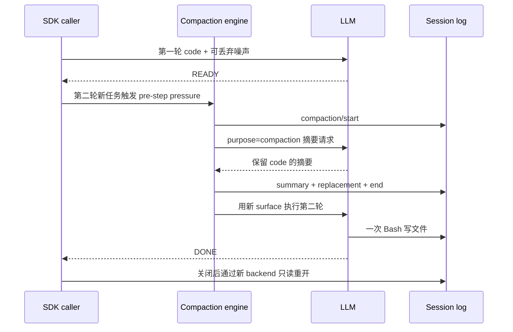

# Compaction：实际压缩、继续任务与持久化重放

压缩改变的是模型可见的消息序列，不会删除原始 Session 事件。本课通过真实 compaction engine、真实模型摘要和一个文件产物验证这件事：旧消息被替换后，模型仍能从 checkpoint 使用其中的随机代号完成后续任务。

固定 npm SDK/runtime `0.1.7-rc.2`、Cordis `4.0.4`，源码 revision `477b4f420553e8a52c2fbccc464d7561b239c443`。前置：[Session log 与 projection](../../how-dsh-works/04-session-event-log-and-projection.md)、[Compaction 与 context assembly](../../how-dsh-works/05-compaction-and-context-assembly.md)。

## 1. 先运行确定性实验

从仓库根目录开始：

```sh
cd labs/compaction-lifecycle
pnpm install --frozen-lockfile
pnpm test
pnpm typecheck
pnpm lint
pnpm format:check
```

Node 支持 `^22.19.0 || >=24.0.0`；本机运行 Node `26.7.0`、pnpm `12.3.4`、macOS arm64。

[`engine.test.ts`](tests/engine.test.ts)挂载发布的 Context、AgentLoop、TokenMeter 和 BasicCompactionEngine。只有 LlmAdapter 使用确定性输出；压缩选区、事务事件、消息替换和后续请求都执行真实发布库代码：

- 空历史手动压缩返回 null，不增加日志。
- 手动压缩生成完整 bracket 与 checkpoint，原事件前缀保持；下一次模型请求使用摘要，不再包含旧噪声。
- summarizer 失败关闭失败记录，不提交 summary/replacement，旧 surface 保留。
- 自动 pre-step pressure 压缩发生后，当前尚待处理的用户输入仍进入后续请求。

[`verification.test.ts`](tests/verification.test.ts)另外验证验收器不会接受丢失代号的 checkpoint、写文件之后才发生的压缩，或其他保留消息中藏有代号的情况。这些是 keyless 测试，不能当作模型摘要质量的证明。

## 2. 触发真实 pressure compaction

环境已有 `DEEPSEEK_API_KEY` 时执行：

```sh
pnpm live
```

也可以使用根目录被忽略的 `.env`：

```sh
pnpm exec node --env-file=../../.env --import tsx examples/live.ts
```

示例通过公开 sdk-minimal profile 启动独立 workspace、HOME 和 dshHome；它不启动私有 demo bin。sdk-minimal 自身没有 token-meter 或 compaction，patch 显式添加这两个发布包的入口，版本由本 lab 的依赖和 lockfile 固定。

保留 `deepseek-flash` 在该版本模型目录声明的 1,000,000-token capacity，只把实验的 pressure 阈值调早。`DSH_CONTEXT_WINDOW` 是 fallback，不能据此假设已经覆盖目录中的模型容量。

| 配置                 | 本实验值 | 用途                                       |
| -------------------- | -------- | ------------------------------------------ |
| thresholdRatio       | 0.002    | 在约 2,000-token 的请求压力触发            |
| headroomTokens       | 1024     | 请求容量余量                               |
| retainTokens         | 0        | 使最早的大消息可被选中；实现仍保留末尾节点 |
| compaction maxTokens | 4096     | 摘要调用的输出预算                         |
| compactionRetries    | 0        | 每个触发不追加压缩重试                     |
| maxOverflowRetries   | 0        | 本实验不执行 context-overflow 恢复重试     |
| Agent maxTokens      | 512      | 正常任务回复的输出预算                     |

该版本的阈值为 `floor(min(W × thresholdRatio, W − O − headroomTokens))`。这里得到 2,000。若只存在“大 user 消息 + 很短的 READY”，正的 retainTokens 可能把大消息也保留下来，导致没有可压缩范围；不能仅通过降低阈值就断言一定会压缩。

## 3. 两轮任务，三种独立证据

第一轮提交随机 recovery code 和可丢弃噪声，只要求回复 READY，且工具调用必须为零。第二轮不再提供 code，只给出 printf 模板，要求模型把记住的 code 写入 proof.txt，再回复 DONE。



[`verify.ts`](src/verify.ts)要求以下证据同时成立：

1. **日志事实**：相同 compactionId 的 start/summary/end 完整，summary 后紧邻带正确 source、range 和引用的 replacement；旧 seed 在 shadowedSeqs 中。
2. **信息来源**：checkpoint 包含真实 summary 和精确 code；在产物工具调用所属 step/start 之前，压缩已关闭，其他保留消息（包含 reasoning 内容）没有 code。
3. **外部结果**：根 turn completed；恰好一次 Bash，命令精确匹配只写 proof.txt 的模板，没有读取日志、文件或环境的额外命令；文件字节等于原随机 code。

仅“模型说压缩完成”、summary 文本含 code，或文件正确，都不足以通过。若文件先从未压缩的历史写出，再在后一步压缩，这个验收也会拒绝。

模型工具使用当前 minimal profile 的宿主执行权限，目录是实验目标位置，不构成 sandbox。本例只提交自有虚构数据，允许的实际命令由验收精确核对；不要替换为陌生任务。

## 4. 重开日志，检查 surface

SDK 返回时订阅到的完整根事件前缀会被保存于本进程内，并验证原事件未改写。SDK close 后，示例用全新的 Context 挂载公开 JsonlSessionPersistence，对同一 session 执行只读 open/read/close，再使用发布的 `foldSurface` 重建当前序列。

重开必须读到 V4 完整压缩记录；每个现场观察事件和磁盘同 seq 内容相等，surface 节点序列也必须一致。只检查进程退出码不够：固定 SDK shutdown 会容纳部分 dispose 失败，所以持久化必须另行读取验证。

替换节点占据旧消息的 surface 位置，所以本次节点顺序含 `19,10`，并非按 seq 递增。不要将“最后 N 个事件”或对 seq 排序误当成当前模型上下文。

原始 seed 和噪声仍在 log，只是 seed 不再属于当前 surface。这个实验不证明数据已删除、摘要脱敏或供应商忘记原文，也不演示 SDK 跨进程重新执行同一会话；它验证的是 persistence 重开与纯 surface replay。

## 5. 本次观察与限制

2026-09-30 的成功实验中，seed seq 5 被 checkpoint seq 19 替换，compaction/end seq 20 早于 proof step/start seq 21；一次工具调用 seq 26 写出精确 40 字节产物。关闭后读回 34 个事件，原始前缀未变、surface 重放一致。详细 hash、summary usage 与进程观察见[验收记录](../../docs/reviews/2026-09-30-compaction.md)。

首次真实实验将摘要 maxTokens 设为 1024，发生了摘要截断，没有提交 checkpoint；自动 hook 保留原上下文并继续任务，所以“文件正确”未通过压缩验收。提高预算至 4096 后，在新的独立实验中完成成功压缩。这个数值不是模型摘要的一般最小预算；模型输出长度会变化。compactionRetries=0 不表示整个 Run 最多一次摘要尝试：压力仍在时，后续 step 可以再次触发。

失败摘要没有成功的 compaction/summary usage 记录，不能只加成功摘要的计数就宣称得到本批总费用。单个 nonce 的保留也不代表通用摘要质量。[溢出与取消课](RECOVERY.md)新增10种受控 adapter 场景和独立 profile 重放，包含迟到摘要在取消后的版本差异；[裁剪与图片 offload](REDUCTION.md)又补10个场景及2个内容变异负对照，Lab 总计29项测试；真实供应商 overflow、生产附件存储、大规模历史样例和缓存性能仍未验证。

成功验证且 SDK 关闭确认后才删除自有临时目录；失败保留目录并输出位置，不自动重放任务。活动 deadline 是 180 秒，触发后仍等待 SDK close；没有宣称业务副作用已撤销。
