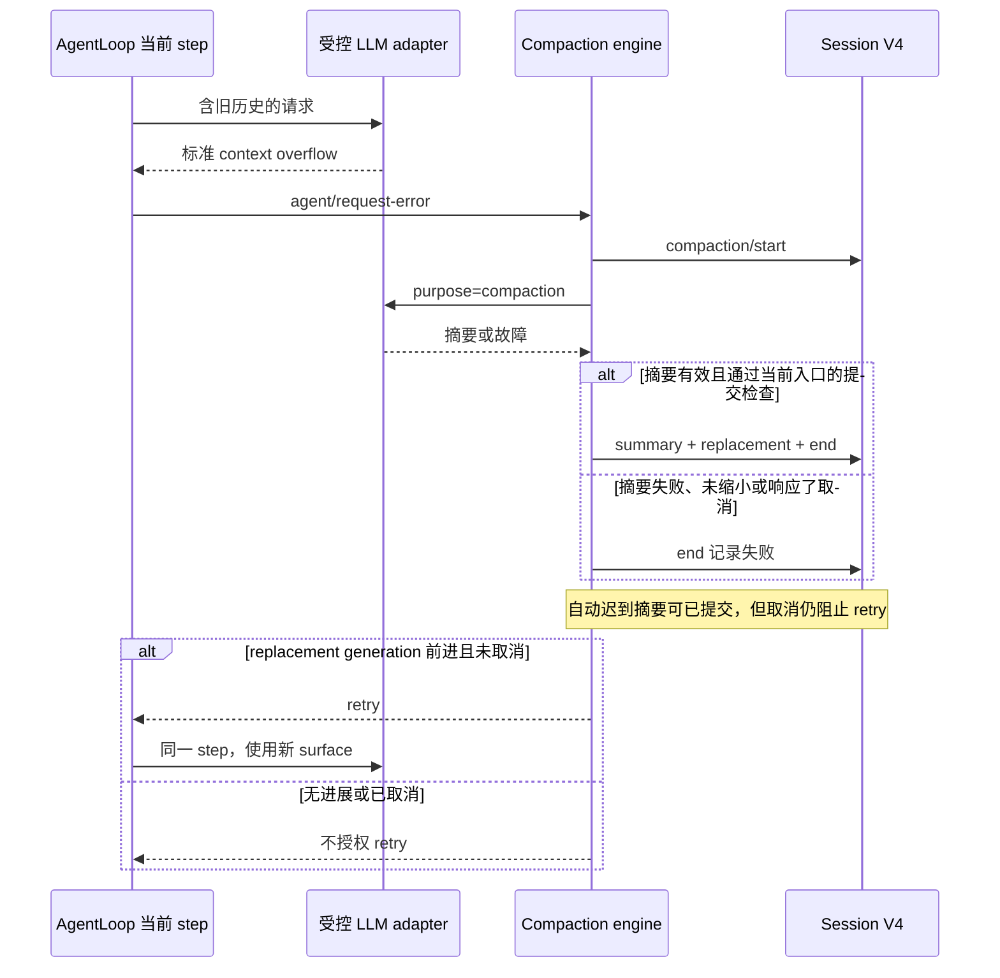

# Compaction：溢出恢复、重试上限与取消

本课在[基础压缩实验](README.md)上补故障路径，固定 npm DSH `0.1.7-rc.2` / Cordis `4.0.4`，源码 `477b4f420553e8a52c2fbccc464d7561b239c443`。模型适配器故意返回指定结果，AgentLoop、token meter、compaction engine、Session 与 persistence 均使用真实发行包。

这不是让真实供应商返回 context overflow 的实验。故障注入无需 Key，能稳定区分错误分类、重试条件和取消时序；基础课已有的真实 pressure 摘要证据单独保留，不与本课混算。

## 运行

从仓库根目录执行：

```sh
cd labs/compaction-lifecycle
pnpm install --frozen-lockfile
pnpm test
pnpm typecheck
pnpm lint
pnpm format:check
pnpm faults
```

本课新增10种故障场景；`pnpm test` 当前共29项，包含基础课与后续[裁剪/offload课](REDUCTION.md)。`pnpm faults` 先编译课程 plugin，再依次启动10个独立 `sdk-minimal` profile；每个使用自己的 home/workspace/Session，通过公开入口加载 meter、compaction 和 fixture plugin。子进程环境不传入 API Key，每个场景关闭后通过新的公开 JSONL backend 重读 V4。

本次环境：macOS arm64、Node `26.7.0`、pnpm `12.3.4`。主进程只打印验证元数据，不输出完整 Session 历史。成功且所有 SDK owner 已关闭才删除实验目录；失败保留目录并打印位置，不自动重跑。

## 十个场景

表中“对话请求”仅计**注入故障的阶段**，不计准备旧历史的请求，亦不计手动取消后的 admission 验证请求。摘要调用单独计数，所有响应都来自受控 adapter。

| 场景                    | 故障阶段对话请求 | 摘要调用 | surface replacement 增量 | 最终观察                                                                         |
| ----------------------- | ---------------: | -------: | -----------------------: | -------------------------------------------------------------------------------- |
| `recover-thrown`        |                2 |        1 |                        1 | 抛出标准 overflow 后恢复，turn completed                                         |
| `recover-in-band`       |                2 |        1 |                        1 | stream finish 中携带标准 overflow，结果相同                                      |
| `budget-exhausted`      |                2 |        1 |                        1 | 允许重试一次，第二次仍 overflow 后 turn error，不进行第三次对话请求              |
| `disabled`              |                1 |        0 |                        0 | `maxOverflowRetries: 0`，不执行 overflow recovery                                |
| `no-progress`           |                1 |        1 |                        0 | 摘要不缩小选区，被拒绝；保留 overflow 错误，不重试                               |
| `summary-error`         |                1 |        1 |                        0 | 摘要异常，无 replacement；保留原 overflow 错误，不重试                           |
| `non-overflow`          |                1 |        0 |                        0 | 错误文本类似 overflow，但 code 不匹配，不启动恢复                                |
| `manual-cancel`         |                0 |        1 |                        0 | 调用方取消；迟到摘要未提交，maintenance 拒绝，之后第二轮模型请求成功             |
| `overflow-cancel`       |                1 |        1 |                        0 | 摘要响应取消信号，turn 为 user-caused aborted，没有对话重试                      |
| `overflow-late-summary` |                1 |        1 |                        1 | adapter 忽略取消并返回迟到摘要；checkpoint 已提交，但 turn aborted，没有对话重试 |

模型容量设为1,000,000，普通输出上限64，pressure 比率1，headroom0；旧历史远低于该阈值，故障恢复由标准错误码驱动。`maxOverflowRetries` 为1（`disabled` 为0），`compactionRetries` 为0。零次 overflow recovery 不等于禁用所有压缩；前者控制确认溢出后的对话重试，后者控制压力路径的额外压缩尝试。它们也不是 transient provider retry 的预算，本课没有注入 transient errors。

## 恢复必须产生持久进展

[`fault-scenarios.ts`](src/fault-scenarios.ts)让实际 `agent/request-error` 路径接收标准 `CONTEXT_WINDOW_EXCEEDED`，检查同一步里的恢复与重试：



恢复成功的两个场景要求：首次请求确实带有旧历史，重试请求含 checkpoint、不含旧噪声且仍含当前任务；compaction bracket 位于同一个 step/start 与 step/end 之间。没有新建 turn 或重新领取一份任务。预算耗尽案例则检查第二次 overflow 后没有第三次请求。

不缩小和摘要失败都只能留下 start/end，无 summary/replacement；标准 overflow 的 code 与 message 保留，不被摘要错误替换。错误文本看起来像 overflow 并不够，必须由 adapter 以标准 code 确认。

## 取消不等于“日志没有变化”

这里故意用同步点控制“摘要已经开始、结果尚未返回”，然后取消，避免靠 sleep 猜测时序。

**手动压缩**通过 `compactNow()` 保留 idle admission。即使 adapter 在取消后才返回一个有效摘要，manual transaction 也在提交前再次检查 signal，拒绝提交；调用方得到原取消原因，原 surface 保留。实验随后发送一个新 message，要求它被持久记录、到达 adapter，并在第二个 turn completed，以验证 admission 已释放。

**自动 overflow recovery**有两种实测结果。合作的 adapter 在 signal 已 aborted 时抛出，压缩失败且无 checkpoint。非合作 adapter 忽略 signal 并返回有效的迟到结果时，该固定版自动 transaction 会提交 checkpoint。随后 request-error listener 看到取消状态，不授权对话重试；根 turn 仍为 aborted。

这个差异可在固定源码 [region transaction](https://github.com/deepseek-ai/deepseek-harness/blob/477b4f420553e8a52c2fbccc464d7561b239c443/packages/compaction/compaction-basic/src/region.ts) 和 [automatic listener](https://github.com/deepseek-ai/deepseek-harness/blob/477b4f420553e8a52c2fbccc464d7561b239c443/packages/compaction/compaction-basic/src/index.ts)核对：摘要返回后的 signal 检查在 transaction 中只针对 manual owner，listener 则对所有已取消的恢复拒绝 retry。因此不能从一个 aborted turn 推断 surface 没有变化，也不能根据 checkpoint 存在推断业务任务已完成。

`manual-cancel` 的表格终态 completed 是**后续验证 turn**，不是把被取消的 maintenance 算作成功。旧事件始终保留，本课验证的是当前 surface 的选择，不是原文删除。

## 重读必须比较内容

每个场景先检查完整 bracket、错误分类、generation、请求内容和原始事件前缀；之后 dispose handle、关闭 SDK owner，再重开公开 persistence。

[`replay-evidence.ts`](src/replay-evidence.ts)对完整事件 JSON 的对象键做稳定排序，数组顺序保持原样，计算 SHA-256。重开后要求事件数量、全部内容指纹、marker 类型和 surface 节点都一致。只比较节点编号会漏掉“checkpoint 内容被改、seq 不变”的错误；测试明确构造了这个负对照。

本次10个 profile 均通过；最终进程采样记录的12个后代 PID 全部退出。200ms 采样不构成任意后代进程的完整审计。完整数据见[JSON](evidence/2026-09-30-recovery.json)和[验收记录](../../docs/reviews/2026-09-30-compaction-recovery.md)。

## 未确认

没有请求真实供应商产生溢出，也未验证真实 provider 在所有取消时序下是否及时停止。本课这10个 overflow/cancel 场景没有挂载 tool-result pruner 或 image offload，因此不能把“无 replacement”推断到已提交 prune/offload 的组合；[下一课](REDUCTION.md)已单独验证这类已提交缩减在摘要失败/取消后保留。未覆盖繁忙 surface 竞争、持久化失败、进程强杀、transient retry 混合、重试预算跨成功请求的重置、摘要质量或缓存/费用性能。

fixture 的等待点最多等待5秒，profile 初始化与报告各限60秒，关闭仍等待 SDK owner；这不是端到端硬性 deadline。未来迁移版本时，应重新运行这些案例，尤其核对自动迟到摘要的行为，不将此版观察写成永久保证。
