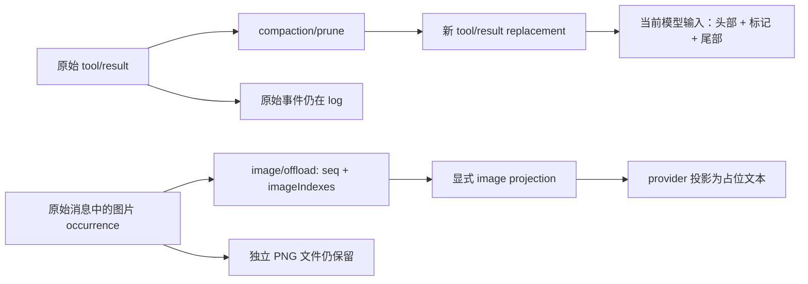

# 工具结果裁剪与图片 offload

本课接续[溢出与取消](RECOVERY.md)，固定 DSH npm `0.1.7-rc.2`、Cordis `4.0.4`、源码 `477b4f420553e8a52c2fbccc464d7561b239c443`。实验使用真实发行包的 AgentLoop、工具管线、pruner、offload executor 和 JSONL persistence；模型响应、超预算错误及工具内容由 fixture 控制，不调用外部模型。

## 运行与输入

```sh
# 从仓库根目录开始
cd labs/compaction-lifecycle
pnpm install --frozen-lockfile
pnpm test
pnpm typecheck
pnpm lint
pnpm format:check
pnpm reductions
```

Lab 共29项测试：前两课17项，本课10个正向/故障场景和2个 live pruner 变异负对照。`pnpm reductions` 先编译，再通过公开 `sdk-minimal` profile 启动10个独立进程；与 `pnpm faults` 共用启动、关闭和原始事件重读流程。最终也重新跑了旧10个 profile，避免共用启动器改变旧实验。

工具 fixture 使用公开 `defineContentToolFixture()`，通过实际工具管线返回含 emoji 的大段文本，组合案例还返回图片引用。图片是本课创建的70字节、1×1 RGBA PNG，已独立检查 chunk CRC 和 zlib 解压；同一个文件/hash 以不同名字出现在多个消息位置。它不经过生产 AttachmentStore 的归一化、上传或 provider Files API，不能用来证明这些服务可用。

主进程不向子进程传 API Key。每个 profile 有独立 home/workspace；只有 owner 关闭、持久重读和图片字节校验完成后才删除自有目录。失败保留路径，不自动重跑。

## 先区分两种日志变化



**工具裁剪**追加 `compaction/prune` 和紧邻的 replacement `tool/result`，保留 callId、step、错误标记和 metadata；新结果引用原 seq。raw log 仍有完整原始文本，当前 surface 才使用缩短后的结果。

**图片 offload**追加 `image/offload`，选择“消息事件 seq + depth-first image index”。当前消息节点编号不变，派生图片块带 `offloaded` 标记，provider 再用公开 `projectOffloadedImages()` / `offloadedImageText()` 将其转为文本。本 fixture 的占位符带 attachment identity 和映射的只读路径；文件存在与字节不变另行检查。这个步骤没有把文件移动到其他存储，也不授予新的读取权限。

## 十个运行案例

下表计整个案例的受控对话调用；摘要调用单列。manual summary 案例的对话调用只用于准备历史。

| 场景                      | 对话 / 摘要调用 | prune / offload 事件 | 观察                                                                                     |
| ------------------------- | --------------- | -------------------- | ---------------------------------------------------------------------------------------- |
| `prune-below-pressure`    | 2 / 0           | 0 / 0                | 工具文本虽超过字符阈值，整体低于 pressure，原文继续进入请求                              |
| `prune-relieves-pressure` | 2 / 0           | 1 / 0                | 裁剪已解除压力，无额外摘要调用                                                           |
| `prune-summary-fails`     | 2 / 1           | 1 / 0                | 其他长输入仍造成压力；摘要失败，裁剪保留，主 turn 继续完成                               |
| `prune-summary-cancel`    | 1 / 1           | 1 / 0                | 裁剪后摘要等待中取消；主 turn aborted/user，已提交裁剪保留                               |
| `image-agent-recover`     | 3 / 0           | 0 / 1                | 一次 image-budget 错误后恢复；下一轮换更大 route 并加入同附件的新 occurrence             |
| `image-exhausted`         | 3 / 0           | 0 / 2                | 两张 retained occurrence 逐次被选中；第三次错误已无可选图片，结束为 error                |
| `image-no-count`          | 1 / 0           | 0 / 0                | 错误缺少 `offloadImages`，不作选择、不重试                                               |
| `image-summary-fails`     | 1 / 2           | 0 / 1                | 第一次摘要要求 offload，第二次摘要失败；选择保留，无 summary checkpoint                  |
| `image-summary-cancel`    | 1 / 1           | 0 / 1                | offload 落盘后取消 manual summary；选择保留，不再发第二次摘要请求                        |
| `prune-preserves-offload` | 4 / 0           | 1 / 1                | 工具结果先 offload 图片，下一轮 pre-step 再裁剪文本；图片 metadata、标记和块顺序完整保留 |

每个 prune 案例只执行一次 fixture tool；replacement 不是第二次工具执行。两种 image-summary 失败/取消发生在 maintenance 中；日志里的 completed turn 属于准备历史，不能当成 maintenance 成功。

## 字符预算与真实压力

pruner 配置为 `thresholdChars: 256`、`headChars: 24`、`tailChars: 24`。预算按 Unicode code point 计算，marker 也占预算；本课用精确预期字符串核对 emoji、头部和尾部。它不是 provider token 计费，也不保证 grapheme cluster 不被分开。

前三种主动裁剪/取消场景把 pressure 比率设为0.002，其他场景为1；fixture route 的窗口为1,000,000。裁剪后由 token meter 重新衡量。没有足够减压时才进入摘要；摘要失败或取消并不会回滚此前已写入的 `compaction/prune` 与 replacement。

不要把 `pruneSession()` 当成任意 idle Session 的写入入口。本次初始组合 probe 在 idle 状态直接写 replacement，内存检查通过，但公开 backend 重开时拒绝 `tool/result is outside an open turn`。最终例子将这一操作放入下一轮已开启 turn 的 `agent/pre-step`，再进行持久验证。应用通常应让 compaction backend 在自己的运行流程中调用 pruner。

## 图片按 occurrence 选择

`image-agent-recover` 让两张图片共享同一个 attachment hash。首次失败选择旧消息的 index0；第二次请求只有这一项成为占位符，index1仍为图片。下一轮模型 route 从 `fixture` 改为 `larger`，窗口从1M改为2M；已选 occurrence 仍被省略，同文件的新 occurrence 却仍是图片。

因此不能只按 attachment ID 推断选择状态。source log 中的原图片块没有被改写；选择事件与 projection 决定每次模型输入。本次 retry 后正常请求会重新构建消息，且没有 `llm/retry` 事件；这不同于消耗 transient provider retry 预算。图片重试由 offload listener 根据新增选择决定；上一课的 replaceGeneration 条件属于 context-overflow 恢复。

摘要内的选择发生在同一个 compaction bracket。`image-summary-fails` 的第二次摘要请求已经带着第一次提交的 offload；失败后这项选择仍在。取消案例在 `image/offload` 事件已经提交时发出取消，验证没有第二次摘要调用、没有 summary checkpoint，已选图片仍为 offloaded。

## 验收分成两层

[`reduction-scenarios.ts`](src/reduction-scenarios.ts)先检查**live 行为是否符合预期**：精确调用次数、没有工具重执行、原始记录不变、裁剪范围/引用/marker 相邻、固定头尾、完整图片字段和块顺序、已选/未选 occurrence、fixture adapter 内用公开 projection helpers 生成的占位符视图、PNG 字节未变。

随后关闭 profile，使用公开 persistence 读取原始事件，并以显式 `[imageOffloadProjection]` 调用 `foldSurface` / `deriveEventMessage`，核对完整事件指纹及派生消息指纹。没有 projection 的重放应拒绝，不能把“raw JSON 可读”当成模型上下文已正确重建。

负对照包括：重复图片索引应拒绝；把合法选择从 index0 换成 index1，节点编号虽不变，消息与日志指纹必须变化；恶意 fixture pruner 改图片名字或移动图片块，即使文字与 offloaded 标记还正确，也必须失败。仅比较磁盘与 live 指纹，只能证明两者一致，不能证明 live 结果本身正确。

本次29项测试、旧10个和新增10个 profile 均通过。新组关闭后复核的 PNG SHA-256 为 `e6f217a3ddbdbfa0a558cc8e09f9f54004e8a9990409168efb2348c9abb97869`。详见[验收记录](../../docs/reviews/2026-09-30-compaction-reduction.md)和[结果 JSON](evidence/2026-09-30-reduction.json)。

## 未覆盖

本课不是实际视觉供应商的预算错误或图片理解评测；附件 store、归一化、上传、Files API、路径授权与真实多平台执行尚未验证。没有覆盖所有嵌套 rich content、并发改写、持久化部分失败、强杀恢复、真实 provider overflow 与 prune 混合、成本/缓存性能。更大模型不会自动恢复旧 occurrence 的结论由本固定版本源码和受控 route 切换支持，不扩大为未来版本保证。

这里的“重开”是只读日志及 projection 重放，不是第二个 Agent 冷恢复并继续视觉对话。保留/删除 fixture 目录由实验程序负责，与 image offload 的选择事件是两件事。
