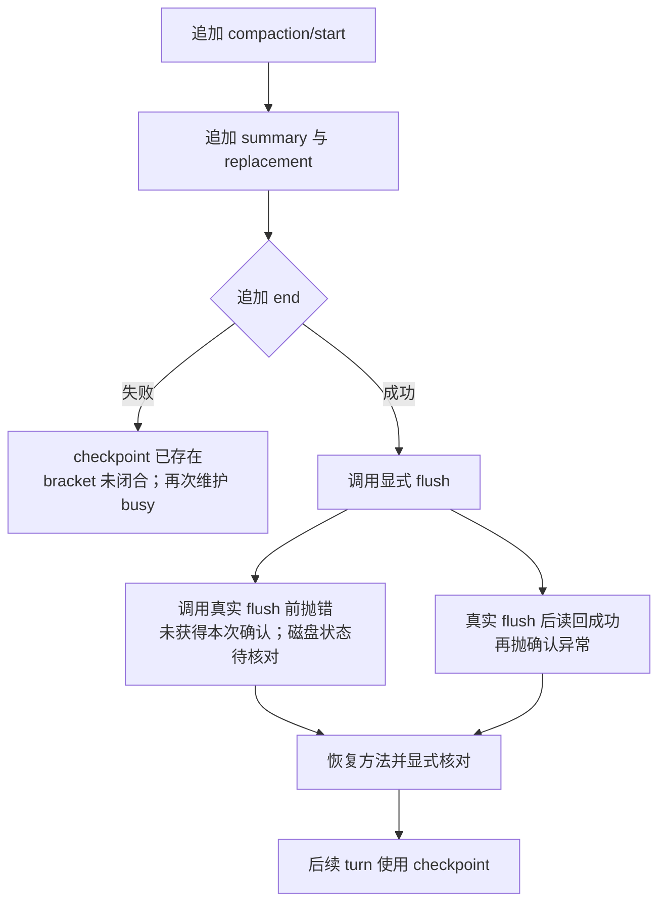

# Compaction：并发维护、部分提交与持久化确认失败

`compactNow()` 抛错了，要不要马上再压缩一次？先别急。异常可能发生在 checkpoint 已写出之后，只是调用方没有收到持久化确认。再次调用之前，需要先看日志里已经发生了什么。

本课分别卡住摘要、结束标记和 flush，观察调用结果与实际记录怎样分开。固定 npm `0.1.7-rc.2` / upstream `477b4f420553e8a52c2fbccc464d7561b239c443`；engine、AgentLoop、Session 与 JSONL 使用真实发行包，摘要来自受控 adapter。故障注入在本次 Session 的公开 append/flush 调用处，不制造磁盘损坏或全机故障。

## 运行

在 `labs/compaction-lifecycle`：

```sh
pnpm install --frozen-lockfile
pnpm test
pnpm typecheck
pnpm lint
pnpm format:check
pnpm transactions
```

`transactions` 编译 fixture plugin，再分别启动 4 个公开 `sdk-minimal` profile。每个有独立 home/workspace，不传 API Key，外部模型请求为 0。报告里值得一起看的字段是错误分类、checkpoint 是否存在，以及下一轮是否使用它。

父进程取得报告后会关闭 owner，再用新 Context 重开 V4，比较全部事件指纹与 surface。这样即使事件数量恰好相等，内容被改写也无法通过。

## 四个场景

| 场景                   | 注入/竞争                                                     | 调用结果                   | 日志与后续行为                                                        |
| ---------------------- | ------------------------------------------------------------- | -------------------------- | --------------------------------------------------------------------- |
| concurrent-maintenance | 第一份摘要等待；第二次compactNow与followup竞争                | 第二次维护busy；第一份成功 | 后续输入等待摘要及flush gate释放后才进入下一轮，摘要只执行1次         |
| flush-before           | manual bracket已写入后，在调用真实flush前抛异常               | persistence错误            | 内存checkpoint已存在；恢复正常flush并明确核对后，下一轮使用checkpoint |
| flush-after            | 实际flush并通过reader读回完整事件后，抛确认异常               | persistence错误            | 抛错前checkpoint已可读；失败不代表撤销已提交内容                      |
| closing-marker         | summary和replacement写入后，第一次compaction/end append抛异常 | commit错误                 | checkpoint存在但start未闭合；同owner再次压缩被busy拒绝                |

先读并发案例：第一份维护占用新 turn 的 admission，也就是控制“排队的输入何时可以开始下一轮”。实验先保持 summary gate，再单独保持 flush gate。跟进消息已经进入 Inbox，但 checkpoint 确认仍挂起时，没有新的 `turn/start` 或对话模型调用。释放后，新请求才带着 checkpoint 与跟进输入开始，旧长历史不再进入请求。因此外部 Agent status 为 idle，也不能据此认定没有维护正在占用它。

接下来比较两种 flush 错误。`flush-before` 在调用真实 flush 之前抛错，但后台写入可能已经发生，所以不能断言磁盘没有新数据。实验恢复原方法，显式 flush 后再完整重读；这里的 reconcile 就是核对并确认本次实际存储状态。

`flush-after` 更直接：真实 flush 完成，独立 reader 已读到完整 checkpoint，然后包装函数才抛出确认异常。两次调用都失败了，能够证明的持久状态却不同。



图中两条 flush 分支是分别运行的故障场景。它们与结束标记失败一样，都不会撤销前面已经追加的记录。

结束标记故障不是整段rollback：原事件前缀、summary与replacement均保留。实验不会偷偷补一个end然后宣称原操作成功；原owner的重复压缩被拒绝，关闭后读取的日志仍保留未闭合标记。它没有测试通过重启自动修复后再次压缩。

## 源码与验收

[compactSurfaceRegion](https://github.com/deepseek-ai/deepseek-harness/blob/477b4f420553e8a52c2fbccc464d7561b239c443/packages/compaction/compaction-basic/src/region.ts)依次记录start、summary、replacement、end，之后才做manual durability checkpoint。失败的closing append留下可识别的未闭合start；flush失败另报 `ManualCompactionError('persistence')`。这些append不能视作数据库的原子transaction。

[compactNow](https://github.com/deepseek-ai/deepseek-harness/blob/477b4f420553e8a52c2fbccc464d7561b239c443/packages/compaction/compaction-basic/src/index.ts)通过Agent的runMaintenance持有新轮次admission；[driver](https://github.com/deepseek-ai/deepseek-harness/blob/477b4f420553e8a52c2fbccc464d7561b239c443/packages/core/agent-loop/src/agent.ts)允许跟进输入排队，但不会把它当成另一个同时运行的维护owner。

[`transaction-scenarios.ts`](src/transaction-scenarios.ts)检查精确异常类/code/cause、只执行一次摘要、surface replaceGeneration增加1、checkpoint内容、不可变原始前缀及下一次模型输入。36项Lab测试中新增4个真实库场景；4个独立profile又分别验证关闭后的完整持久重读。2026-10-02事件数为25/25/25/15，4个记录的runtime PID在结束后均不存在。详情见[元数据](evidence/2026-10-02-transactions.json)与[验收](../../docs/reviews/2026-10-02-compaction-transactions.md)。

## 对调用方的要求

读完报告，可以尝试回答开头的问题：同样是 Promise rejected，哪个场景还能继续下一轮，哪个场景会再次得到 busy？答案取决于已经提交的记录和 bracket 是否闭合，不取决于异常是否被捕获。

调用方应先检查实际记录与持久状态，再决定后续操作，不能仅凭 Promise rejected 重发摘要或工具任务。已有 checkpoint 可能有效，未闭合 bracket 也可能需要受控恢复。本实验的显式 reconcile 只处理本次 fixture 注入，不是供任意损坏日志使用的修复器。

本课没有验证真实ENOSPC/EIO、物理掉电、恶意并发写者、任意selected-span修改或跨主机存储。真实服务端overflow另见[上一课](PROVIDER-OVERFLOW.md)，其错误来源与这里的公开调用处注入不同。
