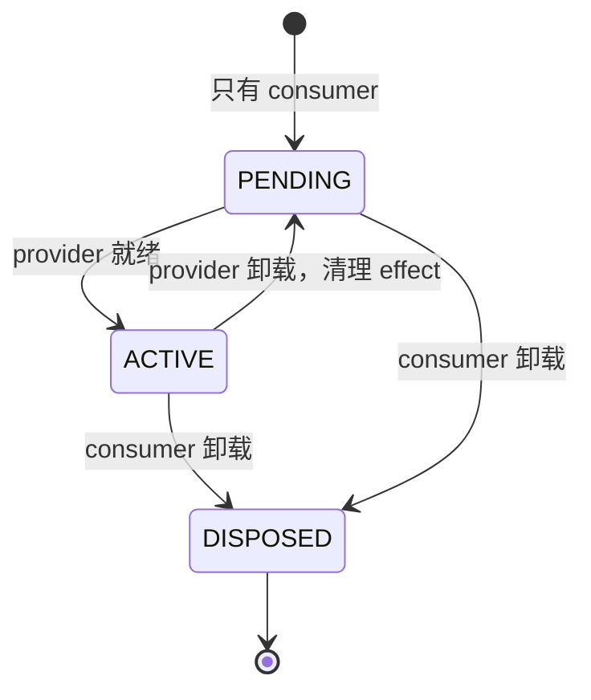
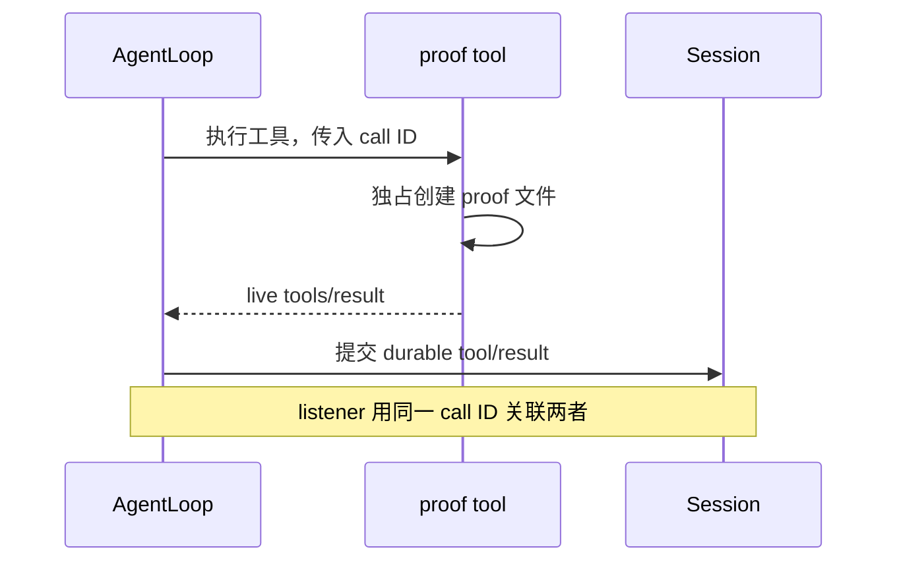

# Cordis Plugin Lifecycle：依赖消失后，插件如何停下并恢复

假设我们写了一个记录 proof 的插件，它依赖 `ctx.proofJournal`。如果提供这个 service 的插件还没启动，consumer 应该等待；如果 provider 被卸载，它已经注册的 listener 又该由谁清理？本课从这个小问题开始，再把同一套生命周期规则用到真实 Agent 的工具上。

实验里的 **proof journal** 只是一个记录字符串、发出事件的教学 service。先看 consumer 如何等待、启动和清理，再看 waterfall 如何委托决策，最后验证一次工具执行怎样留下外部文件与 Session 记录。Loader/HMR、preset 和可打包 subpath 都放在这条主线之后。

## 1. 先运行依赖消失的实验

版本固定为 DSH npm `0.1.7-rc.2`，上游 tag `dsh-v0.1.7-rc.2`、commit `477b4f420553e8a52c2fbccc464d7561b239c443`。Cordis 为 `4.0.4`；同一 tag 的 Include `1.0.9`、Loader `1.0.5`、HMR `1.0.19`、Timer `1.1.6`、Schemastery `3.18.4`。支持 Node `^22.19.0 || >=24.0.0`，pnpm `12.3.4`；历史验证环境为 Node `26.7.0`、macOS arm64。

从仓库根目录开始：

```sh
cd labs/cordis-plugin-lifecycle
pnpm install --frozen-lockfile
pnpm test -t 'tracks PENDING'
```

后面的命令都在这个 lab 目录执行。这一步不调用模型；[`tests/lifecycle.test.ts`](tests/lifecycle.test.ts) 先挂 consumer，再挂 provider，写入 `first`，卸载 provider，再挂一个新 provider 写入 `second`。测试断言的观察列表如下，测试通过时不会额外逐行打印它：

```text
active:1
recorded:first
cleanup:1
active:2
recorded:second
```

先挂 consumer 时没有 `active`，因为它声明的 service 尚未就绪。第一次 provider 出现，consumer 才运行 `apply()`；provider 消失后，`cleanup:1` 说明这次激活结束。新 provider 出现会再次激活 consumer，而第二条记录仍只收到一次。



打开 [`src/proof-journal.ts`](src/proof-journal.ts) 中的 `createProofConsumer()`，这几行就是依赖与资源归属的核心：

```ts
export function createProofConsumer(observations: string[]) {
  let activations = 0;
  return {
    name: "proof-journal-consumer",
    inject: ["proofJournal"],
    apply(ctx: Context) {
      activations += 1;
      const generation = activations;
      observations.push(`active:${generation}`);
      ctx.on("proof/recorded", (value) => observations.push(`recorded:${value}`));
      ctx.effect(() => () => observations.push(`cleanup:${generation}`));
    },
  };
}
```

这是源文件中的 consumer 函数；`Context` 导入、service 和事件类型声明都在同一文件中。`ProofJournalService` 把能力提供为 `ctx.proofJournal`，consumer 通过 `inject` 等它就绪。`ctx.on()` 注册的 listener 随这次激活撤销；`ctx.effect()` 中的 disposer 记录清理发生。手工保留旧 listener 会让重载后的同一条事件被处理多次，因此注册和清理必须属于同一次插件激活。

## 2. 文件、timer 和 watcher 也需要清理

继续运行：

```sh
pnpm test -t 'awaits one resource disposer'
```

这个测试安装 `createProofResource()`，然后连续 dispose 两次。它检查 `resource.log` 精确包含 `opened`、`closed` 两行，独立产物 `proof.txt` 仍是 `preserve me` 加一个换行。这里特意保留产物：关掉 watcher、timer 和文件描述符，并不意味着删除插件已经交付的文件。

资源插件在一个 effect 中拥有 timer、watcher 与文件描述符；dispose 会等待异步清理。获取资源中途失败则需要回滚已经取得的资源，这与安装成功后正常卸载的行为不同。`lifecycle.test.ts` 还分别在 write、open、append、watch、timer 处注入失败，检查回滚。第一次读源码时先跟正常路径，再用失败测试找每项资源的释放位置。

## 3. waterfall 中，观察者为什么要调用 next

```sh
pnpm test -t 'observer delegates waterfall'
```

[`createProofPolicy()`](src/proof-journal.ts) 装了两个 listener：第一个观察输入，第二个决定是否 veto。输入 `allow` 时，预期 trace 是 `observe:allow → default:allow`，结果为 `default-allow`；输入 `deny` 时，trace 是 `observe:deny → veto:deny`，结果为 `vetoed`，默认处理器不会执行。

观察者调用 `next()`，才能把决定交给后面的 listener，并在下游返回后继续处理结果。拥有拒绝权的策略可以直接返回 `vetoed`，短路后续流程。waterfall 因而不是普通广播：少写一次 `next()` 就会改变谁有机会处理这次请求。

练习：先预测如果观察者不再调用 `next()`，上面哪个结果会变化；再对照测试中的 trace 验证。完成后恢复改动，避免把实验性的短路带进后面的工具测试。

## 4. 一次工具执行，为什么要看两种结果

现在让 Agent 使用一个真正写文件的工具：

```sh
pnpm test -t 'writes exact proof and correlates'
```

[`tests/agent-loop.test.ts`](tests/agent-loop.test.ts) 用固定脚本模型驱动真实 `ctx.agents.create()` / AgentLoop。它先检查模型能看到工具 schema，再检查文件字节和两个结果事件的 call ID。模型是可控的，工具执行与 Session 提交走真实项目代码。



直接调用 `ctx.tools.execute()` 只能得到 live result；durable row 由 AgentLoop 提交。看到工具返回，不等于已经看到了 Session 记录。当前 V4 durable 结果的关联 ID 在 `event.data.message.toolCallId`；结果内容是模型可见的文本块，不能从旧版的 `message.content[0].toolCallId` 读取。

## 5. 把工具和 listener 交给其他项目

两个插件通过同一个 package 的 `./tool` 与 `./listener` subpath 提供给[AG-UI 项目](../../projects/ag-ui-dsh-runtime/README.md)。consumer 使用 tracked `file:`/workspace 依赖，不复制源码，也不依赖个人机器的绝对路径。

`@hands-on-dsh/cordis-plugin-lifecycle/tool` 注册 `write_stage4_proof`。模型只提供 `content`，没有文件路径或命令参数；写到哪里由配置的 `workspaceRoot` 决定。默认 `partitionMode: single` 写 `stage4-proof.txt`，`call` 模式则用 Session ID 与 provider call ID 的哈希作为隔离目录名。两种模式都独占创建文件、使用 `0600`、遵循取消信号，只返回安全相对路径和字节数。

listener 负责回答“这次 live result 有没有对应的提交”。它按 `rootSessionId`（或 `sessionMode: all`）与 `toolName` 选择事件，用 call ID 关联后写入 `auditPath` 的 `live`、`durable` 两行。foreign、重复、mismatch 和 orphan 情况会被隔离或写到可选 `healthPath`；因此两行 audit 比单独看到一次工具返回多提供了一层证据。

`auditOwnerToken` 确定 audit 的拥有者。owner sidecar 与 audit 文件使用 `0600`，重挂载要求相同 token。两条 subpath 都导出 named `name`、`inject`、`Config`、`apply`，没有 default export；导出名、配置和 proof/audit/health 文件语义供 consumer 复用。

```sh
pnpm build
pnpm pack:smoke
```

build 输出编译产物；pack smoke 再把 tarball 安装到一个新 consumer，通过 plain Node 的 Loader 加载两条 subpath，并读取 proof 字节。它检验的是打包后是否仍可使用，不依赖 tsx 或本目录源码。

## 6. 再看 reload 与 Agent 作用域

理解前面的 cleanup 后，Loader/HMR 就有了一个具体检查点：同一个稳定 ID 的插件重载时，旧实例应先清理，新实例再激活一次。`tests/hmr.test.ts` 覆盖文件和配置 reload，`tests/loader-pending.test.ts` 检查缺失依赖时的 PENDING 诊断。

```sh
pnpm test -t 'public preset declares'
```

这个 probe 通过发布的 AgentPreset/Registry API 声明 `proof-only` preset，child list 包含本 package 的 `./tool`。测试读取 composition inventory，确认声明可解析，同时确认工具没有泄漏到 Host 的全局 `ctx.tools`。preset 决定 Agent 作用域中有哪些插件；它不改变 runtime 的 host 文件权限，也不是安全 sandbox。

## 7. 最后运行一次真实模型

根目录被忽略的 `.env` 可提供 `DEEPSEEK_API_KEY`。仍在本 lab 目录，先 build，再使用发布版同版本 resolver 拉起 `sdk-minimal`：

```sh
pnpm build
node --env-file=../../.env --import tsx examples/live-proof.ts --handshake-only
node --env-file=../../.env --import tsx examples/live-proof.ts
```

如果凭据已经在环境中，去掉两条 node 命令的 `--env-file=../../.env`。握手模式只验证启动；第二条才提交要求精确内容与一次工具调用的 prompt。模型运行使用发布版 `dsh --profile sdk-minimal` 与有序 patch，不启动私有 demo bin。

[`examples/live-proof.ts`](examples/live-proof.ts) 为本次运行创建独立 workspace、DSH_HOME 和 patch，禁用 profile 默认 persistent shell，只插入编译后的 proof tool/listener。子进程只收到必要路径和 DeepSeek 凭据，不打印 key。

检查结果时沿着同一条调用走：根 turn 是否 completed，是否只有一个 root `tool/call` 和对应 `tool/result`，工具输出是否符合预期，磁盘上的 proof 是否具有精确字节与 `0600`，最后 live/durable audit 是否使用相同 call ID 且 health 为空。模型说“写好了”只是回复，外部文件才证明写入发生。

2026-09-29 的真实发布包运行观察到一次 `write_stage4_proof` 调用和一次 V4 durable 结果；audit 精确为 `live`、`durable` 且 call ID 相同。proof 为 27 字节、`0600`，SHA-256 为 `3f119a4f8daeac10a4f80ecec504394590dc60ddeeda42008d888c1f68490a32`。独立 `ps` 采样捕获一个后代 PID，CLI 退出后该 PID 不再存在，stderr 为空。这是当次运行证据，不是任意故障下都能回收的保证。

示例在 SDK close 确认后删除临时状态；关闭失败时保留状态供排查。`sdk-minimal` 固定 `danger-full-access`，禁用默认 shell 只收窄模型可见工具，不限制 custom plugin 或 runtime 的 host 权限。proof workspace 是产物位置；隔离未知指令或多租户还需要独立容器、Sandbox 与业务授权。

## 8. 回顾并验证完整实验

```sh
pnpm test
pnpm typecheck
pnpm lint
pnpm format:check
```

现在应能解释三条关系：consumer 跟随 service 的可用性激活；effect 跟随这次激活清理；live 工具结果由 AgentLoop 转成 durable Session 记录。完整 keyless tests 覆盖这些关系，以及 HMR、tool schema、proof 字节、V4 call ID、listener 拒绝路径、preset 声明、teardown 和 packed consumer。

源码事实来自固定 revision 的 [AgentLoop](https://github.com/deepseek-ai/deepseek-harness/blob/477b4f420553e8a52c2fbccc464d7561b239c443/packages/core/agent-loop/README.md)、[工具结果类型](https://github.com/deepseek-ai/deepseek-harness/blob/477b4f420553e8a52c2fbccc464d7561b239c443/packages/core/session/src/types.ts)与[preset registry](https://github.com/deepseek-ai/deepseek-harness/blob/477b4f420553e8a52c2fbccc464d7561b239c443/packages/preset/agent-preset-registry/README.md)。旧版本记录不自动证明新版行为；keyless 测试与真实模型调用分别支持各自范围。接下来可在 AG-UI 项目中追踪同一套 proof/audit 文件如何服务于业务 Run。
