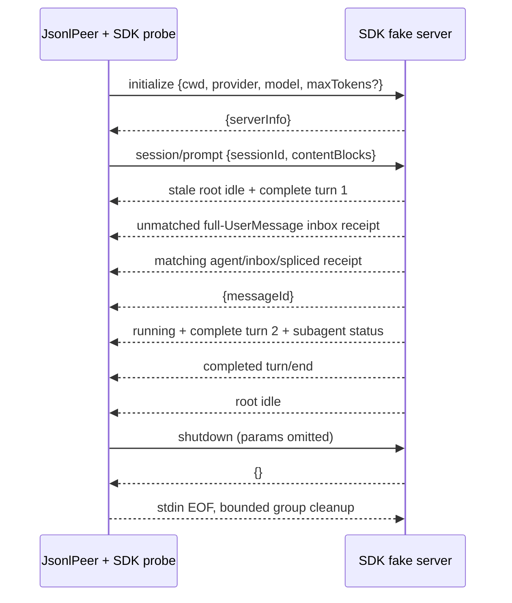

# DSH protocol semantics labs

本项目通过可重复的 JSONL wire 实验学习 DSH SDK JSON-RPC 与 ACP 的协议语义。它包含共享 JSONL peer、两个确定性 fake server、显式 command 模式，以及固定 revision 的 source server 验证。选型结论见 [SDK JSON-RPC 与 ACP 对比](../../docs/comparisons/sdk-jsonrpc-vs-acp.md)。

## 学习问题

- JSONL 如何处理分片、多帧、畸形帧、超大帧和 stderr 尾部？
- 双向 JSON-RPC 如何让两个方向同时使用 ID `0`，又不混淆 pending response？
- `session/prompt` 返回的 `messageId` 为什么只是 durable inbox receipt，而不是回答？
- 为什么必须忽略匹配 receipt 之前的所有 root status/event，并在 receipt 之后等下一次 root `session.status=idle`，而不是把 `turn/end` 当作 prompt result？
- raw `assistant/chunk` 与 committed `assistant/message` 有什么区别？
- ACP 如何协商单一 protocol v1、报告真实 prompt capabilities，并区分 committed update、cancel 与 permission response？

## 版本和边界

[`versions.json`](versions.json) 固定 DSH `0.1.1-rc.2`、tag `dsh-v0.1.1-rc.2`、commit `b150a551b8d465e31e418e1b2eaf5e79bbb7d28e`，以及 ACP SDK `0.25.1` / protocol v1。SDK `serverInfo.version=0.0.1` 与 ACP `agentInfo.version=0.0.1` 都是 wire identity，不是 DSH release version。

本项目要求 Python 3.10+ 和 POSIX host（当前验证目标是 macOS/Linux），使用 stdlib asyncio/subprocess/JSON、pytest、Ruff 和条件依赖 tomli。`JsonlPeer` 的 process-group supervision 依赖 POSIX session/signal 语义，并在非 POSIX 平台 fail loud；本 lab 没有声明 Windows 实现。它没有 runtime dependency，也不通过 `deepseek-harness-sdk` 启动服务。

## 运行 fake lab

```sh
cd labs/protocol-semantics
uv sync --group dev
uv run python -m protocol_labs.sdk_jsonrpc --server fake
uv run python -m protocol_labs.acp --server fake
```

两条命令分别输出不含路径/凭据的 JSON evidence。SDK 输出包含 server identity、匹配 receipt、raw deltas、committed answer 与 receipt-to-idle settlement；ACP 输出包含 agent identity、实际 capabilities、committed updates、cancel 与 permission settlement。两者的 fixture transcript 都与 [`fixtures/committed-answer.jsonl`](fixtures/committed-answer.jsonl) 一致；SDK fake 的完整通知流另与 [`fixtures/sdk-jsonrpc-notifications.jsonl`](fixtures/sdk-jsonrpc-notifications.jsonl) 逐帧一致。

## 运行固定 source checkout

先在 DSH checkout 中核对 `versions.json` 对应的 commit/tag 和 tracked-clean 状态，再构建当前 revision：

```sh
git -C "$DSH_SOURCE_ROOT" status --porcelain --untracked-files=no
git -C "$DSH_SOURCE_ROOT" rev-parse HEAD
git -C "$DSH_SOURCE_ROOT" describe --tags --exact-match
pnpm --dir "$DSH_SOURCE_ROOT" run build
```

在本 lab 目录运行两个真实 prompt。`../../.env` 由 uv 注入父进程；lab 不读取、打印或复制该文件：

```sh
cd labs/protocol-semantics
export DSH_SOURCE_ROOT=/absolute/path/to/deepseek-harness
uv run --env-file ../../.env python -m protocol_labs.sdk_jsonrpc --server source
uv run --env-file ../../.env python -m protocol_labs.acp --server source
```

source mode 要求 `DSH_SOURCE_ROOT` 是绝对目录，且 HEAD、exact tag、root package version、root ACP dependency 和 lock resolution 全部精确匹配。它使用 absolute `node_modules/.bin/tsx`、absolute entry/config 和由 CLI 创建的临时 isolated cwd；resolver 不创建目录。因此 ACP bin 查找不到 source checkout 的 `.env`。child environment 只继承存在的 `PATH`、`TMPDIR`、`LANG`、`LC_ALL` 和证书变量，再加入父进程中的 `DEEPSEEK_API_KEY`、可选 `DEEPSEEK_BASE_URL` 以及固定 DSH 临时值。`HOME` 与 `DSH_HOME` 都指向 disposable directories；proxy、cloud、cookie、auth 和其他 service-specific 变量不传入，`DSH_SNAPSHOT` 明确缺席。

> **SDK source 安全边界：** pinned SDK minimal config 把 sandbox policy 硬编码为 `danger-full-access`；`DSH_PERMISSION_MODE=workspace-write` 不会约束它。live prompt 明确要求不使用工具，workspace/HOME/session 都是 disposable，但 SDK source process 仍能访问 host 权限允许的路径。ACP composition 才使用 `DSH_PERMISSION_MODE=workspace-write`。

SDK live gate 要求 committed answer 非空、`messageId` 匹配 `agent/inbox/spliced`、此 receipt 之后下一次 root idle、`shutdown` response 成功、final returncode 0、未使用 SIGTERM/SIGKILL，且 owned group 消失。ACP live gate 要求至少一个非空 committed `agent_message_chunk`、prompt result `end_turn` 和 owned group 消失；它如实记录 EOF 后的 final returncode 与 SIGTERM/SIGKILL escalation，不把强制回收称为 clean exit。所有 post-close diagnostics 都进入 `closeOutcome`。

### 真实 source 验收记录（2026-08-31）

固定 rc.2 checkout 在 tracked-clean、已 build 状态下分别完成一次真实 prompt。SDK probe 收到非空 committed answer、matching inbox receipt 和其后的 root idle；`shutdown` response 成功，final returncode 为 0，未使用 TERM/KILL escalation，owned process group 最终消失。ACP probe 收到非空 committed `agent_message_chunk` 并以 `end_turn` settle；当次 stdin EOF 后 final returncode 为 0，未使用 TERM/KILL，owned process group 最终消失。

这两次 live run 只验证普通 prompt 与 process lifecycle。cancel 和 permission 的精确 wire 语义由 keyless transcript tests 验证；本次真实模型没有为追求覆盖而人为制造审批或中断。

若要研究其他 revision，可在任一 source 命令末尾加 `--allow-version-mismatch`。该模式仍要求 tracked-clean，记录实际 HEAD、可能缺失的 exact tag 和所有 version mismatch，并固定输出 `conforming:false`、非空 `mismatches` 与 `liveAcceptance:false`。它可以运行学习探针，但永远不能充当本页 live acceptance evidence。

## 使用显式 command

command mode 适合对其他兼容 server 做同一探针。变量必须是 JSON string array，不能写 shell command string；可选 cwd 必须是已存在的绝对目录。SDK command 使用 generic `deepseek-official` / `deepseek-v4-flash` initialize 和 no-tool prompt；ACP command 也只运行一个 generic prompt，不执行 fake-only cancel/permission choreography：

```sh
export DSH_SDK_SERVER_ARGV='["/absolute/path/to/server","--stdio"]'
export DSH_SDK_SERVER_CWD=/absolute/existing/directory
uv run python -m protocol_labs.sdk_jsonrpc --server command

export DSH_ACP_SERVER_ARGV='["/absolute/path/to/agent","--acp"]'
export DSH_ACP_SERVER_CWD=/absolute/existing/directory
uv run python -m protocol_labs.acp --server command
```



## 确定性触发器

| Prompt | Fake 行为 | Probe 观察 |
| --- | --- | --- |
| `fixture prompt` | receipt-before-response、running、raw/committed answer、turn/end、idle | 精确三行 transcript，receipt-to-root-idle |
| `lab:timeout` | handler 保留请求，不返回 | 本地 timeout；server handler 未被请求超时取消 |
| `lab:internal-error` | error response `-32603` | typed `JsonRpcError` |
| `lab:malformed` | 先写畸形 JSONL，再继续正常 fixture | diagnostic 加成功 continuation |
| `lab:close` | request pending 时输出受控 stderr 并退出 | pending request 立即收到 partial stdout-EOF context；close 后可读取最终 returncode/stderr |
| `lab:continuation-error` | response 后 continuation task 抛错 | exception 被 tracker 消费并写入 bounded stderr diagnostic |

Fake server 的 stdin reader 不等待 request handler；因此 held prompt 不会阻塞后续 `shutdown`。所有 stdout 写入共享一个 lock。

ACP fake 的 `initialize` 接受包括 `0` 与 JSON number `1.0` 在内的任意 finite integral requested version，并固定返回当前唯一支持的 protocol v1；bool、fractional number 和其他畸形 schema 返回 `-32602`。Fake 没有 image、audio 或 embedded-context prompt 能力，因此三个 capability flag 都是 `false`；probe 要求三个字段都是 boolean 并保留服务端实际值，所以具备 image 能力的其他 agent 可以返回 `image: true`。本 lab 的 no-op authenticate 要求 `authMethods: []`。

ACP `fixture prompt` 只收集 committed `agent_message_chunk` 并以 `end_turn` settle。`lab:cancel` 先提交固定 readiness chunk，再由客户端发送 `session/cancel` notification 并以 `cancelled` settle。`lab:permission` 让 server 与 client 同时使用 direction-local ID `0`；allow/reject/cancel 是字面 ACP outcome，未知 option ID 由 fake 映射为 rejected，request error 映射为 unavailable，二者都 fail closed。

正常 fake fixture 的 root `session.event` 从 seq 0 连续到 17：stale inbox insert、完整 turn 1（含 inbox removal）、matching inbox insert、完整 turn 2（含 matching inbox removal）。`user/message` 与 `assistant/message` 是 surface append；assistant message 的 `sourceEventSeqs` 指向同 turn/step 的 chunk。Post-receipt child session 也有从 seq 0 到 5 的完整 turn/step/chunk/message/end stream，并由 child running/idle 与 `subagent.finished` 包围。另一个 synthetic transport test 验证即使 pre-receipt 出现 child start/event/finish，probe 也不会把它计入活动窗口。

Settlement 仍只拥有 matching receipt → next root idle 区间，不把 `turn/end` 解释为 prompt result。测试用独立 synthetic server 证明缺少 turn/end 时仍可 settle；只有观察到 committed answer 加 completed turn 的 fixture 才生成三行规范化 transcript。

## Launch resolver

- `fake`：使用当前 Python 执行对应的 `protocol_labs.sdk_jsonrpc.fake_server` 或 `protocol_labs.acp.fake_server`。
- `command`：只接受对应 `DSH_SDK_SERVER_ARGV` / `DSH_ACP_SERVER_ARGV` 的非空 JSON string array；`argv[0]` 必须非空，后续参数可以是空字符串；可选 cwd 必须是绝对且存在的目录。不会解析 shell string，只运行 generic prompt。
- `source`：精确验证固定 source checkout，要求调用方提供绝对且已存在的隔离 cwd，使用绝对 `tsx`/entry/config，运行一个真实 committed prompt 并验证 process-group outcome。build 是调用前置条件，不在 Python CLI 中隐式执行；mismatch flag 只生成非 conforming 学习证据。

## Wire 方法、通知与错误

SDK client 只请求 `initialize`、`session/prompt`、`shutdown`；server 只通知 `session.event`、`session.status`、`subagent.started`、`subagent.finished`。`session/prompt` 返回 `{messageId}`，回答来自 committed `assistant/message`。Unknown method 与 handler failure 在当前 DSH server 都表现为 `-32603`；不要推断它有 ACP 的 schema `-32602` 语义。

ACP client 请求 `initialize`、`authenticate`、`session/new`、`session/prompt`，并用 `session/cancel` notification 取消。Agent 用 committed `session/update` notification 输出文本，用 `session/request_permission` request 索取一次性选择。ACP unknown method 是 `-32601`，invalid schema/semantics 是 `-32602`，unexpected handler failure 是 `-32603`。

共享 peer 对 malformed、non-object、oversize 或 unterminated stdout frame 只记录 bounded diagnostic 并丢弃；这是 lab client robustness policy，不代表 upstream policy。请求 timeout 只移除本地 waiter，不会取消 server work。stdout EOF 立即以 partial context 拒绝 pending；bounded close/reap 之后，typed `CloseOutcome` 才同时给出 final returncode、SDK shutdown request 是否成功、EOF 是否以 returncode 0 且无 escalation 退出、最终使用的 SIGTERM/SIGKILL、group 是否消失和 post-close diagnostics。

## 验证

```sh
uv lock --project labs/protocol-semantics --check
uv run --python 3.10 --project labs/protocol-semantics pytest labs/protocol-semantics/tests
uv run --python 3.10 --project labs/protocol-semantics ruff check labs/protocol-semantics
uv run --python 3.10 --project labs/protocol-semantics ruff format --check labs/protocol-semantics
```

固定 source revision 的 keyless conformance 使用以下精确命令：

```sh
pnpm --dir "$DSH_SOURCE_ROOT" exec vitest run \
  packages/sdk/protocol/tests/transport.spec.ts \
  packages/sdk/server/tests/server.spec.ts

pnpm --dir "$DSH_SOURCE_ROOT" exec vitest run \
  packages/acp/acp/tests/bridge.spec.ts \
  packages/acp/acp/tests/turns.spec.ts \
  packages/acp/acp/tests/approval.spec.ts \
  packages/acp/acp/tests/edges.spec.ts

DSH_E2E_MAX_WORKERS=1 pnpm --dir "$DSH_SOURCE_ROOT" exec vitest run \
  --config vitest.e2e.config.ts \
  examples/jsonrpc-agent/tests/keyless-smoke.e2e.ts \
  packages/examples/acp-demo/tests/load-path.e2e.ts \
  packages/examples/acp-demo/tests/built-bin.e2e.ts
```

测试覆盖 fragmentation、多帧、空/畸形/非对象/超大/未终止行、跨 JSON number 序列化的 integral ID、双向 ID `0`、handler nonblocking、timeout、stdout EOF 即时拒绝、partial/final process context、delayed stderr、stderr byte bound、process-group cleanup 和精确 source version validation。协议测试覆盖 SDK rc.2 完整 envelope/seq/turn/step/source 引用、全活动 receipt gate，以及 ACP negotiation、capabilities、committed update、cancel、permission、normalization、error 和 CLI 行为。

stdout EOF 必须立刻拒绝 pending request，不能等待仍存活的 child process。此时 `PeerExitedError.context_final` 是 `false`，其中的 return code 与 stderr 只是当前 snapshot；不得把尚未产生的 delayed stderr 或最终 return code 写成已经可用。`close()` 完成 bounded reap 和 stderr drain 后返回 `CloseOutcome`；`eofExitedCleanly=true` 只表示 returncode 0 且未发送 escalation signal，不等于 SDK shutdown request 成功。

## 限制

当前 SDK surface 只有 `initialize`、`session/prompt`、`shutdown` 和四类通知：`session.event`、`session.status`、`subagent.started`、`subagent.finished`；它没有 negotiation、cancel、session close、prompt result 或 permission。ACP lab 只覆盖 initialize/authenticate、fresh session、prompt、cancel、committed text update 与一次性 permission decision。两者都不提供 list/resume/fork/history 或 authoritative business Task/Run state。

本 lab 不实现 editor/Web client、session browser、resume/fork、history、业务 Task/Run、崩溃恢复或 production protocol abstraction。Python published SDK bundles rc.1 runtime，而本 lab 的 source facts 固定 rc.2；不要把两者混为同一个 artifact。rc.2 ACP demo 也不是 zero-config binary distribution。

真实 prompt 只证明当次 source checkout、环境和模型调用满足上述 gate，不证明模型固定措辞、平台矩阵或生产可用性。清理验证覆盖 lab-owned wrapper/process group 与临时 state；调用方提供的 command mode server 若再启动脱离其进程组的 daemon，不在本 lab 所有权内。
