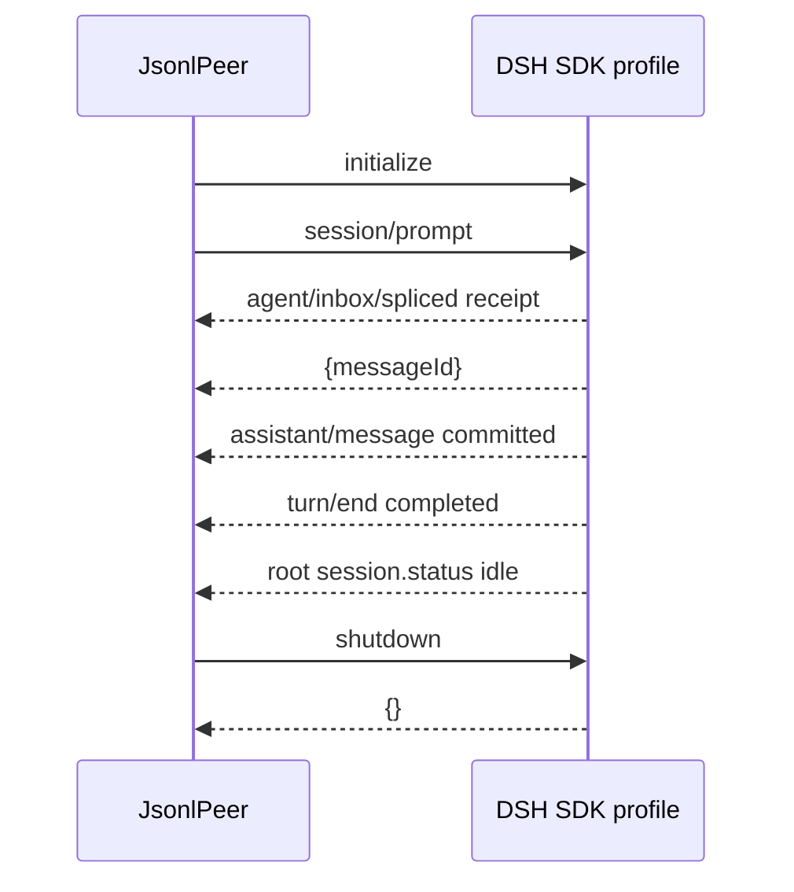
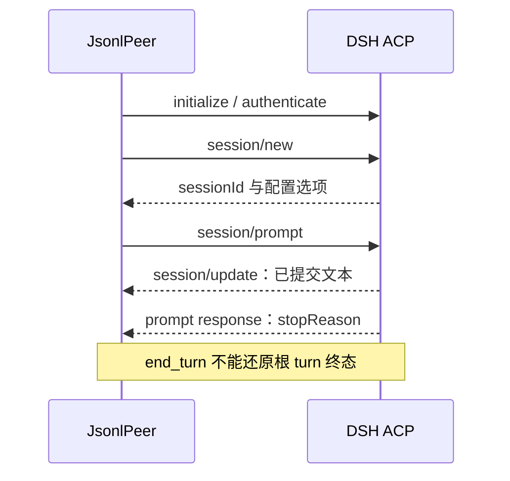

# SDK JSON-RPC 与 ACP：两个 stdio 协议的语义实验

同样向 DSH 提交一句话，SDK JSON-RPC 很快返回一个 `messageId`，ACP 的 `session/prompt` 则等到工作结算才返回 `stopReason`。如果把两者的 RPC 返回都当成“任务完成”，客户端就会在错误的时刻结束等待。

本 lab 用 Python stdlib 写一个 JSONL peer，也就是能在 stdio 上收发逐行 JSON 的客户端。我们先对照可控 fake server 看顺序，再运行固定发行包；读完应能回答输入何时被确认、文本何时提交、何时可以判断结算，以及哪些 Session 操作真的可用。

## 版本与准备

本目录的 `versions.json` 和 npm lock 固定 DSH `0.1.7-rc.2`（tag `dsh-v0.1.7-rc.2`，commit `477b4f420553e8a52c2fbccc464d7561b239c443`），ACP JavaScript SDK `1.4.0`，ACP protocol v1。SDK 的 `serverInfo.version` 和 ACP 的 `agentInfo.version` 都是 `0.0.1` 的 wire identity，不代表 DSH 发行版版本。

Python 需 3.10+，只用 stdlib、pytest、Ruff 和 3.10 所需的 `tomli`；没有 Python DSH SDK 运行依赖。npm 包只用于分发公开 runtime。POSIX process group 回收在 macOS/Linux 上验证；本实验不声明 Windows 支持。

从仓库根目录开始：

```sh
cd labs/protocol-semantics
uv sync --group dev
pnpm install --frozen-lockfile
uv run python -m protocol_labs.sdk_jsonrpc --server fake
uv run python -m protocol_labs.acp --server fake
```

后面的命令都在本 lab 目录执行。fake 不读取 API key、不访问模型；两个 server 与 probe 共用 `JsonlPeer` 的 JSONL 帧、请求 waiter、通知队列和有界进程组关闭，没有第三种传输或私有 SDK client。

先在 SDK 输出里找 receipt 是否匹配、root turn 是否 completed，再在 ACP 输出里找 stopReason 和 committedAnswer。它们都可能拿到文本，但用来结束等待的证据不同。下方时序图会解释这个差别。

本课提供三种入口，选入口时也选择了证据范围：

| 模式 | 启动什么 | 用来回答什么 |
| --- | --- | --- |
| `fake` | 本项目可控 Python server | 客户端是否按预定顺序处理事件与故障 |
| `package` | 本项目安装的公开 dsh CLI | 锁定发行版在这次运行中实际做了什么 |
| `command` | 调用方指定 argv | 指定服务的表现，不能替代固定版本验收 |

## 发布包运行

把 `DEEPSEEK_API_KEY` 放进环境，或在仓库根目录准备被忽略的 `.env`，从本目录运行：

```sh
uv run --env-file ../../.env python -m protocol_labs.sdk_jsonrpc --server package
uv run --env-file ../../.env python -m protocol_labs.acp --server package
```

如果已经导出凭据且没有准备 `.env`，去掉上述两条命令的 `--env-file ../../.env`。

`launch.py` 读取**本项目** `node_modules/@deepseek-ai/dsh/package.json`，核对包名、精确版本、公开 `bin.dsh` 及安装产物，然后使用 `node <bin> --profile sdk-minimal` 或 `node <bin> --profile acp`。它不查找 sibling 项目的模块，不从源码 demo bin 启动。输出的 `packageEvidence` 记录已安装版本和 profile；`versionEvidence` 是本项目的固定源码参照，wire identity 独立报告。

每次 CLI 运行创建一次性 workspace、HOME 和 DSH_HOME。子进程只继承需要的 PATH、临时目录、locale、证书、DeepSeek key 和可选 API base URL；不把父进程所有凭据或代理变量传入。SDK `sdk-minimal` profile 固定 `danger-full-access`，因此临时 workspace 是产物位置，不是文件系统隔离保证。两个真实 prompt 都要求不使用工具。

SDK probe 先 initialize，再提交 prompt；拿到 `messageId` 后匹配 `agent/inbox/spliced` receipt，收集 root `assistant/message`，等 receipt 后的下一次 root idle。它还检查最后一个 root turn completed，最后请求 `shutdown`。

ACP probe 则先 initialize/authenticate、新建 Session，选择服务端公布的 `deepseek-flash` model option，再提交第一轮 prompt。第一轮结束后，它调用 `session/close` 和 `session/list`；随后在**第二个公开 CLI 进程**中，用相同 HOME、DSH_HOME、cwd 和 session ID 调用 `session/resume`。

恢复验证分两步：先确认没有历史 user/assistant/thought/tool update 回放（合法配置 update 不计入），再让模型回忆第一轮随机代号。第二条 prompt 不把答案重新告诉模型。两轮都要求不用工具，并分别统计 `tool_call` 与 `tool_call_update`；两轮工具 update 都为 0，才认可这个回忆结果。每个 process group 最后分别关闭，并核对已经消失。

2026-09-29 的发布包验证运行于 Node `26.7.0`、pnpm `12.3.4`、macOS arm64，结果分三部分：

| 观察对象 | 当次结果 |
| --- | --- |
| SDK | 回复 `Protocol is live.`，receipt 匹配、根 turn completed、root idle；shutdown 成功，退出 0，无信号升级，group 消失 |
| ACP | 第一轮回复 `remembered.`；close 后 list 找到 inactive root；第二进程 resume 相同 ID，无历史文本/工具回放，第二轮精确返回代号，两轮 `toolUpdates=0` |
| 进程回收 | ACP 两次关闭均退出 0，无信号升级，group 消失；独立采样重跑 SDK/ACP 分别观察到 2/3 个后代 PID，CLI 退出后均不再存活 |

这些是当次真实运行观察，不扩大为任意失败场景的恢复保证。

## 先看 SDK：RPC 返回的是输入身份


```mermaid
sequenceDiagram
    participant C as JsonlPeer
    participant S as DSH SDK profile
    C->>S: initialize
    C->>S: session/prompt
    S-->>C: agent/inbox/spliced receipt
    S-->>C: {messageId}
    S-->>C: assistant/message committed
    S-->>C: turn/end completed
    S-->>C: root session.status idle
    C->>S: shutdown
    S-->>C: {}
```

图展示 fake 中刻意安排的 receipt 先于 RPC response 的顺序；客户端必须提前收集通知，不能等 RPC 返回后才订阅。用于划定本次活动的是匹配的 receipt，不能只看“现在已经收到 response”这个时刻。

SDK `messageId` 是 inbox receipt identity，非最终答案。probe 忽略 matching receipt 前的 root status/event 和 child/foreign 活动；receipt 后才收集 root 已提交消息，以最后一条为答案。最后等 root idle，并检查根 turn 的终态。

这个版本的 SDK server 转发 `session.event`、`session.status`、`subagent.started`、`subagent.finished`，不会把实时 `agent/assistant-stream` 转发为逐 token 通知。fake fixture 也不制造旧的 `assistant/chunk`。SDK wire 没有 resume、cancel 或 session close RPC。

## 再看 ACP：文本 update 与 prompt 结算


```mermaid
sequenceDiagram
    participant C as JsonlPeer
    participant A as DSH ACP
    C->>A: initialize / authenticate
    C->>A: session/new
    A-->>C: sessionId 与配置选项
    C->>A: session/prompt
    A-->>C: session/update：已提交文本
    A-->>C: prompt response：stopReason
    Note over C,A: end_turn 不能还原根 turn 终态
```

ACP `session/prompt` 在结算后返回 `stopReason`，文本经 `session/update` 的 `agent_message_chunk` 到达，当前发行版的 update 含 `messageId`。名字里虽然有 chunk，这条 DSH 路径交付的仍是已提交文本，不能据此推断逐 token transport。

再看一个反例：`end_turn` 既可能来自 completed，也可能来自 aborted/blocked；`max_tokens` 才单独保留输出截断。因此 ACP transcript 使用 `protocol_end` 标记，只有 SDK 的明确根 completed 才生成该 `turn_end` 标记。收到正常协议结算之后，应用仍需判断产物或业务目标是否满足。

ACP 还提供 `session/cancel` 通知与 `session/request_permission` 双向 request，两个方向均可独立使用 ID `0`。fake 测试覆盖 literal allow/reject/cancel、未知 option fail closed、超时、异常 EOF、畸形帧和 bounded close。

## 关闭 Session 后，恢复了什么

固定版本 DSH ACP bridge 使用 protocol v1。先 `session/close` 保存可恢复状态，之后 `session/list` 才会列出 inactive、已持久化、可恢复的 root Session。`session/resume` 拒绝 active Session 和 cwd 不匹配；恢复时不回放历史消息或工具 update。fake 只验证同进程确定性生命周期，跨进程恢复由上述 published package 运行单独观察。

选择模型时，`session/set_config_option` 接受服务端 `configOptions` 已公布的 ID 和 opaque value，不需要调用方拼接 provider/model ID。当前 DSH ACP bridge 未实现 `session/load`、delete、fork 和 transcript replay；不能从协议中出现了这些名称就推断本服务可以调用。

读恢复结果时，把两件事分开：模型能回忆旧代号，支持这次恢复带回了对话上下文；客户端没有收到历史 update，则说明 UI 不能靠 resume 自动重建整份旧聊天记录。需要展示旧记录的产品还要自行设计历史读取，不能用一个 resume 按钮同时承诺两者。

## command 模式与故障触发器

command 模式只执行通用 prompt，输出 `packageEvidence: {}` 和 `liveAcceptance: null`，不能用来证明目标是本项目固定发行包。参数是 JSON string array，不执行 shell；可选 cwd 必须是已存在的绝对目录：

```sh
export DSH_SDK_SERVER_ARGV='["/absolute/path/to/server","--stdio"]'
export DSH_SDK_SERVER_CWD=/absolute/existing/directory
uv run python -m protocol_labs.sdk_jsonrpc --server command

export DSH_ACP_SERVER_ARGV='["/absolute/path/to/agent","--acp"]'
export DSH_ACP_SERVER_CWD=/absolute/existing/directory
uv run python -m protocol_labs.acp --server command
```

| Fake prompt | 行为 |
| --- | --- |
| `fixture prompt` | SDK receipt-before-response、root/child/foreign 顺序；ACP committed update 与 end_turn |
| `lab:timeout` | 服务端保留工作；client 本地 waiter 超时不等于取消 |
| `lab:internal-error` | JSON-RPC error `-32603` |
| `lab:malformed` | 畸形帧 diagnostic 后正常继续 |
| `lab:close` | pending request 收到带 partial context 的 EOF |
| `lab:cancel`（ACP） | ready update 后发送 cancel，返回 cancelled |
| `lab:permission`（ACP） | 双向 request ID 0，校验一次性选择 |
| `lab:continuation-error`（SDK） | 后续任务错误被记录为 bounded stderr |

共享 peer 对 malformed、non-object、oversize 和 unterminated stdout frame 记录 bounded diagnostic 并丢弃。stdout EOF 立即拒绝 pending；`close()` 完成 bounded 回收后才给出 final returncode、stderr 尾部、SIGTERM/SIGKILL 是否升级与 group 状态。lab 只在所有已启动 owner 的 close 返回且独立 group 检查确认消失后删除临时 workspace/HOME/DSH_HOME；启动失败、close 抛错或任一 group 状态未确认时保留带 `sdk-jsonrpc-live-` / `acp-live-` 前缀的临时目录供排查。手工清理前先确认没有相关进程。这是本 lab 的 client robustness policy，不代表 DSH server 的保证。

## 验证与限制

阅读练习：在 `tests/test_sdk_jsonrpc.py` 找到 stale idle 与 matching receipt 的用例，说明为什么旧 idle 不能结束这次请求；再看 `tests/test_acp.py` 的 resume 用例，指出“恢复相同 Session”与“回放历史 update”分别检查什么。

```sh
uv lock --check
pnpm install --frozen-lockfile
uv run --python 3.10 pytest tests
uv run --python 3.10 ruff check .
uv run --python 3.10 ruff format --check .
```

测试覆盖 package metadata 与 profile argv、Python 3.10、JSONL 分帧与双向 ID、SDK receipt-to-idle/EOF、ACP list/resume/cwd/config、cancel/permission。fake 和 published run 是不同证据。一次成功的模型回复不证明错误恢复、跨平台行为、多租户安全或业务任务状态；业务 Run/Task 仍应有自己的权威状态。协议选择参见[SDK JSON-RPC 与 ACP 对比](../../docs/comparisons/sdk-jsonrpc-vs-acp.md)，进程管理实验参见[Runtime Supervision](../runtime-supervision/README.md)。固定源码依据：[公开 CLI](https://github.com/deepseek-ai/deepseek-harness/blob/477b4f420553e8a52c2fbccc464d7561b239c443/apps/cli/src/bin.ts)、[SDK server](https://github.com/deepseek-ai/deepseek-harness/blob/477b4f420553e8a52c2fbccc464d7561b239c443/packages/sdk/server/src/server.ts)、[ACP bridge](https://github.com/deepseek-ai/deepseek-harness/blob/477b4f420553e8a52c2fbccc464d7561b239c443/packages/acp/acp/src/index.ts)。

[第 7.7–7.8 课适配层](ADAPTERS.md)用共享场景比较 DSH 双入口，并为 Codex/Hermes CLI 增加独立终态适配；两款 CLI 的 nonce 与文件真实任务均通过，Hermes 固定启动警告和早期失败分别记录。
