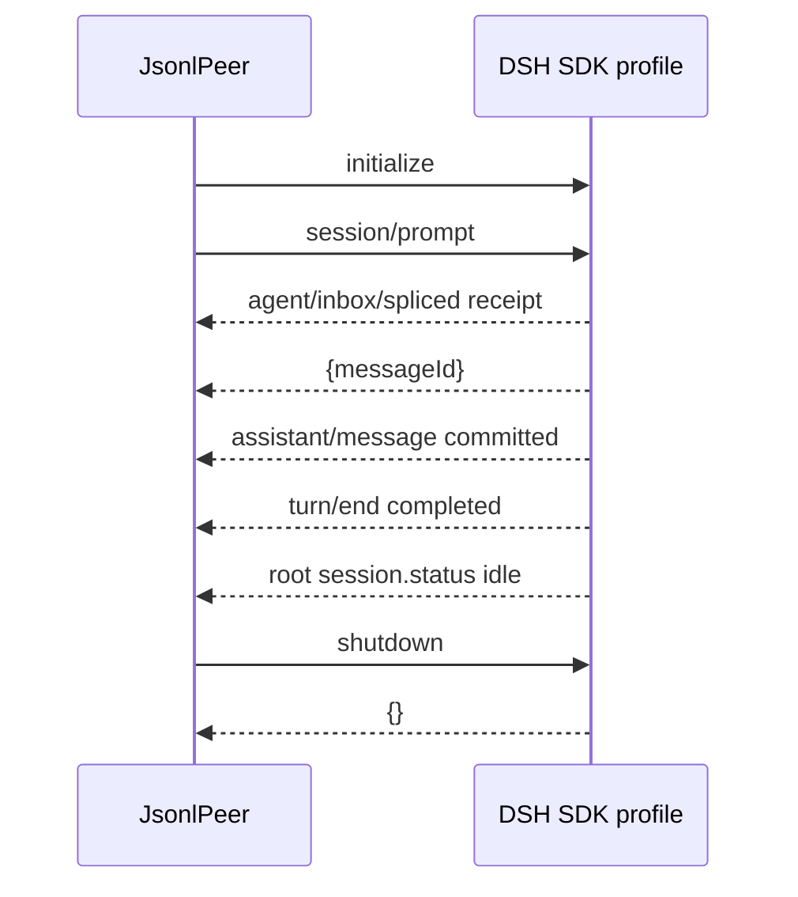

# SDK JSON-RPC 与 ACP：两个 stdio 协议的语义实验

本 lab 用一个 Python stdlib JSONL peer 比较 DSH SDK JSON-RPC 和 ACP。学习目标是解释两种协议如何确认输入、交付已提交文本、结束一次工作，以及各自提供什么 session 控制。fake server 提供可重复的 keyless 顺序与故障；published package 模式运行本项目安装的公开 `dsh` CLI；command 模式可探测其他服务，但不产生固定版本验收结论。

## 版本与准备

本目录的 `versions.json` 和 npm lock 固定 DSH `0.1.7-rc.2`（tag `dsh-v0.1.7-rc.2`，commit `477b4f420553e8a52c2fbccc464d7561b239c443`），ACP JavaScript SDK `1.4.0`，ACP protocol v1。SDK 的 `serverInfo.version` 和 ACP 的 `agentInfo.version` 都是 `0.0.1` 的 wire identity，不代表 DSH 发行版版本。

Python 需 3.10+，只用 stdlib、pytest、Ruff 和 3.10 所需的 `tomli`；没有 Python DSH SDK 运行依赖。npm 包只用于分发公开 runtime。POSIX process group 回收在 macOS/Linux 上验证；本实验不声明 Windows 支持。

从本目录安装并运行：

```sh
cd labs/protocol-semantics
uv sync --group dev
pnpm install --frozen-lockfile
uv run python -m protocol_labs.sdk_jsonrpc --server fake
uv run python -m protocol_labs.acp --server fake
```

fake 不读取 API key、不访问模型。两个 server 与 probe 都只用 `JsonlPeer` 的 JSONL 帧、请求 waiter、通知队列和有界进程组关闭；没有第三种传输或私有 SDK client。

## 发布包运行

把 `DEEPSEEK_API_KEY` 放进环境，或在仓库根目录准备被忽略的 `.env`，从本目录运行：

```sh
uv run --env-file ../../.env python -m protocol_labs.sdk_jsonrpc --server package
uv run --env-file ../../.env python -m protocol_labs.acp --server package
```

`launch.py` 读取**本项目** `node_modules/@deepseek-ai/dsh/package.json`，核对包名、精确版本、公开 `bin.dsh` 及安装产物，然后使用 `node <bin> --profile sdk-minimal` 或 `node <bin> --profile acp`。它不查找 sibling 项目的模块，不从源码 demo bin 启动。输出的 `packageEvidence` 记录已安装版本和 profile；`versionEvidence` 是本项目的固定源码参照，wire identity 独立报告。

每次 CLI 运行创建一次性 workspace、HOME 和 DSH_HOME。子进程只继承需要的 PATH、临时目录、locale、证书、DeepSeek key 和可选 API base URL；不把父进程所有凭据或代理变量传入。SDK `sdk-minimal` profile 固定 `danger-full-access`，因此临时 workspace 是产物位置，不是文件系统隔离保证。两个真实 prompt 都要求不使用工具。

SDK probe 完成 initialize、`session/prompt`、匹配 `agent/inbox/spliced` receipt、接收 root `assistant/message`、等待 receipt 后的下一次 root idle，再请求 `shutdown`。它检查最后一个 root turn 已完成。ACP probe 完成 initialize/authenticate、新建 session、选择服务端公布的 `deepseek-flash` model option、prompt、`session/close`、`session/list`；接着在**第二个公开 CLI 进程**中以相同 HOME、DSH_HOME、cwd 和 session ID 调用 `session/resume`，检查无历史 user/assistant/thought/tool update 回放（合法的配置 update 不计入），再让模型回忆第一轮随机代号。两条 nonce prompt 都明确要求不使用工具；probe 分别统计 `tool_call` 和 `tool_call_update`，只有两轮工具 update 都为 0 才认可回忆证据。每个 process group 分别关闭并核对消失。

2026-09-29 在 Node 26.7.0、pnpm 12.3.4、macOS arm64 上，published SDK probe 收到非空 `Protocol is live.`、matching receipt、`turn/end=completed`、root idle；`shutdown` 成功，returncode 0，无信号升级，group 已消失。published ACP probe 的第一轮回复 `remembered.`；关闭后 list 发现 inactive root，第二进程 resume 相同 ID 后未回放历史文本/工具 update，第二轮精确返回随机代号，两轮 `toolUpdates` 均为 0；两次 ACP 关闭均 returncode 0、无信号升级且 group 已消失。独立进程表采样再次运行 SDK 与 ACP CLI，分别捕获 2 个和 3 个后代 PID；各 CLI 退出后均无存活 PID。这些是当次真实运行观察，不扩大为任意失败场景的恢复保证。

## 两种结算方式


```mermaid
sequenceDiagram
    participant C as JsonlPeer
    participant S as DSH SDK profile
    C->>S: initialize
    C->>S: session/prompt
    S-->>C: agent/inbox/spliced receipt
    S-->>C: {messageId}
    S-->>C: assistant/message committed
    S-->>C: turn/end completed
    S-->>C: root session.status idle
    C->>S: shutdown
    S-->>C: {}
```

SDK `messageId` 是 inbox receipt identity，非最终答案。probe 忽略 matching receipt 前的 root status/event 和 child/foreign 活动；receipt 后才收集 root 已提交消息，以最后一条为答案。这个版本的 SDK server 转发 `session.event`、`session.status`、`subagent.started`、`subagent.finished`；它不会把实时 `agent/assistant-stream` 转发为逐 token 通知。fake fixture 不再制造旧的 `assistant/chunk`。SDK wire 没有 resume、cancel 或 session close RPC。

ACP `session/prompt` 在结算后返回 `stopReason`，已提交文本经 `session/update` 的 `agent_message_chunk` 到达，当前发行版的 update 含 `messageId`。`end_turn` 不等于根 turn completed：固定版本也会用它表示 aborted/blocked；`max_tokens` 保留输出截断。ACP transcript 因此使用 `protocol_end` 标记，只有 SDK 的明确根 completed 才生成该 `turn_end` 标记。ACP 还提供 `session/cancel` 通知与 `session/request_permission` 双向 request；两个方向均可独立使用 ID `0`。fake 测试覆盖 literal allow/reject/cancel、未知 option fail closed、超时、异常 EOF、畸形帧和 bounded close。

ACP protocol v1 的 `session/list` 只列出 inactive、已持久化、可恢复的 root session；`session/resume` 拒绝 active session 和 cwd 不匹配，不回放历史消息或工具 update；`session/close` 保存可恢复状态。`session/set_config_option` 接受服务端 `configOptions` 已公布的 ID 和 opaque value，不需要调用方拼接 provider/model ID。`session/load`、delete、fork 和 transcript replay 未在当前 DSH ACP bridge 实现。fake 只验证同进程确定性生命周期；跨进程恢复由上述 published package 运行单独观察。

## command 模式与故障触发器

command 模式只执行通用 prompt，输出 `packageEvidence: {}` 和 `liveAcceptance: null`，不能用来证明目标是本项目固定发行包。参数是 JSON string array，不执行 shell；可选 cwd 必须是已存在的绝对目录：

```sh
export DSH_SDK_SERVER_ARGV='["/absolute/path/to/server","--stdio"]'
export DSH_SDK_SERVER_CWD=/absolute/existing/directory
uv run python -m protocol_labs.sdk_jsonrpc --server command

export DSH_ACP_SERVER_ARGV='["/absolute/path/to/agent","--acp"]'
export DSH_ACP_SERVER_CWD=/absolute/existing/directory
uv run python -m protocol_labs.acp --server command
```

| Fake prompt | 行为 |
| --- | --- |
| `fixture prompt` | SDK receipt-before-response、root/child/foreign 顺序；ACP committed update 与 end_turn |
| `lab:timeout` | 服务端保留工作；client 本地 waiter 超时不等于取消 |
| `lab:internal-error` | JSON-RPC error `-32603` |
| `lab:malformed` | 畸形帧 diagnostic 后正常继续 |
| `lab:close` | pending request 收到带 partial context 的 EOF |
| `lab:cancel`（ACP） | ready update 后发送 cancel，返回 cancelled |
| `lab:permission`（ACP） | 双向 request ID 0，校验一次性选择 |
| `lab:continuation-error`（SDK） | 后续任务错误被记录为 bounded stderr |

共享 peer 对 malformed、non-object、oversize 和 unterminated stdout frame 记录 bounded diagnostic 并丢弃。stdout EOF 立即拒绝 pending；`close()` 完成 bounded 回收后才给出 final returncode、stderr 尾部、SIGTERM/SIGKILL 是否升级与 group 状态。lab 只在所有已启动 owner 的 close 返回且独立 group 检查确认消失后删除临时 workspace/HOME/DSH_HOME；启动失败、close 抛错或任一 group 状态未确认时保留带 `sdk-jsonrpc-live-` / `acp-live-` 前缀的临时目录供排查。手工清理前先确认没有相关进程。这是本 lab 的 client robustness policy，不代表 DSH server 的保证。

## 验证与限制

```sh
uv lock --check
pnpm install --frozen-lockfile
uv run --python 3.10 pytest tests
uv run --python 3.10 ruff check .
uv run --python 3.10 ruff format --check .
```

测试覆盖 package metadata 与 profile argv、Python 3.10、JSONL 分帧与双向 ID、SDK receipt-to-idle/EOF、ACP list/resume/cwd/config、cancel/permission。fake 和 published run 是不同证据。一次成功的模型回复不证明错误恢复、跨平台行为、多租户安全或业务任务状态；业务 Run/Task 仍应有自己的权威状态。协议选择参见[SDK JSON-RPC 与 ACP 对比](../../docs/comparisons/sdk-jsonrpc-vs-acp.md)，进程管理实验参见[Runtime Supervision](../runtime-supervision/README.md)。固定源码依据：[公开 CLI](https://github.com/deepseek-ai/deepseek-harness/blob/477b4f420553e8a52c2fbccc464d7561b239c443/apps/cli/src/bin.ts)、[SDK server](https://github.com/deepseek-ai/deepseek-harness/blob/477b4f420553e8a52c2fbccc464d7561b239c443/packages/sdk/server/src/server.ts)、[ACP bridge](https://github.com/deepseek-ai/deepseek-harness/blob/477b4f420553e8a52c2fbccc464d7561b239c443/packages/acp/acp/src/index.ts)。

[第 7.7–7.8 课适配层](ADAPTERS.md)用共享场景比较 DSH 双入口，并为 Codex/Hermes CLI 增加独立终态适配；两款 CLI 的 nonce 与文件真实任务均通过，Hermes 固定启动警告和早期失败分别记录。
