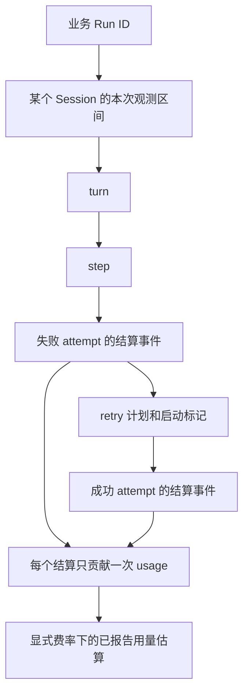

# 第 7.5 课：Run 时间线、用量与费用估算

一个业务 Run 可能包含多个 turn、step 和 provider attempt；一个 Session 又可以服务多个 Run。把事件重放两遍、把 cache token 当成普通 input 再算一遍，都会让统计失真。本课生成仅含元数据的观测记录，保存后重载并重复导入原事件，验证结果保持不变。

前置：[运行时所有权](../runtime-supervision/README.md)、[SDK receipt-to-idle](../../tutorials/typescript-sdk/README.md)。本实验使用 npm SDK/runtime `0.1.7-rc.2`、Cordis `4.0.4`；源码固定为 `477b4f420553e8a52c2fbccc464d7561b239c443`。

## 1. 先跑无模型的重放实验

从仓库根目录开始：

```sh
cd labs/run-observability
pnpm install --frozen-lockfile
pnpm test
pnpm typecheck
pnpm lint
pnpm format:check
pnpm demo
```

支持 Node `^22.19.0 || >=24.0.0`；本机验证为 Node `26.7.0`、pnpm `12.3.4`、macOS arm64。

[`examples/scenario.ts`](examples/scenario.ts)构造两个业务 Run 共用一个 Session 的虚构事件。Run A 包含失败 attempt、一次 retry 计划与启动、成功 assistant/message，另有一个不纳入当前估算的 compaction 标记；Run B 有一个没有 usage 的失败 attempt。数据中的私人文本标记用于验证导出没有包含内容，不是真实用户记录。

[`examples/replay.ts`](examples/replay.ts)把 Run A 乱序导入，保存规范化快照，重新加载，再重复导入两组事件。期望输出：

- 重复事件均被忽略，重载前后摘要深度相等。
- Run A 有 2 个已结算 attempt，报告的 uncached input 为 30、output 为 6、cache read 为 13；reasoning 是 output 的子集。
- Run A 的教学费率估算为 `43300` nanoUSD，即 `0.000043300` USD。
- Run B 的 `missingUsage=1`；已报告部分的估算为零，但这不说明该请求没有成本。
- 快照中不存在 prompt、模型文本、工具参数、原始错误或嵌入 stream。

## 2. 先确定每一层的标识



[`Binding`](src/core.ts)由业务调用方传入 `sourceId/runId/sessionId/provider/model`。`sourceId` 标识一份 session 存储，同一份存储重放时必须保持；重新创建了完全独立的存储才应更换它。`runId` 标识业务请求；`sessionId` 标识 DSH Session；`turn/step` 来自事件，不能拿这些编号代替业务 Run ID。

事件去重键为 `(sourceId, sessionId, seq)`。相同键与相同观测记录重复导入返回 false；同一键的用量、元数据或 Run 归属发生冲突则拒绝。把相同事件换一个 runId 再导入，不会得到第二份用量。一个 runId 也不能跨 source、Session 或路由重新绑定。

这里比较的是白名单投影。若两份原始事件只在被丢弃的文本上不同，观测账本不会发现这种冲突；原始 Session 完整性必须由权威日志负责。更换 sourceId 也会绕过这个去重域，所以它必须来自受控的业务存储标识，不能由客户端任意提交。

## 3. usage 的来源与重复计数

| 事件或字段                                         | 本课如何处理                                                  |
| -------------------------------------------------- | ------------------------------------------------------------- |
| `assistant/message.data.usage`                     | 成功或可见中断输出的首选用量；只计一次                        |
| 同一个 message 的 embedded usage                   | 与 scalar 同时存在时核对一致，不相加；scalar 缺省才取最后一份 |
| `assistant/attempt.data.stream`                    | 无可见输出的结算；取最后一个 usage chunk                      |
| 同一 stream 的多个 usage chunk                     | 累积快照，最后值替换前值，不逐条相加                          |
| `llm/retry` / `llm/retry-started`                  | 分别记录计划和启动数量，不据此增加“已结算 attempt”            |
| `step/end`                                         | step 结束标记，没有独立 usage                                 |
| `compaction/summary` / `session/title-llm-request` | 记录为被排除的辅助调用标记，不纳入本例费用                    |

缺失 usage 保留为 `null` 并增加 `missingUsage`。input/output 必须是非负 safe integer，可选字段缺失则保留“未报告”信息；无效数字不会默默变成零。`totalTokens` 是可选的总量，不是另一个可相加类别。它不能小于已报告的不重叠计数之和；两个缓存字段都已报告时，必须与完整合计相等。矛盾数据会被拒绝。

固定版本的 `inputTokens` 是不含缓存的 input，`cacheReadTokens`、`cacheWriteTokens` 单列，output 已包含 reasoning。计算时只能使用互不重叠的 input/cache read/cache write/output 四项，不能再加 reasoning 或 total。可选 cache 字段没有报告时，对“已报告部分”贡献为零，同时在 `missingOptional` 中计数；这不是将真实缓存用量断言为零。

明确的 `request/header` 路由或 assistant message source 必须与 Binding 匹配，否则拒绝。无 message source 的失败 attempt 只能依据业务绑定归属，不能从 retryId 推导供应商账单请求 ID。一个 retry 计划也可能在等待阶段取消，不能据此声称下一次模型调用已经完成。

## 4. 时间线与费用分别表达什么

`summary()` 按 seq 排列时间线，包含 turn/step、结算事件、retry 标记和有限终态类别。事件 `time` 是记录的 Unix 毫秒时刻，attempt 结算时间不等于请求开始时间。时钟回退由 `clockRegressed` 标识，本课不使用负的时间差伪造延迟；也没有凭空生成完整的分布式 trace 或 provider span。

费率必须显式传入，并与 provider/model 匹配。示例费率如下，**仅用于验证算术，不是 DeepSeek 价格**：

| 已报告类别     | 教学 nanoUSD/token | 等价教学 USD/百万 token |
| -------------- | ------------------ | ----------------------- |
| uncached input | 1000               | 1.00                    |
| output         | 2000               | 2.00                    |
| cache read     | 100                | 0.10                    |
| cache write    | 1200               | 1.20                    |

费率带 `rateId=teaching-v1-not-provider-prices`。聚合和金额使用 BigInt，JSON 输出十进制字符串，避免大型计数相加超过 Number 的精度范围。费用字段叫 `knownUsageEstimateNanoUsd`，并输出 `isInvoice=false`、`observedOnly=true`。

这个数字不覆盖未报告 usage、未形成结算的失败、标题生成、其他辅助调用、供应商侧计费调整或实际账户费率。成功 compaction 可能有自己的 usage，本课明确排除它，便于先掌握普通 assistant attempt 的统计；后续扩展时必须单独定义分类与去重，不能把这部分默认记为零。

## 5. 内容如何被排除

白名单记录只保留受控标识符、seq/time、有限 kind/终态、turn/step、retry 数字和 token 数字。prompt、assistant 文本、reasoning 文本、工具名/参数/结果、错误消息、URL 和原始 stream 都不会被导出。未知事件只变成 `other`，不保留可能携带文本的任意类型字符串。

这不是依赖正则找出每一个秘密，而是只选择明确需要的元数据。Binding 本身仍需由受信任业务代码提供，不能把秘密塞进 runId 或 model 名后期待自动识别。原始 DSH Session 文件也仍可能含完整内容，导出白名单不会改写或清理它们。

[`snapshot.ts`](src/snapshot.ts)写入同目录的独占临时文件，权限 0600，完成写入与文件同步后 rename 替换快照；读取限制为 8 MiB，并严格校验 envelope 和每条观测记录的字段。多余字段和未知 schema 被拒绝，错误不回显原始 JSON。它是单写入者教学 checkpoint，没有跨进程锁、数据库事务、目录 fsync 的崩溃持久保证，也不执行扣费。

## 6. 运行真实的两个 Run

环境已有 `DEEPSEEK_API_KEY` 时执行：

```sh
pnpm live
```

或者从根目录被忽略的 `.env` 加载：

```sh
pnpm exec node --env-file=../../.env --import tsx examples/live.ts
```

[`examples/live.ts`](examples/live.ts)通过公开 sdk-minimal 和禁用 shell tools 的 patch 启动独立 runtime、HOME、dshHome 与 workspace。在同一个 Session 顺序提交两条请求，为每次调用赋予不同 runId；检查根 turn completed、精确 nonce 回复和零工具调用，再收集 SDK 返回的根会话事件。

SDK 的收集范围是本次输入 receipt 到根 agent idle，不等于完整 session 全量导出。child session、区间外异步标题或其他辅助活动不能从这个结果推断为已覆盖。示例把规范化记录保存、重载并重复导入所有已收集事件，要求两个 Run 的摘要完全不变；保存文件不含两次 prompt/reply marker 或 API key。

原始事件仅供当前进程内验证，不写入观测快照。成功验证并确认 SDK close 后删除临时目录；失败不自动重试，保留目录并打印位置。不要将保留的原始 DSH 数据当成已经去除内容的快照。

具体测试数量、真实 usage 与缺失项见[验收记录](../../docs/reviews/2026-09-29-run-observability.md)。下一课 [7.6 Eval 与可重放回归](../../docs/learning-paths/engineering.md)会使用固定场景验证 Agent 行为，本课不把 token 数量当作质量指标。

源码参考：[Session 结算事件](https://github.com/deepseek-ai/deepseek-harness/blob/477b4f420553e8a52c2fbccc464d7561b239c443/packages/core/session/src/types.ts)、[TokenUsage](https://github.com/deepseek-ai/deepseek-harness/blob/477b4f420553e8a52c2fbccc464d7561b239c443/packages/llm/llm/src/types.ts)、[流记录与 reader](https://github.com/deepseek-ai/deepseek-harness/blob/477b4f420553e8a52c2fbccc464d7561b239c443/packages/llm/llm/src/assistant-stream.ts)、[retry 事件](https://github.com/deepseek-ai/deepseek-harness/blob/477b4f420553e8a52c2fbccc464d7561b239c443/packages/llm/llm-retry/src/types.ts)。
