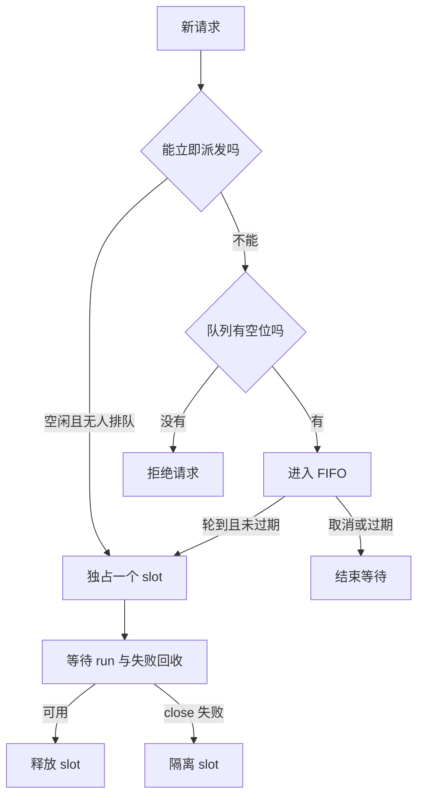

# 第二课：有界进程池与排队

现在有两个 runtime，A 和 B 已经在执行，C、D 又到了。让它们排队并不难；难的是 B 连接失败时，C 应该马上接替 B，还是等旧进程关闭？本课把[单 runtime supervisor](README.md)组成固定容量的池，用这一组请求观察接纳、排队和回收。

读完后，你应能沿着一个请求说明：它何时进入队列、何时占用 slot、取消作用于哪一段，以及为什么下一条请求可以开始并不意味着上一条可以安全重做。

## 1. 先跑可控故障

本课沿用第一课的 Node 范围、锁文件和 npm SDK/runtime `0.1.7-rc.2`，不增加依赖。以下命令从仓库根目录开始：

```sh
cd labs/runtime-supervision
pnpm install --frozen-lockfile
pnpm pool:faults
pnpm test
pnpm typecheck
pnpm lint
pnpm format:check
```

[`examples/pool-faults.ts`](examples/pool-faults.ts)不启动进程、不读取凭据。它用可控 Promise 固定每一步的发生顺序：

1. A、B 分别占用两个 slot；C、D 排队，快照为 `active=2, queued=2`。
2. E 超过队列上限，收到 `PoolCapacityError`。
3. D 的等待被取消，收到 `PoolQueueAbortedError`，从未进入 runtime。
4. B 模拟连接失败；等 owner close 完成后，C 才在 slot 2 的 generation 2 开始。
5. A 完成后关闭池。输出 `started=[A,B,C]`、创建并关闭 3 个 owner、`replayed=false`。

这些结果验证调度与资源所有权。fixture 的空事件列表不代表模型完成；真实请求还需要下面的终态检查。

## 2. 容量、FIFO 与独占使用



[`RuntimePool`](src/pool.ts)拥有固定数量的 supervisor，按需创建 SDK owner。每个 slot 同时只执行一个 `run()`，直到它完成或失败回收结算才释放；新请求不能越过已经排队的请求。FIFO 指派发顺序，不保证完成顺序，也不保证每个 slot 获得相同数量的任务。

```ts
const pool = new RuntimePool((slotId) => createIndependentHarness(slotId), {
  size: 2,
  maxQueued: 8,
  activityTimeoutMs: 180_000,
  queueTimeoutMs: 30_000,
});
const { slotId, generation, result } = await pool.run("你的任务");
// 根据 result 中本次根会话的 turn/end 判断业务接下来怎么处理。
await pool.close();
```

上面的 `createIndependentHarness` 表示由应用提供的工厂，完整可执行版本见[真实示例](examples/pool.ts)。`size` 范围为 1–32，`maxQueued` 为 0–1024；这两个上限是教学实现的资源限制。`maxQueued=0` 只接收立即可派发的工作。两个 timeout 必须为 1 到 `2^31-1` 的整数毫秒。

`slotId` 从 1 开始，生命周期内稳定；`generation` 统计这个 supervisor 创建的 owner。一次正常 run 不增加 generation。工厂必须每次返回新 owner；复用别的 slot 或已退役 owner 会触发 `PoolOwnerReuseError` 并隔离当前 slot，不关闭别的 slot 正在使用的对象。

## 3. 沿着 B 和 C 看三种等待

故障示例里，B 报错后仍占着 slot 2；C 的排队等待不会因为“已经看到错误”而提前结束。下面是场景中的状态变化顺序，行与行的间隔不代表真实耗时：

| 观察时刻 | slot 1 | slot 2 | 队列 | 为什么还要等 |
| --- | --- | --- | --- | --- |
| A、B 已派发 | A 执行 | B 执行，generation 1 | C、D | 两个 slot 都被占用 |
| D 取消 | A 执行 | B 执行 | C | D 从未进入 runtime |
| B 失败 | A 执行 | B 的 owner 正在 close | C | 退出尚未确认，C 不能复用 |
| B 回收成功 | A 执行 | C 开始，generation 2 | 空 | 只派发 C，没有重放 B |

同样叫“等待”，下面三种操作负责的事情不同：

| 等待     | 起点与终点                                 | 到期或取消后发生什么                              |
| -------- | ------------------------------------------ | ------------------------------------------------- |
| 排队     | 入队到派发                                 | 拒绝等待者，不调用 runtime                        |
| activity | supervisor 接收请求到 SDK run 完成         | 等待 owner close，向调用方返回失败；不重放 prompt |
| 池关闭   | 调用 `close()` 到活动结算及所有 owner 关闭 | 立即拒绝新请求和队列；已派发请求继续到结算        |

如果 C 等得太久，应该在进入 runtime 之前被拒绝。队列使用单调时钟，派发前再次检查 deadline；即使事件循环阻塞导致 timer 回调迟到，也不能把已经过期的任务派发出去。deadline 限制可派发时间，不保证 Promise 恰在那个时刻返回。

`pool.run(prompt, { queueSignal })` 的 signal 只控制排队：预先 abort 会直接拒绝；派发后移除监听器，之后 abort 不会中止模型。SDK 没有 per-prompt cancel RPC。若业务需要执行取消，应单独定义业务状态和整个 runtime 关闭的后果，不能把 HTTP 断开直接当作取消成功。

`close()` 是共享的 drain Promise：先关闭接纳，拒绝全部排队任务，等活动请求及失败回收结束，再关闭每个 supervisor。重复调用共享同一结果。任意 slot 关闭失败则为 `close-failed`，错误标明 slot，不能重新开放这个池。活动 timeout 仍然生效，但关闭耗时还包括 SDK 的回收过程。

## 4. 故障后容量怎么变化

正常失败且 close 成功，只意味着该 slot 可以接收下一条独立请求；它在下一次需要时创建新 generation。原失败请求仍然返回给调用者。应用需要核对业务 Run、幂等记录和产物后决定是否重试，池不判断外部副作用是否发生。

再把 B 的 close 改成失败：slot 2 不能确认退出，因此会被隔离；slot 1 仍能继续接单。如果全部 slot 被隔离，排队和新请求收到 `PoolUnavailableError`，不必等待队列 deadline。`snapshot()` 返回独立副本：`capacity` 是配置数量，`active` 包含等待失败回收的 lease，`queued` 是等待数量，`available` 是当前可接单的空闲数量，`quarantined` 是被隔离数量。关闭接纳后 `available=0`。

[`tests/pool.test.ts`](tests/pool.test.ts)还覆盖全部/部分隔离、迟到完成、延迟 timer、重复 owner、工厂重入，以及两个 slot 关闭都失败时的错误收集。这些是可控故障测试；真实进程崩溃和 close 失败未在本课注入。

## 5. 跑两个真实 runtime

环境已有 `DEEPSEEK_API_KEY` 时执行：

```sh
pnpm pool:demo
```

也可以从被忽略的根目录 `.env` 加载：

```sh
pnpm exec node --env-file=../../.env --import tsx examples/pool.ts
```

[`examples/pool.ts`](examples/pool.ts)通过公开 `sdk-minimal` profile 启动两个 owner，分别使用独立的绝对路径 workspace、`HOME` 和 `dshHome`。patch 禁用该固定版本的两个 shell 工具。模型默认 `deepseek-flash`；可选 `DSH_MODEL` 与兼容新版 Messages 的 `DEEPSEEK_BASE_URL`，详情见[第一课](README.md)。

示例提交四个独立请求，验证接纳时 `active=2, queued=2`，额外第五个请求被拒绝。四条结果必须分别精确回复 `POOL_A` 到 `POOL_D`，最后的根会话 `turn/end.kind` 为 `completed`，无 `tool/call`，且 session ID 各不相同。打印每条的 slot 和 generation，再关闭池；只在关闭确认成功后删除临时目录。关闭失败时打印保留目录的位置，不打印凭据和原始 provider 错误。

这里的并行执行需要两个进程；模型请求是否在提供商内部同时执行，不能仅靠客户端进程数量确认。实测结果与外部进程采样见[本课验收](../../docs/reviews/2026-09-29-runtime-pool.md)。

## 6. 应用集成前的练习

先只改无模型的 `examples/pool-faults.ts`：把 `maxQueued` 改成 0，预测 C、D 会发生什么；再把 D 的 abort 移到派发之后，解释为什么它仍会执行。第三次让 B 的 owner close 失败，并先让 A 完成，再等 C 的结果；对照上表，找出 C 可以改由哪个健康 slot 接纳。原脚本先等 C、后结束 A，直接保留这个顺序会让 C 没有健康空位可用。修改场景后要同步修改它原本对固定顺序的断言；断言失败本身不能说明调度器有错。

完成这三个练习，再考虑应用集成：HTTP 请求取消对应的是排队撤回、停止等待响应，还是结束整个 runtime？这些选择的副作用不同，不能只用一个通用的 cancel 名称代替决定。修改真实示例的容量时，也要相应修改它对固定场景的断言。

这个池没有持久队列、业务 Run 存储、租户配额或会话亲和性；每次 SDK `run()` 默认创建新 Session。同一段多轮对话不能随意分配给不同 slot。进程和目录分开也不构成安全隔离；`sdk-minimal` 的执行策略仍为 `danger-full-access`。下一课[7.3 身份认证与租户](../../docs/learning-paths/engineering.md)在服务层处理身份和数据访问。
