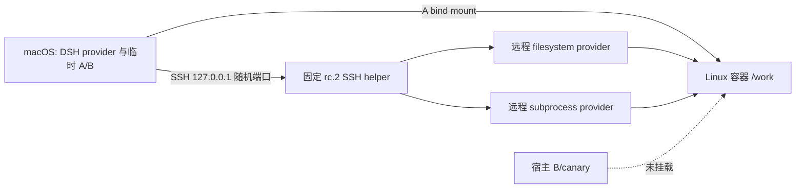

# 第 7.4 补充：容器 workspace 与远程执行

把租户 A 的 workspace 交给一个 Linux 容器后，租户 B 的文件是否仍能被工具读取或改写？本实验用 OrbStack Docker 29.4 的 Linux arm64 容器，以及固定 `0.1.7-rc.2` 的 DSH SSH 文件、子进程、sandbox provider 做一次无模型的真实验证。它回答的是这次容器挂载和执行路径的结果，不是生产多租户安全认证。

前置：[本课 macOS 文件策略实验](README.md)。需要 Docker 及可拉取 `node:22-bookworm-slim` 的网络、`ssh`、`ssh-keygen`、Node `^22.19 || >=24` 和 pnpm。无需 API Key；脚本不读取 `.env`。

## 运行

从仓库根目录执行：

```sh
cd labs/sandbox-isolation
pnpm install --frozen-lockfile
pnpm container
pnpm container:test
```

`pnpm container` 先构建带有 OpenSSH server 和固定 DSH helper 的独占镜像，再建立独占 bridge 网络、容器及 A/B 两个临时目录。每次运行的 Docker image、network、container 都有 `hands-on-dsh.task=container-executor` 和随机 run 标签。脚本仅绑定挂载 A 到 `/work`；B 留在宿主机，A 内预置一个指向 B 的符号链接。SSH 私钥和独立 `known_hosts` 只存在于本次临时目录，脚本不改用户的 SSH 配置、凭据、全局 `known_hosts` 或 Docker daemon 配置。



容器以 UID 10001 运行；根文件系统只读，所有 Linux capabilities 被移除，并设置 `no-new-privileges`、PID 上限 64、内存上限 256 MiB 和 CPU 上限 1 核。仅 `/run/ssh` 与 `/tmp` 使用私有 tmpfs；SSH 端口只发布到宿主 `127.0.0.1`。脚本通过 `docker inspect` 核对挂载、权限、安全选项、三个资源上限及两个 tmpfs 的参数，并通过容器内 `id -u` 核对有效 UID。bridge 网络仍可能有出口，本实验没有验证网络隔离。OpenSSH host key 在容器启动时生成；宿主通过自己创建的容器读取公钥并写入本次私有 `known_hosts`，连接坚持严格 host-key 检查。

## 看实际文件，而不只看工具回答

[`container.sh`](examples/container.sh)先用 `docker exec` 和 loopback SSH 各写一个文件，再经固定发行版的 [`SshFileSystem`](examples/remote-provider.ts) 和 `SshSubprocessRuntime` 各写一个文件。宿主为四个文件逐字节比较本次 nonce；它还检查 B 的 canary 字节未变且没有新增文件。实验同时尝试读取 B、写 B，以及通过 A 内符号链接读写 B。错误路径是容器内的 `/work/../tenant-b`；B 的宿主绝对路径和链接目标都没有对应的容器挂载，所以观察到的是不可见文件导致的拒绝，并不证明远程 provider 自身提供了一个独立的租户读隔离策略。

2026-10-01 本机运行 `pnpm container` 的核心结果：

| 观测                                                     | 结果                                                                      |
| -------------------------------------------------------- | ------------------------------------------------------------------------- |
| Docker 29.4.0，Linux arm64；容器 Node                    | `v22.23.3`，有效 UID `10001`                                              |
| 直接执行与 SSH 命令                                      | 退出码均为 `0`                                                            |
| `/work/../tenant-b/canary` 与 `/work/escape/canary` 读取 | 退出码均为 `1`                                                            |
| 同路径写入                                               | 均失败，B 未新增文件，canary 未变                                         |
| 远程 DSH filesystem 和 subprocess                        | helper 握手成功，写入产物与宿主预期字节一致；远程 B 读取失败              |
| 外部产物 `provider.bin` 的实际十六进制字节               | `6532376263353634656461393334383731613437326638373939376461346537`        |
| 本次镜像 ID                                              | `sha256:fc73cbe2965b27688bb141e5042bf6cc0570f7dd56f5bd3dea484a755879b9f9` |
| 本次 helper SHA-256                                      | `42373bff731239ab5e50bfd908fba8d7e9b9f127463586fa346715135a8ada0b`        |
| 清理后检查                                               | 本次容器、网络、镜像和临时目录均不存在                                    |

每次运行会生成新的 nonce 和镜像 ID，不能把上表字节当作下次运行的固定期望。`pnpm container:test` 会重新创建独占环境，检查真实退出码、Docker 配置、四份文件字节及清理；普通 `pnpm test` 不自动启动 Docker，避免无 Docker 的环境把实验误报为产品测试通过。

## 固定发行版的接入路径与界限

宿主端使用固定 `0.1.7-rc.2` 的 `SshConnection`、`SshFileSystem`、`SshSubprocessRuntime`、`SshSandboxProvider` 和 `SandboxPolicyService`。容器内安装同版 helper；脚本从这个容器读取 helper entry 的 SHA-256，再由连接核对握手报告的 digest。这只证明连接期间使用的文件与本次读取一致，不是独立的软件来源校验。路径 `/work` 由 SSH 端解释，文件工具和子进程使用同一个远端执行世界。OpenSSH 的临时 wrapper 只给本次 Node 进程注入私有 `-F` 配置；用户的 `~/.ssh` 不变。

此实验直接挂载公开 provider，未通过完整 `dsh --profile headless` 运行模型回合，也未演示所有工具或 PTC 均绑定到 SSH provider。DSH runtime、Session、模型传输与宿主插件仍在容器外；远程执行不是这些进程的隔离证明。`SshSandboxProvider` 被挂载以形成远程 provider 组合，但本次未调用它的 `confine()`，因此没有验证容器中 bwrap/Landlock 的额外 file-effect policy。SSH 断线后的未知结果、主动逃逸、资源耗尽、网络出口、共享内核漏洞以及多租户调度也不在本次实验范围。

固定源码：[SSH 连接及部署前置](https://github.com/deepseek-ai/deepseek-harness/blob/477b4f420553e8a52c2fbccc464d7561b239c443/packages/ssh/ssh/README.md)、[SSH 执行坐标](https://github.com/deepseek-ai/deepseek-harness/blob/477b4f420553e8a52c2fbccc464d7561b239c443/docs/subsystems/ssh.md)、[公开 provider 组合测试](https://github.com/deepseek-ai/deepseek-harness/blob/477b4f420553e8a52c2fbccc464d7561b239c443/packages/ssh/ssh/tests/live.e2e.ts)。对应 tag `dsh-v0.1.7-rc.2`，commit `477b4f420553e8a52c2fbccc464d7561b239c443`。

## 清理

脚本在成功或失败退出时按本次随机名称查找资源，并在删除前核对 run 与 task 标签；容器创建后即使启动失败，也会被找到。删除后再次检查资源不存在。若任何 Docker 清理无法确认，脚本返回非零、报告未清理完成并保留本次临时目录供定位；临时 SSH 私钥仍会先删除。没有宽泛的 Docker prune，也不触及已有容器或宿主凭据。
