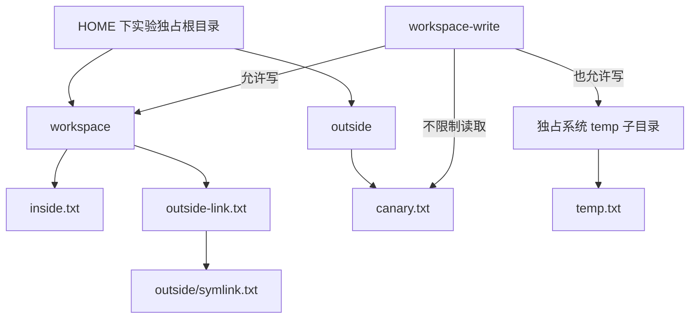

# 第 7.4 课：Workspace、文件写入限制与执行隔离

DSH 的 `workspace-write` 能否保护另一个租户的数据？本课先跑真实探针，再回答：在本次 macOS 实测中，它拒绝了工作区外的写入，但仍允许读取外部文件、访问环回网络，以及观察父进程是否存在。单独设置 workspace 路径或写入模式，不能提供完整的多租户执行隔离。

前置：[身份认证与租户 API 数据访问](../../projects/recoverable-agent-service/TENANCY.md)。本课不改已有服务，所有操作只触及实验自己创建的文件、进程与本地 HTTP server。

## 1. 安装并运行真实系统调用矩阵

从仓库根目录开始：

```sh
cd labs/sandbox-isolation
pnpm install --frozen-lockfile
pnpm test
pnpm typecheck
pnpm lint
pnpm format:check
pnpm probe
```

版本：npm SDK/runtime `0.1.7-rc.2`，Cordis `4.0.4`，对应源码 commit `477b4f420553e8a52c2fbccc464d7561b239c443`。Node 支持 `^22.19.0 || >=24.0.0`；本机验证 Node `26.7.0`、pnpm `12.3.4`、macOS arm64。

`pnpm probe` 先编译 worker，然后通过发布的 `LocalSandboxProvider.confine()` 获取受限 argv 并启动真实子进程。这是 provider 机制实验，不启动 DSH 应用、不读取模型凭据。默认测试包含真实的临时文件、环回 HTTP 和短命子进程，并不全部是 mock；它们与 Seatbelt 实测仍是两组证据。

此矩阵只支持 macOS。其他系统执行探针会明确失败，不会跳过后报告通过，也不会在 sandbox 启动失败时改成无约束执行。Linux/Windows 的差异见后面的源码表。

## 2. 观察八种操作

每种模式使用全新目录和 nonce，父进程独立检查结果：

| 操作                                           | 显式未限制对照 | `read-only` | `workspace-write` |
| ---------------------------------------------- | -------------- | ----------- | ----------------- |
| 写入 workspace/inside.txt                      | 允许           | 拒绝        | 允许              |
| 读取 outside/canary.txt                        | 允许           | 允许        | 允许              |
| 写入 outside/outside.txt                       | 允许           | 拒绝        | 拒绝              |
| 经 workspace 内 symlink 写 outside/symlink.txt | 允许           | 拒绝        | 拒绝              |
| 子进程写 outside/descendant.txt                | 允许           | 拒绝        | 拒绝              |
| 写入独立的系统 temp 子目录                     | 允许           | 拒绝        | 允许              |
| 请求实验自己的 127.0.0.1 HTTP server           | 允许           | 允许        | 允许              |
| 对实验父 PID 做 signal 0 存在性检查            | 允许           | 允许        | 允许              |

表格是本机真实结果，不是所有平台统一保证。写入内容必须精确等于本次 nonce；拒绝写入要求目标文件确实不存在；读取与 HTTP 响应也必须精确匹配 canary。`signal 0` 不向进程发送终止信号，只检查这个已知的自有 PID；本课不扫描其他进程。

JSON 输出包括 `mode`、`enforcement`、`runner`、每个 operation 的 `status/code`，以及 `externalFilesVerified=true`。这次受限模式使用 `sandbox-exec`，拒绝返回 `EPERM`。只接受 `EPERM` / `EACCES` / `EROFS` 为权限拒绝；`ENOENT`、连接失败、程序启动失败、错误 nonce、子进程超时都使整个探针失败。

显式 `danger-full-access` 对照直接运行原 argv，证明文件路径和命令本身可用；它不是受限模式失败时的 fallback。provider 说 `full`，表示它报告完整覆盖该策略承诺的文件效果，不表示它禁止读取、网络或进程观察。

## 3. 为什么 outside 不能放在普通临时目录

[`fixture.ts`](src/fixture.ts)在 HOME 下创建独占的随机 `.hands-on-dsh-sandbox-*` 根目录，里面的 workspace 和 outside 是兄弟目录；另在系统 temp 下创建一份独占目录。启动时确认 HOME fixture 不落入默认 temp grant。



固定版本的 Seatbelt 写入白名单包含 canonical workspace、`/tmp` 和 `os.tmpdir()`。如果把“禁止目录”也放在普通临时目录，它可能本来就位于白名单内，实验会测错问题。`read-only` 不授予这些 temp 写入权限，但仍保留 `/dev/null` 等必要输出 sink。

本课预先创建的 symlink 只指向自己 outside 下的文件。worker 会先检查链接类型和目标，避免把错误链接当作成功拒绝。没有访问个人数据，也没有探测互联网。

## 4. 验证真实模型的 Bash 工具也经过限制

环境已有 `DEEPSEEK_API_KEY` 时：

```sh
pnpm model
```

或者从仓库根目录被忽略的 `.env` 加载：

```sh
pnpm build
pnpm exec node --env-file=../../.env --import tsx examples/model.ts
```

[`examples/model.ts`](examples/model.ts)分别为 `read-only` 和 `workspace-write` 启动全新 `sdk-minimal` runtime、Session、HOME 与 dshHome，调用 `deepseek-flash`。Python 的 `0.1.5rc1` 配置不能直接替代这里的 npm pin。可选 `DEEPSEEK_BASE_URL` 必须兼容此版本使用的 Messages API。

patch 设置 `sandbox-policy.config.mode` 与 workspaceRoot。持久 Bash 的实际链路是：

```text
SDK prompt -> bash(command) -> TerminalBashBackend.spawn
  -> sandboxPolicy.resolve(session) -> sandbox.confine(shell argv)
  -> 持久 shell -> 同一个 built worker -> worker 的子进程
```

策略在持久 shell 创建时解析；后续命令复用该 shell，因此不要通过修改配置来假设一个已存活 shell 的模式已经改变。本课每种模式都新建 runtime。Session 的 immutable cwd 决定 workspace；新 Session 没有旧的 `sandbox/mode` 覆盖事件。

固定版本的持久 Bash 工具只有 `command` 参数，没有逐次 `sandbox_permissions` 升权参数。示例还会检查 durable `tool/call.data.arguments`：必须只含那一条精确命令，不能增加字段、修改脚本或多调用工具。它通过 callId 匹配 `tool/result.data.message.toolCallId`，检查最后根 `turn/end.kind=completed`，解析工具输出中的完整 worker JSON，再核对实际文件。

不要只看模型回复或 `message.isError=false`：shell 命令的非零退出可能只出现在工具文本中。两次真实调用的八项结果均与上表对应受限模式一致，见[本课验收](../../docs/reviews/2026-09-29-sandbox-isolation.md)。

## 5. 进程与文件由谁清理

provider 示例拥有独立 POSIX process group。正常主进程退出后还会检查该 group；若有残留，终止自有 group、等待退出并把本次探针判为失败。超时也终止这个自有 group，不能把超时算作权限拒绝。此机制不覆盖主动脱离 group 的任意进程；本课 worker 的后代执行的是固定短命命令。

模型示例的 runtime 和持久 terminal 由 SDK `close()` 回收；总活动等待限时 180 秒、initialize 限时 120 秒、Bash 命令限时 15 秒，回收本身仍需等待 SDK 退出确认。没有自动重试，也不删除关闭未确认的目录。

只有结果验证和关闭都成功，才删除自己创建的目录；失败保留目录并输出位置供排查，环回 server 仍会关闭。fixture 尚未完整建立时发生错误，会清理已经创建的部分。测试包含启动失败、残留后代以及半途 fixture 失败的回归。不要对用户目录执行宽泛清理命令。

## 6. 平台差异与后续设计

以下基于固定版本源码；只有 macOS 行执行了本课矩阵：

| 平台/backend   | 文件与进程方式                                                                               | 本课证据                                |
| -------------- | -------------------------------------------------------------------------------------------- | --------------------------------------- |
| macOS Seatbelt | allow-default 加文件写入拒绝/白名单；共享主机文件系统和进程世界                              | provider 三模式、真实 Bash 两模式已运行 |
| Linux bwrap    | host root 只读 bind；workspace-write 加 workspace bind 和独立 `/tmp`；使用私有 PID namespace | 只读源码，未运行                        |
| Linux Landlock | 由版本化 launcher 提供访问限制；旧 ABI 可能报告 partial                                      | 只读源码，未运行                        |
| Windows ACL    | workspace 写权限与每 session 临时区；报告 partial，存在硬链接/读取等限制                     | 只读源码，未运行                        |

同一个 DSH mode 并不保证各平台具有相同的 PID 可见性或 temp 行为。此版本没有网络 deny 配置项；本课只测环回连接，不把它扩大为全部网络行为都已验证。硬链接、其他系统调用、恶意 native plugin、主动脱离进程组及资源耗尽也未穷举。

如果需求是阻止租户 A 的工具读取租户 B 数据，仅靠第 7.3 课的 API 路由加 `workspace-write` 仍不够。下一层执行环境需要明确文件系统可见范围、网络出口、进程可见性、凭据注入和资源回收，并让 shell、文件工具与其他执行能力指向一致的环境。容器、虚拟机或远程 executor 的选型和集成需要单独验证，本课不提供现成实现。

原始 DSH runtime、SDK 父进程及宿主插件代码都在这里的受限 Bash 之外；本课测到的拒绝不能当作它们也被隔离。后续工程课 [7.5 可观测性与成本](../../docs/learning-paths/engineering.md)将把这些执行事实记录到业务 Run 中。

源码参考：[file-effect 词汇](https://github.com/deepseek-ai/deepseek-harness/blob/477b4f420553e8a52c2fbccc464d7561b239c443/packages/sandbox/sandbox/src/index.ts)、[平台 profile](https://github.com/deepseek-ai/deepseek-harness/blob/477b4f420553e8a52c2fbccc464d7561b239c443/packages/sandbox/sandbox-local/src/profiles.ts)、[writableRoots](https://github.com/deepseek-ai/deepseek-harness/blob/477b4f420553e8a52c2fbccc464d7561b239c443/packages/sandbox/sandbox/src/roots.ts)、[持久 terminal 的策略解析](https://github.com/deepseek-ai/deepseek-harness/blob/477b4f420553e8a52c2fbccc464d7561b239c443/packages/terminal/terminal-bash/src/index.ts)。
