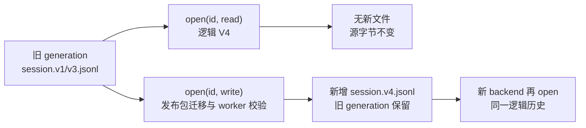

# Session V1 / V3 → V4：只读迁移与不可变发布

这个实验回答一个存储问题：新版 DSH 如何读取旧 Session 日志，以及什么时候会把当前格式写到磁盘。它直接挂载发布版 JSONL persistence backend，调用公开的 `ctx.sessionPersistence.open(id, "read" | "write")`。这里没有 Agent、模型调用或私有 runtime bin；要运行完整 Agent 应用，仍应使用公开 `dsh` profile。

## 版本与实验条件

- npm 包：`@deepseek-ai/dsh-session-persistence-jsonl`、`@deepseek-ai/dsh-session-persistence`、`@deepseek-ai/dsh-session` 都精确锁定 `0.1.7-rc.2`；Cordis `4.0.4`。
- 上游源码：`dsh-v0.1.7-rc.2`，commit `477b4f420553e8a52c2fbccc464d7561b239c443`。当次发布包含 `lib/worker.cjs`，write open 的 successor 校验确实由已安装 worker 执行。
- Node 支持范围 `^22.19.0 || >=24.0.0`；本次运行使用 Node 26.7.0、pnpm 12.3.4、macOS arm64。项目采用 strict ESM/NodeNext、Vitest、Oxlint、Oxfmt。

从本目录安装并运行：

```sh
cd labs/session-format-migration
pnpm install --frozen-lockfile
node --import tsx examples/run.ts v1
node --import tsx examples/run.ts v3
pnpm test
pnpm typecheck
pnpm lint
pnpm format:check
```

CLI 只接受 `v1` 或 `v3` 两个项目内 fixture 名称，不接受外部日志路径或用户 Session root。每次运行把 fixture 复制到一个新临时 root，完成 backend close 后删除它，不会修改原始 fixture。输出只报告版本、事件类型、文本、SHA-256 和 generation 文件名，不打印临时绝对路径。

## 合成输入和物理布局

`fixtures/synthetic-v1.jsonl` 与 `fixtures/synthetic-v3.jsonl` 是本 lab 手工构造的**合成**历史文件，不是用户资料或真实会话录制。V1 有一轮 user 与 assistant 文本、四条旧 `assistant/chunk` 事件及其 assistant message；V3 有一轮 user/assistant 文本，assistant message 内含当时的 embedded stream。两者都有完整的 turn/step 结束事件。V1 的旧 chunk 行经发布包迁移后折入 V4 assistant message 的 stream；实验没有复制 codec 或 repair 实现。

`src/fixture.ts` 的极小路径 helper 只处理这两个固定、仅含安全字符的 ID，按此发行版的 `_no-cwd/<id>/session.vN.jsonl` 布局复制输入：

```text
<fresh temp root>/
  _no-cwd/
    synthetic-v1/
      session.v1.jsonl
      session.v4.jsonl  # 仅 write open 后出现
```

这个 helper 不处理任意 Session ID 的转义规则；该规则由真实 backend 持有。物理输入选择 `compression: "none"`，因此可逐行检查并计算源文件 SHA-256。另一个测试通过公开 `create/flush/open` API 验证默认 Zstd 能产生并读取一个**新建 V4 header**；本 lab 没有压缩的历史 V1/V3 fixture，也没有覆盖混合编码或编码转换。

## 观察什么



`read` 打开 V1 或 V3 后，handle 的 header 是 V4，`read().events` 有非空 user/assistant 历史。V1 逻辑事件不再有顶层 `assistant/chunk`，assistant 的 embedded stream 有四项；V1 经迁移还出现一条 `system/message`。此时目录仍只有原 generation，原文件字节和 SHA-256 不变。

`write` 打开同一 ID 后，backend 发布 `session.v4.jsonl`。V1 到 V4 经过发布包的相邻逻辑转换，但磁盘只新增当前 V4 successor，不要求每个中间格式都留一个物理文件。V1/V3 输入以及任何已存在的较低 generation 都保持逐字节不变。关闭 backend、重新挂载并读取，得到相同的 V4 逻辑事件，successor 的字节也没有变化。demo 输出 `sourceBytesUnchanged`、`successorBytesStable`、`logicalReopenStable` 和三个时点的 generation 列表以便核对。写打开可能留下独立的 `session.lock` 辅助文件；generation 断言只统计规范的 `session.vN.jsonl`。

**拒绝也是结果：** 放入未来版本 `session.v5.jsonl` 后，read/write 都拒绝；即使较旧 V1 可读也不会回退。把最高 V4 generation 改为完整但无效的事件，或在 V1 加入未知历史事件，同样拒绝；这些失败不生成新 successor，也不改动现有 generation 字节。实验没有把这些文件“修好”或降级。

## 验证边界

2026-09-29 的 keyless 测试使用真实发布包、worker 和临时文件系统，覆盖两份非空 fixture 的 read/write/reopen、源 SHA-256、已有 V1+V3 generation 不变、future/corrupt/unsupported body 拒绝，以及新建 V4 的默认 Zstd header。两次 demo 都观察到逻辑版本 4、源 SHA-256 前后一致、read 阶段无 successor、write 后新增 V4、重新打开稳定。它证明的是这两份合成文件和这台机器上的发布包行为，不代表任意历史用户日志均可无损升级。

Session 格式版本属于 DSH 的持久日志。它与应用数据库 schema、业务 Run/Task 状态、模型会话恢复是不同问题：可读取历史 Session 不等于一次不确定的工具副作用可以安全重试，也不等于旧客户端可读取 V4。保留 predecessor 是审计与升级策略，不提供自动 fallback 或 downgrade。相关业务恢复实验见[可恢复 Agent 服务](../../projects/recoverable-agent-service/README.md)。

源码事实可从固定 revision 的 [JSONL backend 文档](https://github.com/deepseek-ai/deepseek-harness/blob/477b4f420553e8a52c2fbccc464d7561b239c443/packages/session/session-persistence-jsonl/README.md)、[V3→V4 发布测试](https://github.com/deepseek-ai/deepseek-harness/blob/477b4f420553e8a52c2fbccc464d7561b239c443/packages/session/session-persistence-jsonl/tests/v3-restart-migration.spec.ts)和[V1 历史读取测试](https://github.com/deepseek-ai/deepseek-harness/blob/477b4f420553e8a52c2fbccc464d7561b239c443/packages/session/session-persistence-jsonl/tests/jsonl.spec.ts)查证。
