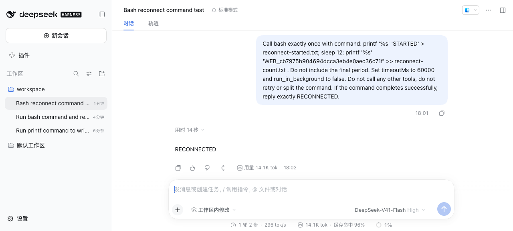
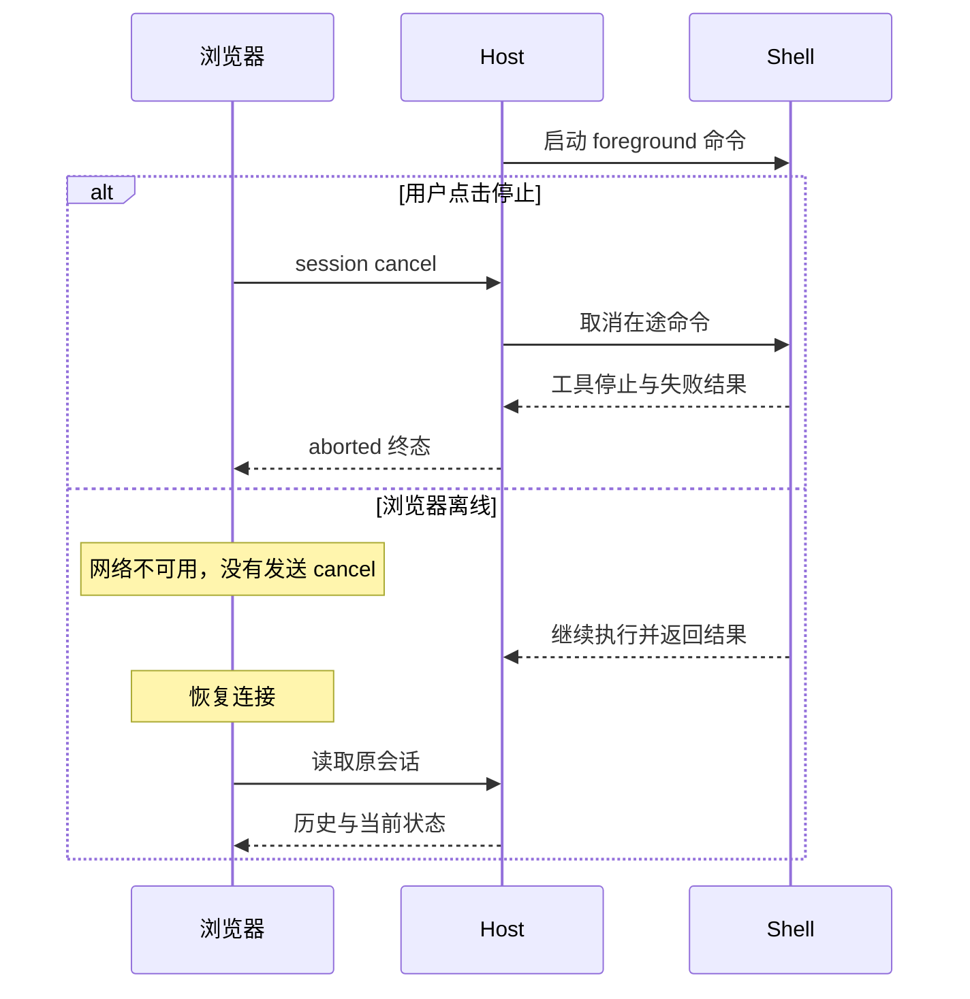

# Web 控制：拒绝、单次允许、取消与离线

用户拒绝写文件、点击停止、关闭浏览器网络，这三个动作会造成同一种结果吗？先分清它们各自在控制什么：审批决定某次操作是否允许，取消试图停止已经开始的工作，离线只说明浏览器暂时无法连接。

本课接续[官方 Web Host 基础实验](README.md)，沿用同一 `0.1.7-rc.2` 与工具链。我们让每个动作留下可检查的文件或日志差异，再回到页面理解看到的状态。

## 准备

按 README 完成安装、启动一个**新的**实验目录、登录和添加 `$LAB_ROOT/workspace`；这次不发送基础实验的两条提示。在 Lab 目录准备固定命令：

```sh
pnpm exec node --import tsx examples/prepare-controls.ts "$LAB_ROOT"
```

`control-cases.json` 保存本次随机值、四条命令和各自的 prompt。`prepare-controls.ts` 不执行命令、不调用模型，也不覆盖已有案例文件。将对应 `cases.<name>.prompt` 原样复制到页面发送。记录 Session ID 的方法仍是该固定版本页面的本地选中状态：

```sh
agent-browser --session dsh-web-lesson eval 'JSON.parse(localStorage.getItem("dsh.sessions.current")).sessionId'
```

每条 prompt 只发送一次；失败不自动重发。模型如果改变命令、调用其他工具或重试次数不符，验收应失败。

这一页会使用三个 Session，先留好下面三个 ID 的记录位置。审批的拒绝与允许共享一个 Session，取消和离线各自新建：

| 保存的 ID | 案例 | 文件观察 |
| --- | --- | --- |
| `approval` | denied，随后 allowed | `denied.txt` 不存在；`allowed.txt` 内容准确 |
| `cancel` | 开始后取消 | 有 `cancel-started.txt`；延迟结束文件不存在 |
| `reconnect` | 浏览器离线再连接 | `reconnect-count.txt` 只追加一次随机值 |

## 1. 拒绝和允许一次

在第一个 Session 中将访问模式改为“仅可查看”。先发送 `cases.denied.prompt`，目标是 `denied.txt`。

这里为什么预期两次 Bash 调用？固定 prompt 要求模型先在 read-only 下尝试，遇到明确的 sandbox denial 后，再用**完全相同的 command** 请求 `workspace-write`，携带 `sandbox_permissions` 与 `justification`。第二次才会等待用户审批。

第一次 shell 失败可能仍返回正常的工具消息，所以要检查内容中的 `[sandbox: file access denied under read-only mode]`，并独立确认文件没有出现。只看 `isError` 无法判断这次写入。

等审批面板出现，确认 `denied.txt` 尚不存在，再点击“拒绝”。预期最终回复 `DENIED`，文件仍不存在。持久审计有同一个 ID 的 `approval/asked → approval/decided(rejected)`，关联第二个 tool call；其 result 为 error。**根 turn 仍可 completed**，表示模型结束了本轮，不表示被拒绝的操作成功。

在同一个 Session 发送 `cases.allowed.prompt`。等审批面板出现，先确认 `allowed.txt` 不存在，再点击“允许一次”。预期 `ALLOWED`，文件精确等于本次随机值；审计为 `allowed-once`，关联工具结果成功。页面仍显示“仅可查看”，最后一条持久 `sandbox/mode` 仍为 read-only，未把会话改为长期可写。记录这个 Session ID 为 `approval`。

## 2. 取消正在运行的 Bash

新建第二个 Session，确认它使用“工作区内修改”，发送 `cases.cancel.prompt`。命令先写 `cancel-started.txt`，等待 45 秒，再准备写 `cancel-finished.txt`。

```sh
test -f "$LAB_ROOT/workspace/cancel-started.txt"
```

开始标记出现后立即点击“停止生成”，必须早于延迟写入。等待页面显示“已停止”，记录 Session ID 为 `cancel`。验证器要求一次匹配的失败工具结果，以及 `turn/end.reason = { kind: 'aborted', reason: { kind: 'user' } }`。点击返回或停止按钮消失都不能替代这个终态。

观察结束后，回头看那份开始文件：它还在。本次两个正在运行的子进程已退出，超过原定 45 秒后结束文件仍未出现，但第一份写入没有被撤销。**取消不是回滚**。

这只验证本例的 foreground 命令，不能推导外部系统写入、主动脱离进程组的进程或已分离 job 都一定可取消。

提示明确指定 `timeoutMs: 60000`、`run_in_background: false`。这避免较短 foreground timeout 把命令转为 detached job。官方 Web 会把命令登记到 jobs，UI 显示 job 不等于本例采用了后台分离执行。

## 3. 浏览器离线，Host 继续工作

新建第三个 Session，确认“工作区内修改”，发送 `cases.reconnect.prompt`。命令先写 `reconnect-started.txt`，等待 12 秒，再向 `reconnect-count.txt` **追加**本次随机值。记录 Session ID 为 `reconnect`。

开始标记出现且追加文件尚不存在时，在浏览器自动化上下文中离线并刷新：

```sh
test -f "$LAB_ROOT/workspace/reconnect-started.txt"
test ! -f "$LAB_ROOT/workspace/reconnect-count.txt"
agent-browser --session dsh-web-lesson set offline on
agent-browser --session dsh-web-lesson reload
```

必须检查页面确实显示 `ERR_INTERNET_DISCONNECTED`。本机 agent-browser 的 reload 返回了 `chrome-error://chromewebdata/`，退出码仍为 0；命令退出码不能替代错误页观察。这里切断的是浏览器上下文的网络，Host 与模型服务之间的网络保持可用。


保持浏览器离线，继续从操作终端看文件：追加文件仍然出现了。执行命令的是 Host，它与模型服务的网络仍然可用；浏览器离线没有发送取消，也没有让 Host 自动暂停。然后恢复连接：

```sh
agent-browser --session dsh-web-lesson set offline off
agent-browser --session dsh-web-lesson open "$WEB_ORIGIN"
```

`WEB_ORIGIN` 使用启动器打印的无 token `baseUrl`。等待原 Session 历史加载，确认 ID 相同、只有一条独立最终回复 `RECONNECTED`，并显示“1 轮 2 步”。不要再次发送 prompt。最终文件必须只含一次随机值；用 append 而不是覆盖写，才能发现这次写入被执行两遍。



## 关闭后验收

将记录的三个 ID 写到实验目录：

```sh
cat > "$LAB_ROOT/control-session-ids.json" <<'JSON'
{
  "approval": "替换为审批 Session ID",
  "cancel": "替换为取消 Session ID",
  "reconnect": "替换为离线 Session ID"
}
JSON
```

等待取消开始标记的修改时间已过去至少 45 秒。在启动器终端 Ctrl-C，等待 Host 退出并核对 PID；再执行：

```sh
pnpm verify:controls "$LAB_ROOT"
pnpm test
```

[`verify-controls.ts`](examples/verify-controls.ts) 重读公开 JSONL backend，核对三个 Session 的 ID、cwd、V4 header、每个 prompt 一次、工具/审批关联和终态，并独立读取文件。它不替代中间的 UI、离线错误页和进程观察。metadata collector 若启用，先 Ctrl-C 停止观察器，再关闭专属浏览器；最后按 README 删除自己创建的实验目录。

2026-09-30 验收：审批 Session 61 条事件，拒绝/允许各两次 Bash；取消 Session 22 条事件，user-caused aborted；离线 Session 26 条事件，completed。允许文件与追加文件各 36 字节且内容相同；拒绝文件和取消的延迟文件均不存在。Lab 共 8 项无 Key 测试通过。详见[验收记录](../../docs/reviews/2026-09-30-web-controls.md)与[安全元数据](evidence/2026-09-30-controls.json)。

## 从源码解释观察

审批发生在更宽权限的执行之前；取消与离线发生在命令已经运行之后。后两者的区别可以沿进程看：



固定源码的 [Session cancel](https://github.com/deepseek-ai/deepseek-harness/blob/477b4f420553e8a52c2fbccc464d7561b239c443/packages/api/session-controller/src/commands.ts) 调用 `agent.cancel({ kind: 'user' }, { keepInbox: true })`，只返回 accepted；本例没有排队消息，不能据此宣称队列已清空。[审批 service](https://github.com/deepseek-ai/deepseek-harness/blob/477b4f420553e8a52c2fbccc464d7561b239c443/packages/interaction/user-approval/src/index.ts) 记录问答 ID；[Bash consumer](https://github.com/deepseek-ai/deepseek-harness/blob/477b4f420553e8a52c2fbccc464d7561b239c443/packages/shell/tool-bash/src/index.ts) 在更宽策略执行之前等待批准。

[恢复案例](RECOVERY.md)继续检查审批等待时取消、同一事件的迟到 Web 结果、prompt admission 断线、重复 RPC 和执行中 Host 强杀。面板消失后的人手点击、任意任务树回收、真正后台 job、所有平台与网络故障仍未验证。本次“一次追加”是受控观察，不是通用 exactly-once delivery 保证。
