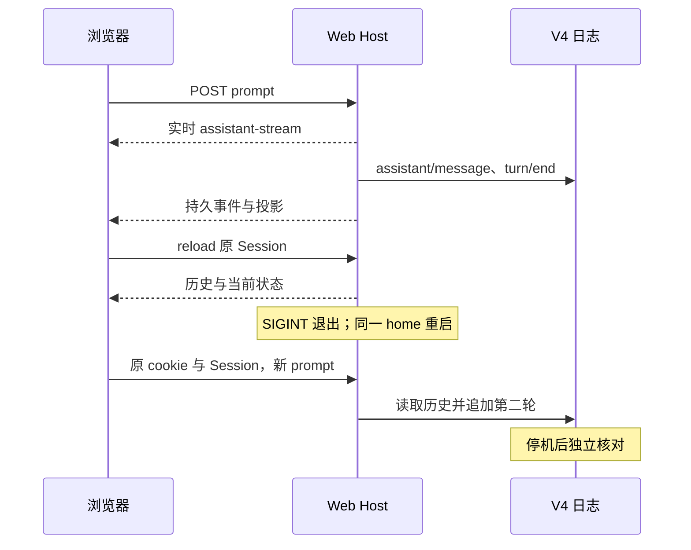
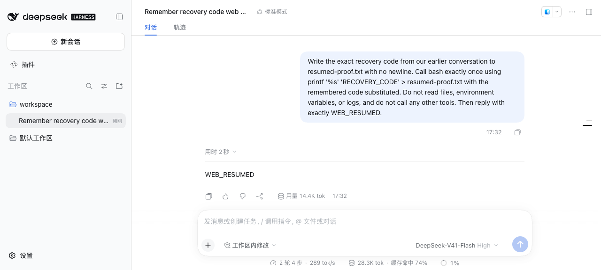

# 官方 Web Host：实时输出与重启后的会话恢复

在官方 Web 页面里让 Agent 记住一个口令并写入文件。然后关闭 Host、启动一个新进程，再让它根据旧对话写出同一个口令。页面看起来接上了，我们还要检查两件事：第二轮是否使用原 Session，以及文件中的字节是否真的正确。

本课从官方 `dsh web` 完成这两轮任务，用浏览器、文件和持久日志分别取证，补充[协议与 Web Host 机制章](../../how-dsh-works/07-sdk-jsonrpc-acp-and-web-host.md)。后续[控制案例](CONTROLS.md)讨论拒绝、允许、取消和浏览器离线，[恢复案例](RECOVERY.md)再进入 admission 断线、重复投递、审批等待时取消与 Host 强杀。自有 AG-UI 应用的表现不能替代官方 Web 的这些观察。

## 版本与前置

DSH npm 固定 `0.1.7-rc.2`、Cordis `4.0.4`；源码 `dsh-v0.1.7-rc.2` / `477b4f420553e8a52c2fbccc464d7561b239c443`。工具链 Node `^22.19 || >=24`、pnpm `12.3.4`；实测 macOS arm64、Node `26.7.0`、agent-browser `0.37.0` 和其 Chromium。

需要本地 `DEEPSEEK_API_KEY`，可选 `DEEPSEEK_BASE_URL`。启动器只将必要环境变量传给子进程，使用独立 OS home、Harness home 和临时 workspace。真实运行选择 UI 显示的 `DeepSeek-V41-Flash / High`；持久请求配置为 `deepseek-official / deepseek-flash / high`。本实验保留 Web 默认配置，不能沿用 SDK Lab 的输出预算；此次记录的 `maxTokens` 为 `256000`。

## 安装与启动

从仓库根目录执行：

```sh
cd labs/web-host-lifecycle
pnpm install --frozen-lockfile
pnpm test
pnpm typecheck
pnpm lint
pnpm format:check
# 根目录 .env 由自己在本地配置，不提交
pnpm exec node --env-file=../../.env --import tsx examples/start.ts
```

已有环境变量时可用 `pnpm start`。把这个终端当作 **Host 终端**：启动器打印 `labRoot`、去除 token 的 `baseUrl`、launcher/host PID 后会持续运行，先不要关闭。

再打开一个**操作终端**，进入同一 Lab 目录，按实际输出设置变量并打开专属浏览器：

```sh
LAB_ROOT='/替换为实际的/labRoot'
agent-browser --session dsh-web-lesson open "$(cat "$LAB_ROOT/bootstrap.url")"
agent-browser --session dsh-web-lesson snapshot -i
```

也可自己在浏览器中打开该本地文件中的完整 URL。`bootstrap.url` 和 `host.log` 含登录 token，只存于实验目录，不能复制到报告、截图或提交。登录后地址跳转为无 token 的根 URL。裸请求该地址不等于已认证请求；本次无 cookie 的首页请求返回 401。

启动器使用 `dsh --profile web --patch … --no-open --port …`。Launcher 参数必须位于 Web 参数之前，否则 `--patch` 会交给 Web parser 并被拒绝。patch 与固定 tag 的 `apps/web/tests/pin-browse-picker.overlay.yml` 相同：启用网页内目录选择器，便于浏览器自动化；没有替换 Host、模型 adapter 或会话控制服务。

## 两轮浏览器实验

先看完整目标，运行中就容易判断当前到了哪一步：

| 阶段 | 浏览器观察 | 独立检查 |
| --- | --- | --- |
| 第一轮 | `WEB_READY`，1 轮 2 步 | `web-proof.txt` 与 checkpoint 日志 |
| Host 重启 | 原 Session 重新加载 | 原 Host 退出，新 Host PID 不同 |
| 第二轮 | `WEB_RESUMED`，2 轮 4 步 | `resumed-proof.txt` 与旧日志前缀 |

如果还想观察独立的实时帧，可先设置后文[只读观察器](#可选观察-web-的实时帧)，再发送第一轮。第一次学习不必同时运行观察器。

1. 阅读并确认内测声明。在“添加工作区”中点击“编辑路径”，输入 `$LAB_ROOT/workspace` 的实际绝对路径，按 Enter，等待目录加载后点击“打开”。选择该工作区；保留工作区内修改模式和 Flash 模型。
2. 本地打开 `$LAB_ROOT/state.json`，取出随机 `code`。将下列提示中的 `<CODE>` 两处替换成它，通过页面发送：

   > Remember this exact recovery code for a later task: `<CODE>`. Call bash exactly once with this command: printf '%s' '`<CODE>`' > web-proof.txt . Do not include the sentence's final period in the command. Do not call any other tools. Then reply with exactly WEB_READY.

3. 等待回复 `WEB_READY` 和“1 轮 2 步”。切到“轨迹”，核对 Bash 命令及结果；切回对话。刷新页面，确认原会话和历史仍在。
4. 取当前 Session ID。此版页面的选中状态存在以下本地存储项；它是实验定位手段，不是业务集成 API：

```sh
agent-browser --session dsh-web-lesson eval 'JSON.parse(localStorage.getItem("dsh.sessions.current")).sessionId'
```

5. 在 Host 终端按 Ctrl-C，等待 `hostExited`，并用 `ps` 确认记录的进程已退出。切回已设置 `LAB_ROOT` 的操作终端，保存第一轮 checkpoint：

```sh
SESSION_ID='替换为实际的/session-id'
pnpm verify "$LAB_ROOT" "$SESSION_ID" checkpoint
```

6. 回到 Host 终端。两个终端不共享变量，先把 `LAB_ROOT` 设置为步骤 1–5 使用的同一个实际目录，再启动新 Host：

```sh
LAB_ROOT='/替换为刚才同一个/labRoot'
pnpm exec node --env-file=../../.env --import tsx examples/start.ts "$LAB_ROOT"
```

端口和 Harness home 保持一致，Host PID 应变化。在原浏览器刷新页面，确认仍为原会话。此次已有 cookie 在重启后继续有效，没有打开新 token URL。正常登录态加载与实时重连是不同观察，不把它扩大为任意网络故障恢复。

7. 在原会话发送以下提示，**不要填入口令**：

   > Write the exact recovery code from our earlier conversation to resumed-proof.txt with no newline. Call bash exactly once using printf '%s' 'RECOVERY_CODE' > resumed-proof.txt with the remembered code substituted. Do not read files, environment variables, or logs, and do not call any other tools. Then reply with exactly WEB_RESUMED.

8. 等待 `WEB_RESUMED` 和“2 轮 4 步”，然后在 Host 终端再次 Ctrl-C，确认 Host 退出。切回保留 `LAB_ROOT` 和 `SESSION_ID` 的操作终端验证：

```sh
pnpm verify "$LAB_ROOT" "$SESSION_ID" final
agent-browser --session dsh-web-lesson close
```

`checkpoint` 使用排他写入，不覆盖已有 baseline。验证失败不自动重发 prompt，也不重新创建 Session。

## 验证内容与观察



为什么验证一定放在 Host 停止后？这时 [`verify.ts`](examples/verify.ts) 可以用独立的公开 JSONL backend 重读 V4，核对同一 header 和完整历史前缀，再把两个 completed turns、每轮 Bash 命令、成功结果与外部文件对应起来。它不依赖页面还记得什么。

官方 Bash 还带描述性的 `description` 参数，验证器允许这个文本字段，但命令必须完全匹配。第二轮新增 user/message 也不能含旧口令，否则文件正确只能说明模型照抄了新输入，不能证明它使用了持久历史。

此次结果：Session `26 → 43` 条事件，前 26 条逐项相同；两个文件各 36 字节、SHA-256 相同。页面刷新和 Host 重启后都保留同一个选中 ID；浏览器未捕获 pageerror。关闭前的两个进程树快照中，所有记录 PID 在停止后均已退出。这是离散快照，不是完整后代进程审计。



安全的结果元数据保存在 [evidence/2026-09-30.json](evidence/2026-09-30.json)，完整检查说明见[验收记录](../../docs/reviews/2026-09-30-web-host.md)。原始日志、cookie、token、checkpoint 和 API Key 不随教程提交。

## 可选：观察 Web 的实时帧

页面上的文字逐渐出现，是否就证明存在逐 token 通知？还需要看传输。浏览器用 `/api/remote.mux` WebSocket 接收消息，`/api/session/prompt` 等 unary 请求则走 HTTP POST。本次 CDP 观察只保存类别与时间：两个回复各出现 4 个独立 `assistant-stream + text-delta` 帧，之后才收到对应的持久 `event + assistant/message`。这与 SDK 把已提交消息内的 stream 事后展开不同。

可在发送第一轮前，在已设置 `LAB_ROOT` 的操作终端启动只读观察器。`CDP_URL` 来自 agent-browser 的本地调试地址，`WEB_ORIGIN` 填入启动器实际输出的无 token `baseUrl`：

```sh
CDP_URL="$(agent-browser --session dsh-web-lesson get cdp-url)"
WEB_ORIGIN='替换为启动器输出的/baseUrl'
node examples/browser-metadata.mjs "$CDP_URL" "$WEB_ORIGIN" "$LAB_ROOT/browser-metadata.jsonl"
```

等 Observer ready 后刷新页面，再发送提示。观察器保持运行，Ctrl-C 停止；它只记录类别、路径、UTF-16 code unit 长度与时间，不保存消息内容、请求头或 cookie。必须区分独立 `assistant-stream` 帧与持久事件内嵌的 chunk；仅搜索所有 `text-delta` 字样会重复计数。一次短回复的帧数量不能代表吞吐或延迟保证。

## 清理与限制

启动器不会删除实验目录，失败时也保留它。完成验收后先停止两个终端和专属浏览器，确认相关 PID 已退出，再删除输出的 `labRoot`。不要删除实际项目目录。预期退出为正常 code 0，或主动 Ctrl-C 后的 code 130；其他 code、signal 或启动未就绪都报失败。启动等待最多 180 秒，但停止仍等待 CLI，不承诺启动器的硬性总时限。上游 CLI 给 disposal 5 秒，超时或 disposal 失败也可用同一个 130 退出；因此 code 130 只识别所请求的退出路径，不能单独证明 flush 或全部清理成功，本实验还独立重读日志并检查已记录 PID。

基础实验没有覆盖全部故障路径；[控制案例](CONTROLS.md)补充 foreground 取消、拒绝/单次允许及浏览器离线中的写入观察，[恢复案例](RECOVERY.md)记录迟到 Web 结果、强杀后的未知工具结果、请求接纳竞争和串行/并发重复投递。面板消失后的人手点击、完整 Host/Origin 攻击矩阵、多租户 ACL、所有浏览器平台和完整 Web 产品功能仍未实测。标题生成、用量和缓存展示不构成供应商账单验证。源码和运行观察只适用于本 Lab 固定版本及记录的模型路由。
