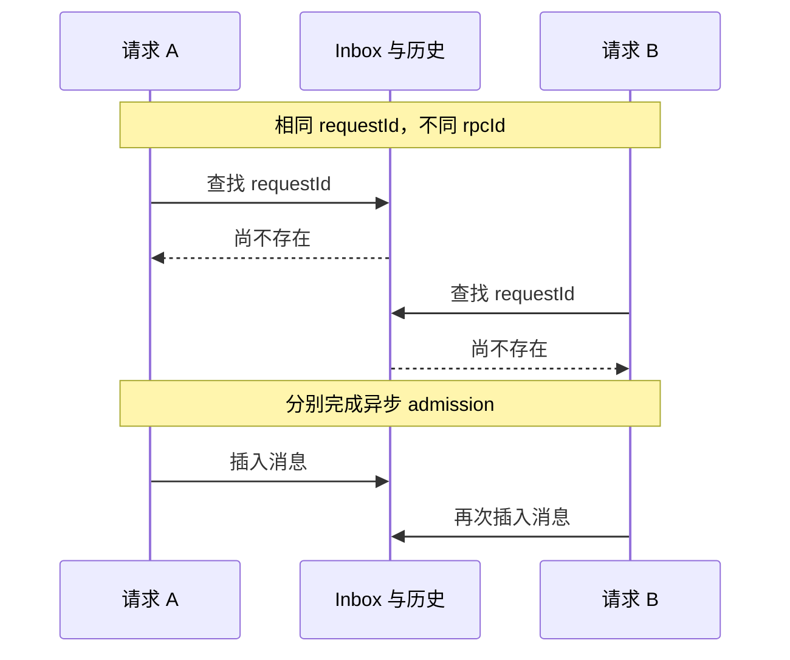

# 官方 Web：提交断线、重复投递与强杀恢复

浏览器报了 `AbortError`，服务器是不是就没有收到任务？Host 被强杀了，刚才那条 Bash 是没有执行，还是执行完却来不及记录结果？这类问题都不能只看页面或 HTTP `accepted`，需要带着原请求身份去核对持久记录与外部状态。

本课接续[基础 Host 实验](README.md)和[审批/取消/离线控制](CONTROLS.md)。按实际操作顺序，我们先取消等待中的审批，再检查串行重投、请求断线和并发重投，最后强杀 Host。每个探针只提交一次，不靠重发任务来凑预期结果。

固定版本为 npm `@deepseek-ai/dsh@0.1.7-rc.2`、源码 `477b4f420553e8a52c2fbccc464d7561b239c443`。以下实验使用官方 `web` profile 和网页内 picker overlay；浏览器调用的是 Host 的 `/api/session/prompt`，不是自建后端。前课记录的 `/api/remote.mux` 独立 `assistant-stream/text-delta` 帧仍是实时输出证据；本课的持久 `assistant/message` 只用于结算和恢复，不算逐 token 帧。

## 准备与隔离

从 `labs/web-host-lifecycle` 运行 `pnpm install --frozen-lockfile`，按 [README](README.md#安装与启动)用本地 Key 启动**新**实验目录。Host 终端保持运行；在另一个进入同一 Lab 目录的操作终端，按启动器实际输出设置变量：

```sh
LAB_ROOT='/替换为实际的/labRoot'
WEB_ORIGIN='替换为无 token 的 baseUrl'
HOST_PID='替换为本次 hostPid'
agent-browser --session dsh-web-recovery open "$(cat "$LAB_ROOT/bootstrap.url")"
```

确认声明，添加 `$LAB_ROOT/workspace`，保留 `DeepSeek-V41-Flash / High`。整个实验复用这一个 root，后面重启 Host 时也不新建目录。不要把 `bootstrap.url`、`host.log`、cookie、原始网络包、完整 Session 日志或私人 PID 列表拷进仓库。

先分清两个 ID：`requestId` 标识同一条 prompt 命令，外层 `rpcId` 标识一次传输。后面会故意用不同 rpcId 发送相同 requestId，看 Host 能否认出重复命令。发生 `AbortError` 时应先查原 requestId 的持久接纳记录，不能自动换 ID 重发。

需要新 Session 时点击官方页面的“新建会话”，保留当前实验 workspace。记录选中的 Session ID 可用：

```sh
agent-browser --session dsh-web-recovery eval 'JSON.parse(localStorage.getItem("dsh.sessions.current")).sessionId'
```

## 1. 等待审批时停止，并核对迟到答案的边界

在新 Session 将访问模式设为“仅可查看”。用页面发送下面一条提示：

> Run exactly this bash command: printf '%s' 'LATE' >> approval-late.txt . Do not include the final period. Use only bash. First try under the current read-only policy. If denied by the sandbox, request workspace-write permission for the exact same command once, with a justification. Do not retry or call other tools. If cancellation arrives, stop.

等面板显示“拒绝/允许一次”且 `approval-late.txt` 尚不存在时，触发页面“停止生成”。若自动化点击被审批浮层遮挡，可对页面已有停止按钮执行 `agent-browser --session dsh-web-recovery eval 'document.querySelector("button[aria-label=\"停止生成\"]")?.click()'`；这是对官方 UI 控件的点击。记录该 Session 为 `approval`。预期面板撤回，页面显示“已停止”；Host 退出后必须看到同一 approval ID 的 `asked → decided(cancelled)`、第二次 Bash 错误结果和 `turn/end.reason.kind=aborted`、`reason.kind=user`，同时文件不存在。

再用**新的** Session 验证同一事件的迟到结果，确认它同样使用“仅可查看”。另开一个**观察终端**，从仓库根目录进入 Lab，按操作终端记录的实际值设置变量，再启动 CDP 观察器。终端之间不会自动共享刚赋值的 shell 变量：

```sh
cd labs/web-host-lifecycle
LAB_ROOT='/替换为刚才同一个/labRoot'
WEB_ORIGIN='替换为刚才的无 token baseUrl'
CDP_URL="$(agent-browser --session dsh-web-recovery get cdp-url)"
node examples/observe-late-approval.mjs "$CDP_URL" "$WEB_ORIGIN" "$LAB_ROOT"
```

观察器显示 ready 后刷新官方 Web 页面，再把上面的固定命令中的 `LATE`/`approval-late.txt` 改成 `STALE`/`approval-stale.txt`，发送一次。等审批面板出现，观察器生成 `$LAB_ROOT/late-answer-eval.js`，其中含本次 WebSocket `clientId/eventId` 原值，只保留在忽略的实验目录。另一个 `$LAB_ROOT/late-wire-audit.json` 保存这些 ID、Agent ID 和 tool call ID 的 SHA-256，不保存原始帧、请求正文、cookie 或 token。

看到“captured”后**保持观察器运行**。确认目标文件不存在，使用页面“停止生成”，等待“已停止”和面板消失。回到操作终端执行一次：

```sh
umask 077
agent-browser --session dsh-web-recovery eval --stdin < "$LAB_ROOT/late-answer-eval.js" > "$LAB_ROOT/late-answer-receipt.json"
```

脚本先检查审批面板已撤回、页面已显示“已停止”，再从已认证页面向官方 `POST /api/$events/result` 发送原 `clientId/eventId` 的 `allowed-once`。随后用同一 client ID 和随机 event ID 发送一次负对照。这是在 Web 协议上重放**迟到结果**，不是真正点击已经消失的按钮，也不重新运行模型。

两次都得到 HTTP 200 / RPC OK。因此仅凭 200，连 event ID 是否正确都无法判断。浏览器回执只保存 ID 哈希和 HTTP/RPC 状态；CDP 另行记录实际发出请求中这些字段的哈希及返回状态，让我们能够确认“回执对应的是哪一次请求”。

收到两个回执后，Ctrl-C 停止观察器，记录新 Session ID 为 `lateApproval`，然后在 Host 终端停止 Host 并等待退出。在操作终端运行：

```sh
LATE_APPROVAL_SESSION_ID='替换为 lateApproval 的 Session ID'
pnpm verify:late-approval "$LAB_ROOT" "$LATE_APPROVAL_SESSION_ID"
```

验收分两步。先把 live frame 的 Agent ID 哈希与 Session ID 对上，把 call ID 哈希与持久 `approval/asked.callId` 对上，再确认第一条实际 POST 和浏览器回执使用原 client/event ID，随机负对照则不匹配。随后检查日志和文件：当次 34 个事件中仍只有一次 `decided(cancelled)`、一次 `aborted(user)` turn，没有后续 turn，`approval-stale.txt` 不存在。

固定 [Gateway result handler](https://github.com/deepseek-ai/deepseek-harness/blob/477b4f420553e8a52c2fbccc464d7561b239c443/packages/api/gateway/src/index.ts)对已结束 event 的 result 做 no-op；固定[审批 service](https://github.com/deepseek-ai/deepseek-harness/blob/477b4f420553e8a52c2fbccc464d7561b239c443/packages/interaction/user-approval/src/index.ts)和[迟到回答测试](https://github.com/deepseek-ai/deepseek-harness/blob/477b4f420553e8a52c2fbccc464d7561b239c443/packages/interaction/user-approval/tests/approval.spec.ts)还验证 abort 在同一进程的 answer 竞争中获胜。本课没有测试面板消失后的人手点击路径。

**先重启 Host，再继续下一节。**在 Host 终端复用同一实验目录启动；如果该终端尚未设置 `LAB_ROOT`，先按前面记录的实际路径赋值：

```sh
# 仍在 labs/web-host-lifecycle
LAB_ROOT='/替换为刚才同一个/labRoot'
node --env-file=../../.env --import tsx examples/start.ts "$LAB_ROOT"
```

凭据已导出时去掉 `--env-file=../../.env`。等待启动器打印就绪后的 `baseUrl` 与新的 `hostPid`，在操作终端更新 `HOST_PID`，再刷新专属浏览器。确认仍是同一个 workspace；root、home、端口与前面的审批日志都保留。后续串行、断线和并发实验期间保持 Host 运行。

## 2. 同 ID 串行重投

新建 `serialDuplicate` Session，确认访问模式为“工作区内修改”，再在操作终端执行下面两条命令。第二条会从已认证浏览器直接调用官方 Host 两次，外层 `rpcId` 不同，内层 `requestId` 相同。只保留输出中的响应状态与 Session ID，不保存完整响应体。

```sh
agent-browser --session dsh-web-recovery eval 'sessionStorage.setItem("dsh.webRecovery.mode", "serial")'
agent-browser --session dsh-web-recovery eval --stdin < examples/browser-recovery-probes.js
```

等回复结束，确认 `duplicate-count.txt` 是三个字节的 `DUP`。本次两次 HTTP 200 都返回 `accepted=true`，关闭 Host 后仅有一次匹配的 `user/message`、一次 Bash call/result、一个 completed turn 和一次 append。`accepted` 表示投递请求被接纳，不等于本轮成功或外部恰好执行一次。

## 3. admission 期间连接中断

新建一个 Session，记录 ID 为 `admission`，运行下面的断线探针一次：

```sh
agent-browser --session dsh-web-recovery eval 'sessionStorage.setItem("dsh.webRecovery.mode", "admission")'
agent-browser --session dsh-web-recovery eval --stdin < examples/browser-recovery-probes.js
```

脚本对两条**不同**的无工具 prompt 分别在发起 `fetch` 后约 0 ms、5 ms 主动 abort。它是浏览器请求载体的故障注入，不等于拔网线，也不能精确指定服务端代码运行到哪一行。两次本地结果均是 `AbortError`；独立读取日志时第一条 `requestId` 没有 inbox 插入或 `user/message`，第二条有一次插入、一次 `user/message` 和 completed turn。浏览器没拿到响应并不意味着 Host 没接纳。时序依机器和负载变化；若重跑得到另一分支，应保留真实接纳数、不要修改证据让它符合本次数字。

固定 Host 的 [`@Remote('prompt')`](https://github.com/deepseek-ai/deepseek-harness/blob/477b4f420553e8a52c2fbccc464d7561b239c443/packages/api/session-controller/src/index.ts)在进入命令前检查传输 signal；其后命令做 Agent/附件 admission，成功时把带 `requestId` 的 user message 交给 inbox，再回 `accepted`。浏览器的 [pending submission](https://github.com/deepseek-ai/deepseek-harness/blob/477b4f420553e8a52c2fbccc464d7561b239c443/packages/api/session-controller/src/client/sessions/session.ts)是 UI 临时回显，不能代替耐久记录。断线后应按原 ID 查 inbox 与 `user/message`；只有确定未接纳并满足业务重试策略时才决定新提交。包含不可幂等副作用的请求还要核对外部系统。

## 4. 同 ID 并发重投

保留第 3 节的 `admission` Session，等待已接纳的 prompt 结束，再运行下面的并发探针一次。不要重跑前一节的 admission 模式：

```sh
agent-browser --session dsh-web-recovery eval 'sessionStorage.setItem("dsh.webRecovery.mode", "concurrent")'
agent-browser --session dsh-web-recovery eval --stdin < examples/browser-recovery-probes.js
```

串行重投只执行一次，并不意味着并行投递也一定去重。本次两个并行 POST 都返回 HTTP 200 / `accepted=true`，持久日志里相同 requestId 有两次 inbox 插入、两次 user/message 和两轮 completed；这是当前发行版的**反例**。

固定 [Host prompt 实现](https://github.com/deepseek-ai/deepseek-harness/blob/477b4f420553e8a52c2fbccc464d7561b239c443/packages/api/session-controller/src/commands.ts)先查 live inbox 与历史中的 requestId，再异步执行 admission。下面表示这段并发窗口：两条处理路径可以都查到“还没有”，随后分别插入。



图中的 A/B 表示 Host 内两条请求处理路径。串行情形下，第二次检查已经能看到第一次插入；并行情形下，检查与插入没有覆盖同一个原子区间。不能把串行结果推广为并发 exactly-once。并发探针只要求模型回复固定文本，不执行工具，以免制造重复外部写入。

## 5. Host 强杀和持久修复

另建 `crash` Session，保留“工作区内修改”，通过页面发送：

> Call bash exactly once with command: printf '%s' 'STARTED' > crash-started.txt; sleep 20; printf '%s' 'CRASH' >> crash-count.txt . Do not include the final period. Set timeoutMs to 60000 and run_in_background to false. Do not call other tools or retry. If the command succeeds, reply exactly CRASH_DONE.

记录 Session ID，并再次确认 `HOST_PID` 是第 1 节重启后这个 Host 的 PID。看到 `crash-started.txt` 后、20 秒延迟写入前，只对这个实验 Host 执行 `kill -KILL "$HOST_PID"`。等待启动器报告 `signal=SIGKILL`、非成功退出，再核对曾记录的直属子进程状态。**不要重发 prompt。**强杀后的冷读在本次得到 19 条事件：已有 `tool/call`，没有 `tool/result` 或 `turn/end`。

再次使用第 1 节的启动命令，复用同一个 `$LAB_ROOT`、home 和端口。原浏览器刷新后仍应选中旧 Session。Host 在旧日志后追加 `TOOL_OUTCOME_UNKNOWN` 错误工具结果、`step/end` 和 `turn/end(interrupted)`；当次最终有 23 条事件。

与此同时，`crash-count.txt` 最终含一次五字节 `CRASH`，与开始文件 mtime 相差 20 秒。这个结果正是我们要区分的两件事：日志不知道工具完成结果，外部字节却已经改变。保存的元数据没有精确 kill 时间戳，所以只能断言强杀前无持久结果、重开后标记 unknown、外部延迟写入确实发生，不能推断写入与 kill 信号的严格先后，也不能把 interrupted 叫作 resumed success。

停止恢复后的 Host，确认本次记录的所有 Host、启动器和直属子进程 PID 都已退出。历史实测中的强杀/恢复阶段记录了两个 Host；按本页顺序运行时，第 1 节审批后的重启还会产生一个更早的 Host PID，也应一并核对。

固定[恢复实现](https://github.com/deepseek-ai/deepseek-harness/blob/477b4f420553e8a52c2fbccc464d7561b239c443/packages/core/agent-loop/src/index.ts)在获取写句柄后为 open tail 写合成 closer；[closer 规则](https://github.com/deepseek-ai/deepseek-harness/blob/477b4f420553e8a52c2fbccc464d7561b239c443/packages/core/session/src/repair.ts)区分 `TOOL_NOT_STARTED` 与 `TOOL_OUTCOME_UNKNOWN`。它修复会话结构并给模型可见的未知结果，不会为外部副作用提供事务回滚或自动恰好一次。

## 6. 关闭后独立验收

将这四个 Session ID 与 admission/concurrent 探针输出的三个 `requestId` 写入实验目录中的 `recovery-ids.json`，权限设为 `0600`：

```json
{
  "approval": "session-替换",
  "serialDuplicate": "session-替换",
  "admission": "session-替换",
  "crash": "session-替换",
  "abortedBeforeAdmission": "替换为 beforeAbort",
  "abortedAfterAdmission": "替换为 afterAbort",
  "concurrentDuplicate": "替换为 concurrent 的 requestId"
}
```

确认 Host 已停止后，从本 Lab 目录运行：

```sh
pnpm verify:recovery "$LAB_ROOT"
pnpm verify:late-approval "$LAB_ROOT" "$LATE_APPROVAL_SESSION_ID"
pnpm test
pnpm typecheck
pnpm lint
pnpm format:check
```

两个验收器用公开 JSONL backend 重开 V4，核对固定 prompt/command、ID 接纳数、审批与 turn 终态，再独立读取文件。输出只含白名单计数与分类；迟到审批验收还写出 `late-correlation-proof.json`，只保存可比较的 SHA-256 与结果类别。这里重新读取原迟到审批证据，不会再次发送迟到结果。

本次结果见[安全元数据](evidence/2026-10-02-recovery.json)、[哈希关联证据](evidence/2026-10-02-late-correlation.json)与[验收记录](../../docs/reviews/2026-10-02-web-recovery.md)。特别注意：严格验收要求当次观察的 0/1/2 次接纳分支，不是通用时序保证。故障若落在别的分支，先检查本地日志、如实记录实际接纳数，绝不自动重试来凑出这组数字。

最后关闭专属浏览器，确认实验 PID 退出，再删除自己创建的 `$LAB_ROOT`。本课没有测试多浏览器并发、真正网络分区、持久跨进程幂等锁、面板消失后的人手点击、任意外部 API 副作用或完整后代进程树回收。固定源码测试覆盖同进程的迟到 answer 竞争；真实 Host 测到的是已结束 event 收到同线迟到结果后仍保持取消审计与无目标写入。以上结论只对应固定发行版和本次受控文件实验。
