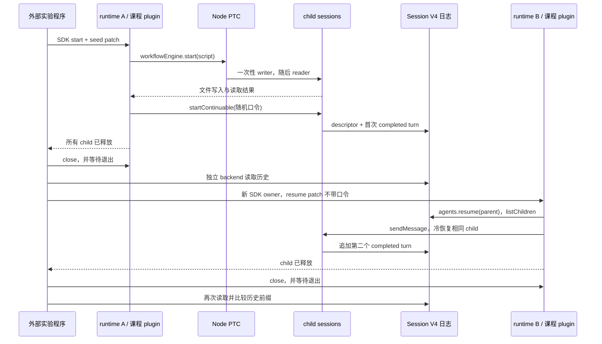

# Workflow PTC 与 child 冷恢复

本实验回答两个问题：PTC 脚本能否调用两个 child 完成可检查的任务；整个 runtime 退出后，父 Agent 能否恢复同一个 continuable child 的历史。先运行，再对照[机制说明](../../how-dsh-works/06-subagent-and-workflow.md)。进阶的进程崩溃、并发上限和三节点森林见[恢复与失败章节](RECOVERY.md)。

## 版本与条件

- npm DSH packages 固定 `0.1.7-rc.2`，Cordis `4.0.4`；源码为 `dsh-v0.1.7-rc.2` / `477b4f420553e8a52c2fbccc464d7561b239c443`。
- Node `^22.19 || >=24`，pnpm `12.3.4`；本次实跑 macOS arm64、Node `26.7.0`。
- 真实调用需要 `DEEPSEEK_API_KEY`，可选 `DEEPSEEK_BASE_URL`，模型 `deepseek-official / deepseek-flash`。无 Key 测试只替换模型响应，仍运行发布的 PTC 子进程、AgentLoop 和 JSONL persistence。
- 先理解 [SDK profile](../../tutorials/typescript-sdk/README.md)、[runtime 所有权](../runtime-supervision/README.md)和[业务恢复与会话恢复](../../docs/comparisons/recovery-and-session-migration.md)。

## 从零运行

在仓库根目录执行：

```sh
cd labs/workflow-child-lifecycle
pnpm install --frozen-lockfile
pnpm test
pnpm typecheck
pnpm lint
pnpm format:check
pnpm build
```

凭据已在环境中时运行 `pnpm live`。也可以让 Node 从本地、未提交的 `.env` 读取：

```sh
# 仍在 labs/workflow-child-lifecycle；根目录 .env 不提交
pnpm exec node --env-file=../../.env --import tsx examples/live.ts
```

`pnpm build` 生成忽略的 `dist/`。SDK 通过公开 `sdk-minimal` profile 加载编译后的课程 plugin；程序不修改 upstream，也不直接启动内部 runtime bin。整个实验通常需要数次模型请求，输出 token 和耗时具有波动性；失败后不会自动重跑。

## 实验结构



[`lesson-plugin.ts`](src/lesson-plugin.ts) 用 host 代码调用公开服务。固定 workflow 脚本先让 writer 用一次 Bash 写出 `workflow-proof.txt`，再让 reader 用一次 Bash 读取；脚本要求返回内容与随机 `FLOW_…` 字符串一致。另一个 continuable child 只记住独立的 `MEMORY_…` 口令，第一次不得调用工具。第二次 runtime 使用相同 Harness home 和 workspace，恢复父 Session，通过 `sendMessage()` 向原 child 发送不包含口令的任务，要求一次 Bash 写出 `cold-proof.txt`。

父 Agent 的 `agent/pre-step` 被课程 plugin 显式拒绝，避免 child settlement 通知额外触发父模型请求。这是 host 驱动的 service 实验，未验证模型生成 workflow 脚本、`tool-workflow` 的 durable UI 事件，也不把父 turn 计为业务成功。脚本没有网络任务。

## 必须同时成立的证据

[`evidence.ts`](src/evidence.ts) 与真实程序共同检查：

1. workflow 返回成功值，两个 member 均 completed，run dispose 后两者均不在 Agent registry。
2. writer/reader 各恰好一个 Bash call/result，命令、call ID 和成功标志匹配；文件恰好 37 字节，无换行。
3. continuable child 第一次仅回复 READY，没有工具调用；关闭后重新读取其持久记录。
4. 第二次 runtime PID 不同；父 catalog 可发现原 child，发现时没有激活它；随后通过原父的公开 `sendMessage()` 恢复。
5. child header、descriptor 和前 14 条事件不变；最终有两个 completed turns，新增消息来源为该父，父 catalog 对这个 child 只有一条记录。
6. 第二次 patch 不携带口令；新增 user/message 也不带口令。唯一 Bash 命令写出正确的 39 字节口令。

模型说 DONE 或 READY、文件单独存在、SDK close 返回、日志单独可读，都不足以替代以上组合检查。SDK JSON-RPC 在此版本仍用 create 接纳首个 prompt；本实验调用的是 plugin 内公开 `ctx.agents.resume()`，没有证明原生 SDK `session(id).run()` 可以冷恢复。

## 组合与生命周期

`src/lifecycle.ts` 持有每个 workflow run 并在所有路径 await dispose。continuable API 的返回只表示 inbox admission；实验继续等待该 child 从 registry 移除，再检查其 residency outcome。plugin 最后 drain descendants 并释放父 handle。

`sessionPersistence` 保存日志；`sessionQuery` 负责读取冷 child 的 descriptor 和父子关系。这里额外加载 `dsh-session-query-sqlite`，配置 `openAt: never` 与 `path: ':memory:'`，保留 exact reads 和 catalog 查询，不开启 SQLite 全文搜索。只有 JSONL persistence 的组合能够创建 child，但无法完成这个冷恢复路径。

workflow 使用 `maxConcurrentAgents: 2`、`maxTotalAgents: 2`；脚本顺序执行两个 child。这些是 helper 的协作限制，不是恶意代码的安全配额。workspace-write 限制来自公开 sandbox provider，VM 本身不是安全隔离层，文件策略不封禁网络。

plugin 的 240 秒信号用于取消 workflow 和停止等待；外部程序 270 秒未收到报告则进入关闭。SDK 初始化上限 120 秒；cleanup 仍等待 provider，不承诺整个实验具有硬性总耗时上限。首次 child 继承父的 512 输出 token 设置；该版本 continuable descriptor 不保存 `maxTokens`，冷恢复使用模型路由默认值，不能把 512 视为恢复后的预算。

## 观察与清理

2026-09-30 的一次真实运行通过：两个 runtime PID 不同，child 日志 `14 → 31`，历史前缀相同，文件 `37 / 39` 字节；公开 backend 重读成功。外部 200ms 进程采样观察到一个 PTC 进程、先后两个 profile runtime，累计 14 个后代 PID，结束时均已退出。采样不能证明从未存在更短命或脱离父子关系的进程。完整元数据和受控测试见[执行记录](../../docs/reviews/2026-09-30-workflow-child.md)。

成功且 close 已确认后删除实验专属临时目录。失败或关闭未确认则输出 `retainedDirectory`，保留日志供本地检查，不输出原始模型内容、API Key 或随机口令。不要提交保留目录；确认相关进程已退出后，只删除输出指向的实验目录。单独删除 `dist/` 不会删除持久状态。

## 未确认与下一步

本页的真实模型流程验证正常退出后的冷恢复。[进阶章节](RECOVERY.md)另用受控模型响应和发布版 runtime 验证 PTC `SIGKILL`、两路并发及总量拒绝、脚本显式重试、flush 后的正常关闭/进程崩溃三节点森林冷恢复，以及合成 V3 parent/child catalog 迁移。中途未提交 turn、工具副作用后的自动重试、外部 provider、恶意脚本隔离、网络策略和所有平台仍未覆盖。[官方Web Host](../web-host-lifecycle/README.md)已有独立浏览器运行证据。
