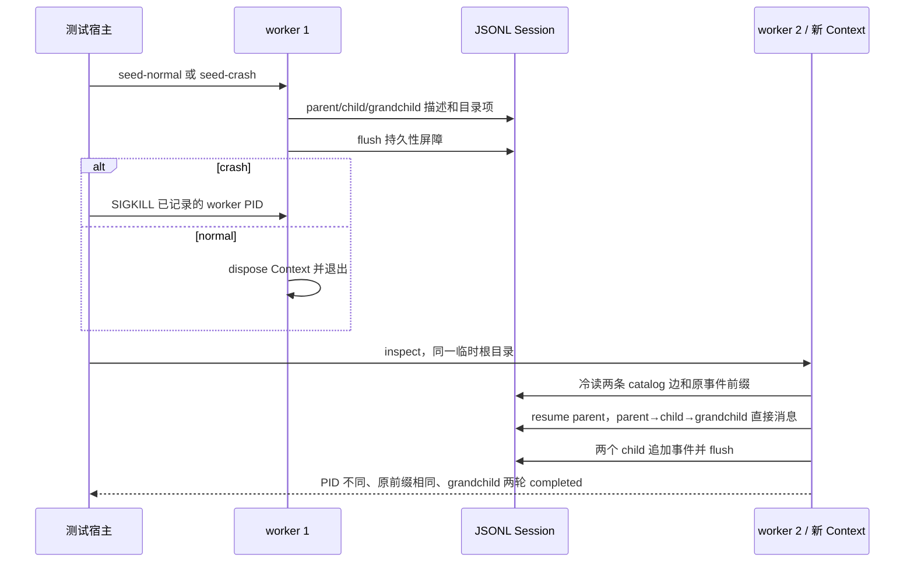

# 进阶实验：PTC 失败、并发上限与 child 森林恢复

本章把正常关闭、PTC 进程死亡、父 runtime 崩溃和历史 child catalog 迁移分开观察。每个成功结论都要求发布版服务的结果、持久日志或外部文件相互印证；错误结果不当成完成。

## 固定版本与运行

本实验锁定 `@deepseek-ai/dsh-*` npm `0.1.7-rc.2`、Cordis `4.0.4`，对应上游 `dsh-v0.1.7-rc.2` / [`477b4f420553e8a52c2fbccc464d7561b239c443`](https://github.com/deepseek-ai/deepseek-harness/commit/477b4f420553e8a52c2fbccc464d7561b239c443)。受控响应只替换模型；Workflow Engine、Node PTC 子进程、AgentLoop、continuable subagent、Session Query 与 JSONL backend 都来自发布包。2026-10-02 在 macOS arm64、Node `26.7.0`、pnpm `12.3.4` 执行。以下命令从本目录运行，不需要 API Key：

```sh
cd labs/workflow-child-lifecycle
pnpm install --frozen-lockfile
pnpm exec vitest run tests/recovery.test.ts
pnpm exec vitest run tests/historical-catalog.test.ts
pnpm test
pnpm typecheck
pnpm lint
pnpm format:check
pnpm build
```

已有的[真实模型路径](README.md#从零运行)仍可用 `pnpm live` 重跑；它验证 Bash 工具的实际写入/读取和正常关闭后的 child 口令恢复。本章的故障实验使用受控响应，不能替代真实模型对新故障脚本的行为验证。

## PTC 进程死亡与部分外部效果

[`tests/recovery.test.ts`](tests/recovery.test.ts) 让已发布的 Workflow Engine 启动真实 Node PTC 进程。脚本先用 Node `fs.writeFileSync` 写入 `ptc-started.json`，其中包含实际 PTC PID；随后对自身发 `SIGKILL`。脚本尾部原本要写 `ptc-completed.txt` 并返回 `{ verified: true }`，故障后两者都不得出现。宿主逐字节核对 marker、确认 PID 与测试进程不同、完成文件不存在、PTC PID 已退出、`stopReason: error`、`value: null`、`agentsStarted: 0`，最后 await run disposal。marker 是**部分外部文件效果**；Workflow 的错误状态没有回滚它。脚本利用 VM 逃逸取到 Node process，仅用来对实验自身做确定性注入，不能据此推断恶意脚本隔离能力。

`FixtureModel` 的第一次 stream 抛出受控错误，使第一个真实 child 失败；Workflow 脚本见到 `agent()` 返回 `null` 后只发起第二个 child。`maxTotalAgents: 2` 限制总调用数，事件记录先 `failed` 后 `completed`，最终只在第二个响应成功时返回 `CONTROLLED`。这是脚本显式写出的重试，不是 DSH 自动重放工具效果。另一脚本用 `parallel()` 同时启动两个 child：受控模型 gate 观察峰值并发 `2`；第三次 `agent()` 被总量上限拒绝，Workflow 以 `error` 结束，模型请求仍只有两次。`maxConcurrentAgents: 2`、`maxTotalAgents: 2` 都是协作上限，不是恶意代码的资源隔离。

## 正常关闭与崩溃后的森林

[`forest-worker.ts`](examples/forest-worker.ts) 在一个独立 Node 进程和全新临时根目录里，用公开 `startContinuable()` 建立 `parent → child → grandchild`。两个 child 的初始模型响应由 gate 控制；worker 等两者实际释放并调用发布版 persistence `flush()`，作为崩溃前的明确持久性屏障。测试对同一逻辑森林分别执行两种收尾：

| 情形     | 第一个进程                                                                                          | 第二个进程                                            |
| -------- | --------------------------------------------------------------------------------------------------- | ----------------------------------------------------- |
| 正常关闭 | 释放父 handle 和 Context，退出码 `0`                                                                | 新 Context 从持久根目录读 catalog 并继续原 grandchild |
| 崩溃     | 保持父 handle/Context，在 flush 后由测试进程对**所启动的 worker PID** 发 `SIGKILL`，观察退出 signal | 新 Context 从同一根目录读 catalog 并继续原 grandchild |



新进程在激活 child 前调用 `listDescendants(parentId)`，得到深度 `1/2`、父 ID 分别为 parent/child 的两行，并确认两个 child 都不在 Agent registry。之后 `agents.resume(parent)`，父向原 child 发送消息；child 活跃时，它作为 grandchild 的**直接父**向原 grandchild 发送消息。最终重读 JSONL：两个 child 的旧事件均为新日志的精确前缀，新增 grandchild user message 的 sender 是 child，grandchild 的两个 turn/end 均为 `completed`。child 可能因 grandchild settlement 通知产生额外的已完成 turn；测试逐一核查其结束原因，不把 child turn 数硬写成两个。

测试对 seed 和 inspect worker 都设置了有限的退出等待；任何失败路径的 `finally` 只通过自己创建的 `ChildProcess` handle 发 `SIGKILL`，等待退出后才删除临时根目录。一个真实 Node fixture 分别模拟 inspector 提前失败与持续挂起，验证这两条清理路径；若 worker 仍不能退出，目录会保留供检查。

崩溃发生在 flush 之后、worker 清理之前；本实验**没有**声称中途未提交 turn 一定可继续，也没有执行重复的有副作用工具。初始实现曾在 gate 刚放行时调用 `drainContinuableDescendants()`，真实日志显示 turn 为 `aborted`；改为等待 child 自行完成后再 drain。此负证据说明“成功调用清理”不等于 child 任务成功。

## 历史 V3 child catalog 与不可变 predecessor

[`fixtures/historical-v3/`](fixtures/historical-v3/) 中三个 JSONL 文件是**手写、确定性的合成 V3 历史**，不是用户已有 Session，也不是发布版录制的旧版本。它们分别保存 parent、child、grandchild 头；两个后代各有自己的 `subagent/descriptor`，两个父日志没有 catalog 项。测试把这些固定字节复制到临时 JSONL root，再调用发布版 backend：

1. `open(id, "read")` 对 parent 和 child 补全逻辑 V4 catalog，得到两条直接父子关系；磁盘仍只有 V3 predecessor。
2. `open(id, "write")` 为三个 Session 各发布 V4 successor；每个 V3 predecessor 的全部字节保持相同。
3. 新 backend 再次打开三份 V4，头、事件、catalog/descriptor 对应关系与迁移读相同；V4 successor 字节在重开后也保持相同。

[`verifyForest()`](src/evidence.ts) 要求头上的直接父 ID、每个父 catalog 的 child ID/创建时间/label、child 自身 descriptor、历史前缀同时一致。负对照删除 child catalog、改错 grandchild header、改 catalog label、增添 descriptor/执行事件或截断前缀，验证器都会拒绝；把合成 V3 grandchild 的 `parentSession` 改成陌生 ID 时，发布版迁移不为 child 虚构 grandchild catalog。这些测试覆盖此固定三节点样本，不证明任意历史 corpus 都可迁移。V3 predecessor 保留也不构成旧版回退支持。

## 结论边界与清理

本章证明的是：受控故障能留下文件部分效果而 Workflow 仍明确失败；两个 child 可并发，第三次调用受上限拒绝；已 flush 的三节点森林可在正常关闭或实际 `SIGKILL` 后由**另一个进程/Context** 冷读并沿直接父链继续；固定 V3 parent/child/grandchild 样本可由发布版 backend 完成 catalog 迁移且保留 predecessor 字节。实验使用每项测试自己的可丢弃临时根目录，`afterEach` 只删除这些目录。测试杀死的 PID 来自自己创建的 worker 或 PTC marker，不操作其他进程。

`SIGKILL` 发生在 flush 之后，因此没有检验半写入 frame、未完成 turn 的补闭、幂等重放或外部工具写入后的未知结果；故障后的 marker 也不能当成完成凭证。真实 Bash 文件结果由[基础实验](README.md#必须同时成立的证据)独立检查。V3 样本的 source 是合成历史；复杂压缩历史和附件引用由[迁移实验](../session-format-migration/RICH-HISTORY.md)验证。
