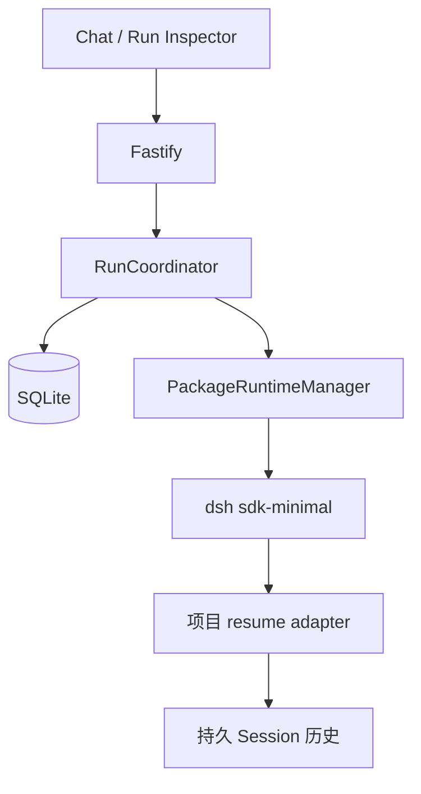
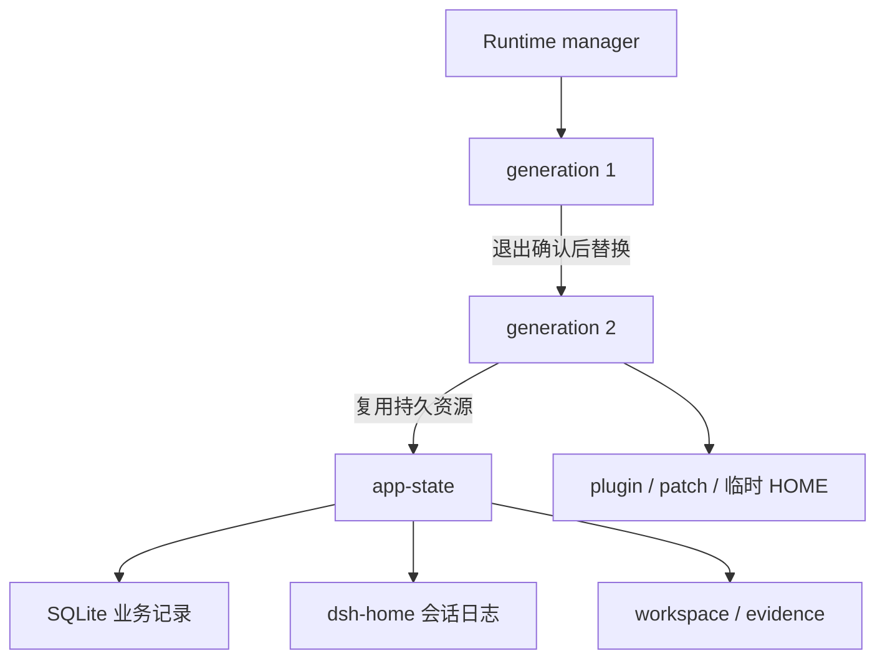
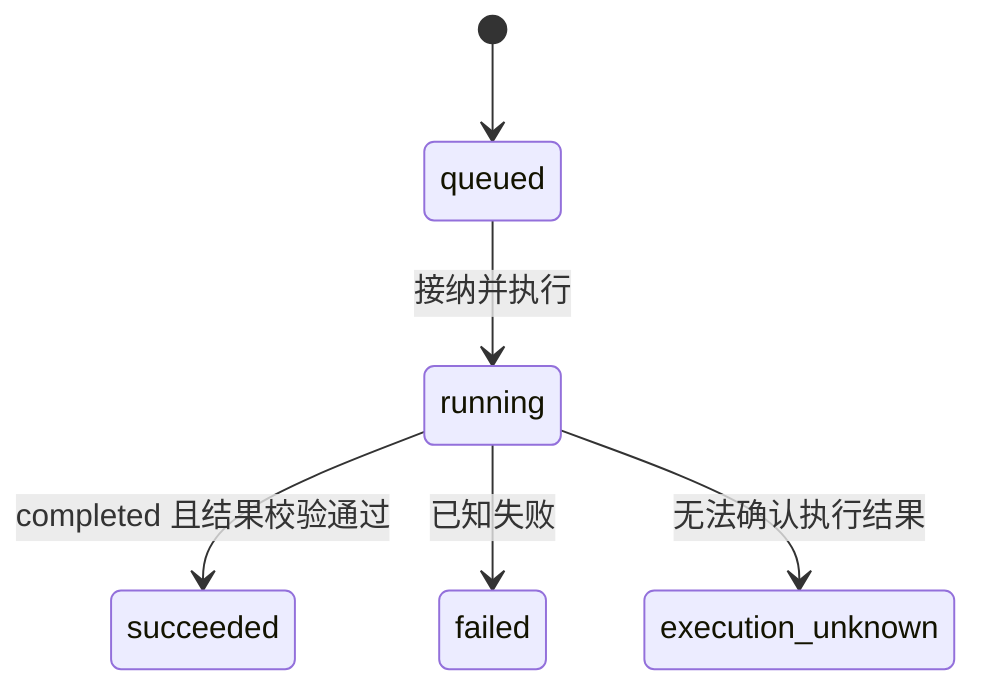
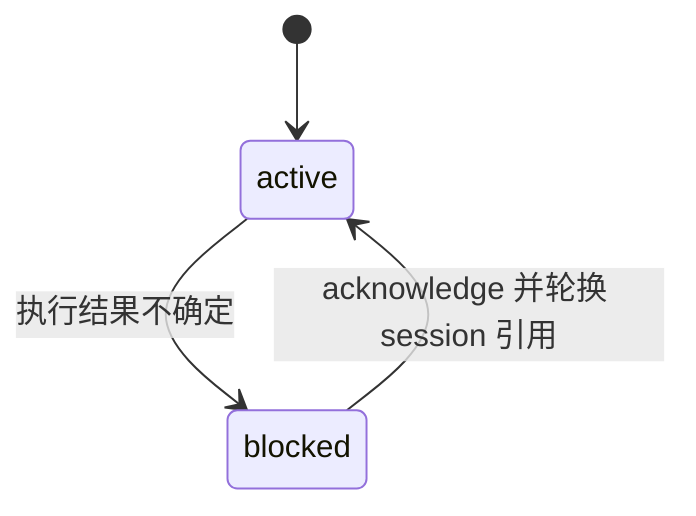
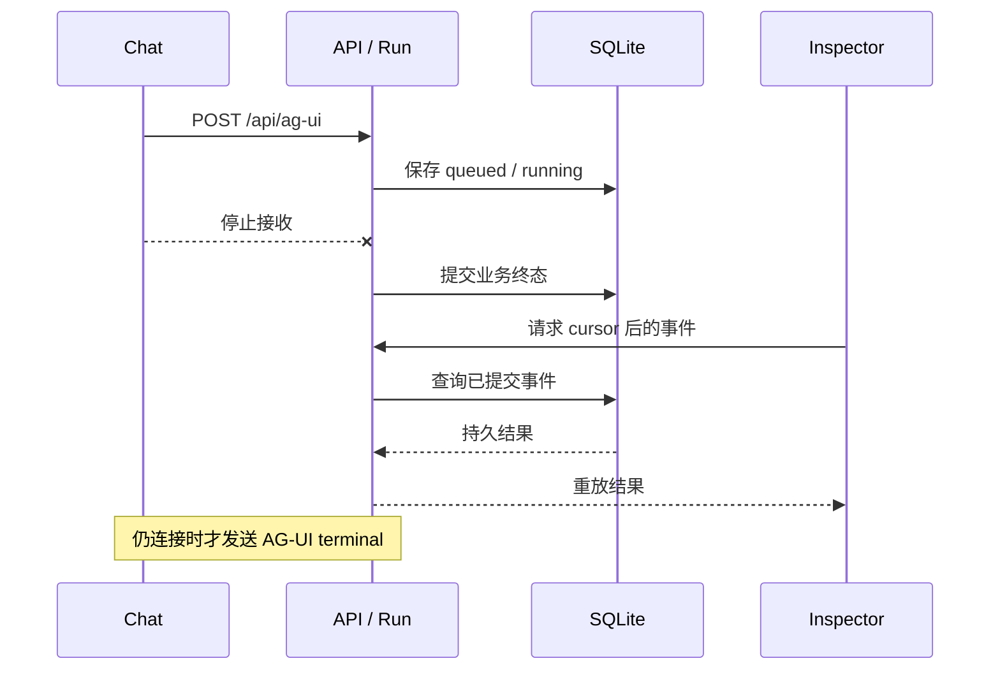

# AG-UI DSH Runtime

> 固定版本（2026-09-29）：npm `@deepseek-ai/dsh@0.1.7-rc.2`、同版本 TypeScript SDK 与 Cordis `4.0.4`；上游源码为 [`dsh-v0.1.7-rc.2`](https://github.com/deepseek-ai/deepseek-harness/tree/477b4f420553e8a52c2fbccc464d7561b239c443)。

聊天窗口停止接收后，右侧 Run Inspector 为什么还会继续更新？点击重启 runtime 后，刚才的对话又如何接上？这个 TypeScript AG-UI 项目把浏览器体验、业务任务记录和 DSH 执行放在同一个可运行应用里，让我们逐一观察这些关系。

Fastify 提供同源 API 与静态页面，React/CopilotKit 展示对话和 Run Inspector；应用 SQLite 保存 Conversation、Run、RunEvent 和不可变 Artifact。DSH Session 只是 runtime 引用，浏览器连接与模型回复都不决定业务终态。本项目只绑定 loopback，没有认证、多租户、wire cancel 或 approval。



先关注两份历史：业务数据库记录“接受了哪个任务、结果是什么”，DSH 日志记录模型会话。后面的重启实验会说明，保存前者并不自动恢复后者。

## 固定工具链

- Node `^22.19 || >=24`、pnpm `11.7.0`、TypeScript `6.0.3` strict ESM/NodeNext。
- AG-UI client/core/encoder `0.0.57`、CopilotKit React Core `1.69.3`、React/ReactDOM `19.2.8`、Fastify `5.12.1` 与 Fastify Static `8.3.0` 保持原版本。
- 同版本 `@deepseek-ai/dsh`、`@deepseek-ai/dsh-sdk-client` 和相关 DSH 包 `0.1.7-rc.2`，Cordis `4.0.4`。
- Stage 4 工具来自 tracked `file:../../labs/cordis-plugin-lifecycle` 的 `./tool`、`./listener` 出口。

本项目不安装 `@ag-ui/server`、`@copilotkit/react-ui` 或 `@copilotkit/runtime`。server/shared/web 有独立 compiler face；browser face不接触 `node:sqlite`、DSH runtime 或模型凭据。

## 安装与运行

本项目复用 [Cordis 实验](../../labs/cordis-plugin-lifecycle/README.md)的工具包。先构建这个文件依赖，再安装本项目。以下命令从仓库根目录开始：

```sh
cd labs/cordis-plugin-lifecycle
corepack pnpm install --frozen-lockfile
corepack pnpm build
cd ../../projects/ag-ui-dsh-runtime
corepack pnpm install --frozen-lockfile
corepack pnpm build
```

第一次体验可直接运行已构建的 fake 应用，不需要模型凭据。它使用临时业务状态，关闭后删除：

```sh
corepack pnpm start:fake
```

打开 `http://127.0.0.1:4317`。点击 New 创建 Conversation，再发一条消息；观察主聊天区与 Run Inspector 展示同一次 Run 的不同信息。fake 模式用于检查应用交互，不证明真实模型、工具或 Session 恢复已经通过。

需要开发页面时，改用两个终端，二者都停留在 `projects/ag-ui-dsh-runtime` 目录；先停止上面的 `start:fake`，避免占用同一端口：

```sh
# 终端 A：持续运行 API 服务
corepack pnpm server:fake
```

```sh
# 终端 B：持续运行 Vite 页面
corepack pnpm dev:web
```

开发模式访问 `http://127.0.0.1:5173`，Vite 只把 `/api` 代理到 loopback Fastify `:4317`。两种 fake 启动方式用的是同一套应用语义。server entry 必须显式选择 `--runtime fake|package`；没有 source checkout 模式。

真实 package 模式要求本地 `DEEPSEEK_API_KEY`、已构建的 server 和可丢弃 workspace。以下命令从本项目目录加载仓库根目录的私有 `.env`，在 loopback `:4317` 同源提供页面与 API：

```sh
node --env-file=../../.env dist/server/server/entry.js \
  --runtime package --host 127.0.0.1 --port 4317 --serve-web
```

默认业务状态位于 ignored `.runtime/app-state`。可用 `--state-root /absolute/disposable/path` 选择独立状态；不要把生产或个人 Session 数据交给本地 demo。`corepack pnpm start:package` 适用于凭据已经由 shell 注入的情况。

## 运行时组成和恢复

真实模式仍由公开 npm `dsh --profile sdk-minimal` 启动。`PackageRuntimeManager` 准备两个有序 patch：应用层禁用默认 shell、保留 `includeRuntimeContext: false` 并启用编译后的 resume adapter；工具层加入唯一可见的 `write_stage4_proof`、审计 listener 和工具清单检查。工具描述与参数 schema 由 Stage 4 包提供，补丁不复制源码。

这样选择工具是为了把实验缩小到一个可检查的副作用，不是建立了安全沙箱。`sdk-minimal` 的执行策略仍是 `danger-full-access`，插件与 runtime 拥有进程权限，因此真实运行必须使用隔离、可丢弃的 workspace。

先把 generation 理解为“一次 runtime 启动所需的临时代码与配置”。它保存复制的 plugin/adapter、补丁、临时 HOME 和可见工具证明，确认 runtime 退出后才删除。较长寿命的 `.runtime/app-state` 目录权限为 0700，其中保存 0600 owner marker、SQLite、workspace、evidence 与独立 `dsh-home/sessions`，不会因为一次 generation restart 就清空。



读 [`src/server/package-runtime.ts`](src/server/package-runtime.ts)时，沿 generation 准备与关闭路径看这些资源。server build 与已安装 Stage 4 文件的路径、出口和 hash 会在准备和首次启动前核对；关闭失败就隔离 owner，不在旧进程旁启动新 generation。restart 与 shutdown 期间拒绝新 Run。启动依据是发布包和本项目构建产物，不依赖 upstream source bin。

留下日志后，新进程仍需要一个恢复入口。锁定版本的 stock SDK JSON-RPC server 首次见到 Session ID 时调用 `agents.create()`；它不会因为同 ID 的日志在磁盘上就自动 resume。

本项目的 [`sdk-resume-adapter.ts`](src/server/sdk-resume-adapter.ts)只代理这一步：先用 `sessionPersistence.stat(id, { signal })` 读取对应持久 header；没有记录才 create。有记录时，把持久化和请求的 cwd 都转换为真实路径并核对，匹配后调用 `agents.resume()`。stat、cwd 或 resume 失败就报错，不回退成新对话。其他官方 server wire 行为保持不变。

理解这个分支后，再读 `tests/sdk-resume-adapter.test.ts` 的“没有日志”“cwd不匹配”“resume失败”三种输入。真实恢复实验则在第一轮记一个随机 nonce，重启 generation 后只问代号；第二轮问题和工具文件都不能带答案。末尾的真实 gate 自动做了这些核对，不能用 fake 页面体验代替。

## 业务状态、事件与产物

一个输入到达 `/api/ag-ui` 后，先由 `AuthoritativeStore` 在事务中分配 Conversation 内的单调序号、保存不可变请求与 fingerprint，再写 queued event。数据库使用 Node `DatabaseSync`、WAL 和 busy timeout。同一 Conversation 只允许一个 active Run，两个不同 Conversation 可以并发。

如果应用重启时发现历史 `running`，它无法据此判断外部工具做到了哪一步，于是把 Run 标为 `execution_unknown`，并 block Conversation。这里 unknown 是一个业务 Run 状态；与 Python 可恢复项目使用 failed+错误码的表达不同。





acknowledgement 允许 Conversation 开始新的工作，不重试旧 Run，也不证明未知副作用可以重复。已有 SQLite schema v2 和旧 RunEvent 仍按原 seq/type/payload 重放；SDK 升级没有改变这份业务 schema。

再看文字如何进入聊天框：DSH V4 的 `assistant/message` 是已提交消息，`AguiProjector` 将文本块转换成一组 `TEXT_MESSAGE_START/CONTENT/END`。AG-UI 的 CONTENT 事件存在，不代表底层正在逐 token 推送。原始 DSH notification 先写 SQLite，再投影成 AG-UI。

工具调用必须对应同一步已提交的 assistant call；V4 `tool/result` 的 call ID 从 `event.data.message.toolCallId` 读取。结束时还要检查最后一个 root `turn/end.reason.kind`：只有 `completed` 才有资格进入 succeeded，`max-tokens`、`error` 等会使 Run failed。失败时已可验证的 proof 仍会快照为 Artifact，因此不能只用“有下载文件”判断 Run 成功。

最后看下载内容从哪里来。coordinator 从 root `tool/call` 取 call ID，计算 `sha256("stage5-proof-v1\0" + session + "\0" + callId)` 目录，再亲自检查 0700 partition、0600 普通 proof 文件和 accepted prompt 的精确字节。验证过的 BLOB/hash 原子写入 SQLite，模型自述与 runtime 返回的字节不作为下载真源。

audit 为同一 call ID 记录 `live,durable`；health 出现 violation 需要排查。失败或未知终态尽可能保留可验证 proof；若 Artifact 写入失败，则 quarantine 唯一原件并停止接纳新 Run，避免为了继续服务丢掉尚未落库的证据。

## AG-UI 与 HTTP

主要接口：

- `POST /api/conversations`、`GET /api/conversations/:id`：创建业务 Conversation 与 SQLite hydration snapshot。
- `POST /api/ag-ui`：AG-UI `RunAgentInput`，新 Run 输出 SSE；重复 Run ID 返回 409 和 replay 链接。
- `GET /api/runs/:id`、`GET /api/runs/:id/events`、`GET /api/runs/:id/stream`：权威 Run、分页事件和持久游标 business SSE。
- `GET /api/artifacts/:id`：下载 SQLite 的 immutable BLOB。
- `POST /api/runtime/restart`、`POST /api/conversations/:id/acknowledge`：idle runtime generation restart 与不确定执行确认。
- `GET /api/capabilities`、`GET /api/health`：明确 false 的 cancel/approval 与不含 PID 的 last-observed 健康信息。

现在回到开头的现象：聊天流断开，只移除浏览器 waiter，Run 仍在服务端执行。Run Inspector 先按 SQLite cursor 分页，再订阅后续业务事件，重连时从确认位置继续。浏览器 Stop 的意思是停止接收，不能当作 wire cancel。

小屏阅读时可[打开此图的 SVG](assets/run-replay-sequence.svg)放大查看。下图为可编辑的 Mermaid 源，SVG 由同一版本图生成。



关闭整个应用又是另一层操作。Fastify `preClose` 停止接纳新 Run，为 active Run 提供有界等待；超时按 unknown 结算并关闭整个 transport。无论浏览器是否还连接，SQLite 终态都先于 AG-UI terminal 提交。

## 验证

```sh
corepack pnpm test
corepack pnpm test:web
corepack pnpm typecheck
corepack pnpm lint
corepack pnpm format:check
corepack pnpm build
corepack pnpm smoke:server
corepack pnpm list -r @ag-ui/client @ag-ui/core @ag-ui/encoder
```

`smoke:server` 从外部 cwd 启动 built fake entry，验证 loopback health、静态 HTML/asset、adapter ESM 和关闭。真实模型 gate 需要私有本地 `.env`；它在临时状态内创建两个 Conversation、四个 Run，验证每个下载的精确 Artifact 字节、大小与 SHA-256、同 Session 跨 generation 的随机 nonce 回忆、AG-UI detach 后 business replay cursor、audit 对应及进程清理。nonce 验收只看最后一条 root 已提交 assistant 消息，去除首尾空白后必须与 nonce 完全相等；第二轮 prompt 和工具产物均不得包含 nonce：

```sh
node --env-file=../../.env scripts/real-package-e2e.mjs
```

2026-09-29 的固定版本实跑结果：两个 Conversation、四个 succeeded Run、四个精确 BLOB 下载及大小/hash 校验、四组 `live,durable` audit；generation 1→2 后同一 Session 的最后一条 root 已提交回复恰好等于未在第二轮 prompt 或工具文件中泄漏的随机 nonce。断开的 AG-UI 请求仍到达 business terminal，游标重放得到 32 个后续 ID；外部观察到的两个 runtime 后代进程在关闭后都已退出。这是项目 adapter 与此机器的运行证据，不扩大成 stock SDK 的恢复保证。

## 生产限制

- 无认证、租户隔离、远程 sandbox、wire cancel、approval 或多进程协调；不要绑定公网。
- `sdk-minimal` 默认权限宽；虽然本项目关闭默认 shell 并检查可见工具清单，插件和 runtime 仍拥有进程权限。
- 本地 hash/regular-file 检查是合作式漂移检测，不是对同 UID 并发替换者的不可变依赖快照。
- Artifact、Session 与业务 Run 的恢复层级不同；任意旧版 Session 文件不因业务事件可重放就自动具备跨版本模型历史恢复能力。
- 2026-08-31 旧 `0.1.1-rc.2` source-mode 验收只作为历史，不能替代上述固定新版测试。
