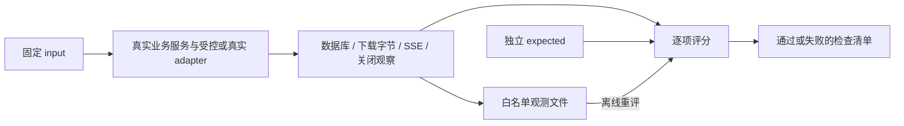

# 第 7.6 课：Eval 与可重放回归

这套评测回答一个明确问题：修改可恢复服务后，它是否仍然按约定处理成功、工具错误、中止、断线和恢复？每个案例都有固定输入、独立期望和明确检查项。先运行应用得到实际观察，再评分；不能从 expected 生成 actual，也不能只看测试进程是否退出成功。

本课复用[可恢复服务](README.md)的 SQLite、coordinator、FastAPI、SSE 和产物下载，固定 Python SDK/runtime `0.1.5rc1`。前一课的[用量观测](../../labs/run-observability/README.md)使用 npm `0.1.7-rc.2`；本课评测的是业务服务，没有把两个 SDK 的事件格式混用。

## 1. 跑完整的无模型评测

从仓库根目录开始：

```sh
cd projects/recoverable-agent-service
uv sync --locked --group dev
uv run --python 3.10 python examples/evaluate.py
```

输出 `counts.selected=5, passed=5, failed=0, not_run=0`，退出码为 0。此模式使用可控 RuntimeAdapter，但数据库、worker、HTTP 路由、SSE 编码和产物快照都执行项目代码。HTTP 使用 TestClient/ASGI，不是一个真实 TCP 断线实验。

每个案例的 17 项检查全部通过才算通过，没有用平均分抵消某项失败。`runtime_calls` 统计 RuntimeAdapter.run 调用次数，不是 provider 请求数：一个 Agent Run 内可以有多次模型调用和工具调用。

| 案例 | 注入条件 | 必须观察到的结果 |
| --- | --- | --- |
| `success` | 写入输入指定的 proof | succeeded、completed、精确下载字节与元数据 |
| `tool-error` | 一个 tool_result 标为错误，随后 turn completed | Run succeeded，但产物 missing、下载 404，tool_errors=1 |
| `aborted-turn` | 返回已经结算的 aborted | Run failed、agent_outcome、runtime_finish=aborted |
| `transport-disconnect` | adapter 抛执行不确定错误 | Run failed、execution_uncertain、Conversation attention_required |
| `recovery` | SQLite 中预置重启前的 running Run | 启动后标为执行不确定，不重跑；确认恢复后新 Session 执行新 Run，旧 Run 保留 |

每个场景还检查幂等重复提交、完整 SSE 与数据库一致、按游标重放、终态游标返回空流，以及 cleanup 已确认。`tool-error` 用例通过，只说明应用实现了这条错误处理约定，不表示模型完成了一个必须交付产物的用户任务。如果业务把“产物必须可用”作为成功条件，需要另外定义相应的产品检查。

## 2. 固定输入、期望与实际观察分别放在哪里

[`eval/cases.json`](eval/cases.json)拥有数据集版本和五个案例，每项分为：

- `input`：任务 prompt、产物名、公开虚构的产物内容。
- `expected`：应当满足的状态、runtime 终态、调用次数、下载 hash/字节数、SSE 和恢复检查。
- `metadata`：场景说明与证据类别，不作为模型输入。

这个拆分参考 [Langfuse 的数据集指南](https://langfuse.com/academy/datasets)。本课使用本地文件和现有业务约定，没有创建或上传远端数据集，也没有把自动生成的开放题答案当作人工标注的标准答案。



[`eval_scenarios.py`](src/recoverable_agent_service/eval_scenarios.py)只读取 scenario 和 input，从实际服务状态及外部字节生成 Observation，不读取 expected。受控 adapter 本身按 scenario 产生预定行为，所以这部分验证应用如何处理这些行为，不验证模型能否自主产生它们。真实模型分支则要求模型实际写出产物。

[`eval_contract.py`](src/recoverable_agent_service/eval_contract.py)校验 fixture 并评分。空数据集、重复 case ID、重复 JSON key、未知字段、缺失检查、bool 冒充整数和无效枚举都不能静默通过。可用产物的期望 hash/字节数必须匹配 input 的 UTF-8 内容，避免先写入一个自相矛盾的基准。

评分结果只输出检查名及布尔结果，不回显任意失败值。观察字段包括 `runtime_finish`，因此把 aborted 错误地变成 max-tokens 不能因二者同属 `agent_outcome` 而通过。

## 3. 用反例证明评测能失败

```sh
uv run --python 3.10 python examples/evaluate.py --negative-control
```

预期退出码为 **1**，五例中一例失败，失败项为 `runtime_calls`。命令先运行实际受控场景，再故意给第一个案例的观察调用次数加 1；它不修改服务、fixture 或期望值。这个负对照说明评分器能识别该类错误，不是让所有结果自动通过。

单独运行一个案例：

```sh
uv run --python 3.10 python examples/evaluate.py --case aborted-turn
```

报告会明确列出 selected 和另外四个 not_run。单例通过不能被显示成全套五例都通过；未知选择和空评测返回配置错误。

默认输出是成功/失败的精确检查，不是模型综合能力分数、生产成功率或质量置信区间。本课没有 LLM-as-a-Judge、开放题语义评分或统计采样结论。

## 4. 保存观察，离线重新评分

```sh
mkdir -p .data
uv run --python 3.10 python examples/evaluate.py --record .data/eval-observations.json
uv run --python 3.10 python examples/evaluate.py --replay .data/eval-observations.json
```

record 文件权限为 0600，已有路径会被拒绝覆盖。需要新的采样时使用新的文件名，不自动刷新“golden”。

每个执行子进程在运行前核对父进程传入的数据集指纹，防止途中修改文件导致“执行新版输入，却按旧版记录”。

记录包含白名单 Observation、原始模式、案例集合和数据集指纹；没有 prompt、模型回复、原始错误、token 或 artifact 原始字节。只保存状态、有限标签、计数、hash、大小和布尔检查。离线重评不执行 RuntimeAdapter，也不需要 API key；它不会重新测试已经修改的应用代码，代码回归需要重新执行场景取得观察。`execution=record-replay` 与记录原本的 `mode` 分开显示，避免把重评误读成一次新的模型实验。

读入时检查 8 MiB 上限、严格 schema、案例归属及数据集完整指纹。修改 input、expected 或 metadata 后旧记录会被拒绝，不能换了题目却继续引用旧结果。修改数据集时应升级 dataset_version，并重新取得观察。

指纹用于发现数据集不匹配，不是签名。任何能修改记录的人仍能伪造符合 schema 的观察，因此它不是防篡改审计存储或可信第三方评测。

## 5. 单独验证真实模型成功路径

环境已有 `DEEPSEEK_API_KEY` 时：

```sh
uv run --python 3.10 python examples/evaluate.py --real
```

或者从仓库根目录被忽略的 `.env` 加载并保存记录：

```sh
mkdir -p .data
uv run --env-file ../../.env python examples/evaluate.py --real --record .data/eval-real.json
uv run python examples/evaluate.py --replay .data/eval-real.json
```

`--real` 只选择 `success`，报告其余四例 not_run；没有 key 时退出码为 2，不会悄悄跳过后显示成功。执行前检查已安装 SDK 与 runtime wheel 的版本与数据集 pin 一致。模型请求沿用现有 DSHRuntimeAdapter，独立临时数据库、workspace 和 dshHome，完成后核对真实下载字节与 hash、SSE、幂等和关闭状态。

真实模式没有注入 provider 断线、工具失败或用户取消。那四种情况下的应用行为来自受控案例，不能借用一次真实成功扩大为全部故障已真实验证。详细运行结果见[本课验收](../../docs/reviews/2026-09-30-eval-regression.md)。

## 6. “取消”和“恢复”的含义

`aborted-turn` 注入的是一个已经结束的 RuntimeResult，不提供新的 HTTP cancel 或 SDK per-prompt cancel。`transport-disconnect` 证明应用保守记录执行不确定，并要求后续确认；它不是对真实网络连接执行断流。

`recovery` 使用本机持久 SQLite 预置 running Run，启动恢复后验证 failed/execution_uncertain 和 attention_required，再确认新 Session 与旧记录保留。新 Run 是显式提交的新工作，不自动续跑旧 prompt，也不恢复旧模型记忆。

SSE 验证在终态后读取完整事件，再按 Last-Event-ID 重放；完整帧还会逐项对照 SQLite 原始事件及连续 seq，避免“完整接口与重连接口丢掉同一事件”仍然通过。它覆盖游标重放语义，未制造真实 TCP 断线。

## 7. 退出码与验证范围

| 退出码 | 含义 |
| --- | --- |
| 0 | 本次 selected 的全部检查通过 |
| 1 | 至少一项检查失败，包括预期的 negative control |
| 2 | 配置、记录、版本或执行基础设施错误，无法完整评分 |

```sh
uv run --python 3.10 pytest
uv run --python 3.10 ruff check .
uv run --python 3.10 ruff format --check .
uv lock --check
```

CLI 为每个案例启动独立的 POSIX 子进程组，默认 deadline 为受控案例 15 秒、真实案例 240 秒，可用 `--case-timeout SECONDS` 调整。子进程内服务仍保留 drain 语义；deadline 到达由父进程终止自有进程组，并在有限宽限后强制回收，报告退出码 2。主进程已退出但仍有同组后代，也会回收并拒绝本次结果。

这个 watchdog 是评测基础设施的终止保护，不是 SDK cancel，也不能证明外部副作用被撤销；主动脱离进程组的进程和远端任务不在它的确认范围内。支持范围为 POSIX，不能把它当作 Windows 或多租户安全 sandbox。调用方只在每例正常返回且关闭已确认后删除临时目录；超时、执行或关闭未确认时保留目录，在 stderr 打印位置。文件清理失败也返回 2，不先打印通过报告。

调用次数、runtime 终态和幂等检查在服务完全关闭后采集或复核，防止关闭期间的迟到工作逃过评分。

本课提供可在 CI 调用的退出码，没有配置远端 Actions、上传数据集或触发发布。下一课 [7.7 跨 runtime 适配](../../docs/learning-paths/engineering.md)将用共同场景标记协议支持范围，不用统一接口伪造缺失能力。
