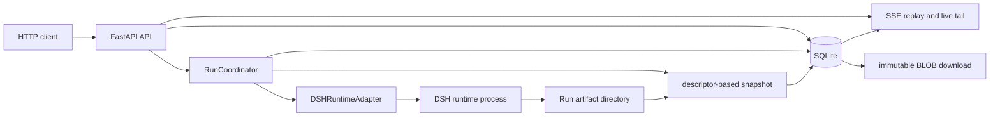

# Recoverable Agent Service

这是一个可直接运行的 Python 3.10+ FastAPI 学习项目。它演示怎样把 DSH 用作 Agent runtime，同时由应用自己的 SQLite 数据库持有权威业务状态。项目没有浏览器 UI；调用方通过 JSON HTTP API、SSE 和不可变产物下载接口完成整个流程。

项目锁定 `deepseek-harness-sdk==0.1.1rc1`，对应 DSH upstream tag `dsh-v0.1.1-rc.1` 和 commit `528c682e061696f5a160f363f236ecbf53cbd006`。

## 架构



`Conversation`、`Run`、`RunEvent` 和 `Artifact` 存在 SQLite 中。DSH session ID 只是 Run 调用 runtime 时使用的外部引用，不是业务 Task 或 Run 的主键，也不承担恢复事实。进程内 notifier 只负责唤醒 SSE reader；事件顺序、游标和终态都必须重新查询 SQLite。

## 状态与不确定执行

新 Run 先以 `queued` 持久化，再由单 worker 条件领取为 `running`。只有正常返回且 `finish_reason == "completed"` 才进入 `succeeded`。调用 `Session.run()` 前的启动错误记为 `runtime_unavailable`；调用开始后的异常无法证明 prompt 未被接受，因此记为 `execution_uncertain`，并把 Conversation 置为 `attention_required`。

服务重启时，历史 `running` Run 会保守地失败为 `execution_uncertain`，不会自动重跑。调用恢复确认接口后，Conversation 回到 `active` 并获得全新的 DSH session ID；旧 Run 保留原 session 快照。这个动作不重试旧 Run，也不声称外部工具副作用安全。

## 安装与启动

从项目目录运行：

```sh
cd projects/recoverable-agent-service
uv sync --group dev
uv run python -m recoverable_agent_service
```

服务仅绑定 `127.0.0.1:8000`。本项目没有认证或公网部署配置，不应直接改成公共监听地址。

| 环境变量 | 默认值 | 用途 |
| --- | --- | --- |
| `RECOVERABLE_AGENT_DATABASE` | `.data/service.db` | SQLite 数据库 |
| `RECOVERABLE_AGENT_WORKSPACE` | `workspace` | DSH workspace 与产物 staging 根目录 |
| `RECOVERABLE_AGENT_SESSION_ROOT` | `.sessions` | DSH session 持久目录 |
| `DSH_PROVIDER` | `deepseek-official` | DSH provider |
| `DSH_MODEL` | `deepseek-v4-flash` | DSH model |
| `DEEPSEEK_API_KEY` | 无 | 真实 provider 凭据，只从环境传入 |

如果仓库根目录已有本地 `.env`，可用 `uv run --env-file ../../.env python -m recoverable_agent_service` 启动。不要把凭据写进命令、源码、fixture 或日志。

## HTTP API

所有路径都位于 `/api`：

| 方法与路径 | 结果 |
| --- | --- |
| `POST /api/conversations` | 创建 Conversation，返回 201 |
| `GET /api/conversations/{id}` | Conversation 与最近 Run 摘要 |
| `POST /api/conversations/{id}/runs` | 需要 `Idempotency-Key`；新建返回 202，完全重放返回 200 |
| `GET /api/runs/{id}` | Run 结果、错误、产物元数据与 `events_url` |
| `GET /api/runs/{id}/events` | 按持久 seq 回放并继续等待的命名 SSE |
| `GET /api/runs/{run_id}/artifacts/{artifact_id}` | 只下载 `available` 的不可变 BLOB |
| `POST /api/conversations/{id}/acknowledge-recovery` | 确认恢复并旋转 DSH session |
| `GET /api/health` | 数据库、coordinator 与 worker 可用性 |

创建和提交示例：

```sh
curl -sS -X POST http://127.0.0.1:8000/api/conversations \
  -H 'Content-Type: application/json' \
  -d '{"title":"artifact demo"}'

curl -sS -X POST http://127.0.0.1:8000/api/conversations/CONVERSATION_ID/runs \
  -H 'Content-Type: application/json' \
  -H 'Idempotency-Key: demo-1' \
  -d '{"prompt":"write the requested proof","artifacts":["proof.txt"]}'
```

同一 Conversation 同时只允许一个 `queued` 或 `running` Run。同一个规范化 key 与相同请求指纹返回已有 Run；相同 key 但 prompt 或产物声明不同返回 409。请求响应不会暴露 agent-facing `runtime_input`，产物元数据也不会内嵌 BLOB。

## SSE 与断线重放

`Last-Event-ID` 缺省为 0，必须是非负整数；非法值返回 400，超过当前 `last_event_seq` 返回 409，未知 Run 返回 404。这些检查和首次数据库查询都在构造 `StreamingResponse` 前完成，因此不会把错误伪装成已经开始的 200 stream。

每帧使用持久 RunEvent 的 seq、type 和 canonical JSON：

```text
id: 3
event: text_delta
data: {"text":"hello"}
```

stream 会回放 `seq > Last-Event-ID`，在每次 notifier wake 或心跳后重新查询 SQLite，并在 `run.succeeded` 或 `run.failed` 后关闭。若游标已等于终态事件 seq，则返回空的正常 SSE 响应。断线后使用最后收到的 `id` 重连即可；notifier 不是重放存储。

## 产物安全

调用方只能声明安全的单文件名。服务从不跟随预先放置的 `artifacts` 或 Run 目录符号链接；它在模型运行前保留 Run 目录描述符，完成后通过该描述符打开、检查并读取每个文件。只接受不超过 1 MiB 的普通文件。可用字节、SHA-256、大小和媒体类型原子写入 SQLite，下载始终读取不可变 BLOB，不会重新打开可变 workspace 路径。缺失、符号链接、非普通文件、超限或读取失败的产物不可下载。

## 验证

默认 pytest 配置排除真实 E2E，因此下列命令不需要凭据：

```sh
uv run --python 3.10 pytest
uv run --python 3.10 ruff check .
uv run --python 3.10 ruff format --check .
uv lock --check
```

真实 E2E 只能显式运行，并只从仓库根目录的本地 `.env` 注入凭据：

```sh
uv run --env-file ../../.env pytest -m e2e
```

该测试通过完整 FastAPI lifespan 创建 Conversation 和 Run，让真实 Agent 在服务指定路径写入无换行 proof artifact，等待终态，然后核对下载字节、SHA-256 和 SSE 终态。没有 `DEEPSEEK_API_KEY` 时它会自跳过。

## 生产限制

- V1 只有一个应用进程和一个 worker，没有多进程 lease 或分布式 claim。
- 没有 cancel、approval、ask-user、认证、租户隔离、配额或远程 sandbox。
- 卡住的 provider 调用可能无限延迟优雅关闭，因为当前切片不伪造安全取消语义。
- `execution_uncertain` 必须由人确认后开启新 session；服务不会自动续跑不确定执行。
- 健康接口只报告数据库、coordinator 和 worker 当前可用，不保证外部副作用可恢复。
- POSIX 目录描述符与 `O_NOFOLLOW` 是当前产物隔离前提；本项目不声明 Windows 等价实现。
