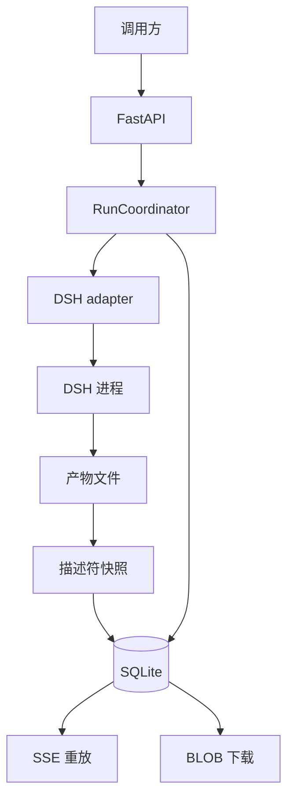
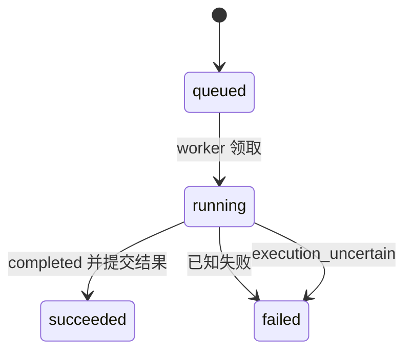
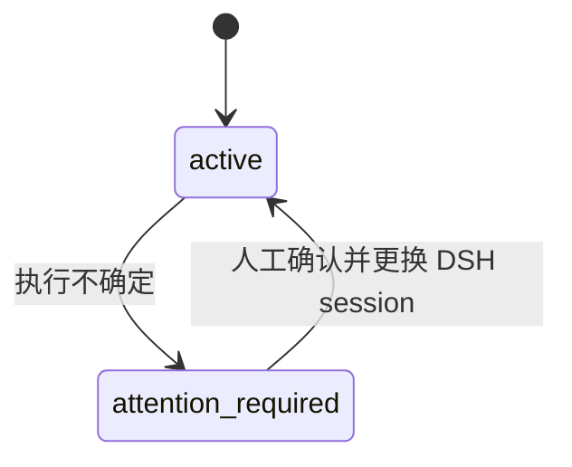

# Recoverable Agent Service

> 已验收版本（2026-09-29）：PyPI `deepseek-harness-sdk==0.1.5rc1` 与匹配的 runtime wheel；对应上游 [`dsh-v0.1.5-rc.1`](https://github.com/deepseek-ai/deepseek-harness/tree/183f08e9c6dde7e36cd2318eaee70b0da08fb35e)。

Agent 已经写好了文件，HTTP 连接却断了：客户端该重发任务，还是先查结果？如果服务随后重启，又凭什么判断那次工作有没有执行？这个 Python 3.10+ FastAPI 项目围绕这些问题，把业务记录存入应用自己的 SQLite，让 DSH 专心负责 Agent 执行。

你会创建 Conversation、提交一个 Run，观察持久事件，再下载由服务验证并保存的产物。项目没有浏览器 UI，整个流程通过 JSON HTTP API、SSE 和产物下载接口完成。建议先跑过 [FastAPI 101](../../tutorials/fastapi-101/README.md)，再比较两者如何处理断连和进程退出。

项目精确锁定 `deepseek-harness-sdk==0.1.5rc1`，安装时带入同版本 `deepseek-harness-runtime-bin`。adapter 通过公开的 `sdk-minimal` profile 和独立 Harness home 启动 runtime；运行不依赖单独安装 Node.js。

## 架构


```mermaid
flowchart TD
    Client[调用方] --> API[FastAPI]
    API --> Coordinator[RunCoordinator]
    Coordinator --> Adapter[DSH adapter]
    Adapter --> DSH[DSH 进程]
    DSH --> Files[产物文件]
    Files --> Snapshot[描述符快照]
    Snapshot --> Store[(SQLite)]
    Coordinator --> Store
    Store --> Events[SSE 重放]
    Store --> Download[BLOB 下载]
```

从客户端的角度，`Conversation` 是一段业务对话，`Run` 是其中一次工作；`RunEvent` 记录工作过程，`Artifact` 保存可下载结果。这四类记录都由 SQLite 持有。DSH session ID 是 Run 调用 runtime 时的引用，不是业务 Run 的主键，也不能单独告诉客户端该不该重试。

事件通知也遵循这个分工：进程内 notifier 只负责叫醒 SSE reader，reader 醒来后重新查询 SQLite。即使错过一次唤醒，只要事件已提交，下一次查询仍能读到。事件顺序、游标与终态因此不依赖某条 HTTP 连接的寿命。

## 状态与不确定执行

新 Run 先以 `queued` 写入数据库，单 worker 再有条件地领取为 `running`。只有正常返回且 `finish_reason == "completed"`，并完成本次结果提交，才能进入 `succeeded`。这让客户端可以先得到业务 ID，再持续查询；模型回复不承担任务状态记录的职责。

失败要再分两种。调用 `Session.run()` 之前启动失败，服务知道输入尚未交出，记为 `runtime_unavailable`。调用开始后再抛异常，就不能证明输入没被接受：工具可能已经产生副作用。这时 Run 以 `execution_uncertain` 失败，Conversation 进入 `attention_required`，等待人确认。


```mermaid
stateDiagram-v2
    [*] --> queued
    queued --> running: worker 领取
    running --> succeeded: completed 并提交结果
    running --> failed: 已知失败
    running --> failed: execution_uncertain
```

这里 `execution_uncertain` 是失败的错误码，不是额外的 Run state。它还会影响 Conversation：


```mermaid
stateDiagram-v2
    [*] --> active
    active --> attention_required: 执行不确定
    attention_required --> active: 人工确认并更换 DSH session
```

服务重启时，历史 `running` Run 也按不确定执行处理，已排队的 `queued` Run 则保留。恢复确认接口让 Conversation 回到 `active` 并获得全新的 DSH session ID，旧 Run 保留原来的 session 快照。确认的含义是“允许下一次新工作”，不会自动重跑旧 Run，也不证明外部工具副作用可安全重复。

因此，这个项目的“可恢复”首先指业务记录可查、事件可重放和不确定状态可处理，不是 stock Python SDK 自动恢复跨进程模型历史。SDK 的构造、启动、运行、关闭使用独立执行线程；等待方取消后，先让已经提交的线程工作结算。若回收失败，adapter 禁止复用该 harness。

## 安装与启动

从仓库根目录开始，进入项目后安装并启动：

```sh
cd projects/recoverable-agent-service
uv sync --group dev
uv run python -m recoverable_agent_service
```

服务仅绑定 `127.0.0.1:8000`。这个原始单租户入口没有认证或公网部署配置，不应直接改成公共监听地址。新增[第 7.3 课认证入口](TENANCY.md)监听独立的 8001 端口，提供 Bearer 认证与按租户分开的业务数据库。

| 环境变量 | 默认值 | 用途 |
| --- | --- | --- |
| `RECOVERABLE_AGENT_DATABASE` | `.data/service.db` | SQLite 数据库 |
| `RECOVERABLE_AGENT_WORKSPACE` | `workspace` | DSH workspace 与产物 staging 根目录 |
| `RECOVERABLE_AGENT_DSH_HOME` | `.dsh-recoverable-home` | 独立 Harness home，保存 profile 与 DSH session 数据 |
| `DSH_PROVIDER` | `deepseek-official` | DSH provider |
| `DSH_MODEL` | `deepseek-v4-flash` | DSH model |
| `DEEPSEEK_API_KEY` | 无 | 真实 provider 凭据，只从环境传入 |

如果仓库根目录已有本地 `.env`，可用 `uv run --env-file ../../.env python -m recoverable_agent_service` 启动。不要把凭据写进命令、源码、fixture 或日志。

## HTTP API

所有路径都位于 `/api`：

| 方法与路径 | 结果 |
| --- | --- |
| `POST /api/conversations` | 创建 Conversation，返回 201 |
| `GET /api/conversations/{id}` | Conversation 与最近 Run 摘要 |
| `POST /api/conversations/{id}/runs` | 需要 `Idempotency-Key`；新建返回 202，完全重放返回 200 |
| `GET /api/runs/{id}` | Run 结果、错误、产物元数据与 `events_url` |
| `GET /api/runs/{id}/events` | 按持久 seq 回放并继续等待的命名 SSE |
| `GET /api/runs/{run_id}/artifacts/{artifact_id}` | 只下载 `available` 的不可变 BLOB |
| `POST /api/conversations/{id}/acknowledge-recovery` | 确认恢复并旋转 DSH session |
| `GET /api/health` | 数据库、coordinator 与 worker 可用性 |

下面走完一次文件任务。创建 Conversation 后，把响应里的 `id` 替换到第二条命令的 `CONVERSATION_ID`；提交 Run 后再记下它自己的 `id`。两者不是同一个 ID：

```sh
curl -sS -X POST http://127.0.0.1:8000/api/conversations \
  -H 'Content-Type: application/json' \
  -d '{"title":"artifact demo"}'

curl -sS -X POST http://127.0.0.1:8000/api/conversations/CONVERSATION_ID/runs \
  -H 'Content-Type: application/json' \
  -H 'Idempotency-Key: demo-1' \
  -d '{"prompt":"Write proof.txt with exactly RECOVERABLE_OK and no trailing newline.","artifacts":["proof.txt"]}'
```

用响应里的 Run ID 替换下面的 `RUN_ID`。第一条查看当前状态，第二条接收已有事件并等待终态：

```sh
curl -sS http://127.0.0.1:8000/api/runs/RUN_ID
curl -N http://127.0.0.1:8000/api/runs/RUN_ID/events
```

终态后再次 GET Run，检查 `state`、`finish_reason` 与 `artifacts`。若 `proof.txt` 的 Artifact 为 `available`，把下面的 `ARTIFACT_ID` 替换为该产物的 ID，直接校验下载字节：

```sh
curl -fsS http://127.0.0.1:8000/api/runs/RUN_ID/artifacts/ARTIFACT_ID | \
  uv run python -c 'import hashlib, sys; data = sys.stdin.buffer.read(); print(len(data), hashlib.sha256(data).hexdigest()); assert data == b"RECOVERABLE_OK"'
```

长度应为 14，打印的 SHA-256 应与 Artifact 元数据相同。这是你本次运行的检查，不保证模型一定按要求写对；若 Run failed 或 Artifact 不可用，先查看错误和事件，不要直接重发。

同一 Conversation 同时只允许一个 `queued` 或 `running` Run。可以用完全相同的 key 和请求再提交一次：应拿到已有 Run，状态码为 200，而不是再次执行。相同 key 但 prompt 或产物声明不同返回 409。请求响应不暴露 agent-facing `runtime_input`，产物元数据也不内嵌 BLOB。

## SSE 与断线重放

`Last-Event-ID` 缺省为 0，必须是非负整数；非法值返回 400，超过当前 `last_event_seq` 返回 409，未知 Run 返回 404。这些检查和首次数据库查询都在构造 `StreamingResponse` 前完成，因此不会把错误伪装成已经开始的 200 stream。

每帧使用持久 RunEvent 的 seq、type 和 canonical JSON：

```text
id: 3
event: assistant_message
data: {"session_id":"session-example","text":"hello"}
```

新运行的 `assistant_message` 是根会话已提交的完整文本，不是逐 token 增量。旧 SQLite 中已有的 `text_delta` RunEvent 保留原来的 seq、type 和 data，按原样重放；仅增加事件类型不会升级业务 schema。stream 会回放 `seq > Last-Event-ID`，在每次 notifier wake 或心跳后重新查询 SQLite，并在 `run.succeeded` 或 `run.failed` 后关闭。若游标已等于终态事件 seq，则返回空的正常 SSE 响应。断线后使用最后收到的 `id` 重连即可；notifier 不是重放存储。

可以在收到几条事件后中断 curl，再携带最后收到的 `id` 连接同一个 Run。把 `LAST_SEEN_ID` 替换为实际的非负整数：

```sh
curl -N http://127.0.0.1:8000/api/runs/RUN_ID/events \
  -H 'Last-Event-ID: LAST_SEEN_ID'
```

应只看到更大的 seq；已经到终态且没有剩余事件时，空响应也是正常结果。读源码可沿 `sse.py → store.py`，观察等待如何回到数据库查询。

## 产物安全

下载成功之后，即使 workspace 中的原文件被改了，客户端仍应拿到同一份结果。为做到这一点，服务在模型运行前保留 Run 目录描述符，运行后通过它打开并检查文件，再把可用字节、SHA-256、大小与媒体类型原子写入 SQLite。之后下载读的是 BLOB，而不是再次打开 workspace 路径。

调用方只能声明安全的单文件名；服务不跟随预先放置的 `artifacts` 或 Run 目录符号链接，只接受不超过 1 MiB 的普通文件。缺失、符号链接、非普通文件、超限或读取失败的产物不可下载。Run 完成与某个声明文件可下载是两项检查，客户端应分别读取 Run 和 Artifact 的状态。

## 验证

默认 pytest 配置排除真实 E2E，因此下列命令不需要凭据：

```sh
uv run --python 3.10 pytest
uv run --python 3.10 ruff check .
uv run --python 3.10 ruff format --check .
uv lock --check
```

若想理解“不确定执行”，先读 `tests/test_store.py` 的 startup recovery 与 acknowledgement 两个场景，再运行 `uv run pytest tests/test_store.py -k "startup_recovery or acknowledgement"`。它们用受控数据库状态验证重启处理与 session 轮换，不需要故意中断一次付费模型任务。

真实 E2E 只能显式运行，并只从仓库根目录的本地 `.env` 注入凭据：

```sh
uv run --env-file ../../.env pytest -m e2e
```

该测试通过完整 FastAPI lifespan 创建 Conversation 和 Run，让真实 Agent 在服务指定路径写入无换行 proof artifact，等待终态，然后核对下载字节、SHA-256、幂等重放、SSE 游标重连及终态。测试还修改 workspace 中的原文件，再确认下载仍来自 SQLite 的不可变 BLOB。没有 `DEEPSEEK_API_KEY` 时它会自跳过。

2026-09-29 实跑：139 个 keyless 测试通过；显式真实 E2E 1 个通过，artifact 精确字节和哈希、重连游标与幂等响应均由断言确认。外部 `ps` 父子进程检查在运行中观察到 6 个后代 PID，FastAPI lifespan 关闭后存活数为 0。这些结果只覆盖本次模型运行与本机环境，不代表任意历史 DSH session 可自动恢复。

第 7.3 课新增认证入口后的完整 keyless 回归为 171 项；双租户 HTTP 与模型验证见[独立验收记录](../../docs/reviews/2026-09-29-tenant-auth.md)。原始入口与认证入口都拒绝 Conversation/Run 请求中未知的字段，返回 422。

[第 7.6 课](EVAL.md)进一步提供五场景回归评测、负对照和可重评记录；当前项目 keyless 回归为 251 项，真实成功场景单独验收，见[评测执行记录](../../docs/reviews/2026-09-30-eval-regression.md)。

## 生产限制

- V1 只有一个应用进程和一个 worker，没有多进程 lease 或分布式 claim。
- 原始入口没有认证；[认证入口](TENANCY.md)提供租户 API 数据访问隔离，两个入口都没有 cancel、approval、ask-user、配额或远程 sandbox。
- 卡住的 provider 调用可能无限延迟优雅关闭，因为当前切片不伪造安全取消语义。
- `execution_uncertain` 必须由人确认后开启新 session；服务不会自动续跑不确定执行。
- 健康接口只报告数据库、coordinator 和 worker 当前可用，不保证外部副作用可恢复。
- POSIX 目录描述符与 `O_NOFOLLOW` 是当前产物隔离前提；本项目不声明 Windows 等价实现。
