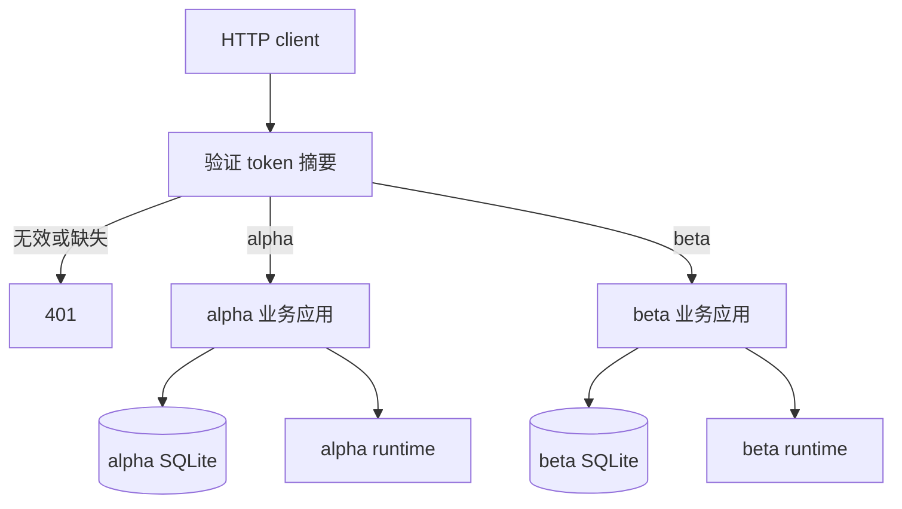

# 第 7.3 课：身份认证与租户数据访问

假设 alpha 创建了一份报告，beta 从某个链接里知道了它的 Run ID。beta 换上自己的凭据请求这个 ID，服务该去哪个数据库查询？本课在[可恢复服务](README.md)上增加认证入口，让凭据先决定租户，再查该租户的数据。

我们会运行 alpha、beta 两个租户，验证知道别人的 Conversation、Run、Artifact 或 DSH session ID，也不能通过 HTTP API 读取或修改它们。工具进程能否读取其他目录是另一层问题，会在下一课单独验证。

## 1. 先运行双租户探针

从仓库根目录开始：

```sh
cd projects/recoverable-agent-service
uv sync --locked --group dev
uv run --python 3.10 python examples/tenant_probe.py
```

探针在真实环回 TCP 端口启动 Uvicorn，通过 HTTP 客户端访问服务。默认 runtime 是可控实现，会实际写入两个租户各自的 proof 文件；SQLite、HTTP、SSE 与产物快照均使用项目代码。这一步不读取 API key，也不调用模型。token 在内存中随机生成，不输出。

先跟着一个资源看结果：alpha 创建的 Run、SSE 和产物对 alpha 可读；beta 用自己的凭据访问同一个 ID，得到 404。请求只在 beta 的数据库中查找，没有先查 alpha 再告诉 beta“对象存在但你无权访问”。这样资源 ID 就不会变成绕过身份检查的凭据。

探针还检查无凭据返回 401，伪造 body 中 tenant/session 字段返回 422，通过 header/query 选择身份被拒绝。两个租户可以使用相同 `Idempotency-Key` 创建各自的任务，本租户重放则返回原 Run。最后核对产物字节、SHA-256，并检查测试 token 没有出现在业务数据库、产物或捕获的服务日志中。

真实 DSH 版本单独执行：

```sh
uv run --env-file ../../.env python examples/tenant_probe.py --real
```

该模式需要本地 `.env` 中的 `DEEPSEEK_API_KEY`，沿用 Python SDK/runtime `0.1.5rc1` 和 `sdk-minimal`。每个租户的模型写入不同 proof，服务只有在 `finish_reason=completed` 时标为成功；HTTP 跨租户检查与默认模式相同。真实故障注入、工具执行隔离与生产部署不在本课验证范围。

## 2. 身份从哪里来



[`tenancy.py`](src/recoverable_agent_service/tenancy.py)先验证请求，再选择一个租户的既有 FastAPI 应用。所有路由都经过这一层，包括 health、docs、OpenAPI、SSE、下载、提交和恢复确认。每个租户使用不同的 SQLite 文件、coordinator、workspace 和 dshHome；请求只能查询它自己的数据库。资源 ID 是定位信息，不是授权凭据。

本课选择静态高熵 Bearer token，服务端保存 SHA-256 摘要到 tenant ID 的映射。它适合展示认证与授权的责任划分，不具备用户账号、JWT/OIDC、角色权限或 token 自动刷新。密码通常是低熵输入，不能用这里的摘要方案存储密码。租户内所有配置的凭据具有相同权限。

HTTP 只接受一个 `Authorization: Bearer ...`，token 必须是 32–256 个 URL-safe ASCII 字符。缺失、错误和重复认证 header 统一返回 401，附带 `WWW-Authenticate: Bearer`；错误不回显 token。验证后的 header 不传给子应用。每个请求的身份保存在本次调用中，没有共享的“当前租户”变量。

`X-Tenant-ID`、`X-Session-ID` 和 query 中的 `tenant_id`、`session_id`、`dsh_session_id`、`access_token` 均不受支持；有效凭据下使用这些字段返回 400。创建 Conversation/Run 的 Pydantic 请求模型拒绝所有未知字段，因此请求 body 不能覆盖 tenant 或 DSH session。认证入口不把未经验证的身份字段当作路由条件。

## 3. 启动可手动调用的认证服务

仍在项目目录执行：

```sh
uv run python examples/create_tenant_env.py
uv run --env-file .env.tenants-server python -m recoverable_agent_service.tenant_server
```

第一条命令生成两个被 Git 忽略的文件，权限为 `0600`，已有文件时拒绝覆盖。`.env.tenants-server` 只含两个租户的 verifier 配置与数据根目录，`.env.tenants-client` 则保存随机客户端 token。区分这两个文件，是为了不把客户端明文凭据一起交给服务进程。

第二条命令会常驻当前终端，只加载服务端文件，监听 `127.0.0.1:8001`。它关闭会记录完整 URL 的 Uvicorn access log，防止错误放入 query 的 token 被写进日志；自行更换启动器或增加代理时，需要另行配置日志脱敏。创建 Conversation 不需要模型 key。若要提交真实 Run，先停止这个 server，再以同时加载模型凭据的命令启动：

```sh
uv run --env-file ../../.env --env-file .env.tenants-server python -m recoverable_agent_service.tenant_server
```

不要把 `.env.tenants-client` 加载到服务进程：固定版本 Python SDK 默认继承进程环境。HTTP 认证层不会把请求 header 放进 prompt 或 SDK 参数，但它不是任意业务文本的秘密扫描器。

在另一个终端进入同一项目目录，以 alpha 创建 Conversation：

```sh
uv run --env-file .env.tenants-client python - <<'PY'
import os
import httpx2 as httpx
with httpx.Client(base_url="http://127.0.0.1:8001") as client:
    response = client.post(
        "/api/conversations",
        headers={"Authorization": "Bearer " + os.environ["TENANT_ALPHA_TOKEN"]},
        json={"title": "alpha demo"},
    )
    response.raise_for_status()
    conversation_id = response.json()["id"]
    print("Created:", conversation_id)
    denied = client.get(
        "/api/conversations/" + conversation_id,
        headers={"Authorization": "Bearer " + os.environ["TENANT_BETA_TOKEN"]},
    )
    assert denied.status_code == 404
    print("Cross-tenant read:", denied.status_code)
PY
```

这个片段不调用模型，只创建一个 Conversation，再以 beta 身份查询。预期终端显示新 ID 和 `Cross-tenant read: 404`；alpha 的 token 负责选择 alpha 应用，URL 中的 ID 负责定位对象，两者各有用途。

其他 API 与原服务相同，每次都需要 Bearer header。SSE 重连时仍携带同一身份与 `Last-Event-ID`；不要把 token 放在 URL。原生浏览器 EventSource 不能直接设置任意认证 header，实际浏览器产品需要单独选择 fetch 流或经过设计的 cookie/BFF 方案，本课不提供浏览器登录 UI。

## 4. 配置与已有数据

[`tenant_server.py`](src/recoverable_agent_service/tenant_server.py)读取 `RECOVERABLE_AGENT_TENANTS`，其 JSON 结构是 tenant ID 到 `token_sha256` 列表。一个摘要只能出现一次；一个租户可以配置多个不同摘要。配置错误、重复 JSON key、空配置、非法 tenant ID 或摘要都会在启动前失败，不回显配置内容。

`RECOVERABLE_AGENT_TENANT_ROOT` 默认 `.data/tenants`，布局为：

```text
.data/tenants/
  alpha/service.db
  alpha/workspace/
  alpha/dsh-home/
  beta/service.db
  beta/workspace/
  beta/dsh-home/
```

tenant ID 只允许小写字母开头，随后是小写字母、数字或短横线，长度不超过 32。入口检查各目标路径没有符号链接，已有数据库没有额外硬链接，避免配置时把租户指向相同存储。根目录及其父目录由部署者管理；这一检查不能抵御同系统用户在启动后修改文件或符号链接。

业务 schema 仍是 1，不给历史数据库自动添加或推断 tenant。原 `RECOVERABLE_AGENT_DATABASE/WORKSPACE/DSH_HOME` 配置属于原单租户入口，认证入口显式生成自己的路径。已有业务数据的归属和迁移需要单独确定，不能靠复制一个随机 session ID 完成。

## 5. 访问检查与关闭

| 请求 | 本租户 | 其他租户的 ID |
| --- | --- | --- |
| Conversation、Run 查询 | 返回本租户数据 | 404 |
| 提交 Run、恢复确认 | 按原业务状态执行 | 404，不写对方数据库 |
| SSE 首次访问与重连 | 本租户持久事件 | 404，在开始 stream 前拒绝 |
| 下载 Artifact | 本租户不可变 BLOB | 404，不读取对方文件 |

HTTP 响应添加 `Cache-Control: no-store` 和 `Vary: Authorization`，避免把授权响应当作公共缓存内容。凭据在连接开始时验证；配置是进程启动时的快照，不支持在线吊销已经建立的 SSE。更换配置需要重启服务，已有连接随后重新认证。

外层 lifespan 启动并拥有各租户子应用；启动中途失败会退出已经启动的应用。正常关闭等待各 coordinator 清理，沿用原服务的“不自动重跑不确定执行”规则。卡住的真实 provider 可能延迟优雅关闭，本课不伪造安全取消。

阅读练习：把上面的 GET 换成 alpha 凭据，预测结果；再保留有效凭据并加入 `X-Tenant-ID: beta`，对照认证入口解释为什么拒绝选择身份，而不是切换租户。练习只操作本机演示数据。

## 6. 结束手动实验

回到运行 `tenant_server` 的终端按 Ctrl+C，等待 Uvicorn 完成 shutdown 并返回 shell；coordinator 会按原服务的 drain 规则清理自有 runtime。若关闭报错或一直未完成，先保留现场并确认相关进程，不要因浏览器断开就删除数据。

两个 env 文件不会自动删除。若要继续使用这批演示凭据，保留它们的 `0600` 权限；不要打印 `.env.tenants-client`，也不要将它加载到 server 进程。如果本次实验结束且不再复用凭据，在确认它们正是本次生成的文件、server 已停止后，可从当前项目目录逐个确认删除：

```sh
rm -i .env.tenants-client .env.tenants-server
```

这是终端中由你确认的删除步骤。需要新凭据时，再运行生成器；不要直接覆盖已有文件。默认 `.data/tenants/alpha` 与 `.data/tenants/beta` 会保留数据库、workspace 和 dshHome；先检查其中是否还有需要保留的实验记录，再决定如何归档或清理。不要无条件清空整个 `.data`，更换凭据也不会自动迁移或删除业务数据。

## 7. 验证与下一步

```sh
uv run --python 3.10 pytest
uv run --python 3.10 ruff check .
uv run --python 3.10 ruff format --check .
uv lock --check
```

[本课验收记录](../../docs/reviews/2026-09-29-tenant-auth.md)分别记录自动化测试、环回 HTTP 探针、真实模型和进程清理。所有查询走独立数据库是本教学应用的实现选择；它不代替共享数据库架构中的 tenant 条件、复合唯一键和行级授权。

这个示例仍是一个本机应用进程，没有公网 TLS 配置、速率限制、租户配额或平台级审计。各 runtime 以同一系统用户运行，DSH 工具仍可能访问其他目录；独立 workspace、DB 和 dshHome 只证明正常 API 路径的数据分离。下一课 [7.4 Workspace 与执行隔离](../../docs/learning-paths/engineering.md)用真实允许/拒绝探针验证工具能力。
