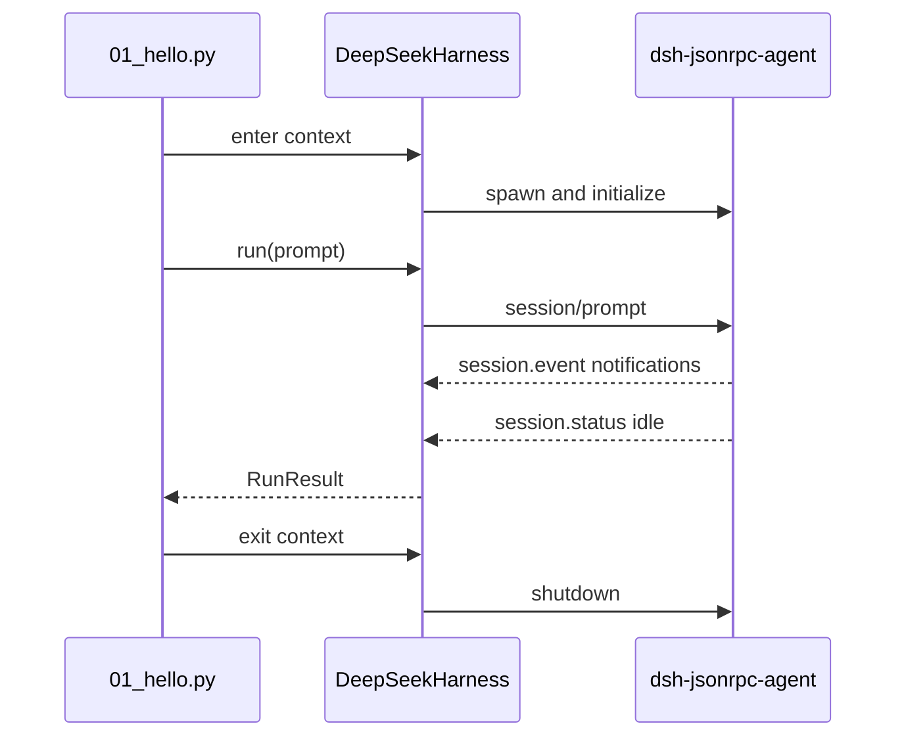

# Tutorial 01: One high-level run

English | [中文](01-hello.zh.md)

## Outcome

Run one prompt through [`01_hello.py`](../01_hello.py), observe the generated session ID, the interval finish reason, and the final committed assistant text. This is the smallest production-shaped SDK lifecycle because the context manager also closes the owned runtime process.

## Prerequisites

Complete the installation in the [demo index](../README.md). The command reads the API credential from the environment and writes durable session logs below the selected `--session-root`.

## Run it

```sh
python python-sdk/01_hello.py \
  --session-root /tmp/dsh-demo-01 \
  "Reply with exactly: PYTHON_DEMO_01_OK"
```

The response contains a generated `session_id`, `finish_reason: completed`, and the requested text.

## How it works

`DeepSeekHarness` resolves the bundled runtime lazily. Entering the context starts it and sends `initialize`; `run()` creates a session ID when none is supplied, enqueues the prompt, collects notifications after the durable inbox receipt, waits for the whole agent to become idle, and projects the final assistant message into `RunResult.final_response`.



The high-level lifecycle is implemented by [`DeepSeekHarness`](https://github.com/deepseek-ai/deepseek-harness/blob/master/python/sdk/src/deepseek_harness/api.py) and the subprocess transport by [`HarnessClient`](https://github.com/deepseek-ai/deepseek-harness/blob/master/python/sdk/src/deepseek_harness/client.py).

## Verify it

Confirm all three facts: the process exits with status 0, `finish_reason` is `completed`, and the response matches the prompt. Inspect `/tmp/dsh-demo-01` to confirm a durable session log was created.

## Limitations

This example returns only after the owned activity interval reaches `idle`; it does not show incremental events. A final response belongs to that interval rather than carrying strict prompt-to-response causality when other work is queued. Continue with [Tutorial 02](02-reuse-session.md) for session reuse.
