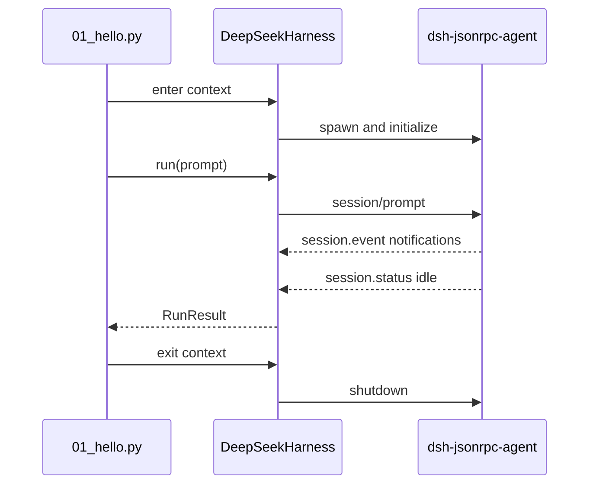

# 教程 01：一次高层运行

[English](01-hello.md) | 中文

## 结果

通过 [`01_hello.py`](../01_hello.py)运行一条提示词，观察生成的会话 ID、活动区间结束原因和最终提交的 assistant 文本。这是最小的生产式 SDK 生命周期，因为上下文管理器还会关闭其拥有的运行时进程。

## 前置要求

完成[示例索引](../README.zh.md)中的安装步骤。命令从环境读取 API 凭据，并把持久会话日志写入 `--session-root` 指定的目录。

## 运行

```sh
uv run --project python-sdk python python-sdk/01_hello.py \
  --session-root /tmp/dsh-demo-01 \
  "Reply with exactly: PYTHON_DEMO_01_OK"
```

响应包含生成的 `session_id`、`finish_reason: completed` 和提示词要求的文本。

## 工作原理

`DeepSeekHarness` 延迟解析内置运行时。进入上下文时会启动运行时并发送 `initialize`；`run()` 在调用方未提供 ID 时创建会话 ID，令提示词入队，在持久 inbox 回执之后收集通知，等待整个 agent 进入空闲状态，再把最终 assistant 消息投影到 `RunResult.final_response`。



高层生命周期由 [`DeepSeekHarness`](https://github.com/deepseek-ai/deepseek-harness/blob/master/python/sdk/src/deepseek_harness/api.py)实现，子进程传输由 [`HarnessClient`](https://github.com/deepseek-ai/deepseek-harness/blob/master/python/sdk/src/deepseek_harness/client.py)实现。

## 验证

确认三个事实：进程以状态 0 退出、`finish_reason` 为 `completed`，且回复与提示词匹配。检查 `/tmp/dsh-demo-01`，确认系统创建了持久会话日志。

## 限制

本示例只有在其拥有的活动区间抵达 `idle` 后才返回，不展示增量事件。当队列中还有其他工作时，最终回复属于该活动区间，不具备严格的提示词到回复因果关系。继续阅读[教程 02](02-reuse-session.zh.md)了解会话复用。
