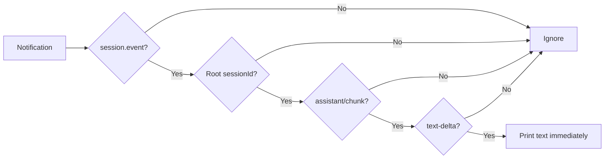

# Tutorial 03: Stream committed assistant text

English | [中文](03-stream-events.zh.md)

## Outcome

Use [`03_stream_events.py`](../03_stream_events.py) to print text while the agent is still running. Learn the distinction between notification streaming and the synchronous `RunResult` returned at idle.

## Prerequisites

Complete [Tutorial 02](02-reuse-session.md). Use a fresh session ID so earlier queued or persisted work cannot join this activity interval.

## Run it

```sh
python python-sdk/03_stream_events.py \
  --session-id python-demo-03 \
  --session-root /tmp/dsh-demo-03 \
  "Explain agent runtimes in three short bullets."
```

Text appears after `stream:` before the script prints `finish_reason` and `notification_count`.

## How it works

`Session.run()` calls `on_notification` on its worker thread for every notification belonging to the root session tree. `text_delta_from()` accepts only root-session `session.event` notifications whose event is `assistant/chunk` and whose chunk is `text-delta`. It intentionally excludes reasoning, tool-call deltas, usage, finish chunks, and descendant text.



The callback dispatch and activity-interval collection are in [`Session.run()`](https://github.com/deepseek-ai/deepseek-harness/blob/master/python/sdk/src/deepseek_harness/api.py); transport subscriptions and the reader thread are in [`client.py`](https://github.com/deepseek-ai/deepseek-harness/blob/master/python/sdk/src/deepseek_harness/client.py).

## Verify it

Run with a response long enough to split into several deltas. Confirm text is visible before the final metadata and that `notification_count` is greater than zero. Redirecting stdout to a file is a simple way to inspect ordering.

## Limitations

The SDK has no async iterator API. A GUI or ASGI server must bridge this synchronous callback into its event loop without blocking it. The FastAPI tutorials use a thread-safe callback plus `asyncio.Queue`. Continue with [Tutorial 04](04-workspace-agent.md) for tools and external-state verification.
